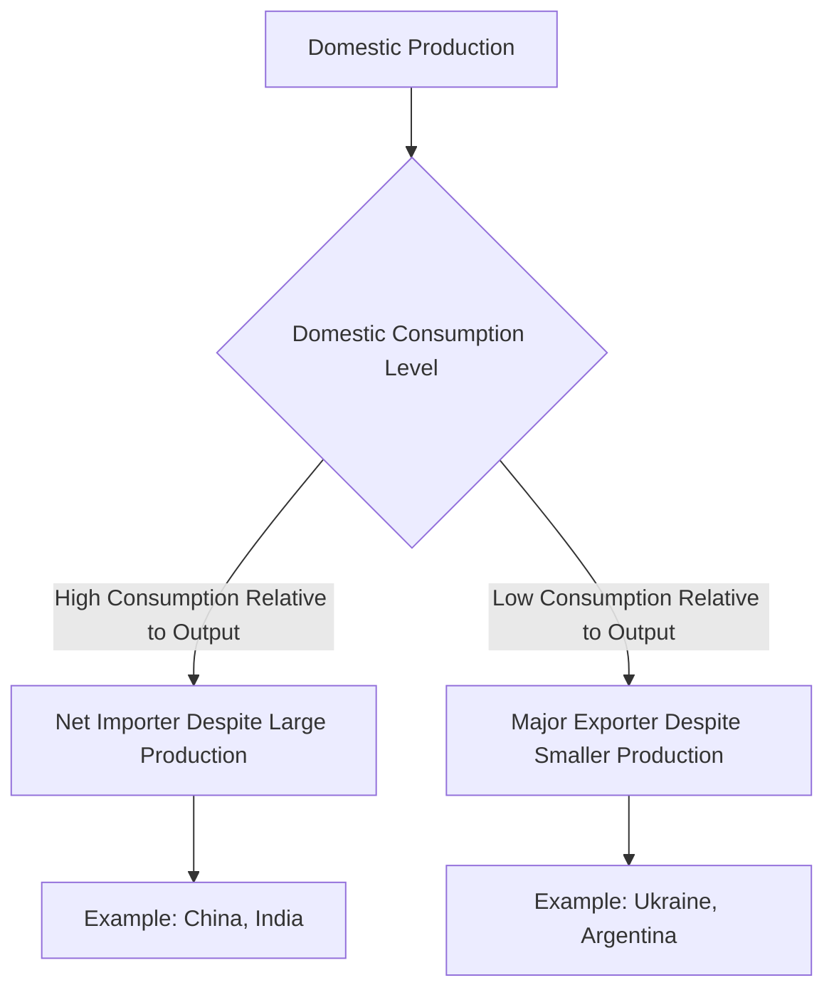
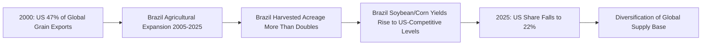

## Global Grain Trade and Export Concentration Risk

### Overview

The global grain trade — spanning wheat, corn (maize), rice, and soybeans — is characterized by a structural asymmetry between widely distributed production and highly concentrated exports. A small number of countries account for the overwhelming majority of internationally traded grain, meaning that weather shocks, policy decisions (export bans), conflict, or logistics disruptions in just a handful of exporting nations can transmit significant price and availability shocks to import-dependent countries worldwide. This concentration risk is a central concern in food security and supply chain geopolitics analysis.

### The Production-Export Divergence

A foundational distinction is that production volume and export volume measure different things: production measures total domestic output, while exports measure the surplus shipped internationally after domestic consumption and stock changes. Some of the largest producers are not the largest exporters — China and India together produce nearly 900 million tons of grain but are net importers of certain grains, since China imports significant quantities of soybeans and corn while India restricts wheat exports during tight domestic supply years. Conversely, relatively smaller producers like Ukraine (~54 Mt) or Argentina (~60 Mt) are globally important exporters precisely because their domestic consumption is low relative to production, leaving a larger exportable surplus.

### Current Export Concentration by Commodity

#### Wheat

Wheat export markets remain heavily concentrated among a small set of suppliers. Russia and the European Union remain the major exporters of wheat, while the United States consistently ranks in the top five among the world's largest wheat exporters. Regionally, European countries together accounted for more than half of global wheat exports in recent years. Over the 2021–2025 period, the largest cumulative wheat exporters were Russia (approximately 190 million tons), the EU (162 million tons), Canada (105 million tons), Australia (peak of 130 million tons), and the United States (95 million tons) — meaning a handful of suppliers account for the substantial majority of global wheat trade. [Unverified] Precise annual export shares fluctuate significantly year-to-year based on harvest conditions, so any single-year concentration ratio should be checked against the most current USDA or International Grains Council data rather than treated as a stable figure.

For the 2025/26 marketing year, global wheat trade was forecast to rebound, with nearly all major wheat exporters expected to see larger exports; Argentina was forecast for the largest year-over-year increase (up 8.6 million metric tons on a record crop), followed by Australia and the EU, while Ukraine was the only major exporter forecast to see reduced exports.

#### Corn (Maize)

Corn export concentration is comparably tight. Brazil was the leading exporter of corn worldwide in 2023, with an export volume of 55.9 million metric tons, with the United States ranking second at 46 million metric tons, followed by Ukraine at 26.4 million metric tons. The United States produced nearly a third of the world's corn, concentrated in the Midwest "Corn Belt" region — meaning corn supply carries not only country-level but sub-national geographic concentration risk (weather events affecting a single US region can materially affect global corn supply).

#### Long-Term Structural Shift: Declining US Share

A significant structural trend is the erosion of the historically dominant US share of global grain exports. In 2000, world grain production (soybeans, corn, and wheat combined) totaled 58 billion bushels and the US provided 47% of global exports of those commodities; by 2025, global production had grown to 91 billion bushels while the US share of global grain exports had shrunk to 22%. This decline is attributed largely to Brazil's rapid agricultural expansion — from 2005 to 2025, Brazil's harvested acreage more than doubled to 177 million acres, with potential to add 55 million more, while Brazil's soybean yields now rival those in the US and its corn yields are also rising, both attributed to improved cropping techniques and technology adoption.

[Inference] This shift represents a partial de-concentration of global grain export dependency away from a single dominant supplier (the US) toward a more multipolar structure (US, Brazil, Argentina, Black Sea region, Australia) — though this reduces reliance on any single country while potentially introducing new concentration risk around the Southern Hemisphere/Brazil axis, a dynamic analysts continue to monitor rather than one with a settled long-term assessment.

### Concentration Risk Mechanisms

#### Weather and Climate Shock Transmission

Because exportable surplus is concentrated in a handful of major producing regions, localized weather events (drought in Argentina, flooding in the US Midwest, heat stress in the Black Sea region) can have outsized effects on global prices even though they affect only a fraction of global production acreage.

#### Export Restriction and Policy Risk

Grain-exporting governments periodically impose export bans or quotas during domestic supply concerns or price-stability efforts — for example, Ukraine has at various points limited wheat exports with the explicit goal of maintaining domestic bread price stability, and India has restricted wheat exports during tight supply years. Such restrictions, even when domestically rational, can sharply reduce global tradable supply precisely when global demand or other supply disruptions are already elevating prices, since concentrated export bases mean few substitute suppliers are available to absorb the shortfall.

#### Conflict and Geopolitical Disruption

The Russia-Ukraine war (since February 2022) demonstrated acute concentration risk in practice: both countries are major global wheat and corn exporters (accounting for a substantial combined share of global wheat and sunflower oil exports specifically), and disruption to Black Sea shipping lanes materially affected global grain prices and availability, particularly for import-dependent countries in North Africa and the Middle East with limited diversification of supply sources.

#### Trading Company Concentration (Downstream Concentration)

Beyond country-level concentration, the global grain trade is also characterized by concentration among a small number of multinational trading conglomerates that handle a large share of physical grain logistics, storage, and merchandising globally (sometimes referenced by the "ABCD" shorthand — Archer-Daniels-Midland, Bunge, Cargill, and Louis Dreyfus — though market shares shift and additional major traders, including firms of Chinese and other origin, have grown in relevance). [Unverified] Specific current market-share percentages for grain trading firms vary by source and commodity and should be checked against current industry data given the dynamic nature of this sector; historical estimates (e.g., from Oxfam-cited research around 2003) placed a very high combined share with a small number of firms, though this figure is dated and not representative of current conditions.

### Import Dependency and Vulnerability

Countries with high import dependency and low supplier diversification face the greatest exposure to export concentration risk. Turkey, for example, cannot rely on its own domestic wheat production despite being the world's largest wheat flour producer and exporter (importing wheat, milling it, then re-exporting flour), while Algeria imports large volumes of wheat annually from the world market. The EU itself relies on wheat imports from key suppliers including Brazil and Ukraine for specific grain categories, illustrating that even major producing/exporting blocs can carry import dependencies for particular grain varieties or in specific years.

North Africa is highlighted as a rapidly developing food manufacturing hub that is increasing grain imports to help meet regional food demand, representing a growing node of import dependency exposed to the concentration risk of the global supply base.

### Diversification and Resilience Strategies

**Emerging alternative suppliers**: the rise of Romania and Kazakhstan as regional exporters offers alternative sourcing corridors for Black Sea and Central Asian logistics, providing partial diversification options for import-dependent buyers seeking to reduce reliance on the largest traditional suppliers.

**Cross-hemisphere procurement**: procurement strategies that diversify origins across both the Northern and Southern Hemispheres reduce exposure to single-region weather shocks, since Northern and Southern Hemisphere harvest cycles are offset, allowing buyers to source from whichever hemisphere is currently in-season or unaffected by adverse weather.

**Domestic production policy responses**: some import-dependent countries pursue domestic production expansion, strategic grain reserves, or diversified long-term supply agreements as risk-mitigation strategies against concentrated export-base exposure — analogous in logic to the supply chain diversification strategies (nearshoring/friend-shoring) discussed in earlier chapters, applied to agricultural commodities rather than manufactured goods.

### Key Points

- Global grain exports are far more concentrated than global grain production, since export capacity depends on exportable surplus (production minus domestic consumption) rather than raw output
- Wheat and corn export markets are dominated by a small number of countries (Russia, EU, US, Canada, Australia, Argentina for wheat; Brazil, US, Ukraine, Argentina for corn)
- The US share of global grain exports has structurally declined from 47% (2000) to 22% (2025), driven substantially by Brazil's agricultural expansion
- Concentration risk is transmitted through weather shocks, export restrictions/bans, and conflict (notably the Russia-Ukraine war's effect on Black Sea grain exports)
- Diversification strategies include cross-hemisphere procurement, emerging alternative suppliers (Romania, Kazakhstan), and downstream trading-company concentration is a related but distinct risk layer from country-level export concentration

### Related Topics

- The Russia-Ukraine war's impact on Black Sea grain export corridors and global food security
- Brazil's agricultural expansion and its effect on global soybean and corn trade structure
- Export bans and quotas as domestic food-security policy tools with global spillover effects
- Multinational grain trading company concentration ("ABCD" firms) and physical commodity logistics control
- North Africa and Middle East grain import dependency and food security exposure
- Strategic grain reserves and domestic production policy as food security risk mitigation