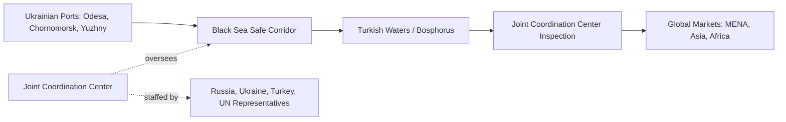

## The Black Sea Grain Initiative and Its Collapse

### Overview

The Black Sea Grain Initiative (BSGI), formally the "Initiative on the Safe Transportation of Grain and Foodstuffs from Ukrainian Ports," was a multilateral agreement signed on 22 July 2022 in Istanbul between Russia, Ukraine, Turkey, and the United Nations. It established safe maritime corridors allowing Ukrainian grain exports to resume following the complete halt of Black Sea shipping caused by Russia's February 2022 invasion. Russia terminated its participation on 17 July 2023, and the initiative's collapse remains a central case study in how conflict-driven disruption to a geographically concentrated export corridor can transmit acute risk through global food security systems.

### Background: The Disruption That Necessitated the Agreement

The February 2022 Russian invasion led to a complete halt of maritime grain shipments from Ukraine, previously a major exporter via the Black Sea, while Russia also temporarily halted its own grain exports, further exacerbating the situation. This resulted in a sharp rise in world food prices, the threat of famine in lower-income countries, and accusations that Russia was weaponizing food supplies. To address the crisis, negotiations began in April 2022, hosted by Turkey — which controls the maritime routes from the Black Sea under the Montreux Convention — with UN support.

### Agreement Structure and Mechanism

- **Signatories**: Ukraine, Russia, Turkey, and the United Nations
- **Effective dates**: 22 July 2022 – 17 July 2023
- **Mechanism**: safe corridors allowing grain shipments to travel from Ukraine (via three ports: Chornomorsk, Odesa, and Yuzhny/Pivdennyi) to Turkey, where a Joint Coordination Center inspected vessels before onward transit.
- **Initial term**: 120 days, structured to require periodic renewal — a design feature that ultimately became the primary lever Russia used to extract concessions and eventually terminate the deal.

### Renewal Timeline and Escalating Fragility

The agreement's renewal history illustrates a pattern of escalating Russian leverage-extraction ahead of each deadline:

- **17 October 2022**: initial 120-day term nearing expiration
- **29 October 2022**: Russia suspended participation, then re-entered four days later on 2 November
- **18 November 2022**: Russia and Ukraine agreed to a 120-day extension
- **17 March 2023**: renewed again, but for only 60 days — a marked reduction from the prior 120-day term
- **18 May 2023**: another 60-day extension, until 17 July
- **17 July 2023**: Russia announced it would not renew, effectively terminating the initiative

Each extension cycle saw negotiations pushed to the eleventh hour, with Russia using the deadlines to press a set of demands, including reconnecting a Russian agricultural bank to the SWIFT international payment system and other sanctions-relief-adjacent conditions.

### Immediate Aftermath of Collapse

On 17 July 2023, Russia announced it was unwilling to remain in the deal unless its demands were met to ship more of its own food and fertilizer exports. Over the following two days, Russia attacked Odesa with drones and missiles in one of the largest sustained strikes on the port city, directly targeting grain export infrastructure. Russian officials, including spokesperson Dmitry Peskov, confirmed the termination of participation.

### Quantified Impact of the Initiative While Active

Over its roughly one-year operation, the corridor was substantively significant:

- Over 1,000 ships full of grain and other foodstuffs departed Ukraine via the three designated ports.
- Almost 33 million tonnes of grain and other foodstuffs were exported via the initiative as of its termination in July 2023.
- Over 50% of the cargo shipped was maize — the grain category most affected by port blockages in Ukrainian granaries at the outset of the war.
- The initiative is credited as a contributing factor in global food prices falling 23% between March 2022 and July 2023, and is broadly assessed as having been successful in its original aim of mitigating an impending acute global food security crisis, even though it ultimately collapsed.

### Structural Vulnerability Exposed

Ukraine typically accounted for about 10% of global wheat exports before the war, meaning the disruption's effect on global markets was comparable to back-to-back droughts occurring simultaneously in a major wheat-producing region — illustrating how concentration risk (as discussed regarding global grain export concentration generally) converts a regional conflict into a global price and availability shock.

The suspension was projected to hurt Ukrainian producers directly: even prior to full suspension, Ukraine's Agriculture Minister indicated farmers would sow 20% less winter wheat, and USDA projected Ukraine's 2023 wheat, maize, and barley production down 43% in aggregate from 2021 levels, with projected exports down 28% for maize, 44% for wheat, and 68% for barley compared to 2021/22 — demonstrating how the corridor's loss compounded pre-existing wartime production disruption rather than operating as an isolated logistics event.

### The "Solidarity Lanes" Alternative and EU Response

In parallel with the BSGI, the EU established "Solidarity Lanes" — alternative overland and river/rail export routes through EU territory (Poland, Romania, and other neighboring states). Since May 2022, over 45 million tons of grain, oilseed, and other agricultural products were exported via the EU solidarity lanes — a larger cumulative volume than the BSGI itself moved, though at higher logistics cost per ton via overland/rail transit compared to maritime shipping.

This parallel channel created a secondary policy tension: the influx of Ukrainian grain via Solidarity Lanes into neighboring EU agricultural markets prompted the EU to impose temporary import limits for Ukrainian grain in Bulgaria, Hungary, Poland, Romania, and Slovakia (through September 2023) to address domestic farmer concerns, illustrating a friction point between humanitarian/global-food-security objectives and domestic agricultural protection within the EU — with the EU's Common Agricultural Policy Crisis Reserve funds for compensating affected farmers reported as depleted by mid-2023.

### Post-Collapse Adaptation: Ukraine's Unilateral Humanitarian Corridor

After a short period of inactivity following the BSGI's collapse, Ukrainian forces took responsibility for export/import flows into the country and introduced a unilateral humanitarian corridor, controlled only by Ukraine (without Russian participation or the UN/Turkey coordination mechanism). This corridor achieved a return to relatively normal export terms over time, with freight rates returning to pre-war levels. [Unverified] The precise security guarantees and risk-management mechanisms underpinning this unilateral corridor's durability differ materially from the original multilateral BSGI framework, and current operational details should be checked against the latest reporting given the fluid nature of the conflict.

### Broader Food Security Consequences

The FAO noted that the corridor's suspension, layered onto the ongoing war, posed additional challenges through higher logistics costs for exporting via alternative routes, with all existing alternative initiatives assessed as more costly and having much less absorption capacity compared to the BSGI. This occurred against a backdrop where, globally, one in eleven people faced hunger and nearly 3.1 billion people (42% of the global population) could not afford a diet beyond starchy staples — context underscoring why disruption to a major grain export corridor carries acute humanitarian stakes beyond price volatility in wealthy import markets.

### Key Points

- The BSGI (July 2022–July 2023) was a rare instance of wartime cooperation between combatants (Russia and Ukraine), brokered by Turkey and the UN, to preserve a critical global food security function
- Its renewal structure (initially 120 days, later reduced to 60-day increments) became a recurring leverage point Russia used to extract concessions before ultimately terminating the agreement
- The corridor moved almost 33 million tonnes of grain over roughly one year and is credited with contributing to a 23% decline in global food prices during its operation
- Ukraine's pre-war ~10% share of global wheat exports meant the corridor's loss functioned as a global supply shock comparable to simultaneous droughts in a major producing region
- Post-collapse, Ukraine established a unilateral humanitarian corridor without Russian or UN/Turkey participation, eventually restoring near-normal freight rates, while the parallel EU Solidarity Lanes moved larger cumulative volumes but created intra-EU agricultural policy friction

### Related Topics

- Global grain trade export concentration risk and structural vulnerability
- EU Solidarity Lanes and the domestic agricultural policy friction they created
- Montreux Convention and Turkish control over Black Sea maritime access
- Food security impacts in MENA and import-dependent regions from Black Sea disruption
- Russian fertilizer and grain exports as a parallel sanctions-exemption negotiating issue
- Comparative case: wartime commodity export corridors and multilateral coordination mechanisms