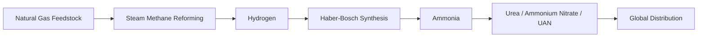
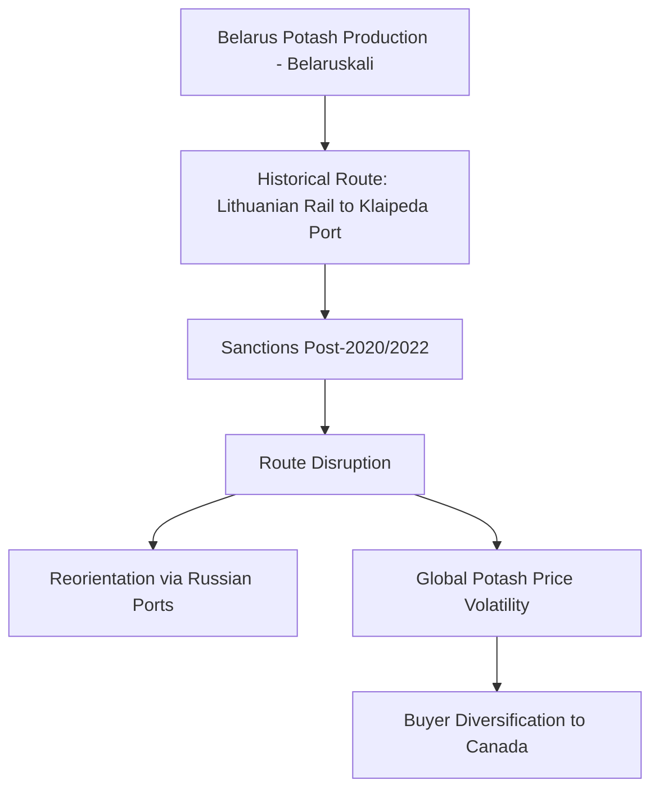

## Fertilizer Supply Chains: Potash, Phosphate, and Nitrogen

### Overview

The three primary macronutrient fertilizers — nitrogen (N), phosphate (P), and potash (K), collectively the "NPK" inputs essential to modern agricultural yields — have fundamentally different supply chain structures, geological availability, and geopolitical risk profiles. Unlike nitrogen fertilizer, which can theoretically be manufactured anywhere with access to natural gas and industrial infrastructure, phosphate and potash are geologically concentrated raw materials, mined from a small number of large ore deposits globally. This creates a layered supply chain risk architecture distinct from, but analogous to, the concentration risks discussed in critical minerals and semiconductor supply chains.

### Nitrogen Fertilizer Supply Chain

#### Production Process

Nitrogen fertilizer (primarily ammonia-based products including urea, ammonium nitrate, and UAN solutions) is produced industrially via the **Haber-Bosch process**, which synthesizes ammonia from atmospheric nitrogen and hydrogen:

$$N_2+3H_2\rightarrow2NH_3$$

The hydrogen feedstock is typically sourced from natural gas via steam methane reforming, making natural gas price and availability the dominant cost driver for nitrogen fertilizer production — [Inference] natural gas commonly represents a substantial majority of the variable production cost for ammonia-based fertilizer, a widely cited industry cost-structure characteristic, though the precise percentage varies by region, gas price regime, and plant efficiency.

#### Geographic Distribution

Because natural gas (rather than a geologically scarce mineral) is the key input, nitrogen fertilizer production capacity is more geographically distributed than potash or phosphate, concentrated instead in regions with abundant, low-cost natural gas: the United States (Gulf Coast), Russia, China, the Middle East (particularly Qatar, Saudi Arabia), and Trinidad and Tobago.

#### Key Risk Factor: Natural Gas Price Volatility

Because natural gas is the dominant input cost, nitrogen fertilizer prices are tightly correlated with regional natural gas price shocks. The 2021-2022 European energy crisis (driven substantially by reduced Russian pipeline gas supply following the invasion of Ukraine) caused a sharp spike in European natural gas prices, which in turn drove several major European ammonia and nitrogen fertilizer plants to curtail or suspend production, since production became uneconomical at prevailing gas prices — directly illustrating how an energy-market shock can transmit into a food-security-relevant fertilizer supply disruption.

### Phosphate Fertilizer Supply Chain

#### Geological Concentration

Phosphate fertilizer is derived from phosphate rock, a geologically concentrated resource. Morocco (and the Western Sahara territory it administers) holds the largest share of global phosphate rock reserves, alongside significant reserves in China, and smaller but commercially significant deposits in the United States, Russia, and a handful of other countries.

#### Production Chain

Phosphate rock is processed into phosphoric acid (typically via the "wet process" using sulfuric acid) and subsequently into finished fertilizer products such as diammonium phosphate (DAP) and monoammonium phosphate (MAP):

$$Ca_5(PO_4)_3F+5H_2SO_4\rightarrow3H_3PO_4+5CaSO_4+HF$$

This process also requires substantial sulfuric acid input (itself often derived from sulfur, a byproduct of oil and gas refining), creating a secondary input dependency layer.

#### Concentration Risk

Reserve concentration is particularly acute for phosphate: a small number of countries (led by Morocco) hold a very large share of global reserves, meaning long-term global phosphate availability is disproportionately dependent on the political stability, mining policy, and export decisions of a small set of jurisdictions. China has historically imposed export restrictions or tariffs on phosphate fertilizer exports at various points to prioritize domestic agricultural supply, directly reducing global tradable phosphate availability during periods of restriction.

### Potash Fertilizer Supply Chain

#### Geological Concentration

Potash (potassium chloride, KCl, along with related potassium salts) is the most geographically concentrated of the three major fertilizer nutrients. The largest global reserves and production are concentrated in Canada (particularly Saskatchewan), Russia, and Belarus, with these three jurisdictions historically accounting for a substantial majority of global potash production and trade.

#### Geopolitical Disruption: Belarus Sanctions

Belarus is a major global potash exporter (historically operating through the state-controlled producer Belaruskali). Following the 2020 disputed Belarusian election and subsequent crackdown, and further compounded by Belarus's role supporting Russia's 2022 invasion of Ukraine, the US, EU, and other Western governments imposed sanctions on Belarusian potash exports and, separately, on the Belarusian rail and port logistics (notably via Lithuania's Klaipėda port) that Belarusian potash historically transited for export. This substantially disrupted established Belarusian potash export logistics, forcing a reorientation of trade routes (including increased reliance on Russian ports) and contributing to global potash price volatility, particularly acute in 2022.

#### Canada's Role as Alternative Supplier

Canada, operating largely through major producers (Nutrien, Mosaic), holds a substantial share of global potash reserves and production capacity, and has been positioned as a key alternative supplier for buyers seeking to reduce reliance on Russian and Belarusian potash following the sanctions and geopolitical disruptions of 2022, though production capacity expansion to fully substitute for disrupted volumes takes significant time and capital investment given the multi-year timelines typical of large-scale mining project development.

### Comparative Concentration Risk Structure

| Nutrient | Primary Input Constraint | Geographic Concentration | Key Disruption Precedent |
| --- | --- | --- | --- |
| Nitrogen | Natural gas price/availability | Moderate — tied to gas-producing regions | European gas crisis (2021-2022) curtailing EU ammonia production |
| Phosphate | Phosphate rock reserves | High — Morocco/Western Sahara dominant reserve holder | Chinese export restrictions periodically limiting global supply |
| Potash | Potash ore reserves | Very high — Canada, Russia, Belarus dominate | Belarus/Russia sanctions disrupting established export logistics (2022) |

### Interlinkage With the Russia-Ukraine War

The war compounded fertilizer supply chain risk across all three nutrients simultaneously: Russia is a major exporter of nitrogen fertilizer (ammonia, urea) and potash, while the war's effect on European natural gas prices independently pressured nitrogen fertilizer production economics in Europe. This concurrent, multi-nutrient disruption is a key reason the war's food security impact extended beyond direct grain export disruption (covered in relation to the Black Sea Grain Initiative) to also constrain fertilizer availability and affordability for farmers globally, with downstream effects on crop yields and planting decisions in subsequent growing seasons, particularly in import-dependent developing economies with limited capacity to absorb fertilizer price spikes.

### Strategic and Policy Responses

#### Diversification of Sourcing

Fertilizer-importing countries and companies have pursued diversification strategies analogous to those discussed in manufacturing supply chain contexts — increasing sourcing from Canada (potash), diversifying nitrogen fertilizer sourcing toward Middle Eastern and North American gas-advantaged producers, and, for phosphate, exploring alternative and emerging producer regions.

#### Domestic Production Incentives

Some import-dependent countries have explored or implemented policies to support domestic fertilizer production capacity or strategic reserves, though the geological concentration of phosphate and potash reserves means true self-sufficiency is infeasible for the large majority of countries lacking domestic reserves — a structural constraint analogous to the "limits of full supply chain relocation" discussed for manufactured goods, but rooted in geology rather than industrial ecosystem effects.

#### Efficiency and Substitution Measures

Longer-term mitigation strategies include improved fertilizer-use efficiency (precision agriculture, slow-release formulations reducing total nutrient application needed), recycling of phosphorus from agricultural and wastewater streams, and crop rotation/nitrogen-fixing cover crop practices that reduce synthetic nitrogen fertilizer dependency — though these remain complementary rather than substitute solutions at current agricultural productivity requirements.

### Key Points

- Nitrogen fertilizer's key vulnerability is natural gas price/availability (an energy-market risk), while phosphate and potash are geologically concentrated raw materials with a small number of dominant reserve-holding countries
- Morocco (and Western Sahara) dominates global phosphate rock reserves; Canada, Russia, and Belarus dominate global potash production
- The 2020-2022 period saw compounding disruptions across all three nutrients: European gas crisis (nitrogen), Belarus sanctions and Russia-Ukraine war (potash and nitrogen), and periodic Chinese export restrictions (phosphate)
- Belarusian potash export logistics were substantially disrupted by sanctions targeting both direct exports and Lithuanian rail/port transit routes, forcing trade reorientation
- True self-sufficiency in phosphate and potash is geologically infeasible for most countries, making diversification, efficiency improvements, and strategic reserves the primary available mitigation strategies

### Related Topics

- The Haber-Bosch process and industrial ammonia synthesis chemistry
- Morocco and Western Sahara's role in global phosphate reserve geopolitics
- Belarus and Russia sanctions regimes and their effect on commodity export logistics
- European energy crisis (2021-2022) and its transmission to industrial input costs
- Precision agriculture and fertilizer-use efficiency as demand-side mitigation
- Critical minerals supply chain concentration as a comparative framework for geological resource risk