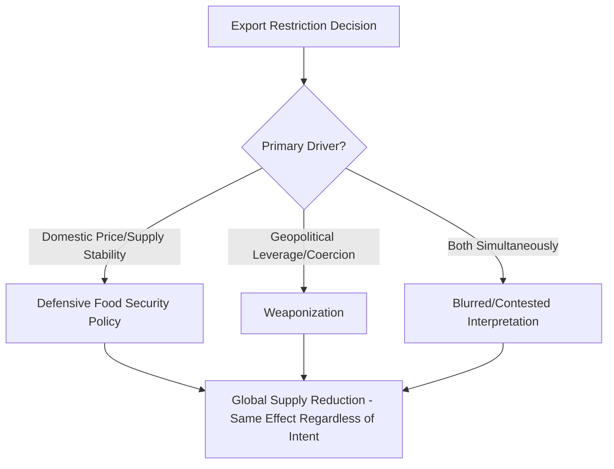

## Export Bans and the Weaponization of Food Trade

### Overview

Food export restrictions — bans, quotas, licensing requirements, and export taxes — are policy tools governments use to manage domestic food price stability and availability, but which produce significant negative externalities for the global trading system when deployed by major exporters during periods of already-tight global supply. This topic examines both the "defensive" domestic-stabilization rationale typically cited by governments imposing restrictions and the "weaponization" framing applied when export restrictions are assessed as being used for geopolitical leverage rather than (or in addition to) genuine domestic food security management.

### Distinguishing Defensive Restriction from Weaponization

#### The Domestic Stabilization Rationale

Governments typically justify food export restrictions on the grounds that, during periods of poor harvests, global price spikes, or supply chain disruption, redirecting exportable surplus toward domestic consumption protects domestic consumers (particularly lower-income households for whom food represents a large share of spending) from imported price inflation and potential local shortages.

#### The Weaponization Framing

"Weaponization" framing applies when export restrictions are assessed as being used, or having the practical effect of being used, as leverage in a geopolitical or military conflict — either by deliberately restricting food supply to pressure an adversary or dependent population, or by leveraging a dominant export position to extract political concessions from import-dependent countries. [Inference] The distinction between defensive and weaponized restriction is often analytically blurred in practice, since a government can simultaneously hold genuine domestic-stability motivations while also recognizing and leveraging the geopolitical signaling effect of its restriction decisions — determining which motivation predominates in any specific case is frequently a matter of contested political interpretation rather than a fact that can be cleanly established.

### Historical and Contemporary Case Studies

#### Russia's Wartime Grain and Fertilizer Policy

Russia's conduct during the 2022 invasion of Ukraine has been widely characterized by Western governments and food-security analysts as involving elements of food weaponization: Russia's initial naval blockade of Ukrainian Black Sea ports halted Ukrainian grain exports entirely, and Russia's eventual withdrawal from the Black Sea Grain Initiative in July 2023 (discussed in detail elsewhere in this curriculum), followed by attacks on Odesa port grain infrastructure, has been cited as evidence of deliberate targeting of food export capacity as a tool of pressure — though Russia has characterized its own actions as responses to Western sanctions restricting its own agricultural and fertilizer export capacity, illustrating the contested-interpretation dynamic described above.

#### India's Wheat and Rice Export Restrictions (2022-2023)

India, historically a major rice exporter and an increasingly significant wheat producer, imposed a wheat export ban in May 2022 (citing domestic price concerns following a heatwave-affected harvest) and subsequently imposed restrictions on various rice export categories (including a ban on non-basmati white rice exports in July 2023). These measures, while framed explicitly around domestic food price stability ahead of key elections and amid inflation concerns, had substantial effects on global rice markets given India's outsized share of global rice trade — illustrating how domestically-motivated restrictions by a dominant exporter can produce global-scale effects regardless of whether "weaponization" intent is present.

#### Historical Precedent: 2007-2008 and 2010-2011 Food Price Crises

The 2007-2008 global food price crisis saw a cascade of export restrictions imposed by multiple major grain and rice exporting countries roughly simultaneously (including India, Vietnam, and others restricting rice exports, and various wheat exporters imposing restrictions), which analysts assessed as significantly amplifying the initial price spike beyond what underlying supply-demand fundamentals alone would have produced — a widely cited example of the "prisoner's dilemma" dynamic in export restriction policy, discussed further below. A similar pattern of restrictions occurred during the 2010-2011 price spike, notably including Russia's 2010 wheat export ban following a severe drought and wildfires.

#### Ukraine's Own Historical Export Management

Notably, even Ukraine itself — the country most directly affected by the Black Sea Grain Initiative's collapse — had, prior to the full-scale invasion, periodically used wheat export restrictions or informal export management measures aimed at maintaining domestic bread price stability, illustrating that export restriction is a broadly available policy tool used across many exporting nations under varying circumstances, not solely by countries engaged in active weaponization strategies.

### The Collective Action Problem: Why Restrictions Amplify Crises

Food export restrictions during a global supply-tightening episode exhibit a structure analogous to the subsidy-race dynamic discussed regarding industrial policy: each individual exporting country's restriction decision may be domestically rational (protecting local consumers from a price spike), but when multiple major exporters restrict simultaneously, the cumulative effect is to remove a disproportionate share of global tradable supply from the market precisely when global demand for imports is most acute — amplifying the price spike for import-dependent countries well beyond what the underlying global production shortfall alone would justify.

$$P_{global}=f(S_{global}-\sum_{i}R_i)$$

Where $P_{global}$ is the global price level, $S_{global}$ is total global tradable supply absent restrictions, and $R_i$ is the volume withheld from export by country $i$'s restriction. [Inference] This is a simplified conceptual framing rather than a formally estimated model; the actual price elasticity of global food markets to supply withdrawal varies significantly by commodity, season, and prevailing stock levels, and rigorous quantification requires commodity-specific econometric modeling rather than this general functional relationship.

### Institutional and Policy Responses

#### WTO Agreement on Agriculture Provisions

The WTO's Agreement on Agriculture includes provisions (Article 12) requiring members imposing new export prohibitions or restrictions on foodstuffs to give due consideration to the food security effects on importing members and to notify the WTO Committee on Agriculture — though this obligation is a procedural transparency requirement rather than a binding constraint on the substantive right to impose restrictions, and compliance with notification requirements has historically been inconsistent.

#### G20 and Multilateral Coordination Efforts

Following the 2007-2008 and 2010-2011 crises, and again following the 2022 disruptions, there have been recurring multilateral discussions (including through G20 agricultural ministerial processes) aimed at establishing voluntary commitments to avoid export restrictions on food purchased for humanitarian purposes (e.g., World Food Programme procurement) and to improve transparency around national food stock levels and restriction decisions — though these initiatives generally remain voluntary and non-binding, reflecting the same absence of a strong coordinating enforcement institution seen in the industrial subsidy context.

#### Agricultural Market Information System (AMIS)

Established following the 2007-2008 crisis by the G20, AMIS is an inter-agency platform intended to improve food market transparency and policy coordination among major producing and consuming countries, aiming to reduce the information asymmetries and panic-driven dynamics that can amplify export restriction cascades during price spikes.

### Downstream Effects on Import-Dependent Countries

Countries with high food import dependency and limited fiscal capacity to absorb price shocks — frequently concentrated in the MENA region, Sub-Saharan Africa, and parts of South and Southeast Asia — bear disproportionate exposure to export restriction cascades, since they typically lack diversified sourcing options or substantial strategic food reserves to buffer against sudden tradable-supply reductions. This dynamic directly connects to the food security stakes discussed regarding the Black Sea Grain Initiative's collapse and to the broader export concentration risk framework covered earlier in this chapter.

### Distinguishing Export Restrictions From Sanctions-Based Trade Restriction

A related but analytically distinct category involves food and fertilizer trade restrictions arising from third-party sanctions regimes (e.g., Western sanctions affecting Russian and Belarusian fertilizer export logistics, discussed in the fertilizer supply chain topic) rather than the exporting country's own domestic policy choice. [Inference] While the practical market effect (reduced tradable global supply) can be similar, the policy analysis and potential remedies differ: sanctions-driven disruption is generally addressed through carve-outs or humanitarian exemptions negotiated by the sanctioning parties, whereas exporter-imposed restrictions are addressed (to the limited extent they are addressed at all) through the WTO and G20 mechanisms described above.

### Key Points

- Export restrictions can be genuinely defensive (domestic price stability), assessed as weaponization (geopolitical leverage), or — most commonly — some contested mixture of both motivations
- India's 2022-2023 wheat and rice restrictions and Russia's wartime conduct toward Ukrainian grain exports represent contemporary reference cases illustrating both ends of this spectrum
- Simultaneous export restrictions by multiple major exporters during a supply-tightening episode create a collective-action dynamic that amplifies global price spikes beyond underlying production shortfalls, as observed in 2007-2008 and 2010-2011
- WTO Agreement on Agriculture Article 12 imposes only a procedural notification obligation, not a binding substantive constraint on export restrictions
- Import-dependent countries with limited reserves or sourcing diversification (concentrated in MENA, Sub-Saharan Africa, and South/Southeast Asia) bear disproportionate exposure to restriction-driven price shocks

### Related Topics

- Global grain trade export concentration risk and structural exporter dependency
- The Black Sea Grain Initiative and its collapse as a weaponization case study
- Fertilizer supply chains and sanctions-driven trade disruption (Belarus, Russia)
- WTO Agreement on Agriculture and its export restriction notification provisions
- The Agricultural Market Information System (AMIS) and G20 food security coordination
- Historical food price crises: 2007-2008 and 2010-2011 export restriction cascades