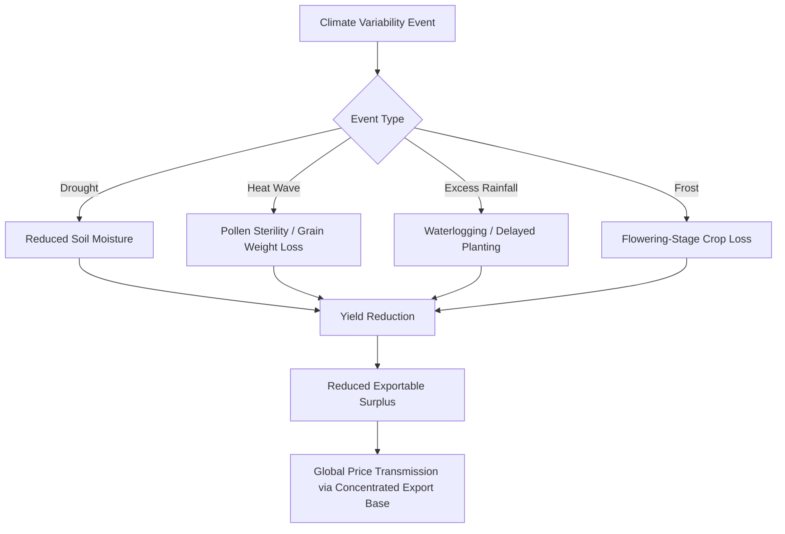

## Climate Variability and Agricultural Supply Shocks

### Overview

Climate variability — encompassing both short-term extreme weather events (droughts, floods, heatwaves) and longer-term shifting climate patterns — represents a distinct and compounding category of agricultural supply chain risk, operating alongside but mechanistically different from the geopolitical, policy, and market-structure risks (export bans, trade concentration, subsidy competition) covered elsewhere in this chapter. Unlike policy-driven disruptions, climate-driven supply shocks originate from physical/biological constraints on crop production itself, though their downstream transmission through concentrated global supply chains often mirrors the amplification dynamics seen in policy-driven disruptions.

### Mechanisms of Climate-Driven Agricultural Disruption

#### Direct Yield Impacts

- **Drought stress**: reduced soil moisture during critical growth stages (flowering, grain fill) directly reduces crop yields; severity depends on timing relative to phenological stage as much as total precipitation deficit.
- **Heat stress**: temperatures exceeding crop-specific thresholds during flowering or grain-filling periods can cause pollen sterility or reduced grain weight, with effects that are highly nonlinear once critical temperature thresholds are crossed (unlike more gradual yield responses to moderate temperature increases).
- **Excess precipitation/flooding**: waterlogged soils reduce root oxygen availability and can delay planting or prevent harvest entirely in severe cases; flooding also increases fungal disease pressure.
- **Frost and cold snaps**: unseasonal frost events, particularly affecting perennial crops (fruit trees, some tree nuts) during flowering, can eliminate an entire season's yield with a single short-duration event.

#### Compounding and Cascading Effects

Climate events frequently compound rather than occur in isolation — a drought reducing yields can be followed by heat stress during the same growing season, or a wet spring delaying planting can push crop development into a window with higher heat-stress exposure during flowering. [Inference] This compounding tendency is a key reason why simple historical-average-based risk models can understate actual agricultural supply risk, since correlated and sequential climate stressors within a single season can produce yield losses exceeding what independent-event probability models would predict; this is an active area of climate-agriculture research rather than a fully settled quantitative consensus.

### Interaction With Export Concentration Risk

As discussed regarding global grain trade concentration, a small number of countries account for the majority of internationally traded grain. This creates a specific vulnerability: because exportable surplus (not total production) determines a country's contribution to global trade, a climate shock affecting even a modest share of global harvested acreage — if concentrated in a major exporting region — can have an outsized effect on global tradable supply and price, since the affected region's *marginal* exportable surplus is what disappears, not merely its proportional share of *global production*.

$$\Delta P_{global}\propto\frac{\Delta Q_{exporter}}{S_{tradable,global}}$$

Where a given absolute production loss $\Delta Q_{exporter}$ in a major exporting country has a larger effect on global price $P_{global}$ the smaller the total tradable global supply pool $S_{tradable,global}$ is relative to that loss — meaning tradable-supply concentration effectively amplifies the price sensitivity of global markets to regionally concentrated climate shocks, even holding total global production constant.

### Historical Case Examples

#### 2010 Russian Heatwave and Wildfires

A severe heatwave and associated wildfires across Russia's grain-growing regions in summer 2010 caused a sharp production shortfall, leading Russia to impose a wheat export ban (as discussed regarding food export restrictions), which combined the direct climate-driven production loss with an additional policy-driven withdrawal of remaining tradable supply — illustrating how climate shocks and export restriction policy frequently interact and compound rather than operating as independent risk categories.

#### 2012 US Midwest Drought

A severe drought affecting the US Corn Belt in 2012 significantly reduced US corn and soybean yields, given the outsized concentration of global corn production and export capacity historically located in that specific US region, with substantial effects on global feed grain and food commodity prices.

#### 2022-2023 Argentina Drought

A multi-year drought affecting Argentina (a major global exporter of soybeans, corn, and wheat, and the world's leading exporter of processed soy products) substantially reduced Argentine harvests and export volumes across multiple consecutive growing seasons, compounding global grain market tightness that coincided with the Russia-Ukraine war's disruption of Black Sea exports — illustrating how climate-driven and conflict-driven supply disruptions can occur concurrently across different major exporters, removing supply cushion from multiple directions simultaneously.

### Distinguishing Weather Variability From Longer-Term Climate Change Trends

#### Short-Term Weather Variability

Year-to-year weather variability (El Niño-Southern Oscillation, or ENSO, cycles being a key driver) produces recurring but somewhat predictable patterns of regional drought and flood risk shifts — ENSO's El Niño and La Niña phases are associated with well-documented, though probabilistic rather than deterministic, shifts in precipitation and temperature patterns across major agricultural regions globally (e.g., La Niña historically associated with drought risk in Argentina and parts of the US Southern Plains).

#### Longer-Term Climate Change Trends

Separately, longer-term shifts in mean temperature, precipitation patterns, and the frequency/intensity of extreme events are attributed to anthropogenic climate change, and are assessed by climate science as likely to increase the baseline frequency and severity of agriculturally disruptive extreme events over coming decades, though translating global climate trend attribution into region-specific and crop-specific yield-risk projections carries substantial uncertainty ranges, and [Unverified] specific quantitative projections vary meaningfully across climate models and downscaling methodologies, so any particular numerical yield-risk projection should be checked against current IPCC or agricultural-research-consortium assessments rather than treated as a settled figure.

### Risk Mitigation and Adaptation Strategies

#### Genetic and Agronomic Adaptation

- Development and deployment of drought-tolerant and heat-tolerant crop varieties through both conventional breeding and biotechnology approaches.
- Shifts in planting dates and crop calendars to avoid exposure of critical growth stages to historically higher-risk weather windows.
- Precision irrigation and soil moisture monitoring technology to optimize water use efficiency under variable precipitation conditions.

#### Market and Financial Risk Transfer

- **Agricultural commodity futures and options markets** allow producers and buyers to hedge price risk associated with climate-driven supply shocks, though basis risk (the gap between futures market prices and local physical market prices) can limit hedge effectiveness for individual producers.
- **Weather-indexed and yield-indexed crop insurance**: insurance products that pay out based on measured weather parameters (rainfall thresholds, temperature-degree-days) or area-average yield outcomes, rather than requiring individual farm-level loss verification, reducing administrative cost and moral hazard relative to traditional indemnity-based crop insurance.
- **Strategic grain reserves**: government or multilateral-held physical stockpiles intended to buffer against acute supply shocks, though reserve maintenance carries significant storage and carrying costs, and reserve release policy itself can become a contested and imperfectly coordinated tool (analogous to export restriction dynamics).

#### Diversification Strategies

As discussed regarding grain trade concentration, cross-hemisphere procurement diversification (sourcing from both Northern and Southern Hemisphere suppliers with offset harvest cycles) provides a partial hedge against climate risk concentrated in any single growing region or hemisphere, since a drought affecting one hemisphere's harvest does not necessarily coincide with conditions in the other.

### Key Points

- Climate-driven agricultural supply shocks operate through direct physical/biological yield-reduction mechanisms (drought, heat stress, flooding, frost) that frequently compound within a single growing season
- Because global grain exports are concentrated among a small number of countries, climate shocks affecting major exporting regions have disproportionate effects on global tradable supply and price relative to their share of total global production
- Historical cases (2010 Russia, 2012 US Midwest, 2022-2023 Argentina) illustrate how climate shocks frequently interact with policy responses (export bans) and coincide with concurrent geopolitical disruptions, compounding rather than operating as isolated risk events
- ENSO-driven short-term weather variability and longer-term anthropogenic climate change trends are analytically distinct but interacting risk layers, with the latter assessed as likely to increase baseline extreme-event frequency and severity over time
- Mitigation strategies span genetic/agronomic adaptation, market-based risk transfer (futures, weather-indexed insurance), strategic reserves, and geographic sourcing diversification

### Related Topics

- Global grain trade and export concentration risk (tradable-supply amplification mechanism)
- Export bans and the weaponization of food trade (climate-policy interaction, e.g., 2010 Russia)
- ENSO (El Niño-Southern Oscillation) cycles and their agricultural risk implications
- Weather-indexed and parametric crop insurance product design
- Climate change impacts on ecosystems and human systems (broader climate science context)
- Agricultural commodity futures markets and hedging strategies for supply chain participants