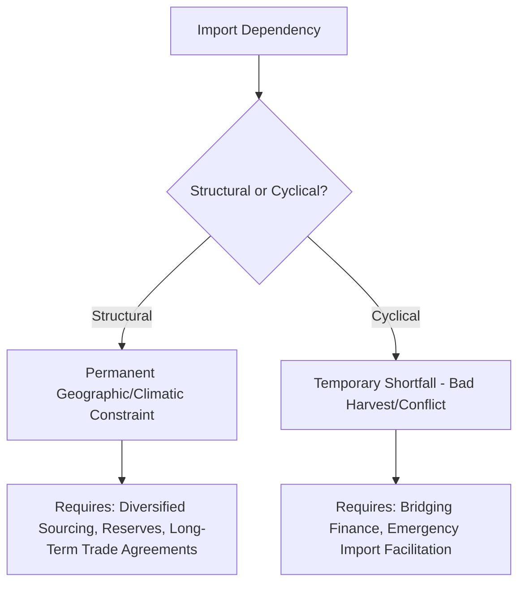

## Food Security in Import-Dependent Regions

### Overview

Import-dependent regions — those where domestic agricultural production is structurally insufficient to meet domestic food consumption needs — face a distinct and compounding set of food security vulnerabilities that sit downstream of nearly every risk category covered elsewhere in this chapter: export concentration, conflict-driven supply disruption, export bans, fertilizer availability, and climate variability. This topic examines the structural characteristics that define import dependency, the regions most exposed, and the policy and market mechanisms available to manage this exposure.

### Defining and Measuring Import Dependency

#### Core Metric: The Import Dependency Ratio

A standard measure used by the FAO and other food security institutions is the import dependency ratio (IDR), typically calculated for a given commodity as:

$$IDR=\frac{Imports}{Production+Imports-Exports}\times100$$

This expresses the share of total domestic supply (the "food balance sheet" availability) accounted for by imports, distinguishing structurally import-dependent countries from those experiencing temporary import needs due to a single poor harvest year.

#### Structural Versus Cyclical Dependency

- **Structural dependency**: arises from persistent geographic, climatic, or resource constraints (limited arable land, water scarcity, unsuitable climate for staple crop cultivation) that make substantial domestic production of key staples permanently uneconomical or infeasible — characteristic of most Gulf states, many small island developing states, and several North African countries.
- **Cyclical dependency**: arises from temporary production shortfalls (a single bad harvest, conflict-related disruption) in countries that are otherwise closer to self-sufficient in normal years — this category faces different intervention logic, since the underlying agricultural capacity exists and the primary need is bridging finance or short-term import facilitation rather than permanent import infrastructure.

### Regions With High Structural Import Dependency

#### Middle East and North Africa (MENA)

The MENA region is widely characterized as having among the highest structural food import dependency globally, driven by acute water scarcity and limited arable land relative to population. Countries such as Egypt (one of the world's largest wheat importers by volume), Algeria, and several Gulf Cooperation Council states import a substantial majority of their staple grain consumption. This structural dependency was a key transmission channel through which the Black Sea Grain Initiative's collapse and broader Russia-Ukraine war disruption affected regional food security, given the region's historical reliance on Black Sea wheat suppliers.

#### Sub-Saharan Africa

Many Sub-Saharan African countries face compounding import dependency and limited fiscal capacity to absorb import price shocks, combined with underdeveloped domestic agricultural productivity (often attributable to limited access to fertilizer, irrigation infrastructure, and improved seed varieties) and, in some cases, ongoing conflict or governance challenges that further constrain domestic production capacity.

#### Small Island Developing States (SIDS)

Small island states across the Caribbean, Pacific, and Indian Ocean regions typically face severe structural constraints on domestic agricultural production (limited arable land area, vulnerability to climate events including tropical cyclones and sea-level-related salinization of agricultural land) alongside high logistics costs for imports given geographic remoteness — creating a distinct vulnerability profile combining structural import dependency with elevated supply chain fragility.

#### Select Wealthy Import-Dependent Economies

Not all import dependency corresponds to low fiscal capacity: Gulf states and other high-income, resource-constrained economies (e.g., Singapore) are also structurally import-dependent for staple foods, but generally possess substantially greater fiscal capacity to manage price volatility through purchasing power, strategic reserves, and diversified long-term supply agreements — illustrating that import dependency and food security vulnerability are related but analytically distinct concepts; dependency ratio alone does not determine vulnerability without accounting for a country's capacity to manage that dependency.

### Compounding Risk Factors Specific to Import-Dependent Regions

#### Currency and Exchange Rate Exposure

Because staple food imports are typically priced and traded in US dollars on global commodity markets, import-dependent countries with weaker or more volatile domestic currencies face a dual exposure: global commodity price increases and domestic currency depreciation can compound simultaneously, since a weakening currency increases the local-currency cost of dollar-denominated food imports even if global commodity prices remain flat.

#### Fiscal Capacity Constraints

Many structurally import-dependent developing countries maintain food subsidy programs (e.g., Egypt's longstanding bread subsidy system) to buffer domestic consumers from global price volatility. These programs create significant and somewhat inflexible fiscal obligations, since reducing subsidies during a global price spike — precisely when subsidy costs to the government are rising fastest — carries substantial social and political risk (historically, sharp increases in bread or staple food prices have been associated with social unrest in multiple import-dependent countries).

#### Limited Diversification Capacity

Smaller or lower-income import-dependent countries often have less capacity to diversify sourcing across multiple exporting countries or negotiate long-term supply agreements compared to larger, wealthier importers, leaving them more exposed to disruption in whichever specific supplier relationships they have established — a vulnerability that compounds the general export concentration risk discussed earlier in this chapter.

### Institutional and Policy Responses

#### Strategic Food Reserves

Some import-dependent countries maintain physical strategic grain reserves intended to buffer several months of consumption against acute supply disruption, though reserve maintenance involves meaningful storage, spoilage, and carrying costs, and reserve sizing involves a tradeoff between fiscal cost and risk coverage.

#### Multilateral and Bilateral Food Assistance

The World Food Programme (WFP) and other multilateral and bilateral assistance mechanisms provide emergency food assistance to the most acutely vulnerable import-dependent populations, particularly in conflict-affected or crisis contexts, though these mechanisms are generally designed for acute humanitarian response rather than as a substitute for structural food security policy.

#### Long-Term Bilateral Supply Agreements and Sovereign Wealth Investment

Some import-dependent countries, particularly Gulf states, have pursued strategies involving direct investment in agricultural land and production capacity in other countries (sometimes termed "land grabs" or overseas agricultural investment by critics) as a strategy to secure long-term supply access outside of open-market purchasing — a strategy that has generated its own set of governance, equity, and host-country food security concerns, since production destined for export back to the investing country may not benefit host-country food security, particularly in host countries that are themselves food-insecure.

#### Regional Cooperation and Buffer Stock Arrangements

Regional coordination mechanisms — such as the ASEAN Plus Three Emergency Rice Reserve (APTERR) — represent efforts to pool strategic reserves and coordinate emergency response across multiple countries within a region, intended to achieve better risk-pooling efficiency than individual national reserves alone, though the scale of such regional mechanisms relative to full regional consumption needs is generally limited.

### Compounding Vulnerability Framework

$$Vulnerability=f(IDR,FiscalCapacity^{-1},SourceDiversification^{-1},ClimateExposure)$$

[Inference] This is a conceptual rather than formally estimated framework: food security vulnerability for an import-dependent region is generally understood in the food security literature to depend jointly on the import dependency ratio itself, the country's fiscal capacity to absorb price shocks (inversely related to vulnerability), the degree of source diversification across suppliers (inversely related to vulnerability), and exposure to climate-driven production risk in its own agricultural base and in its supplier countries — but there is no single standardized index combining these factors identically across all food security research institutions, and specific indices (e.g., the Global Food Security Index published by various organizations) use varying methodologies and weightings.

### Key Points

- Import dependency ratio (IDR) provides a standard quantitative measure of a country's reliance on food imports, but vulnerability depends jointly on dependency level, fiscal capacity, and source diversification, not dependency alone
- MENA, Sub-Saharan Africa, and Small Island Developing States represent regions with particularly high structural import dependency combined with limited fiscal capacity, creating compounded vulnerability
- Currency depreciation and global commodity price increases can compound simultaneously for import-dependent countries with weaker currencies, since staple food imports are typically dollar-denominated
- Food subsidy programs in import-dependent countries create fiscally inflexible obligations that become most costly precisely during global price spikes, while reduction carries significant social/political risk
- Policy responses span strategic reserves, multilateral humanitarian assistance, overseas agricultural investment strategies (with associated host-country equity concerns), and regional buffer-stock cooperation mechanisms

### Related Topics

- Global grain trade and export concentration risk as the upstream structural condition driving import dependency exposure
- The Black Sea Grain Initiative's collapse and its disproportionate impact on MENA import-dependent countries
- Sovereign wealth fund overseas agricultural land investment and host-country food security equity concerns
- The World Food Programme and multilateral humanitarian food assistance mechanisms
- Currency and exchange rate risk in dollar-denominated commodity import exposure
- Regional buffer stock arrangements (e.g., ASEAN Plus Three Emergency Rice Reserve) as risk-pooling mechanisms