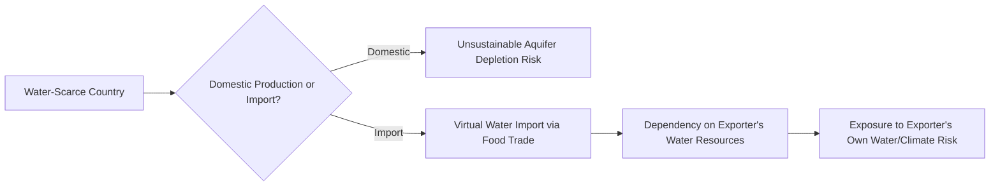
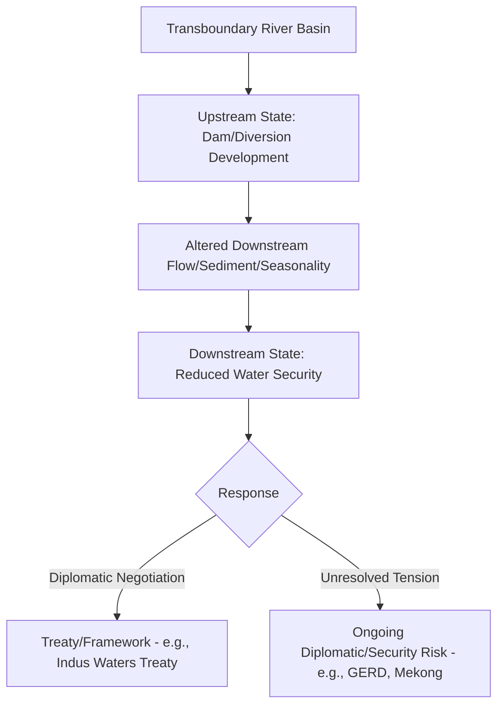

## Water Scarcity as a Supply Chain and Geopolitical Risk

### Overview

Water scarcity intersects with supply chain and geopolitical risk through multiple distinct channels: as a direct constraint on agricultural production (linking to food security topics covered elsewhere in this chapter), as a critical input to industrial manufacturing processes (notably semiconductor fabrication), as a driver of transboundary river basin conflict between states, and as a chokepoint risk factor in global shipping through water-dependent canal infrastructure. This topic surveys water scarcity's role as a distinct but interconnected supply chain and geopolitical risk category.

### Water Scarcity as an Agricultural Production Constraint

#### Virtual Water and Embedded Water Trade

A foundational concept in this domain is **virtual water** (or "embedded water") — the volume of water consumed in producing a good, particularly agricultural commodities, which is effectively traded internationally whenever that good is exported. Water-scarce countries that import food are, in effect, importing water indirectly, and countries with water-intensive export agriculture are effectively exporting scarce domestic water resources embedded in their products.

$$VirtualWaterTrade=\sum_{i}Q_i\times WF_i$$

Where $Q_i$ is the traded quantity of commodity $i$ and $WF_i$ is that commodity's water footprint (volume of water required per unit produced). [Inference] This framework is a widely used conceptual and analytical tool in water resource and trade economics research (developed substantially through the work of water footprint researchers such as Tony Allan and the Water Footprint Network), though precise water footprint coefficients vary by production method, climate, and region, making cross-study quantitative comparisons imprecise without careful methodological alignment.

#### Structural Link to Import Dependency

This concept directly connects to the food import dependency topic covered earlier in this chapter: countries with severe domestic water scarcity (much of MENA, for example) often rationally choose to import water-intensive staple crops rather than attempt water-intensive domestic production, effectively substituting virtual water imports for direct water resource development — a strategy sometimes explicitly articulated in national food security policy.

### Transboundary River Basin Geopolitics

#### Structural Conflict Potential

Many of the world's major river systems cross multiple sovereign borders, creating structural potential for upstream-downstream conflict, since upstream damming, diversion, or water-quality degradation can materially affect downstream water availability without downstream states having direct control or recourse.

#### Key Case Studies

**Nile River Basin — Grand Ethiopian Renaissance Dam (GERD)**: Ethiopia's construction and filling of the GERD on the Blue Nile has generated sustained diplomatic tension with downstream Egypt and Sudan, given Egypt's near-total dependence on Nile water for its agricultural and freshwater needs. Egypt has historically characterized Nile water security as an existential national security concern, while Ethiopia asserts sovereign rights to develop its own water resources for hydroelectric power generation and development — a dispute that has involved multiple rounds of negotiation (including African Union-mediated talks) without a comprehensive binding agreement on reservoir filling and operation protocols acceptable to all three countries as of recent reporting. [Unverified] The precise current status of GERD-related negotiations should be checked against recent reporting given the multi-year, unresolved nature of this dispute.

**Indus River Basin — India-Pakistan**: The Indus Waters Treaty (1960), brokered by the World Bank, has historically governed water-sharing arrangements between India and Pakistan across the Indus river system, and is frequently cited as a rare example of sustained water-sharing cooperation between two states with an otherwise adversarial and periodically militarized relationship. [Unverified] The treaty's status has faced significant strain in recent years amid broader India-Pakistan tensions, and its current operational status should be verified against current reporting rather than assumed stable, given periodic threats by Indian officials to reconsider treaty participation during periods of heightened bilateral tension.

**Mekong River Basin**: Upstream dam construction, predominantly by China on the Mekong's upper reaches (known as the Lancang River within China) along with dam development by Laos, has generated concern among downstream Mekong Basin countries (Thailand, Cambodia, Vietnam) regarding altered seasonal flow patterns, sediment transport disruption affecting downstream agriculture and fisheries, and reduced influence for downstream states over a shared resource critical to regional food security.

**Tigris-Euphrates Basin**: Turkish dam and irrigation development (notably the Southeastern Anatolia Project, GAP) has affected downstream water availability for Syria and Iraq, compounding water stress in a region already affected by conflict and governance challenges, with downstream water scarcity cited among the contributing stressors to agricultural decline and rural-to-urban displacement in parts of Syria and Iraq in recent decades.

### Water as an Industrial Supply Chain Input

#### Semiconductor Manufacturing Water Intensity

As referenced in the discussion of supply chain relocation limits, semiconductor fabrication is a highly water-intensive industrial process, requiring substantial volumes of ultra-pure water for wafer cleaning and processing at each stage of chip fabrication. This creates a specific intersection between water scarcity and the broader semiconductor supply chain geopolitics discussed in earlier chapters: fab siting decisions must account for reliable access to large, consistent water supplies, and drought conditions in fab-hosting regions (notably Taiwan, which has experienced periodic severe droughts affecting the Hsinchu Science Park region) have previously required emergency water-allocation measures prioritizing semiconductor manufacturing over agricultural irrigation — illustrating a direct policy tradeoff between strategic industrial output and domestic agricultural water needs during scarcity episodes.

#### Broader Industrial and Energy Sector Water Dependency

Beyond semiconductors, water scarcity affects thermoelectric power generation (which requires substantial water for cooling), mining and mineral processing (including some critical mineral extraction and refining processes discussed elsewhere in this curriculum), and various other water-intensive industrial processes, meaning water stress can constrain industrial capacity and strategic-sector development independent of, but potentially compounding, other supply chain risk factors.

### Water Scarcity and Shipping Chokepoint Risk

#### Panama Canal Drought Disruption

The Panama Canal's lock system depends on freshwater from Gatun Lake and associated reservoirs to operate its lock mechanisms (transiting each ship through the canal consumes a substantial volume of fresh water, which is ultimately released to the ocean rather than recycled in the traditional lock design). Severe drought conditions affecting the Panama Canal watershed (notably in 2023-2024, associated with El Niño conditions) forced the Panama Canal Authority to impose transit restrictions, including reduced daily transit slots and maximum vessel draft limits, creating a direct climate-driven disruption to a globally critical maritime chokepoint. [Unverified] Current Panama Canal operating conditions and any subsequent infrastructure investments (e.g., proposals for additional water sources or reservoir capacity) should be checked against recent reporting given the evolving nature of both the drought recovery and canal authority mitigation investments.

This case illustrates a distinct risk pathway from other chokepoint risks (e.g., the Strait of Hormuz or Bab-el-Mandeb, which are geopolitical/security chokepoints): the Panama Canal's vulnerability is fundamentally a water-resource-availability constraint, meaning its risk profile is tied to regional precipitation patterns and long-term climate trends rather than primarily to state conflict or coercive action, though the economic and shipping-cost consequences of disruption are similar in kind to security-driven chokepoint disruptions.

### Groundwater Depletion as a Slower-Moving Risk

Beyond acute drought events, long-term groundwater and aquifer depletion — driven by agricultural irrigation demand exceeding natural aquifer recharge rates — represents a slower-moving but potentially more structurally significant risk in several major agricultural regions, including parts of India's Punjab region, the US High Plains (Ogallala Aquifer), and the North China Plain. [Inference] Because aquifer depletion is a gradual, cumulative process rather than a discrete shock event, it receives comparatively less acute geopolitical and market attention than drought-driven price spikes or dam-related interstate disputes, but is assessed by many water resource and agricultural economists as posing a more fundamental long-term constraint on sustained production capacity in some of the world's most agriculturally significant regions; the precise depletion timelines and remaining viable extraction windows vary by aquifer and are subject to ongoing hydrological study and revision.

### Key Points

- Virtual water trade means water-scarce countries can strategically substitute food imports for domestic water-intensive agricultural production, linking water scarcity directly to the food import dependency risk discussed earlier in this chapter
- Transboundary river basins (Nile/GERD, Indus, Mekong, Tigris-Euphrates) create structural upstream-downstream conflict potential, with the Indus Waters Treaty representing a notable, if currently strained, cooperative counterexample
- Water scarcity directly intersects with critical industrial supply chains, notably semiconductor fabrication, creating documented tradeoffs between strategic industrial water allocation and agricultural irrigation during drought episodes
- The 2023-2024 Panama Canal drought demonstrated a water-availability-driven (rather than security-driven) global shipping chokepoint disruption, distinct in causal mechanism from geopolitical chokepoint risks like the Strait of Hormuz
- Groundwater and aquifer depletion represents a slower-moving, cumulative structural risk in major agricultural regions that receives less acute attention than discrete drought or conflict events but may pose more fundamental long-term production constraints

### Related Topics

- Global grain trade export concentration and its intersection with water-scarce major producing regions
- Semiconductor fabrication water intensity and Taiwan drought-driven allocation tradeoffs
- Maritime chokepoints and shipping route risk (Panama Canal, Strait of Hormuz, Bab-el-Mandeb comparative framework)
- The Nile Basin, Indus Waters Treaty, and Mekong River Commission as transboundary water governance case studies
- Groundwater depletion in the Ogallala Aquifer, North China Plain, and Indian Punjab
- Climate variability and agricultural supply shocks as a related upstream risk driver