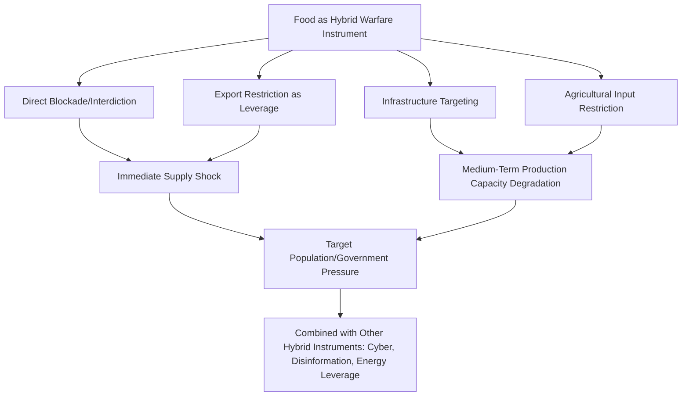

## Food as an Instrument of Hybrid Warfare and Political Leverage

### Overview

This topic extends the "weaponization" concept introduced earlier in this chapter into the broader framework of hybrid warfare — the deliberate combination of conventional, irregular, informational, cyber, and economic instruments below the threshold of open interstate war. Food and agricultural supply chains represent a distinct instrument within this toolkit, capable of exerting coercive pressure on populations and governments without direct kinetic military engagement, while often maintaining sufficient ambiguity or deniability to complicate attribution and international response.

### Conceptual Framework: Food Weaponization Within Hybrid Warfare Theory

#### Defining Characteristics of Hybrid Warfare Instruments

Hybrid warfare theory generally identifies instruments that share several characteristics: they operate below the threshold that would trigger conventional military or full-scale economic response, they exploit legal and normative ambiguity (a government can typically justify food-related restrictions using legitimate domestic-policy language even when strategic coercion is a driving motivation), and they are often deployed in combination with other instruments (cyber operations, disinformation, energy leverage) as part of a coordinated pressure campaign rather than in isolation.

#### Food-Specific Coercive Mechanisms

- **Direct blockade or interdiction**: physically preventing food or agricultural input shipments from reaching a target population or third-country market, as seen in Russia's initial 2022 naval blockade of Ukrainian Black Sea ports.
- **Export restriction as signaling and leverage**: using control over a dominant export position to extract political concessions from import-dependent states, distinct from (though sometimes difficult to disentangle from) genuine domestic stabilization policy, as discussed in the export bans topic.
- **Deliberate infrastructure targeting**: attacking grain storage facilities, port infrastructure, agricultural processing capacity, or irrigation/water infrastructure to degrade an adversary's food production or export capacity over the medium to long term.
- **Fertilizer and agricultural input leverage**: restricting access to fertilizer, seed, or agricultural machinery/parts as an indirect mechanism to degrade an adversary's future agricultural output, operating with a longer time lag than direct food supply interdiction.

### Case Study: Russia-Ukraine War as a Multi-Instrument Food Campaign

The Russia-Ukraine war provides a comprehensive illustration of food-related hybrid warfare instruments deployed in combination:

- **Naval blockade** (2022): the initial halt of Ukrainian Black Sea shipping represented direct interdiction, later partially reversed through the Black Sea Grain Initiative (discussed in detail elsewhere in this chapter).
- **Infrastructure strikes**: attacks on Odesa port grain storage and export infrastructure — notably intensifying immediately following Russia's July 2023 withdrawal from the Black Sea Grain Initiative — directly targeted physical export capacity rather than merely blockading shipping lanes.
- **Grain theft allegations**: multiple international reports and Ukrainian government allegations have documented claims of grain being removed from Russian-occupied Ukrainian territory and exported through Russian or Russian-controlled channels, which — if substantiated — would represent appropriation of agricultural output as an additional dimension beyond blockade or infrastructure denial. [Unverified] Specific quantities and the full scope of such allegations involve contested claims between parties to the conflict and should be treated with appropriate evidentiary caution rather than as settled fact.
- **Fertilizer export dynamics**: Russia's positioning of its own fertilizer exports (discussed in the fertilizer supply chains topic) as exempted or negotiable within sanctions frameworks has functioned as a parallel leverage point in diplomatic negotiations, with Russia citing Western sanctions' effects on its agricultural export logistics as justification for its own conduct — illustrating the attribution-ambiguity characteristic of hybrid instruments, since both sides frame their actions as defensive responses to the other's prior restrictions.

### Historical Precedents Beyond the Current Conflict

#### Cold War-Era Grain Diplomacy

Food trade has functioned as an instrument of interstate leverage well before the contemporary hybrid warfare framework was formalized. The 1980 US grain embargo against the Soviet Union (imposed in response to the Soviet invasion of Afghanistan) represented an explicit use of food export restriction as coercive economic statecraft, though it is generally assessed as having achieved limited strategic effect given the Soviet Union's ability to source substitute grain supplies from other exporters (notably Argentina), while imposing substantial economic costs on US farmers — an early illustration of the collective-action and substitution-effect limitations that constrain unilateral food-weaponization strategies when alternative suppliers exist.

#### Siege Warfare as Historical Antecedent

The deliberate use of starvation and food denial as a tool of coercion against besieged populations has ancient historical antecedents in conventional warfare (sieges), distinguishing it conceptually from modern hybrid food-weaponization in that siege warfare typically operates within an acknowledged state of open conflict rather than the below-threshold ambiguity characteristic of hybrid warfare — though contemporary international humanitarian law (including the Geneva Conventions and subsequent protocols) explicitly prohibits starvation of civilians as a method of warfare, a legal framework directly relevant to assessing food-related conduct during the Russia-Ukraine war and other contemporary conflicts.

### Distinguishing Legitimate Policy From Coercive Intent: Analytical Challenges

As introduced in the export bans discussion, distinguishing genuinely defensive domestic food security policy from deliberate coercive leverage is frequently contested and often unresolvable with full confidence from publicly available evidence. Several analytical indicators are commonly used by geopolitical risk analysts to assess where a specific action falls on this spectrum, while acknowledging that these indicators are suggestive rather than conclusive:

- **Timing relative to negotiation leverage points**: restrictions imposed or lifted in close temporal proximity to unrelated diplomatic negotiations or demands may suggest coercive intent, though correlation does not establish causation with certainty.
- **Proportionality to stated domestic rationale**: restrictions substantially exceeding what stated domestic price or supply concerns would appear to justify may suggest additional motivations, though assessing "proportionality" itself requires judgment calls about counterfactual domestic conditions.
- **Selective application**: restrictions applied differentially against specific trading partners rather than uniformly may suggest targeted leverage rather than general domestic stabilization policy.
- **Explicit linkage in official statements**: instances where officials explicitly tie food/agricultural trade conditions to unrelated political demands provide the clearest (though still not universally agreed-upon) evidence of coercive intent, as opposed to inferring intent solely from restriction patterns.

### Legal and Normative Constraints

#### International Humanitarian Law

Beyond the general prohibition on starvation as a method of warfare, international humanitarian law includes provisions protecting objects indispensable to civilian survival (which can include agricultural areas, irrigation works, and foodstuffs) from deliberate attack or destruction during armed conflict — though enforcement mechanisms for these provisions face similar attribution, jurisdiction, and political-will constraints as other international humanitarian law enforcement generally.

#### UN Security Council Resolution 2417 (2018)

This resolution explicitly condemned the use of starvation as a method of warfare and the unlawful denial of humanitarian access, formally linking conflict-induced food insecurity to the international peace and security framework within UN Security Council competence — representing a relatively recent (2018) formalization of food security as an explicit matter of international peace and security concern, distinct from earlier treatment of food security primarily as a humanitarian or development policy matter.

### Strategic Implications for Import-Dependent and Third-Party States

States and populations most exposed to food-based hybrid warfare instruments are frequently not the direct parties to the underlying conflict, but rather import-dependent third countries (as discussed regarding MENA and Sub-Saharan African exposure to Black Sea Grain Initiative disruption) — meaning food weaponization's coercive target and its most severely affected population can diverge, with humanitarian consequences falling disproportionately on populations with no direct stake in or influence over the underlying geopolitical dispute. [Inference] This dynamic is sometimes cited by international relations analysts as raising distinct ethical and strategic-stability concerns relative to other hybrid warfare instruments (such as cyber operations) that more directly target the adversary state itself, since food weaponization's humanitarian externalities are diffused globally through interconnected trade systems rather than contained to the conflict parties — though this is an analytical observation rather than a settled point of legal or policy consensus.

### Key Points

- Food-related hybrid warfare instruments include direct blockade, export-restriction leverage, infrastructure targeting, and agricultural input denial, often deployed in combination with other hybrid instruments (cyber, disinformation, energy leverage)
- The Russia-Ukraine war illustrates multiple food-weaponization mechanisms operating concurrently: naval blockade, infrastructure strikes, contested grain-theft allegations, and fertilizer-export leverage in sanctions negotiations
- Historical precedents, including the 1980 US Soviet grain embargo, demonstrate that unilateral food-weaponization strategies face significant limitations when substitute suppliers exist, constraining their standalone strategic effectiveness
- International humanitarian law (Geneva Conventions provisions and UN Security Council Resolution 2417) formally prohibits starvation as a method of warfare and links conflict-driven food insecurity to international peace and security, though enforcement remains constrained
- Import-dependent third-party states, uninvolved in the underlying conflict, frequently bear the most severe humanitarian consequences of food weaponization, creating a distinct diffusion of harm relative to other hybrid warfare instruments

### Related Topics

- Export bans and the weaponization of food trade (foundational framework for this topic)
- The Black Sea Grain Initiative and its collapse as a primary contemporary case study
- Food security in import-dependent regions and disproportionate third-party exposure
- UN Security Council Resolution 2417 and the international peace and security framework for conflict-induced hunger
- Historical grain embargoes: the 1980 US-Soviet grain embargo and its limited strategic effectiveness
- Hybrid warfare theory and the combination of economic, cyber, and informational coercive instruments