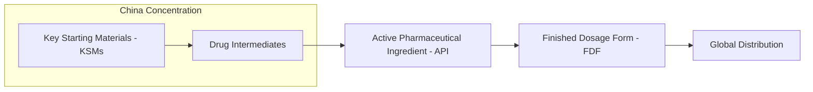
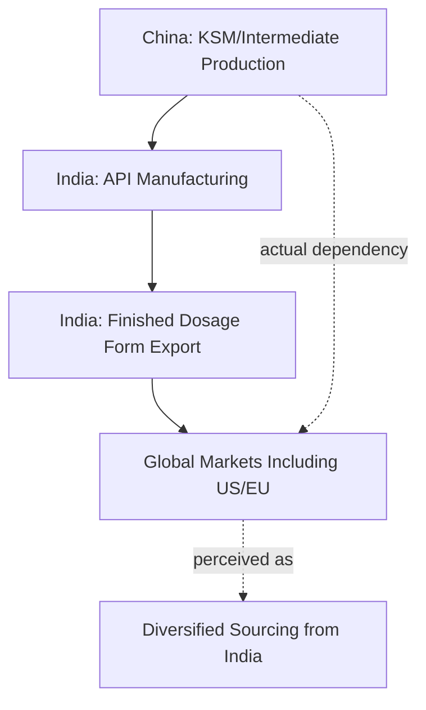

## Active Pharmaceutical Ingredient Concentration in China and India

### Overview

Active pharmaceutical ingredients (APIs) — the biologically active components in a finished pharmaceutical product responsible for its therapeutic effect — represent one of the most consequential and least visible concentration risks in global supply chains, given their direct implications for public health and medicine availability. The global API supply chain exhibits a layered dependency structure: India is a leading global producer and exporter of finished generic drugs and many APIs, but India's own API and key starting material (KSM) production is itself substantially dependent on imports from China, meaning apparent geographic diversification at the finished-drug level frequently masks continued upstream concentration in China — directly illustrating the "tiered supply chain depth" dynamic discussed regarding the limits of full supply chain relocation.

### Defining APIs and Their Position in the Pharmaceutical Value Chain

The World Health Organization defines an API as any drug or mixture of drugs employed in a finished pharmaceutical product to provide pharmacological activity or otherwise have direct action in diagnosis, treatment, or disease prevention. APIs constitute approximately 35% of the overall pharmaceutical market by value, sitting upstream of finished dosage form (FDF) manufacturing in the value chain.

### China's Position in Global API Supply

China controlled approximately 80% of global generic API supply by 2023, leveraging cost advantages, extensive chemical manufacturing infrastructure, and economies of scale built over decades of investment in bulk chemical and pharmaceutical intermediate production. China's registered API manufacturing footprint with the US FDA has grown substantially: in 2019, China had 230 FDA-registered API manufacturing facilities (13% of all registered sites, double its 2010 count), and by February 2025 this had grown to 467 FDA-registered facilities, representing 20% of all such sites globally.

Among FDA-registered API manufacturing sites globally, the current distribution is roughly: the United States accounts for 22%, India 21%, China 20%, and the European Union 19% — figures that, taken at face value, suggest a relatively diversified geographic footprint at the registered-facility level. However, this facility-count metric substantially understates China's effective influence, since it does not capture the volume of intermediates and KSMs that non-Chinese API manufacturers (particularly in India) themselves depend on sourcing from China.

### India's Dual Role: Major Producer and Structurally China-Dependent

#### India's Global API Production Position

India is the third-largest API producer globally, holding roughly an 8-8.8% share of global API output by volume, operating more FDA-approved manufacturing facilities than any country other than the US itself. India supplies approximately 57% of APIs to the World Health Organization's prequalified list, reflecting its central role in global generic medicine supply, particularly for essential medicines used in lower- and middle-income countries.

#### The Underlying China Dependency

Despite this substantial production position, India depends on China for approximately 70-80% of its bulk drug and pharmaceutical intermediate imports, according to industry analysis — a dependency that a 2026 NITI Aayog (India's government policy think tank) report quantified in more granular category-specific terms: India imported $7.4 billion worth of APIs in 2025, with the top five product categories accounting for nearly 84% of total API imports, and China's share within these top categories ranging from 65% to 86% depending on the specific product category. The report specifically flagged fermentation-based products — including key intermediates and precursors such as nucleotides and amino acids — as an area of especially high dependence.

The two largest import categories illustrate this concentration: nitrogen heterocyclic compounds represented $2.3 billion (31.9% of India's total API imports) and antibiotics represented $1.9 billion (26.1%), together constituting nearly 58% of India's entire API import basket — indicating that India's dependency is not evenly distributed but concentrated in a narrow range of critical pharmaceutical input categories, per the NITI Aayog assessment.

[Inference] This structure means that even pharmaceutical supply chains nominally diversified away from direct Chinese finished-product sourcing (e.g., a US buyer sourcing a generic drug from an Indian manufacturer rather than a Chinese one) frequently retain substantial indirect exposure to Chinese supply disruption, since the Indian manufacturer's own production depends on Chinese intermediate inputs — this is a widely cited structural observation in pharmaceutical supply chain analysis rather than a claim requiring further qualification, given the consistency of import-dependency figures across multiple industry and government sources.

### COVID-19 as a Stress-Test Precedent

During the COVID-19 pandemic, India's dependence on Chinese pharmaceutical imports became a significant industry concern, as pandemic-related lockdowns and logistics disruptions in China exposed vulnerabilities throughout the global pharmaceutical supply chain — directly analogous to the semiconductor and broader manufacturing supply chain disruptions experienced during the same period, but with more direct public health stakes given the essential-medicine nature of many affected products.

### Policy Responses

#### India's Production-Linked Incentive (PLI) Scheme

India has implemented a Production-Linked Incentive scheme for pharmaceuticals (running through FY 2029-30) specifically targeting self-reliance and reduced import dependence in critical KSMs, drug intermediates, and APIs, offering financial incentives tied to investment thresholds and domestic sales targets. The program includes a total budgetary outlay of INR 6,940 crore for Bulk Drug Parks, with a broader INR 15,000 crore earmarked under the overall PLI Scheme for Pharmaceuticals. As of September 2025, the scheme had created manufacturing capacity for 26 KSMs/APIs, generating cumulative sales of INR 2,315 crore and avoiding INR 1,807 crore in imports, and had spurred domestic production of 38 critical APIs previously almost entirely imported, including Penicillin G, Clavulanic Acid, Atorvastatin, and Metformin.

#### US Strategic Reserve Response

In the United States, the Strategic Active Pharmaceutical Ingredients Reserve (SAPIR) — a government-supported system designed to secure domestic access to essential APIs — was first developed following COVID-19-era drug shortage concerns and was formally strengthened through a 2025 executive order directing federal agencies to build national API reserves to reduce foreign dependence, reflecting a policy approach parallel to strategic reserve mechanisms used for grain and other critical commodities discussed elsewhere in this curriculum.

#### US Legislative and Tariff Measures

The US has pursued additional measures including Section 301 tariffs (initiated in 2018) imposing duties on various Chinese imports, including certain pharmaceutical chemicals and APIs, and proposed legislation such as the BioSecure Act, which has been directed at limiting certain US government and federally-funded engagement with specified Chinese biotechnology firms on national security grounds — collectively reflecting a policy environment of rising scrutiny on pharmaceutical supply chain dependency on China, analogous to semiconductor and critical minerals policy discussed in earlier chapters.

### "China+1" Diversification in Pharmaceuticals

The disruptions of the COVID-19 period and subsequent tariff/geopolitical tensions have accelerated adoption of "China+1" strategies among global pharmaceutical companies, wherein firms continue sourcing from China while actively diversifying supply chains to reduce concentration risk. India has emerged as a key beneficiary of this diversification given its established manufacturing base, regulatory credibility (extensive FDA-approved facility infrastructure), and existing presence in global generics markets — though, as detailed above, this diversification frequently addresses only the finished-API or finished-drug layer of the supply chain while leaving upstream KSM/intermediate dependency on China largely intact, limiting the depth of true diversification achieved.

[Unverified] Whether sourcing from India provides meaningful tariff or geopolitical insulation depends on the degree of chemical/manufacturing transformation applied in India, since substantial modification of a Chinese-origin material in India may achieve a different country-of-origin tariff classification even though underlying dependency on Chinese raw materials remains — this is a live and evolving area of trade compliance interpretation rather than a settled rule, and specific current tariff treatment should be verified against current customs guidance.

### Key Points

- China controls roughly 80% of global generic API supply by volume, while facility-count metrics (FDA-registered sites) understate this dominance since they don't capture upstream intermediate dependency
- India is the world's third-largest API producer and supplies 57% of WHO-prequalified essential medicine APIs, but depends on China for an estimated 70-86% of its own bulk drug and intermediate imports depending on product category
- India's API import dependency is heavily concentrated in specific categories (nitrogen heterocyclic compounds and antibiotics together comprise nearly 58% of its import basket), rather than being evenly distributed
- Apparent "China+1" diversification toward India frequently addresses only the finished-API manufacturing layer while leaving upstream KSM/intermediate dependency on China substantially intact — a pharmaceutical-sector instance of the tiered supply chain depth problem
- Policy responses include India's PLI scheme for domestic KSM/API self-reliance and the US Strategic API Reserve (SAPIR), both reflecting a broader trend of treating pharmaceutical input security as a national health-security priority

### Related Topics

- The limits of full supply chain relocation and tiered supply chain depth (direct conceptual parallel)
- India's Production-Linked Incentive (PLI) scheme for pharmaceutical self-reliance
- The US BioSecure Act and pharmaceutical biotechnology national security policy
- China+1 diversification strategies across semiconductor and pharmaceutical sectors compared
- Strategic reserves as a cross-sector risk mitigation tool (pharmaceuticals, grain, critical minerals)
- COVID-19 pandemic as a cross-sector supply chain stress-test precedent