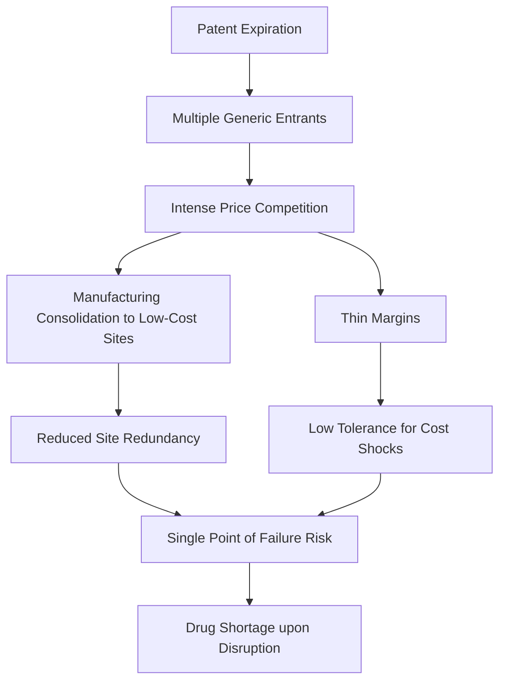
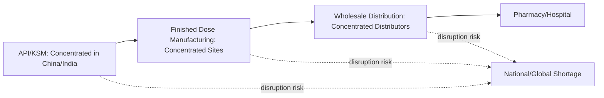

## Generic Drug Supply Chains and Vulnerability to Disruption

### Overview

Generic drugs — off-patent medications produced by multiple manufacturers competing primarily on price — constitute the overwhelming majority of prescriptions dispensed in most developed healthcare systems, yet their supply chains exhibit distinct structural vulnerabilities that differ meaningfully from branded/patented pharmaceutical supply chains. The intense price competition that makes generics affordable also creates thin margins, manufacturing consolidation, and reduced redundancy that leave generic drug supply particularly susceptible to disruption from a single-site or single-supplier failure.

### Structural Economics of Generic Drug Manufacturing

#### The Price Competition-Fragility Relationship

Once a drug's patent and regulatory exclusivity periods expire, multiple manufacturers typically enter the market, driving prices down substantially — often by 80-90% or more from the original branded price over time as additional generic entrants join. This intense price competition creates a structural incentive for manufacturers to minimize production costs through:

- **Manufacturing consolidation**: concentrating production of a given generic drug or its API in a small number of low-cost facilities (frequently in India or China, as discussed regarding API concentration) rather than maintaining redundant production sites, since redundancy adds cost without a corresponding price premium available in a commoditized market.
- **Thin margin tolerance for disruption**: low per-unit margins mean manufacturers have limited financial buffer to absorb unexpected cost increases (e.g., from a raw material price spike or regulatory remediation requirement) without exiting a product line entirely, a dynamic that can lead to abrupt supply withdrawal rather than gradual price adjustment.

#### Market Exit Dynamics

When a generic drug's market becomes sufficiently commoditized and low-margin, some manufacturers exit the product line entirely rather than continuing production at unprofitable prices — a dynamic that, when it affects several manufacturers of the same drug simultaneously (since they typically face similar cost pressures), can leave a critical drug with very few or even a single remaining active manufacturer, despite the drug nominally having "generic" (multi-source) status.

### The Single-Site and Single-Source Vulnerability

#### Concentration Despite Nominal Multi-Sourcing

A key vulnerability specific to generic drugs is that a medication may be approved for manufacture by multiple companies (satisfying regulatory "generic" multi-source criteria) while, in practice, actual active production is concentrated in very few facilities at any given time — because not all approved manufacturers maintain continuous active production, some approved generic versions exist only on paper (approved but not currently marketed), and remaining active manufacturers may share a common upstream API or KSM source even when operating separate finished-dose facilities (connecting directly to the API concentration risk discussed in the preceding topic).

#### FDA Drug Shortage Data as an Indicator

US FDA and other regulatory bodies maintain public drug shortage lists that provide an empirical, if lagging, indicator of realized supply chain vulnerability. [Unverified] Specific current counts of drugs on active shortage lists change frequently and should be checked against the FDA's current drug shortage database rather than a fixed figure, but persistent patterns across multiple years of shortage reporting show injectable generic sterile drugs (including certain chemotherapy agents, local anesthetics, and critical care medications) as disproportionately represented among chronic shortages, reflecting the manufacturing complexity and quality-control sensitivity of sterile injectable production combined with generic-market thin margins.

### Sterile Injectable Manufacturing: A Case of Compounding Vulnerability

Sterile injectable generic drugs illustrate several compounding vulnerability factors simultaneously:

- **High manufacturing complexity and capital cost**: sterile injectable manufacturing requires specialized cleanroom facilities, aseptic processing capability, and rigorous quality control, creating high fixed costs and long facility qualification timelines that discourage new-entrant capacity addition even when shortages create apparent market opportunity.
- **Regulatory remediation risk**: quality or manufacturing compliance issues identified during FDA inspection can require a facility to halt production for remediation, and because sterile injectable capacity is already concentrated among few active manufacturers, a single facility's remediation-driven shutdown can trigger a national shortage with limited ability for remaining manufacturers to rapidly absorb the lost volume, since expanding sterile manufacturing capacity requires significant lead time.
- **Low profitability discouraging capacity investment**: the same price competition dynamics discussed above apply acutely to sterile generics, meaning the return on investment for adding redundant sterile manufacturing capacity is often insufficient to attract investment absent a shortage-driven price premium, creating a structural undersupply of resilience capacity even when the underlying market recognizes the risk.

### Geographic Concentration Risk

#### Overlap With API Concentration

As discussed in the preceding topic, generic drug manufacturing (both API and finished dosage form) is heavily concentrated in India and China. This creates a compounding geographic risk layer on top of the manufacturer-concentration risk discussed above: a natural disaster, regulatory action, public health emergency, or geopolitical disruption affecting a manufacturing hub region can simultaneously affect multiple generic drug manufacturers dependent on that region's facilities or on API imports sourced through that region.

#### Illustrative Disruption Precedent

The COVID-19 pandemic's disruption of Chinese and Indian manufacturing and logistics in 2020 demonstrated this compounding risk in practice, contributing to reported shortages or supply tightness across a range of generic drugs and API-dependent products globally, reinforcing the structural concerns that had been previously documented but not always acted upon by regulators and industry.

### Distribution Layer Vulnerabilities

Beyond manufacturing, the generic drug distribution layer carries its own concentration characteristics: in the US, a small number of large pharmaceutical distributors (sometimes termed the "Big Three" wholesale distributors) handle a substantial majority of pharmaceutical distribution volume, meaning disruption at the distribution layer (e.g., a cyberattack, as has affected healthcare-sector logistics and IT systems in various documented incidents) can have outsized effects on drug availability independent of manufacturing-layer disruption, since distribution represents an additional potential single-point-of-failure layer in the overall supply chain.

### Policy and Market-Based Mitigation Approaches

#### Regulatory Transparency Requirements

Regulatory reforms in various jurisdictions have moved toward requiring greater manufacturer disclosure of API sourcing origin and manufacturing site location, intended to improve regulators' and purchasers' visibility into concentration risk that was historically opaque given limited disclosure requirements in earlier regulatory frameworks.

#### Strategic Stockpiling

Government and hospital-system strategic stockpiling of critical generic drugs identified as having high shortage risk represents a direct mitigation approach analogous to the API and food/fertilizer strategic reserve mechanisms discussed elsewhere in this curriculum, though stockpiling carries similar tradeoffs regarding shelf-life-driven carrying costs and the challenge of accurately identifying which specific drugs warrant reserve prioritization in advance of an actual shortage event.

#### Diversification Incentives and Onshoring Policy

Policy measures aimed at incentivizing domestic or allied-country generic drug and API manufacturing capacity (paralleling the PLI scheme discussed in the API concentration topic, and the CHIPS Act-style approach discussed for semiconductors) have been proposed and, in some cases, implemented, though the fundamental economics of generic drug price competition create an ongoing tension: policies that successfully increase manufacturing cost (through onshoring to higher-cost jurisdictions) can conflict with the cost-minimization logic that keeps generic drugs affordable, unless offset by direct subsidy or guaranteed-purchase mechanisms.

#### Group Purchasing Organization and Contracting Reform

Some analysts and policymakers have proposed reforms to hospital and health-system group purchasing organization (GPO) contracting practices — which have historically emphasized lowest-price, often sole-source, multi-year contracts — to instead incorporate supply chain resilience and manufacturer diversification criteria into purchasing decisions, on the reasoning that pure lowest-price contracting has itself been a contributing structural driver of the manufacturer-consolidation dynamics described above. [Inference] This represents a genuinely contested area of health policy debate rather than a settled reform consensus, since resilience-oriented contracting criteria generally imply somewhat higher steady-state drug costs, creating a policy tradeoff between affordability and supply security that different stakeholders weigh differently.

### Key Points

- Generic drug markets' intense price competition creates structural incentives toward manufacturing consolidation and thin margins, reducing the redundancy that would otherwise buffer against single-site disruption
- A drug can retain nominal "generic" (multi-manufacturer-approved) status while actual active production is concentrated in very few facilities, since not all approved manufacturers maintain continuous production
- Sterile injectable generics illustrate compounding vulnerability: high manufacturing complexity, regulatory remediation risk, and low profitability jointly discourage the redundant capacity investment needed for resilience
- Generic drug supply chain risk compounds with the API/KSM geographic concentration in China and India discussed in the preceding topic, plus a separate concentration layer at the wholesale distribution level
- Mitigation approaches include sourcing transparency requirements, strategic stockpiling, onshoring/diversification incentives, and proposed reform of group purchasing organization contracting practices — each carrying tradeoffs against the cost-minimization logic that keeps generic drugs affordable

### Related Topics

- Active pharmaceutical ingredient concentration in China and India (upstream structural driver of generic drug vulnerability)
- FDA drug shortage reporting and chronic sterile injectable shortage patterns
- Group purchasing organization contracting reform and health system procurement policy
- Strategic stockpiling as a cross-sector resilience mechanism (pharmaceuticals, food, critical minerals)
- Onshoring incentive design tensions between cost affordability and supply chain resilience
- Cybersecurity risk in pharmaceutical wholesale distribution and healthcare logistics systems