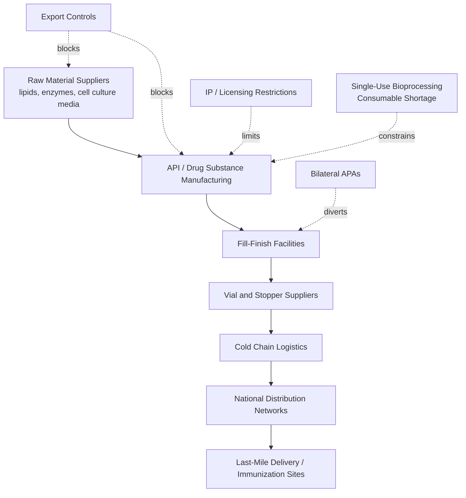

## Vaccine Nationalism and Lessons from the COVID-19 Pandemic

### Definition and Conceptual Framework

Vaccine nationalism refers to the practice of national governments prioritizing the domestic production, procurement, and distribution of vaccines for their own populations, often through bilateral advance purchase agreements (APAs), export restrictions, and manufacturing controls, at the expense of equitable global access. It is a specific instance of a broader phenomenon in supply chain geopolitics termed "medical nationalism" or "health protectionism," where critical health commodities are treated as strategic national assets during a crisis rather than global public goods.

The concept sits at the intersection of three analytical frameworks relevant to supply chain security:

- **Securitization theory**: Health crises are reframed as national security threats, justifying extraordinary state intervention in normally market-driven pharmaceutical supply chains.
- **Zero-sum resource competition**: Under conditions of acute scarcity, states behave as rational self-interested actors, competing for a fixed pool of manufacturing capacity and raw material inputs.
- **Global public goods theory**: Vaccination against a transmissible pathogen has positive externalities beyond national borders (reduced transmission, reduced variant emergence), which vaccine nationalism structurally undersupplies.

### Mechanisms of Vaccine Nationalism

**Advance Purchase Agreements (APAs)**

Wealthy nations and blocs signed bilateral contracts with manufacturers before regulatory approval, often financing Phase III trials and manufacturing scale-up in exchange for guaranteed first-priority doses. This is functionally a forward contract with an embedded R&D subsidy.

**Export Controls and Trade Restrictions**

Governments imposed licensing requirements, outright export bans, or "release valve" mechanisms on finished vaccines, active pharmaceutical ingredients (APIs), and single-use bioprocessing consumables (bioreactor bags, filters, tubing).

**Intellectual property retention**

Patent holders and originator governments resisted or delayed a TRIPS (Trade-Related Aspects of Intellectual Property Rights) waiver at the WTO, limiting the ability of generic manufacturers in the Global South to produce vaccines without licensing negotiations.

**Domestic-first regulatory prioritization**

Regulatory agencies (FDA, EMA, MHRA) processed Emergency Use Authorizations (EUAs) for domestically produced or domestically contracted vaccines ahead of, or independent of, WHO Emergency Use Listing (EUL) processes relevant to lower-income countries.

### Quantitative Snapshot of Global Inequity

**Key Points**

- By mid-2021, high-income countries (roughly 16% of world population) had secured over 4.6 billion doses through APAs, exceeding what was needed for full population coverage with margin for booster doses.
- COVAX, the multilateral pooling mechanism co-led by Gavi, CEPI, and WHO, aimed to deliver 2 billion doses by end of 2021 but delivered approximately 800 million, roughly 40% of target, due to donor-nation hoarding, export bans (notably India's Serum Institute export halt during its domestic Delta-variant surge in 2021), and underinvestment relative to bilateral deals. [Unverified: exact COVAX delivery figures vary slightly by reporting date and source methodology]
- Some low-income countries did not reach 10% vaccination coverage of their populations until well into 2022, more than a year after high-income countries crossed 70%.

### Supply Chain Bottleneck Analysis

Vaccine manufacturing is not a single-node process; it is a multi-tier, globally distributed supply chain with several chokepoints that vaccine nationalism exacerbated:

**Tier 1 — Raw Materials**: Lipid nanoparticles (for mRNA vaccines), single-use bioreactor bags, and specialized filters were produced by a small number of global suppliers (e.g., Cytiva, Sartorius, Thermo Fisher). The U.S. Defense Production Act (DPA) was invoked in 2021 to prioritize domestic allocation of these inputs, which had the side effect of constraining supply to manufacturers building capacity elsewhere, including in India and South Africa.

**Tier 2 — Drug Substance (API) Manufacturing**: This is the most technically demanding and capital-intensive stage, requiring GMP-certified bioreactor capacity. Technology transfer agreements (e.g., AstraZeneca-Serum Institute, Moderna-Lonza) were critical but slow to establish under pandemic time pressure.

**Tier 3 — Fill-Finish**: Often decoupled geographically from API production; finishing capacity became a secondary bottleneck, particularly for glass vials (a shortage of borosilicate glass and specialized stoppers was widely reported in 2020–2021).

**Tier 4 — Cold Chain and Last-Mile**: mRNA vaccines (Pfizer-BioNTech, Moderna) required ultra-cold chain (-70°C) logistics largely absent in low-resource settings, compounding equity problems independent of dose availability.

### Case Studies

**United States — Operation Warp Speed**

Combined APAs, DPA invocation, and direct subsidization of manufacturing scale-up ("at-risk manufacturing," i.e., building production capacity before a candidate was proven safe/effective, accepting financial loss if trials failed). This dramatically accelerated timeline but consumed a large share of global consumable and raw-material supply during the critical 2020–2021 window.

**European Union**

Initially pursued joint procurement to avoid intra-EU competition, but faced criticism for slow initial rollout relative to the UK and US, followed by imposition of an export transparency and authorization mechanism (effectively an export control regime) on vaccines produced within the EU in early 2021, notably affecting shipments to Australia and other destinations.

**India — Serum Institute of India (SII)**

SII was contracted as a major global supplier (particularly for COVAX, via the Oxford-AstraZeneca license) but the Indian government imposed an export ban in April 2021 during the domestic Delta-variant surge, redirecting nearly all output domestically. This single decision removed a substantial share of COVAX's expected supply and is frequently cited as the clearest example of a bilateral domestic emergency directly overriding multilateral commitments. [Inference: the precise causal share of COVAX's shortfall attributable to the SII export ban alone, versus other factors, is debated among analysts]

**COVAX Structural Weaknesses**

COVAX relied on: (1) self-financing participants (mostly high-income, who largely bypassed COVAX in favor of bilateral deals), and (2) Advance Market Commitment (AMC) donor-funded participants (92 lower-income economies). Because COVAX lacked its own manufacturing capacity and depended on the same finite global supply pool as bilateral buyers, it was structurally last in line despite its equity mandate.

### The TRIPS Waiver Debate

**Key Points**

- India and South Africa proposed a temporary WTO TRIPS waiver in October 2020 to suspend patent, trade secret, and industrial design protections for COVID-19 vaccines, therapeutics, and diagnostics.
- Proponents argued IP protections were an artificial bottleneck limiting generic manufacturing capacity in countries like India, Brazil, and South Africa that had unused biomanufacturing capability.
- Opponents (including major pharmaceutical originator governments initially) argued the actual bottleneck was manufacturing know-how, quality control, and raw material access — not patents — and that waiving IP could discourage future pandemic-response R&D investment.
- A narrowed WTO decision was reached in June 2022, covering patents only (not trade secrets or manufacturing know-how) and limited to vaccines, widely criticized by public health advocates as too little, too late, since it arrived after the acute scarcity phase had passed.

This debate illustrates a persistent tension in supply chain geopolitics: intellectual property regimes designed to incentivize peacetime innovation can become friction points during acute-scarcity crises, and there is no settled international consensus mechanism for resolving that tension quickly. [Speculation: how future pandemic treaties will resolve this tension remains an open policy question]

### Systemic Lessons for Supply Chain Resilience

**1. Single-source and small-N supplier risk**

The pandemic exposed that even well-resourced pharmaceutical supply chains depended on a handful of firms for critical consumables (bioreactor bags, filters). Diversifying the *supplier base* for enabling inputs, not just finished-product manufacturing, is now treated as a distinct resilience priority.

**2. Regional manufacturing hub strategy**

Post-pandemic policy has shifted toward building distributed regional manufacturing capacity (e.g., WHO's mRNA Technology Transfer Hub in South Africa, Africa CDC's goal of 60% locally manufactured vaccines by 2040) rather than relying on concentrated production in a small number of high-income countries.

**3. Pre-negotiated multilateral allocation frameworks**

The lesson most frequently drawn by policy analysts is that voluntary pooling mechanisms (like COVAX) are insufficient without binding commitments negotiated *before* a crisis, when incentives to defect toward bilateral nationalism are lower. This directly informed the WHO Pandemic Agreement negotiations (concluded in principle in 2025), which include provisions on real-time pathogen-sharing linked to guaranteed manufacturing set-asides for WHO. [Unverified: implementation details and ratification status should be checked against current WHO sources given ongoing negotiation]

**4. Technology transfer as a strategic asset**

Rapid, pre-arranged technology transfer agreements (know-how, not just licenses) proved to be the actual rate-limiting factor in scaling non-traditional manufacturers, more so than patent status alone.

**5. Export control transparency mechanisms**

The EU's export authorization regime, while criticized as protectionist, also demonstrated the value of a *transparent* (rather than opaque/ad hoc) control mechanism, which some analysts argue is preferable to unpredictable, unannounced restrictions like the SII export ban, since predictability allows downstream planners to adjust allocation expectations.

### Illustrative Diagram: The Vaccine Nationalism Feedback Loop

<svg xmlns="http://www.w3.org/2000/svg" viewBox="0 0 800 500" font-family="sans-serif">
<text x="400" y="30" font-size="18" font-weight="bold" text-anchor="middle" fill="#1a1a2e">Vaccine Nationalism Feedback Loop (svg_diagram)</text>
<circle cx="400" cy="260" r="180" fill="none" stroke="#cccccc" stroke-width="1" stroke-dasharray="4,4" />
<rect x="320" y="70" width="160" height="60" rx="8" fill="#2e86de" opacity="0.85" />
<text x="400" y="95" font-size="13" fill="white" text-anchor="middle">Acute Domestic</text>
<text x="400" y="112" font-size="13" fill="white" text-anchor="middle">Scarcity Perception</text>
<rect x="560" y="200" width="180" height="60" rx="8" fill="#e17055" opacity="0.9" />
<text x="650" y="225" font-size="13" fill="white" text-anchor="middle">Bilateral APAs +</text>
<text x="650" y="242" font-size="13" fill="white" text-anchor="middle">Export Restrictions</text>
<rect x="500" y="380" width="180" height="60" rx="8" fill="#e17055" opacity="0.9" />
<text x="590" y="405" font-size="13" fill="white" text-anchor="middle">Global Supply Pool</text>
<text x="590" y="422" font-size="13" fill="white" text-anchor="middle">Diverted from LMICs</text>
<rect x="120" y="380" width="200" height="60" rx="8" fill="#d63031" opacity="0.9" />
<text x="220" y="405" font-size="13" fill="white" text-anchor="middle">Prolonged Global</text>
<text x="220" y="422" font-size="13" fill="white" text-anchor="middle">Transmission &amp; Variant Risk</text>
<rect x="60" y="200" width="180" height="60" rx="8" fill="#2e86de" opacity="0.85" />
<text x="150" y="225" font-size="13" fill="white" text-anchor="middle">New Variant Emerges</text>
<text x="150" y="242" font-size="13" fill="white" text-anchor="middle">(Reduced Vaccine Efficacy)</text>
<path d="M480 100 Q 600 130 650 200" fill="none" stroke="#555" stroke-width="2" marker-end="url(#arrow)" />
<path d="M650 260 Q 650 340 590 380" fill="none" stroke="#555" stroke-width="2" marker-end="url(#arrow)" />
<path d="M500 410 Q 380 440 320 410" fill="none" stroke="#555" stroke-width="2" marker-end="url(#arrow)" />
<path d="M220 380 Q 150 320 150 260" fill="none" stroke="#555" stroke-width="2" marker-end="url(#arrow)" />
<path d="M150 200 Q 250 130 320 100" fill="none" stroke="#555" stroke-width="2" marker-end="url(#arrow)" />
<text x="400" y="480" font-size="12" fill="#666" text-anchor="middle" font-style="italic">Self-reinforcing cycle: nationalist hoarding lengthens the pandemic that hoarding was meant to shorten</text>

</svg>

### Policy Instruments Compared

| Instrument | Speed of Deployment | Equity Impact | Notable Example |
| --- | --- | --- | --- |
| Bilateral APA | Fast | Negative (concentrates supply) | US Operation Warp Speed |
| Export Ban | Immediate | Highly negative, often unpredictable | India (SII, April 2021) |
| Export Authorization/Transparency Regime | Fast | Negative but predictable | EU mechanism (2021) |
| Multilateral Pooling (COVAX) | Slow to scale | Positive in intent, underperformed in practice | Gavi/CEPI/WHO |
| TRIPS Waiver | Very slow (multilateral consensus required) | Positive but delayed | WTO, June 2022 |
| Regional Manufacturing Hub | Slow (years) | Positive, structural | Africa CDC / WHO mRNA Hub |

### Conclusion

Vaccine nationalism during COVID-19 demonstrated that pharmaceutical supply chains, despite being globally distributed and interdependent, remain highly vulnerable to state capture during acute crises. The core structural lesson is that voluntary, post-hoc multilateral coordination mechanisms cannot reliably overcome the incentive for individual states to defect toward bilateral self-interest under scarcity; durable equity requires either binding pre-crisis commitments, distributed manufacturing capacity that reduces the scarcity itself, or both. The gap between COVAX's stated targets and actual delivery is the clearest empirical evidence of this dynamic, and it directly shaped subsequent international policy efforts, including regional manufacturing initiatives and pandemic treaty negotiations.

**Related Topics**

- Advance Purchase Agreements and forward-contracting risk in pharmaceutical procurement
- WHO Pandemic Agreement / Pandemic Accord and pathogen access and benefit-sharing (PABS) systems
- TRIPS Agreement and compulsory licensing mechanisms outside pandemic contexts
- Single-use bioprocessing consumable supply chains and raw material chokepoints
- Cold chain logistics infrastructure gaps in low- and middle-income countries
- Africa CDC's Partnerships for African Vaccine Manufacturing (PAVM) initiative
- Defense Production Act use in pharmaceutical supply chain prioritization
- Technology transfer hubs and mRNA platform diffusion (WHO mRNA Hub, South Africa)
- Strategic National Stockpile design and pre-positioning for pandemic response
- Export control regimes for medical goods under WTO trade law