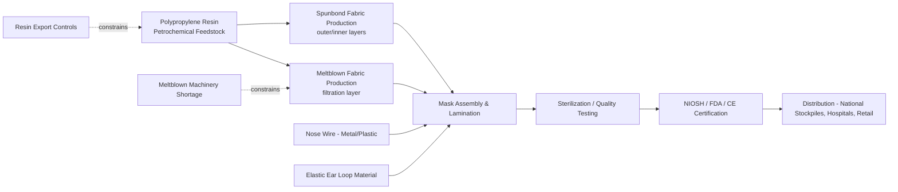
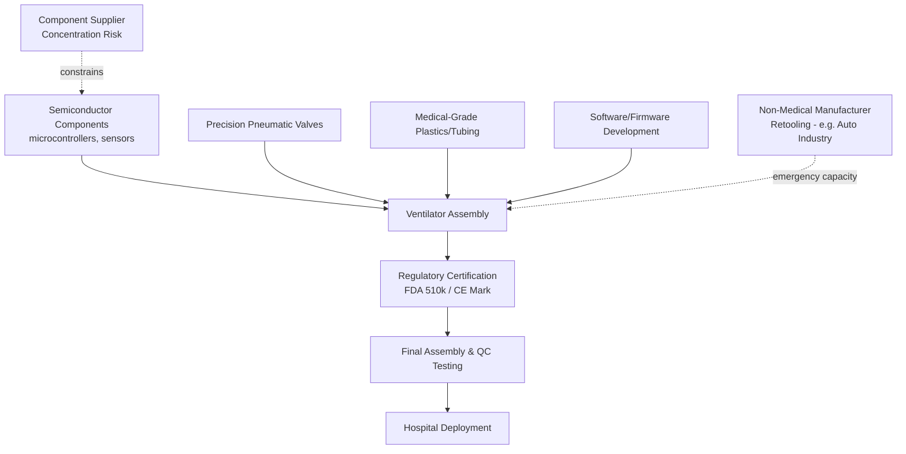

## Medical Device and Personal Protective Equipment Supply Chains

### Scope and Definitional Boundaries

This domain covers two related but structurally distinct product categories:

- **Personal Protective Equipment (PPE)**: N95/FFP2/FFP3 respirators, surgical masks, nitrile/latex gloves, isolation gowns, face shields, and surgical drapes. Characterized by high-volume, low-unit-cost, commoditized manufacturing.
- **Medical devices**: Ranging from low-complexity disposables (syringes, IV sets) to high-complexity capital equipment (ventilators, ECMO machines, imaging systems, infusion pumps). Characterized by longer regulatory pathways, higher component specificity, and more concentrated supplier bases.

Both categories share a common vulnerability profile distinct from pharmaceuticals: they depend heavily on **specialized raw materials and precursor chemicals** (meltblown polypropylene for masks, nitrile latex for gloves, medical-grade semiconductors and rare earth elements for devices) rather than active pharmaceutical ingredients, and they are more exposed to **geographic manufacturing concentration** than most other health commodity categories.

### Geographic Concentration Risk

**Key Points**

- Prior to 2020, an estimated 50% or more of global surgical mask and glove production, and a majority of medical-grade nitrile glove capacity, was concentrated in a small number of countries, most prominently China and Malaysia (for gloves, via firms like Top Glove and Hartalega). [Unverified: precise percentage estimates vary by source and product category, but the qualitative concentration finding is broadly consistent across trade analyses]
- The United States imported the large majority of its N95 respirators and surgical masks prior to the pandemic, with domestic meltblown fabric production capacity (the critical filtration-layer material) reduced to only a handful of manufacturers.
- This concentration arose from decades of cost-driven offshoring under just-in-time (JIT) procurement models optimized for unit cost minimization rather than supply continuity, a dynamic common across many manufactured-goods supply chains but with disproportionate consequence in a health emergency.

### Supply Chain Architecture: PPE (N95/Surgical Mask Example)

The **meltblown fabric bottleneck** is the most technically significant chokepoint: meltblown machines are capital-intensive, specialized extrusion equipment with long lead times (historically 6+ months to over a year for new machine fabrication), meaning capacity could not be rapidly scaled even when raw resin and finished-good assembly capacity existed. This single-node bottleneck explains why the mask shortage of 2020 was disproportionately severe relative to the underlying petrochemical feedstock availability.

### Supply Chain Architecture: Medical Devices (Ventilator Example)

Ventilators illustrate a distinct resilience strategy: **emergency cross-sector retooling**. During 2020, automotive manufacturers (Ford, General Motors, Tesla) and other industrial firms with precision manufacturing capability retooled production lines to assemble ventilators under licensing arrangements with device makers, coordinated in the U.S. via Defense Production Act contracts. This is a device-specific resilience mechanism largely unavailable to pharmaceutical or biologic manufacturing, which require specialized GMP-certified biological facilities that cannot be substituted by adjacent industrial capacity.

### Case Study: U.S. Strategic National Stockpile (SNS) Depletion

**Key Points**

- The U.S. Strategic National Stockpile's PPE reserves had not been fully replenished after being significantly drawn down during the 2009 H1N1 pandemic response, leaving reserves inadequate for a sustained multi-month surge in 2020.
- This is frequently cited as a stockpile-management governance failure distinct from manufacturing capacity failure: the *supply chain* problem (concentrated overseas manufacturing) was compounded by a *stockpile* problem (insufficient buffer inventory to bridge the gap while domestic manufacturing scaled up).
- Post-pandemic reforms in multiple countries have shifted stockpile policy toward "rolling stockpiles" (inventory continuously cycled through routine healthcare use to avoid degradation and ensure freshness) combined with contractual "surge capacity" agreements with domestic manufacturers, rather than static warehoused reserves alone.

### Case Study: Export Restrictions and "Mask Diplomacy"

In early 2020, several major PPE-producing countries imposed export controls or requisitioned domestically produced PPE for national use, including restrictions from countries such as Germany, France, and India at various points, alongside China's role as both the dominant global producer and, at different phases, an importer facing its own domestic surge. This period also saw high-profile bilateral "PPE diplomacy," where producing nations directed shipments as instruments of foreign policy influence rather than pure market allocation — for example, widely reported instances of shipments intended for one buyer being redirected or requisitioned by intermediary or origin governments. [Unverified: specific redirection incidents were widely reported in contemporaneous press but individual claims vary in verification quality; treat specific named incidents with appropriate source-checking]

This period demonstrated that PPE, unlike vaccines, has **low production complexity but high geopolitical substitutability of trust** — because near-identical products can be produced in many countries once tooling exists, the crisis was as much about capacity *activation speed* and export policy as about fundamental manufacturing capability.

### Counterfeit and Substandard Product Proliferation

A supply-chain-security dimension specific to PPE during acute shortage: the rapid emergence of counterfeit and substandard N95 respirators and surgical masks entering global markets, exploiting demand that outstripped legitimate certified supply. The U.S. CDC's National Institute for Occupational Safety and Health (NIOSH) and the FDA issued specific counterfeit-detection guidance during 2020–2021, and international customs agencies reported significant seizures of non-compliant products misrepresented as certified. This illustrates a recurring supply chain security principle: **acute scarcity degrades quality-assurance enforcement capacity precisely when verification matters most**, because regulators and procurement officers face pressure to accept shipments faster than standard certification-verification processes allow.

### Resilience Strategies Adopted Post-Pandemic

**1. Domestic manufacturing reshoring and subsidization**

Multiple governments (U.S. via the Defense Production Act and subsequent legislation, EU via its Health Emergency Preparedness and Response Authority, HERA) invested in subsidizing domestic PPE and critical device component manufacturing capacity, accepting higher unit costs in exchange for supply continuity — a direct trade-off between cost-efficiency and resilience.

**2. Diversification of supplier geography**

Procurement policies shifted toward multi-country sourcing requirements (avoiding single-country dependency thresholds) for critical PPE categories, sometimes formalized as a maximum percentage of national PPE supply permitted from any single foreign source.

**3. Buffer capacity contracts ("warm base" manufacturing)**

Rather than maintaining large physical stockpiles alone, some health systems now contract with manufacturers to maintain idle but activatable production lines ("warm base" capacity) that can scale within a defined activation window during a declared emergency, reducing the trade-off between routine-use waste (stockpile expiry) and emergency responsiveness.

**4. Standardization and interoperability of device components**

The ventilator shortage revealed that many devices used proprietary, non-interoperable components, complicating rapid cross-manufacturer scaling. Post-pandemic device design standards discussions have emphasized modular, standardized component interfaces for critical care devices to ease emergency retooling.

### Comparative Table: PPE vs. Medical Devices vs. Pharmaceuticals (Supply Chain Risk Profile)

| Dimension | PPE | Medical Devices | Pharmaceuticals/Vaccines |
| --- | --- | --- | --- |
| Manufacturing complexity | Low–Medium | Medium–High | High (biologics) |
| Retooling feasibility (cross-sector) | High | Medium (e.g., auto→ventilator) | Very low |
| Regulatory pathway speed | Fast (EUA feasible) | Medium (510k/CE) | Slow (unless EUA) |
| Primary bottleneck | Specialized machinery (meltblown) | Semiconductor/precision components | Bioreactor capacity, cold chain |
| Stockpiling feasibility | High (moderate shelf life) | High (long shelf life) | Limited (cold chain, expiry) |
| Counterfeit risk under scarcity | High | Medium | Medium (falsified vaccines documented but less prevalent) |

### Systemic Lessons

**Conclusion**

The PPE and medical device shortages of the COVID-19 pandemic demonstrated that supply chain vulnerability in health security is not solely a function of manufacturing complexity — commoditized, technically simple products like surgical masks proved as acutely vulnerable as complex biologics, because vulnerability was driven by *geographic concentration*, *specialized-equipment bottlenecks* (meltblown machines), and *inadequate buffer inventory policy*, rather than by intrinsic production difficulty. This distinguishes PPE/device supply chain security from pharmaceutical supply chain security: the policy lessons diverge meaningfully, with PPE resilience favoring diversified low-complexity manufacturing and warm-base capacity contracts, while pharmaceutical resilience requires longer-horizon investments in specialized biomanufacturing and technology transfer given the impossibility of cross-sector retooling for biologics.

**Next Steps**

- Meltblown fabric production technology and filtration efficiency standards (NIOSH N95 vs. EU FFP2/FFP3 vs. China KN95)
- Defense Production Act mechanics and historical invocations beyond COVID-19
- Nitrile and latex glove manufacturing supply chains and Malaysia/China concentration dynamics
- Rolling stockpile inventory management models and shelf-life/expiry optimization
- Counterfeit medical product detection frameworks (FDA, WHO Member State Mechanism)
- Cross-sector emergency manufacturing retooling: legal, IP, and liability frameworks
- HERA (EU Health Emergency Preparedness and Response Authority) mandate and structure
- Semiconductor supply chain dependencies in critical medical device manufacturing
- Modular and interoperable medical device design standards for emergency scalability