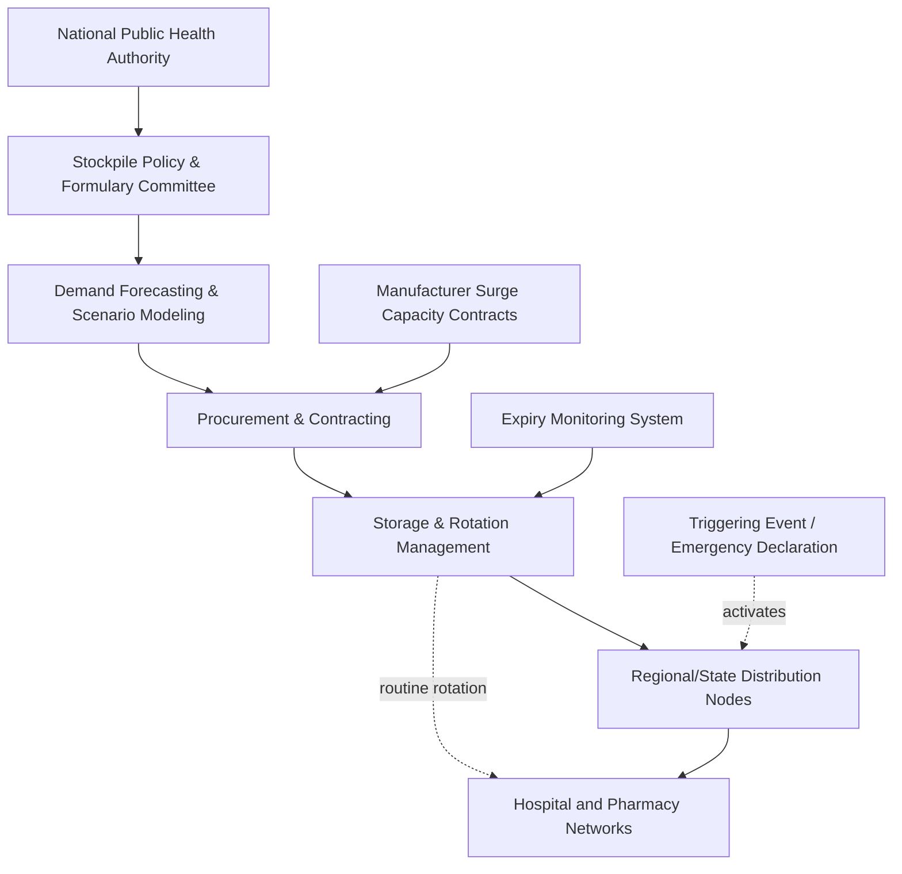

## Stockpiling Strategies for Critical Medicines

### Definitional Framework

Medicine stockpiling refers to the deliberate accumulation and management of pharmaceutical inventory beyond routine operational buffer levels, held specifically to bridge anticipated or unanticipated disruptions in supply, demand surges, or manufacturing interruptions. It is distinguished from ordinary inventory management by its *strategic* rather than purely operational purpose, and it sits within the broader discipline of health system supply chain resilience alongside diversified sourcing, manufacturing redundancy, and demand forecasting.

Stockpiling strategy decisions are fundamentally an exercise in balancing four competing constraints:

- **Cost**: Capital tied up in inventory, storage infrastructure, and eventual waste from expiry.
- **Coverage**: Duration and breadth of disruption the stockpile can absorb.
- **Currency (freshness)**: Degradation of stock value due to shelf-life expiry or clinical obsolescence.
- **Complexity**: Governance, rotation logistics, and multi-stakeholder coordination overhead.

### Taxonomy of Stockpile Models

**1. Static/Warehouse Stockpiles**

Physical inventory held in dedicated storage, not used in routine circulation, drawn down only upon a triggering event (e.g., a declared public health emergency). Simple to govern but exposed to expiry waste and requires periodic manual rotation.

**2. Rolling (Vendor-Managed or Rotating) Stockpiles**

Inventory continuously cycled through routine clinical use on a first-in-first-out (FIFO) basis, with reserve levels maintained above normal operational thresholds. This avoids waste from expiry since stock is used before expiring, but requires tighter logistics integration with normal distribution channels.

**3. Virtual/Contractual Stockpiles ("Warm Base" Capacity)**

Rather than holding physical inventory, governments contract with manufacturers to maintain surge production capacity that can be activated within a defined lead time during an emergency. This shifts the resilience mechanism from *inventory* to *contracted capacity option value*, analogous to a financial call option.

**4. Distributed/Federated Stockpiles**

Reserve inventory is held across multiple regional or institutional nodes (e.g., individual hospital systems, regional depots) rather than centrally, reducing single-point-of-failure risk in distribution logistics but increasing coordination complexity for allocation during a crisis.

**5. International Pooled Stockpiles**

Multilateral mechanisms (e.g., WHO's stockpiles for meningitis vaccines, cholera vaccines, and the International Coordinating Group on Vaccine Provision) hold shared reserves accessible to multiple member states, reducing per-country holding cost at the expense of allocation-priority governance complexity during simultaneous multi-country demand.

### Stockpile Sizing Methodology

Stockpile sizing generally follows a framework balancing expected disruption duration against manufacturing/replenishment lead time:

$$S = D \times (L + B)$$

Where $S$ is required stockpile size, $D$ is average daily/period demand, $L$ is expected replenishment lead time, and $B$ is a buffer safety margin accounting for demand variability and lead-time uncertainty. In practice, $B$ is often derived using a service-level target and demand/lead-time variance, similar to safety stock formulas used in general supply chain management:

$$B = z \times \sigma_{D} \times \sqrt{L}$$

Where $z$ is the service-level factor (e.g., $z \approx 1.65$ for a 95% service level) and $\sigma_D$ is the standard deviation of demand. [Inference: applying standard inventory-theory safety stock formulas to pandemic-scale stockpiling is a simplification; real-world critical medicine stockpile sizing also incorporates scenario-based planning (e.g., specific pandemic severity models) rather than relying on steady-state demand variance alone, since pandemic demand shocks are not well-approximated by normal-distribution assumptions]

### Governance Architecture Example (National Stockpile System)

### Selection Criteria: What to Stockpile

Not all medicines are equally suited to stockpiling. Selection frameworks typically weigh:

**Key Points**

- **Criticality**: Medicines with no ready substitute and significant morbidity/mortality risk if unavailable (e.g., antidotes, antivirals, antibiotics for resistant infections, emergency anesthetics).
- **Shelf-life stability**: Longer-shelf-life formulations are preferred candidates; some agencies fund shelf-life extension studies (e.g., the U.S. FDA/DoD Shelf-Life Extension Program, SLEP) to extend usable stockpile life beyond manufacturer-labeled expiry through periodic re-testing.
- **Manufacturing lead time**: Medicines with long or fragile manufacturing/replenishment chains (e.g., complex biologics, medicines dependent on single-source APIs) are higher priority for stockpiling than medicines with fast, diversified replenishment capability.
- **Disruption probability**: Medicines historically prone to shortage (per FDA/EMA drug shortage databases) are prioritized, since shortage history is a reasonable leading indicator of chain fragility.
- **Substitutability**: Medicines lacking therapeutic alternatives receive higher stockpile priority than those with multiple interchangeable formulations or drug classes.

### Case Study: U.S. Strategic National Stockpile (SNS)

The SNS, managed under the Administration for Strategic Preparedness and Response (ASPR), holds a mix of static and rotating inventory across antibiotics, antivirals, chemical/nerve-agent antidotes, and medical countermeasures, distributed via the "push package" model — pre-positioned regional caches that can be deployed within 12 hours of a federal deployment decision, historically supplemented by vendor-managed inventory (VMI) agreements for faster-moving items. A widely cited governance lesson from COVID-19 is that the SNS's pre-2020 sizing assumptions for pandemic-scale PPE and ventilator demand were calibrated to more geographically contained emergencies (e.g., a regional bioterrorism event or localized natural disaster) rather than a simultaneous nationwide, multi-month demand surge, which is why depletion occurred so rapidly despite the stockpile's existence. [Unverified: specific pre-pandemic sizing assumptions and internal SNS planning benchmarks are not fully public; this represents the general post-hoc analytical consensus rather than a verified internal planning document]

### Case Study: EU Joint Procurement and rescEU Reserve

The EU's rescEU medical reserve, established under the Union Civil Protection Mechanism and expanded significantly post-COVID, operates as a distributed stockpile hosted by individual member states on behalf of the EU as a whole, combined with joint procurement mechanisms that allow member states to aggregate purchasing power and avoid intra-EU bidding competition for scarce medicines during a crisis (a problem observed early in the pandemic when member states competed against each other, driving up prices and fragmenting allocation).

### Case Study: WHO International Coordinating Group (ICG) Vaccine Stockpiles

The ICG manages emergency stockpiles for cholera, meningitis, yellow fever, and Ebola vaccines, functioning as an international pooled stockpile where any member state experiencing a qualifying outbreak can request an emergency allocation, subject to a technical review process. This model minimizes redundant national holding of low-frequency-use, high-shelf-life-sensitivity vaccines by pooling risk internationally, though it depends on rapid technical review turnaround and sufficient international replenishment funding to remain credible during simultaneous multi-country outbreaks.

### Failure Modes and Trade-off Analysis

| Failure Mode | Description | Mitigation Strategy |
| --- | --- | --- |
| Expiry-driven waste | Static stockpiles accumulate expired, unusable stock | Rolling/vendor-managed rotation; shelf-life extension testing |
| Undersizing for scenario severity | Stockpile sized for historical/localized events, insufficient for pandemic-scale demand | Scenario-based stress testing against worst-case demand models, not just historical averages |
| Single-point storage/logistics failure | Centralized warehousing creates distribution bottleneck during simultaneous nationwide demand | Distributed/federated storage nodes |
| Allocation governance breakdown | Ambiguous criteria for who receives stockpile releases first during scarcity | Pre-negotiated, transparent allocation protocols established before crisis |
| Manufacturer capacity contract failure | "Warm base" contracted capacity fails to activate at expected speed under real crisis conditions | Regular activation drills/testing of surge contracts, not purely paper agreements |
| Budget deprioritization in non-crisis years | Stockpile replenishment funding lapses during politically quiet periods (as occurred with SNS PPE reserves after H1N1) | Statutory/mandatory replenishment funding mechanisms independent of annual discretionary budget cycles |

### Emerging Practice: Hybrid Models Post-COVID

**Conclusion**

Post-pandemic policy across most major health systems has converged on hybrid stockpiling architectures that combine (1) a modest static/rotating physical stockpile for the most critical, longest-lead-time items, (2) contracted "warm base" manufacturing capacity for medium-criticality items where physical storage is impractical due to shelf-life or bulk, and (3) international pooled mechanisms for very-low-frequency, high-severity threats where individual national stockpiling would be economically inefficient. The central lesson drawn from COVID-19 stockpile failures is not that stockpiling itself is the wrong strategy, but that stockpile *sizing assumptions* must be stress-tested against low-probability, high-severity scenarios rather than calibrated primarily to historical disruption patterns, and that replenishment funding must be insulated from the political tendency to deprioritize stockpile maintenance during inter-crisis periods.

**Related Topics**

- Shelf-Life Extension Program (SLEP) methodology and regulatory re-testing protocols
- Vendor-Managed Inventory (VMI) models in pharmaceutical distribution
- FDA/EMA drug shortage reporting databases and early-warning indicators
- rescEU civil protection mechanism and EU joint procurement frameworks
- WHO International Coordinating Group (ICG) vaccine stockpile governance
- Scenario-based demand forecasting versus historical-variance-based safety stock models
- Antimicrobial stockpiling and antibiotic resistance stewardship trade-offs
- Chemical, biological, radiological, and nuclear (CBRN) medical countermeasure stockpiles
- Cold chain-dependent stockpile management for biologics and vaccines