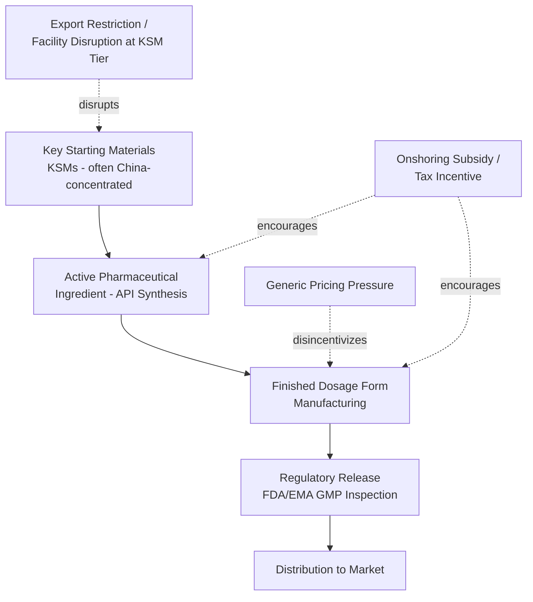

## Onshoring Initiatives for Pharmaceutical Manufacturing

### Definitional Framework

Onshoring (also termed reshoring in cases involving previously offshored capacity returning to the country of origin) refers to policy and industry efforts to relocate or establish pharmaceutical manufacturing capacity — spanning active pharmaceutical ingredients (APIs), key starting materials (KSMs), and finished dosage forms — within a nation's own borders or within trusted allied jurisdictions ("friend-shoring" or "ally-shoring"), reversing decades of cost-driven offshoring to lower-labor-cost, less-regulated manufacturing environments.

This is distinct from, but related to, **nearshoring** (relocating production to geographically proximate countries, e.g., U.S. firms shifting production to Mexico) and **friend-shoring** (relocating production to politically aligned countries regardless of geographic proximity, e.g., diversifying away from China toward India, Vietnam, or allied European manufacturers).

### Historical Context: Why Offshoring Occurred

**Key Points**

- Beginning in the 1990s–2000s, generic drug and API manufacturing migrated heavily to China and India, driven by lower labor costs, lower environmental compliance costs, and government industrial subsidies in those countries.
- By the time of the COVID-19 pandemic, estimates suggested a substantial share of API manufacturing for generic drugs sold in the U.S. and Europe originated from a small number of Chinese and Indian manufacturing clusters, with the U.S. FDA estimating in 2019 that a notable share of API manufacturing facilities registered to supply the U.S. market were located in China and India combined. [Unverified: precise percentage figures are frequently cited across policy literature but vary depending on methodology — whether measuring by facility count, by volume, or by finished-drug dependency — so any single number should be treated as approximate]
- This concentration was economically rational under normal-market assumptions (cost minimization, comparative advantage) but created a latent single-point-of-failure risk that was not priced into peacetime procurement decisions, since generic drug pricing models in the U.S. and EU generally reward lowest-cost bidders without resilience premiums.

### Supply Chain Vulnerability Illustrated

The critical vulnerability insight is that KSM and API manufacturing tiers are often more geographically concentrated than finished-dose manufacturing, meaning a country may believe it has "domestic" pharmaceutical manufacturing while still depending entirely on foreign KSM/API supply for that domestic finished-dose production — a distinction frequently obscured in simple "percent domestically manufactured" statistics.

### Policy Instruments for Onshoring

**1. Direct subsidies and grants**

Government funding for construction of new domestic manufacturing facilities, often targeting specific critical-medicine categories identified through vulnerability assessments (e.g., essential antibiotics, injectable generics, biologics).

**2. Tax incentives**

Favorable tax treatment for domestic pharmaceutical manufacturing investment, sometimes structured as accelerated depreciation or investment tax credits specific to designated "critical medicine" manufacturing.

**3. Advance market commitments and guaranteed procurement**

Government commitments to purchase a minimum volume from domestic manufacturers at a guaranteed price, addressing the core disincentive that generic drug markets otherwise reward only the lowest-cost (often offshore) producer, removing the price-competitiveness barrier that onshored, higher-cost production would otherwise face.

**4. Regulatory pathway acceleration**

Expedited FDA/EMA review processes for domestically manufactured critical medicines or for facilities converting to critical-medicine production, reducing time-to-market for onshoring investments.

**5. Strategic stockpile-linked procurement**

Structuring national stockpile procurement contracts to require or favor domestic or allied-country manufacturing sources, using stockpile purchasing power as a demand signal for onshored capacity (see related stockpiling strategy content).

**6. Import tariffs and trade policy**

Tariffs or trade measures designed to reduce the cost advantage of offshore manufacturing, though this approach carries risk of increasing costs for healthcare payers and consumers, and of provoking retaliatory trade measures affecting other sectors.

### Case Study: United States

The U.S. has pursued onshoring through multiple overlapping mechanisms:

- **Defense Production Act (DPA) invocations** during COVID-19 to fund domestic manufacturing capacity expansion for both APIs and finished pharmaceutical products.
- **Executive orders and legislative proposals** aimed at reducing dependency on China and India for essential medicines, including proposals for a designated list of "essential medicines" subject to onshoring incentives (an approach modeled conceptually on prior essential-medicines-list frameworks used internationally).
- **BARDA (Biomedical Advanced Research and Development Authority)** funding for domestic manufacturing innovation, including flexible, modular manufacturing platforms intended to allow rapid reconfiguration between different drug products during an emergency.
- Bipartisan policy interest in reshoring generic injectable drug manufacturing specifically, following high-profile shortages of common hospital injectables (e.g., saline, certain generic oncology and anesthesia drugs) linked in part to concentrated single-facility dependencies. [Inference: linking specific historical shortages definitively to a single causal onshoring/offshoring factor is often contested by industry, since facility-specific quality/manufacturing incidents (independent of geography) are also a major shortage driver]

### Case Study: European Union

The EU's approach centers on the **Critical Medicines Act** framework (proposed and advanced through EU legislative processes in 2024–2025), which aims to reduce EU dependency on non-EU API and finished-dose manufacturing for a defined list of critical medicines through joint procurement mechanisms that favor EU or allied-country manufacturing, streamlined permitting for new EU manufacturing facilities, and coordinated demand aggregation across member states to make EU-based manufacturing more cost-competitive against offshore alternatives. [Unverified: given the pace of EU legislative processes, the specific implementation status, funding levels, and finalized provisions of the Critical Medicines Act should be checked against current EU sources, as details were still evolving through the legislative process]

### Case Study: India's Production-Linked Incentive (PLI) Scheme

India, itself a major API exporter, launched a Production-Linked Incentive scheme specifically targeting **domestic API and KSM manufacturing**, motivated by the recognition that India's own generic finished-dose manufacturing (a major global export strength) was itself heavily dependent on Chinese-sourced KSMs and intermediate chemicals — illustrating that onshoring concerns exist even for countries that are themselves major pharmaceutical exporters, because export strength in finished dosage forms can mask upstream dependency at the raw material and intermediate chemical tier.

### Economic Trade-offs and Constraints

**Key Points**

- **Cost differential**: Onshored manufacturing in high-labor-cost jurisdictions (U.S., EU) typically carries meaningfully higher production costs than manufacturing in China or India, particularly for mature, low-margin generic drugs where price competition is most intense — meaning onshoring for generics generally requires sustained subsidy or guaranteed-procurement support rather than being commercially self-sustaining under normal market pricing.
- **Environmental and regulatory compliance costs**: Part of the original cost advantage of offshore manufacturing stemmed from lower environmental compliance costs (particularly relevant for API synthesis, which can involve environmentally intensive chemical processes); onshoring to jurisdictions with stricter environmental regulation inherently carries higher compliance costs, which is a structural (not merely transitional) cost differential.
- **Time horizon mismatch**: Pharmaceutical manufacturing facility construction, GMP qualification, and regulatory approval timelines typically span multiple years, meaning onshoring initiatives launched in response to an acute crisis (e.g., COVID-19) generally cannot deliver meaningful capacity change within the timeframe of that same crisis — onshoring is fundamentally a long-horizon structural resilience investment, not an acute-crisis response tool.
- **Risk of over-concentration in reverse**: Policy analysts caution that aggressive onshoring, if it consolidates manufacturing too heavily within a single onshore or allied region, can recreate concentration risk in a new geography rather than genuinely diversifying the global supply base — true resilience requires diversification across multiple independent geographies, not simply relocation of concentration from one country to another.

### Comparative Table: Onshoring Policy Instruments

| Instrument | Speed of Impact | Cost to Government | Market Distortion Risk | Example |
| --- | --- | --- | --- | --- |
| Direct subsidy/grants | Medium (years) | High (upfront) | Low–Medium | BARDA manufacturing grants |
| Guaranteed procurement/AMC | Medium | Medium (ongoing) | Medium (favors selected suppliers) | Stockpile-linked domestic contracts |
| Tax incentives | Medium–Slow | Medium (foregone revenue) | Low | Investment tax credits |
| Tariffs/trade measures | Fast (policy), slow (capacity effect) | Low (government), high (consumer) | High (price increases, retaliation risk) | Proposed API tariffs |
| Regulatory acceleration | Fast (for approval), doesn't address capacity | Low | Low | Expedited FDA review pathways |

### Systemic Lessons

**Conclusion**

Onshoring pharmaceutical manufacturing addresses a real and well-documented geographic concentration vulnerability, but it is a structurally slow, high-cost intervention poorly suited to acute-crisis response timelines, and it fundamentally requires sustained demand-side support (guaranteed procurement, subsidy) because generic drug market pricing dynamics do not naturally reward resilience investment. The most technically important nuance often missed in public discourse is the distinction between finished-dose manufacturing location and upstream KSM/API manufacturing location; a country can substantially onshore finished-dose production while remaining critically dependent on foreign KSM/API supply, meaning genuine resilience requires tracing dependency through the full multi-tier supply chain rather than measuring only the final manufacturing step. Effective onshoring strategy therefore requires prioritization frameworks (similar to stockpiling criticality criteria) rather than blanket reshoring, since attempting to onshore the entire pharmaceutical supply chain is neither economically feasible nor necessary for resilience if applied selectively to the highest-criticality, highest-concentration-risk products.

**Next Steps**

- EU Critical Medicines Act implementation details and joint procurement mechanics
- U.S. essential medicines list proposals and criticality prioritization frameworks
- Production-Linked Incentive (PLI) schemes and comparative international industrial policy
- Key starting material (KSM) supply chain mapping methodology
- BARDA flexible/modular manufacturing platform initiatives
- Generic drug pricing models and their interaction with resilience incentives
- Friend-shoring versus nearshoring versus onshoring: comparative geopolitical trade-offs
- GMP facility qualification timelines and regulatory approval bottlenecks
- Environmental compliance cost differentials in API manufacturing across jurisdictions