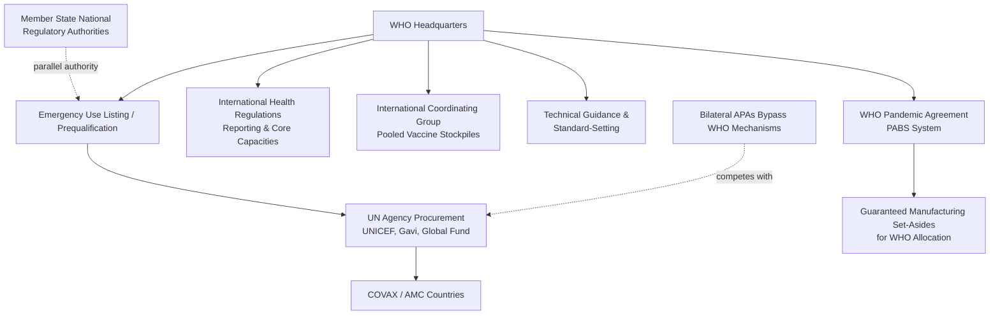

## International Health Supply Coordination and the WHO

### Institutional Role and Mandate

The World Health Organization occupies a distinctive position in global health supply chain security: it holds no direct manufacturing, procurement enforcement, or supply chain command authority over sovereign states, yet it functions as the principal international convener, technical standard-setter, and coordination hub for cross-border health supply issues. Its authority is fundamentally **normative and coordinative rather than binding**, operating through instruments such as the International Health Regulations (IHR, 2005), technical prequalification programs, and ad hoc emergency coordination mechanisms. Understanding WHO's role in supply chain security requires distinguishing between what WHO can *mandate*, what it can *coordinate*, and what it can only *recommend*.

### Core Coordination Mechanisms

**1. International Health Regulations (IHR, 2005)**

A legally binding instrument among 196 states parties establishing obligations for reporting public health emergencies of international concern (PHEICs) and core capacities for surveillance and response. Notably, the IHR historically contained limited enforceable provisions specifically addressing medical supply allocation during a PHEIC, a gap that became evident during COVID-19 and directly motivated subsequent treaty negotiations (see Pandemic Agreement below).

**2. Emergency Use Listing (EUL)**

A WHO risk-based procedure for assessing and listing unlicensed vaccines, therapeutics, and diagnostics for use during a public health emergency, primarily intended to enable procurement by UN agencies and lower-income countries lacking independent stringent regulatory authority (SRA) capacity. EUL functioned as a critical supply-unlocking mechanism during COVID-19, since many low-income country procurement systems and COVAX itself relied on EUL status (rather than full national regulatory approval) to authorize vaccine deployment.

**3. Prequalification Programme (PQ)**

A longer-standing WHO mechanism (predating COVID-19) assessing the quality, safety, and efficacy of medicines, vaccines, and diagnostics for procurement by UN agencies, Gavi, and the Global Fund, functioning as a de facto quality gateway for a large share of global health-product procurement in lower-income settings.

**4. International Coordinating Group (ICG) on Vaccine Provision**

Manages pooled emergency stockpiles for cholera, meningitis, and yellow fever vaccines, coordinating allocation across simultaneous multi-country outbreak requests (referenced in the stockpiling strategies content as an example of international pooled stockpiling).

**5. Global Outbreak Alert and Response Network (GOARN)**

A coordination network of technical institutions supporting rapid deployment of expertise and, in some cases, supply logistics during outbreak response.

### Coordination Architecture Diagram

### Structural Limitations Exposed by COVID-19

**Key Points**

- **No enforcement authority over export controls**: WHO could issue guidance discouraging export restrictions on vaccines and medical supplies but had no mechanism to prevent member states from imposing them, as demonstrated by numerous national export restriction episodes during 2020–2021 (see vaccine nationalism and PPE supply chain content).
- **Dependency on voluntary financing for coordination mechanisms**: COVAX, though WHO-co-led, depended on voluntary donor contributions and self-financing participant fees rather than assessed (mandatory) WHO member state contributions, making its purchasing power structurally weaker than bilateral national procurement budgets.
- **No independent manufacturing or stockpile capacity**: Unlike a national government, WHO does not own or directly control manufacturing facilities or physical stockpiles (with the partial exception of pooled stockpiles like the ICG mechanism, which are typically held by manufacturers or partner logistics organizations under WHO-coordinated allocation rules, not WHO-owned warehouses).
- **Parallel, competing regulatory pathways**: Because national regulatory authorities (FDA, EMA, etc.) operate independently of WHO's EUL process, high-income countries had no structural need to rely on or support WHO mechanisms for their own populations, reducing their incentive to prioritize WHO-coordinated equitable allocation over bilateral deals.

### The WHO Pandemic Agreement (Pandemic Accord)

Following COVID-19, WHO member states negotiated a new international instrument — the WHO Pandemic Agreement — through the Intergovernmental Negotiating Body (INB), explicitly intended to address the coordination gaps identified above. Its central supply-chain-relevant innovation is the **Pathogen Access and Benefit-Sharing (PABS) system**, which links two previously separate issues:

- **Access**: Countries sharing pathogen samples and genetic sequence data rapidly during an emerging outbreak (essential for rapid vaccine/therapeutic development).
- **Benefit-sharing**: In exchange, manufacturers benefiting from that shared pathogen data commit to reserving a defined percentage of resulting vaccine, therapeutic, and diagnostic production for WHO-coordinated equitable global allocation, rather than being sold exclusively through bilateral APAs.

This represents a structural attempt to convert WHO's role from a *voluntary coordination convener* (COVAX's model, which failed to override bilateral nationalism) into a *contractually pre-committed allocation stakeholder* with guaranteed access to a defined percentage of manufacturing output negotiated *before* the crisis occurs, directly addressing the core lesson from vaccine nationalism content: that voluntary post-hoc coordination cannot overcome crisis-driven bilateral defection incentives.

**Key Points**

- The Pandemic Agreement text was adopted by the World Health Assembly in 2025, with the PABS system's detailed operational annex subject to continued negotiation.
- Implementation depends on subsequent ratification processes by individual member states and finalization of the PABS annex's specific percentage commitments and operational mechanics.
- [Unverified: given the ongoing and evolving nature of treaty ratification and annex finalization, specific percentage commitments, ratification counts, and entry-into-force status should be verified against current WHO sources, as this process was still developing]

### Relationship with Other Multilateral Health Bodies

WHO's supply chain coordination role intersects with several partner organizations, each with distinct but overlapping mandates:

| Organization | Primary Role | Relationship to WHO |
| --- | --- | --- |
| Gavi, the Vaccine Alliance | Vaccine procurement financing for low-income countries | Co-led COVAX with WHO; independent governance and financing |
| UNICEF Supply Division | Physical procurement and logistics for vaccines/health commodities | Executes procurement using WHO PQ/EUL-listed products |
| Global Fund | Financing for HIV, TB, malaria commodities | Uses WHO PQ for quality assurance of funded products |
| CEPI (Coalition for Epidemic Preparedness Innovations) | R&D financing for vaccine platform development | Co-led COVAX; focuses on upstream R&D rather than downstream allocation |
| World Trade Organization (WTO) | Trade rules, including TRIPS IP framework | Separate legal authority; WHO cannot itself waive IP protections, only advocate |
| World Bank | Financing mechanisms, including pandemic preparedness funds (e.g., Pandemic Fund) | Provides financing infrastructure; WHO provides technical/allocation coordination |

This multi-institutional landscape means "WHO coordination" in practice is rarely WHO acting alone — supply chain security coordination during a health emergency typically involves a consortium of organizations with WHO providing technical standard-setting and convening authority, while procurement execution, financing, and logistics are distributed across partner agencies with their own independent governance.

### Case Study: Contrast with Non-Health Multilateral Coordination

It is analytically useful to compare WHO's coordination limitations with more binding multilateral mechanisms in other sectors, such as the International Energy Agency's (IEA) oil stockpile-sharing obligations among member states (a legally binding requirement to maintain and, if triggered, release strategic petroleum reserves collectively). The absence of an equivalent binding mechanism in global health — no WHO member state is legally obligated to release vaccine manufacturing capacity or stockpiled medical supplies to WHO-coordinated allocation absent a specific treaty commitment like the emerging PABS system — is a key structural distinction explaining why global health supply coordination proved weaker than analogous energy security coordination during comparable crises. [Inference: this comparison illustrates a structural point about binding versus voluntary coordination mechanisms; it is not a claim that energy and health commodity markets are otherwise directly comparable in production economics or crisis dynamics]

### Systemic Lessons and Trajectory

**Conclusion**

WHO's role in international health supply coordination during COVID-19 revealed a fundamental architecture mismatch: WHO possesses strong technical and normative authority (EUL, PQ, IHR reporting standards) but essentially no binding allocation or enforcement authority over member state procurement or export behavior, and its flagship equitable-allocation mechanism (COVAX) was structurally dependent on voluntary participation by the same wealthy nations whose bilateral defection it was designed to counteract. The WHO Pandemic Agreement's PABS system represents the most significant structural reform attempt to date, converting voluntary post-hoc coordination into pre-negotiated contractual manufacturing set-asides, though its ultimate effectiveness depends on ratification, annex finalization, and — most critically — whether member states honor these commitments under the same acute domestic political pressure that drove vaccine nationalism in 2020–2021. The core unresolved tension is one identified across all pharmaceutical and medical supply chain security content in this chapter: multilateral coordination mechanisms are only as strong as the binding commitments made *before* a crisis, since voluntary goodwill reliably erodes under conditions of acute domestic scarcity.

**Related Topics**

- International Health Regulations (IHR 2005) core capacities and reporting obligations
- WHO Emergency Use Listing (EUL) versus national stringent regulatory authority (SRA) pathways
- Pathogen Access and Benefit-Sharing (PABS) system operational mechanics
- COVAX governance structure: Gavi, CEPI, and WHO co-leadership model
- International Energy Agency (IEA) strategic petroleum reserve model as a comparative binding-coordination case
- WHO Prequalification Programme (PQ) technical assessment criteria
- Pandemic Fund (World Bank-hosted) financing architecture
- TRIPS waiver negotiations and WTO-WHO institutional boundaries
- Global Outbreak Alert and Response Network (GOARN) operational structure