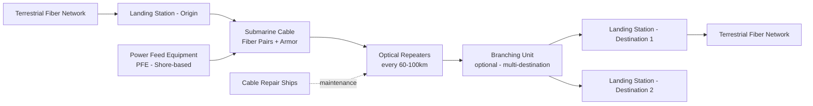

## Submarine Cables and the Physical Backbone of the Internet

### Definitional Framework and Scale

Submarine communications cables are fiber-optic cables laid on or buried beneath the ocean floor, connecting continents and countries by carrying digital data as pulses of light. Despite the popular perception of internet traffic as satellite- or cloud-based, submarine cables carry the overwhelming majority of intercontinental internet, voice, and financial transaction traffic — commonly cited at over 95–99% of intercontinental data traffic by volume, with satellite communication serving as a comparatively low-bandwidth complement rather than a substitute. [Unverified: exact percentage figures vary by source and measurement methodology, but the qualitative dominance of submarine cable infrastructure over satellite for high-volume data transfer is a well-established industry consensus]

As of the mid-2020s, several hundred active submarine cable systems span the globe, spanning well over a million kilometers of cable, owned and operated through a mix of telecommunications carrier consortia, and, increasingly, hyperscale cloud and content companies (Google, Meta, Amazon, Microsoft) that now own or co-own a substantial share of new cable capacity to serve their own data center interconnection needs.

### Physical and Technical Architecture

**Cable Construction**

A submarine cable consists of multiple concentric layers: a core of optical fiber pairs (each pair capable of carrying enormous data volumes via wavelength-division multiplexing, WDM), surrounded by copper conductors that carry electrical power to submerged signal repeaters, and multiple layers of steel wire armor and polyethylene insulation, with armor thickness varying by deployment depth and risk zone (heavier armor near shore where trawling/anchor damage risk is higher, lighter unarmored cable in deep ocean).

**Repeaters**

Because optical signals attenuate over distance, cables require optical repeaters (amplifiers) spaced at regular intervals (typically 60–100 km) along the route, powered by high-voltage DC current fed from shore-based Power Feed Equipment (PFE) at each cable landing station. Repeater failure is a significant maintenance concern, as repeater replacement requires cable retrieval and splicing at the failure location.

**Landing Stations**

Cables terminate at coastal landing stations, which house the terminal equipment converting optical signals for interconnection with terrestrial fiber networks, PFE, and network management systems. Landing station geographic concentration is itself a supply chain security consideration, discussed below.

### System Architecture Diagram

### Ownership and Governance Structures

**1. Consortium Model (Traditional)**

Historically, submarine cables were built and owned by consortia of national telecommunications carriers, each contributing capital in exchange for a proportional share of cable capacity, governed by a Cable Construction and Maintenance Agreement (C&MA) among consortium members.

**2. Private/Corporate Ownership**

A significant and growing share of new cable systems are now built as privately owned assets by a single carrier or, increasingly, by hyperscale technology companies, who either own capacity outright or lease Indefeasible Rights of Use (IRUs) — long-term, non-cancellable rights to use a defined fiber pair or wavelength capacity — from cable owners.

**3. Hyperscaler Direct Investment**

Google, Meta, Amazon, and Microsoft have each invested directly in wholly or partially owned submarine cable systems (e.g., Google's Curie, Dunant, Equiano, and Grace Hopper cables; Meta's 2Africa system) to serve growing inter-data-center bandwidth demand independent of traditional telecom carrier capacity. This represents a structural shift in supply chain control: critical internet backbone infrastructure increasingly sits under the direct governance of a small number of private technology firms rather than telecommunications carriers or state entities, raising distinct governance and resilience questions from a national security and supply chain perspective.

### Chokepoint Geography and Concentration Risk

**Key Points**

- Certain narrow maritime chokepoints carry a disproportionate concentration of global cable routes due to geography: the **Luzon Strait** (between Taiwan and the Philippines), the **Red Sea/Bab-el-Mandeb Strait**, the **Strait of Malacca**, and the waters around **Egypt's Suez Canal corridor** are among the most cable-dense chokepoints globally, since cables connecting major traffic regions (Europe-Asia, particularly) must physically transit these limited geographic corridors.
- Egypt in particular represents a significant single-country chokepoint: a substantial share of Europe-Asia submarine cable traffic transits Egyptian territory (crossing between the Mediterranean and Red Sea, since routing around Africa or through other corridors is significantly longer and costlier), making Egyptian territorial and political stability a de facto global internet resilience factor. [Inference: the specific percentage of Europe-Asia traffic transiting Egypt varies by source and cable-system-specific routing, but the qualitative chokepoint significance is widely documented in industry and government infrastructure risk assessments]
- Landing station geographic clustering (e.g., a high concentration of transatlantic cable landings in specific U.S. and UK coastal locations) creates additional concentration risk distinct from the undersea cable route itself.

### Documented Disruption Incidents

**Case Study: Red Sea Cable Damage (2024)**

Multiple submarine cables in the Red Sea sustained damage in early 2024 amid regional maritime security instability associated with Houthi attacks on shipping, with reported damage to cable systems including portions of the AAE-1, EIG (Europe India Gateway), and Seacom systems, disrupting a portion of Europe-Asia connectivity and requiring traffic rerouting through alternative systems.

**Case Study: Baltic Sea Cable Incidents (2023–2025)**

Multiple incidents of damage to undersea cables and pipelines in the Baltic Sea region (affecting data cables and, in some incidents, associated power interconnectors) occurred amid heightened tension following Russia's invasion of Ukraine, with several incidents attributed by regional governments to vessels linked to a "shadow fleet" allegedly engaged in sanctions evasion, raising suspicion of deliberate or reckless anchor-dragging sabotage, though definitive attribution in several individual cases remained contested or under investigation. [Unverified: specific attribution claims for individual Baltic cable incidents varied significantly by source and were subject to ongoing investigation; treat specific attribution claims with appropriate caution pending official investigative conclusions]

**Case Study: Taiwan-Adjacent Cable Incidents**

Cables connecting Taiwan to outlying islands (notably Matsu) have experienced damage incidents attributed at various points to Chinese vessel activity, raising specific concern given Taiwan's semiconductor manufacturing significance (see related content on semiconductor supply chains) and the strategic sensitivity of Taiwan Strait maritime activity generally.

**General Pattern**: The overwhelming majority of submarine cable faults globally are **not** attributed to deliberate sabotage but to routine causes — fishing trawler activity, ship anchor dragging, and natural seabed movement/abrasion — with industry sources estimating a large majority of global cable faults resulting from such incidental human or natural causes rather than intentional attack. This baseline matters for supply chain security analysis: distinguishing between routine, statistically expected damage (which the industry has decades of repair-ship logistics experience managing) and deliberate, potentially coordinated sabotage (which represents a qualitatively different and less-tested threat model) is analytically important and frequently conflated in public commentary.

### Repair and Maintenance Logistics

The global submarine cable repair ecosystem depends on a limited fleet of specialized cable repair ships (numbering in the several dozens globally), often coordinated through regional maintenance agreements (zone maintenance agreements) that pool repair ship access across multiple cable systems within a geographic region to ensure repair capacity is available without every individual cable owner needing to maintain dedicated repair vessels. This pooled-repair-capacity model is itself a supply chain resilience mechanism, but it means repair ship *availability* — not just cable ownership diversity — is a systemic chokepoint: a surge in simultaneous multi-cable damage (as occurred in some regional incident clusters) can outstrip available repair ship capacity, extending outage duration beyond what any single incident's technical repair time would suggest.

### Resilience and Redundancy Strategies

**1. Route diversification**

Network operators design redundancy by routing traffic across multiple physically separate cable systems and geographic corridors, so that damage to any single cable or chokepoint does not sever connectivity entirely — though this is only effective if diverse-seeming cables do not, in fact, share underlying chokepoint geography (a documented risk called "false redundancy," where cables marketed as diverse routes still transit the same narrow strait or landing corridor).

**2. Terrestrial and satellite backup capacity**

Low-earth-orbit (LEO) satellite constellations (e.g., Starlink) are increasingly discussed as a partial backup capacity layer for critical connectivity during cable disruption, though current satellite bandwidth capacity remains orders of magnitude below submarine cable capacity, limiting this to an emergency-continuity rather than primary-capacity role. [Speculation: the extent to which LEO satellite capacity will meaningfully substitute for submarine cable capacity at scale in the coming years remains a subject of ongoing industry debate rather than settled fact]

**3. Regulatory and permitting coordination**

Some governments have begun incorporating submarine cable route diversity requirements into national telecommunications resilience policy, and international discussions (including at the UN and International Cable Protection Committee, ICPC) have explored strengthening legal protections for submarine cable infrastructure under maritime law, given that cables in international waters currently have more limited legal protection against damage than infrastructure within territorial waters.

**4. Cable landing station security and diversification**

Reducing geographic clustering of landing stations within any single country or region to avoid a single physical location becoming a critical single point of failure for multiple cable systems simultaneously.

### Comparative Table: Threat Types and Mitigation

| Threat Type | Frequency | Typical Cause | Primary Mitigation |
| --- | --- | --- | --- |
| Fishing/trawler damage | High (routine) | Accidental snagging | Route diversification, protected zones near cables |
| Anchor dragging | High (routine) | Accidental or negligent vessel anchoring | Maritime traffic monitoring, protected zones |
| Natural seabed movement | Medium | Underwater landslides, abrasion | Route selection avoiding unstable seabed |
| State-linked sabotage (suspected) | Low but rising concern | Geopolitical conflict, "shadow fleet" activity | Naval patrol presence, international legal deterrence, attribution capability |
| Landing station physical/cyber attack | Low | Terrorism, state action, cyber intrusion | Physical security, redundant landing geography |
| Repair capacity shortage | Situational | Simultaneous multi-cable damage exceeding fleet capacity | Zone maintenance agreements, expanded repair fleet investment |

### Systemic Lessons

**Conclusion**

Submarine cables represent a supply chain security domain with a distinctive risk profile: extremely high traffic concentration through a small number of geographic chokepoints, a physical infrastructure layer largely invisible to end users and policymakers relative to its criticality, ownership increasingly concentrated among a small number of private hyperscale technology firms rather than state or traditional carrier entities, and a threat landscape spanning routine accidental damage (the statistical majority of incidents) alongside a smaller but geopolitically significant and rising incidence of suspected deliberate interference in contested maritime regions (Baltic Sea, Red Sea, Taiwan Strait). The central resilience lesson is that redundancy must be evaluated at the level of true physical route and chokepoint diversity, not merely counted by number of distinct cable systems, since apparent redundancy is illusory if multiple "diverse" cables transit the same narrow strait or landing region. The growing role of private hyperscale ownership also introduces a governance question distinct from earlier state/carrier-consortium eras: national supply chain security policy must now account for critical internet backbone infrastructure decisions being made by corporate entities whose primary incentives (serving their own data center traffic needs) may not fully align with national resilience objectives.

**Next Steps**

- Wavelength-division multiplexing (WDM) and submarine cable bandwidth capacity engineering
- International Cable Protection Committee (ICPC) and legal protections under UNCLOS
- Hyperscaler-owned cable systems: Google, Meta, Amazon, Microsoft infrastructure strategy
- Baltic Sea "shadow fleet" sanctions evasion and infrastructure sabotage allegations
- Taiwan Strait maritime security and semiconductor supply chain interdependency
- Zone maintenance agreements and global cable repair ship fleet capacity
- Low-earth-orbit (LEO) satellite constellations as backup connectivity infrastructure
- Landing station physical security and geographic clustering risk assessment
- Red Sea maritime security and Bab-el-Mandeb Strait chokepoint dynamics