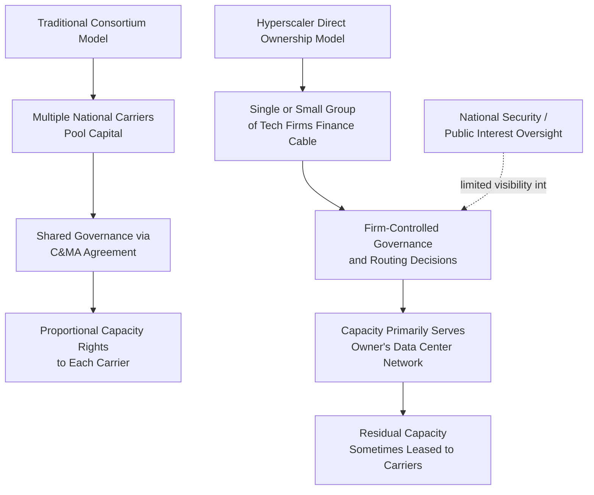

## Hyperscaler Ownership Concentration in Subsea Infrastructure

### Definitional Framework

This topic examines the structural shift in submarine cable ownership from traditional telecommunications carrier consortia toward direct ownership and control by a small number of hyperscale cloud and content companies — principally Google (Alphabet), Meta (Facebook), Amazon (AWS), and Microsoft, collectively often referred to in industry analysis as the "hyperscalers" or, in earlier terminology, alongside Apple, the "Big Tech" content and cloud providers. This represents a distinct supply chain security concern from the general submarine cable chokepoint and physical-vulnerability issues covered separately: the concern here is specifically about **concentrated private corporate control** over critical internet backbone capacity, independent of any single cable's physical route or damage risk.

### Historical Trajectory of Ownership Concentration

**Key Points**

- Prior to roughly the mid-2010s, submarine cable systems were overwhelmingly built and owned by consortia of national telecommunications carriers (e.g., AT&T, NTT, Deutsche Telekom, and similar incumbents), reflecting the historical structure of international telecommunications as a carrier-to-carrier interconnection business.
- Beginning roughly in the 2010s and accelerating through the 2020s, hyperscalers shifted from being primarily *customers* of carrier-owned cable capacity (via leased Indefeasible Rights of Use, IRUs) to being direct *owners and financiers* of new cable construction, driven by exponentially growing inter-data-center bandwidth demand for cloud services, video streaming, and, more recently, AI training and inference workloads requiring massive cross-region data movement.
- By the mid-2020s, hyperscalers were reported to own or co-own a substantial and growing share of new transoceanic cable capacity being constructed, though the precise aggregate percentage of *total global* cable capacity under hyperscaler ownership (as opposed to *new* capacity) varies by measurement methodology and continues to shift as new systems come online. [Unverified: aggregate ownership percentage figures are frequently cited in industry analyses (e.g., TeleGeography reporting) but should be verified against current data given the rapid pace of new cable system deployment]

### Notable Hyperscaler-Owned or Co-Owned Cable Systems

- **Google**: Curie (U.S.-Chile), Dunant (U.S.-France), Equiano (Portugal-South Africa, with branches along the West African coast), Grace Hopper (U.S.-UK-Spain), and Google is also an investor in numerous consortium cables.
- **Meta**: 2Africa (one of the largest cable systems by geographic scope, encircling Africa with landing points across Europe and the Middle East, built in consortium with other carriers but with Meta as a lead investor/driver), and Meta has also pursued additional wholly or majority-owned systems for its own infrastructure needs.
- **Amazon**: Has invested in cable capacity primarily to support AWS region interconnection, generally through consortium participation and IRU arrangements, though with growing direct investment.
- **Microsoft**: Co-invested with Meta in the MAREA cable (U.S.-Spain) and has pursued additional capacity to support Azure region connectivity.

### Ownership Structure Comparison

### Structural Rationale for Hyperscaler Investment

**1. Bandwidth demand growth outpacing carrier capacity planning**

Hyperscaler inter-data-center and cross-region replication traffic, video content delivery, and increasingly AI model training data movement have grown at rates that traditional carrier consortium capacity planning cycles (often multi-year, consensus-driven among consortium members) could not match, incentivizing hyperscalers to control their own capacity planning and deployment timelines directly.

**2. Cost efficiency at scale**

For firms with sufficiently large and predictable bandwidth demand, direct cable ownership can be more cost-effective over a cable's operational lifetime (typically 20–25 years) than perpetually leasing IRU capacity from carrier-owned systems, particularly as demand scales.

**3. Network architecture control**

Direct ownership allows hyperscalers to design cable landing points, routing, and capacity allocation specifically optimized for their own global data center topology, rather than adapting to capacity structured around carrier interconnection priorities.

**4. Strategic competitive differentiation**

Owning dedicated high-capacity, low-latency connectivity between key regions can provide a competitive advantage in cloud service performance and reliability relative to competitors dependent on shared carrier capacity.

### Supply Chain Security and Governance Concerns

**Key Points**

- **Reduced state and regulatory visibility**: Traditional carrier-owned systems, particularly those involving carriers with significant domestic regulatory relationships, have historically been more directly subject to national telecommunications regulatory oversight and, in some jurisdictions, national security review processes (e.g., Team Telecom review in the U.S. for cable landing license applications). Hyperscaler-owned systems are subject to the same landing license processes but the concentration of decision-making within a small number of private firms with global (not nation-specific) commercial incentives raises distinct questions about alignment between corporate infrastructure decisions and national resilience objectives.
- **Single-point commercial dependency**: If a significant share of a country's or region's international connectivity capacity is owned by a small number of foreign hyperscale firms, that region's connectivity resilience becomes partially dependent on the continued commercial interest, financial health, and geopolitical alignment of those specific corporate entities, rather than on diversified multi-carrier national infrastructure policy.
- **Data sovereignty and routing transparency**: Because hyperscaler-owned cables primarily serve the owning company's own inter-data-center traffic, routing and capacity allocation decisions for that infrastructure are generally less transparent to external regulators and competing carriers than consortium-governed systems, raising data sovereignty and competitive-access questions in some jurisdictions.
- **Potential for reduced redundancy investment incentive misalignment**: A hyperscaler's investment decision is driven by its own traffic economics; there is no inherent commercial incentive for a hyperscaler to build redundant capacity along less economically attractive but nationally strategic routes that a state-directed or subsidized carrier investment might prioritize for public interest resilience reasons. [Inference: this is a structural incentive observation rather than a claim that hyperscalers have neglected redundancy in practice; hyperscalers have generally invested heavily in redundant capacity for their own reliability needs, but that redundancy is optimized for their commercial traffic patterns, not necessarily for national public-interest connectivity gaps]

### Regulatory Response: U.S. "Team Telecom" Review

The interagency U.S. process (formally, the Committee for the Assessment of Foreign Participation in the United States Telecommunications Services Sector, commonly called "Team Telecom") reviews submarine cable landing license applications for national security, law enforcement, and data security risk, including scrutiny of foreign ownership stakes and potential foreign government access to cable infrastructure or traffic. This process gained increased attention when proposed cable systems involving Chinese state-linked investment were modified or blocked — for example, portions of the Pacific Light Cable Network (PLCN) system originally planned to connect the U.S. to Hong Kong faced regulatory obstacles related to national security concerns about Chinese government data access risk, resulting in the system being restructured to exclude the Hong Kong landing segment. This illustrates that ownership concentration concerns in subsea infrastructure encompass both the *hyperscaler concentration* dimension covered in this content and a separate but related *foreign state-linked ownership* dimension, which regulatory review processes like Team Telecom are specifically designed to address.

### Comparative Table: Consortium vs. Hyperscaler Ownership Trade-offs

| Dimension | Traditional Carrier Consortium | Hyperscaler Direct Ownership |
| --- | --- | --- |
| Capital deployment speed | Slower (multi-party consensus) | Faster (single/few decision-makers) |
| Regulatory/national oversight visibility | Higher (established carrier regulatory relationships) | Lower (commercial infrastructure, less carrier-specific oversight) |
| Redundancy optimized for | Broad carrier interconnection needs | Owner's specific data center topology |
| Capacity access for third parties | Broadly available via carrier wholesale markets | Often limited to owner's use, with residual capacity sometimes leased |
| Alignment with national resilience policy | More directly shaped by national regulatory relationships | Indirect; shaped by commercial incentives, subject to landing license review only |
| Ownership concentration risk | Distributed across multiple national carriers | Concentrated among small number of firms |

### Emerging Policy Responses

**1. Enhanced landing license scrutiny**

Continued and expanding use of national security review processes (Team Telecom-style mechanisms, and analogous reviews emerging in other jurisdictions) for cable landing applications, with increasing attention to ownership concentration questions beyond purely foreign-state-linked risk.

**2. Public-private capacity-sharing requirements**

Some policy discussions have explored requiring hyperscaler-owned cable systems to reserve a minimum share of capacity for third-party carrier or public-sector use as a condition of landing licenses, to mitigate the risk of critical connectivity capacity being entirely captured by a single firm's internal use.

**3. National/regional cable investment as a counterbalance**

Government-backed or subsidized cable investment (analogous in structural logic to pharmaceutical onshoring covered elsewhere in this course) intended to maintain state or multi-carrier-controlled capacity alongside hyperscaler-owned systems, preserving a baseline of infrastructure not solely dependent on private hyperscaler commercial decisions.

**4. Transparency and reporting requirements**

Proposals in some jurisdictions for greater disclosure of cable ownership structures, capacity utilization, and routing to support national infrastructure resilience planning, given that hyperscaler-owned systems are generally less transparent than consortium systems with multiple carrier stakeholders each subject to independent regulatory relationships.

### Systemic Lessons

**Conclusion**

Hyperscaler ownership concentration in subsea infrastructure represents a distinctive evolution of supply chain security risk: unlike the geographic chokepoint and physical damage risks that apply to submarine cable infrastructure regardless of ownership, this concern is specifically about the alignment (or misalignment) between private commercial infrastructure investment incentives and national or regional public-interest connectivity resilience objectives. The core structural tension is that hyperscalers have become essential infrastructure providers for global connectivity — filling a capacity gap that traditional carrier consortium investment cycles could not meet — while operating under governance and transparency norms designed for commercial cloud service providers rather than critical national infrastructure operators. This mirrors, in a digital-infrastructure context, similar tensions seen in the pharmaceutical manufacturing onshoring discussion: reliance on a small number of powerful private actors for infrastructure with significant public-interest stakes creates resilience benefits (rapid capital deployment, engineering capability) alongside governance risks (reduced transparency, incentive misalignment for public-interest redundancy) that policy frameworks are still adapting to address.

**Related Topics**

- Team Telecom review process and U.S. cable landing license national security review
- Pacific Light Cable Network (PLCN) restructuring and Chinese state-linked investment scrutiny
- 2Africa cable system consortium structure and Meta's investment role
- Indefeasible Rights of Use (IRU) contractual structures in cable capacity leasing
- AI training data center interconnection demand and its effect on cable capacity planning
- Public-private capacity-sharing requirements for critical digital infrastructure
- Comparative analysis: hyperscaler cloud region concentration versus subsea cable ownership concentration
- Data sovereignty regulations and their interaction with privately owned cross-border infrastructure
- National/regional government-backed cable investment as a resilience counterbalance