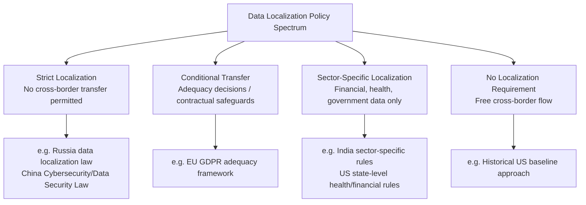

## Data Localization and Digital Sovereignty Policies

### Definitional Framework

**Data localization** refers to legal or regulatory requirements mandating that certain categories of data be stored, processed, or both, within the physical territorial borders of the country whose laws impose the requirement, often prohibiting or restricting cross-border data transfer absent specific conditions being met. **Digital sovereignty** (also "data sovereignty" or "technological sovereignty") is the broader conceptual and policy framework asserting that a state should maintain control over the data generated within its jurisdiction and, in expanded conceptions, over the digital infrastructure, platforms, and technology supply chains its citizens and institutions depend upon. Data localization is the most common *specific policy instrument* used to pursue the broader *digital sovereignty* objective, but digital sovereignty policy also encompasses cloud infrastructure ownership requirements, critical technology export/import controls, and platform governance rules.

These policies sit within supply chain geopolitics because they directly reshape where and how cloud infrastructure, data centers, and associated hardware supply chains are built and operated, creating parallel, jurisdictionally fragmented technology infrastructure rather than a single globally optimized architecture.

### Motivations Driving Data Localization Policy

**Key Points**

- **National security and surveillance concerns**: Governments seek to prevent foreign intelligence services from accessing citizens' or government data through legal mechanisms available in the country where a cloud provider is headquartered (a concern significantly amplified globally following the 2013 disclosures regarding U.S. National Security Agency surveillance programs, which materially accelerated EU and other countries' data sovereignty policy development).
- **Law enforcement access**: Domestic law enforcement agencies seek to ensure data relevant to investigations remains accessible under domestic legal process, without needing to rely on slower or uncertain mutual legal assistance treaty (MLAT) processes to obtain data stored abroad.
- **Economic/industrial policy**: Data localization requirements can function as a form of digital protectionism, creating demand for domestic data center construction, domestic cloud service providers, and associated technology supply chains, rather than allowing that infrastructure investment and associated employment to accrue to foreign hyperscale cloud providers.
- **Privacy and consumer protection**: Some frameworks (though not always requiring strict localization) mandate that cross-border data transfers only occur to jurisdictions with "adequate" data protection standards, creating a functional (if not absolute) localization pressure for transfers to jurisdictions deemed inadequate.
- **Government/public sector data control**: Many localization requirements apply specifically or with heightened stringency to government, critical infrastructure, financial, health, or other sensitive-sector data, reflecting a narrower sovereignty concern than blanket localization of all commercial data.

### Regulatory Architecture Comparison

### Case Study: European Union — GDPR and Adequacy Framework

The EU's General Data Protection Regulation (GDPR) does not impose blanket data localization but instead establishes a **conditional cross-border transfer regime**: personal data may be transferred outside the European Economic Area only to countries the European Commission has formally deemed to provide "adequate" data protection (an adequacy decision), or under specific contractual safeguards (Standard Contractual Clauses, SCCs) or binding corporate rules absent an adequacy decision. This framework produced significant supply chain disruption for transatlantic data flows following the Court of Justice of the European Union's *Schrems II* decision (2020), which invalidated the EU-U.S. Privacy Shield adequacy framework on grounds that U.S. surveillance law did not provide adequate protection for EU citizens' data, forcing U.S. cloud providers and their EU customers to restructure data transfer mechanisms pending negotiation of a successor framework (the EU-U.S. Data Privacy Framework, adopted in 2023). This illustrates how data protection adequacy determinations function as a supply-chain-relevant regulatory chokepoint: a single judicial ruling can require rapid restructuring of cross-border cloud service architecture for thousands of companies simultaneously.

### Case Study: China — Cybersecurity Law and Data Security Law

China's framework, comprising the Cybersecurity Law (2017), Data Security Law (2021), and Personal Information Protection Law (PIPL, 2021), imposes some of the most stringent localization requirements globally, particularly for "critical information infrastructure operators" and data classified as "important data," which generally must be stored within China and undergo a security assessment before any cross-border transfer. This has required foreign technology and cloud companies operating in China to establish domestic data center infrastructure, often through joint ventures or partnerships with domestic firms (for example, arrangements involving foreign cloud providers operating through licensed domestic partners to comply with foreign-investment and data-control restrictions in the telecommunications/cloud sector).

### Case Study: Russia — Federal Law No. 242-FZ

Russia's data localization law (effective 2015) requires that personal data of Russian citizens be initially collected, recorded, and stored using databases physically located within Russian territory, one of the earliest and most explicit strict-localization frameworks globally, and enforcement actions (including fines and, in some cases, blocking access to non-compliant foreign platforms) have been used to compel compliance.

### Case Study: India — Data Protection and Sector-Specific Rules

India has pursued a more sector-specific approach, with the Reserve Bank of India (RBI) mandating localization of payment systems data specifically (requiring payment data to be stored exclusively within India, even if processing occurs partly abroad under certain conditions), while India's broader Digital Personal Data Protection Act (2023) takes a more conditional cross-border transfer approach for personal data generally, illustrating that "digital sovereignty" policy design frequently differentiates by data sensitivity category rather than applying uniform rules across all data types.

### Supply Chain Infrastructure Consequences

**Key Points**

- **Data center construction fragmentation**: Data localization requirements directly drive demand for in-country data center construction by both domestic and foreign cloud providers seeking to serve localized markets, contributing to a broader trend of "sovereign cloud" offerings — cloud infrastructure and services specifically architected to meet a given jurisdiction's localization and access-control requirements (e.g., Microsoft's and AWS's sovereign cloud offerings for EU and other markets, often involving local operational control and restricted foreign government access provisions).
- **Increased infrastructure duplication and reduced economies of scale**: Global cloud providers historically achieved substantial cost and reliability efficiencies through centralized, globally optimized data center architecture; localization requirements force geographically fragmented, jurisdictionally siloed infrastructure, increasing capital costs and potentially reducing the resilience benefits of geographic load-balancing across a global network.
- **Semiconductor and hardware supply chain implications**: Increased sovereign/localized data center construction increases aggregate global demand for server-grade semiconductors, networking hardware, and data center construction materials, intersecting with the broader semiconductor supply chain geopolitics covered elsewhere in this course, since sovereign cloud buildouts in multiple jurisdictions simultaneously compound demand on already concentrated chip manufacturing capacity.
- **Talent and technical expertise localization pressure**: Some sovereignty frameworks extend beyond data storage location to require domestic technical support, operational control, or even domestic ownership stakes in infrastructure operators, creating workforce and expertise localization requirements alongside pure data storage requirements.

### Tension with Global Cloud Architecture Efficiency

A core technical tension underlying this policy area: modern hyperscale cloud architecture is designed around global redundancy, load balancing, and content delivery optimization that generally routes and replicates data across multiple geographic regions for performance and resilience reasons independent of any regulatory requirement. Strict data localization requirements can directly conflict with this architecture, forcing providers to either (a) build genuinely siloed, non-globally-replicated infrastructure for localized markets (increasing cost and potentially reducing technical resilience for that specific region, since it loses the benefit of global failover), or (b) implement complex data classification and routing control systems that allow most infrastructure to remain globally integrated while specific regulated data categories are technically constrained to approved jurisdictions. [Inference: the relative prevalence of approach (a) versus (b) across the industry is not something with a single verifiable figure; it varies by provider, jurisdiction, and specific regulatory stringency, and providers may describe their compliance architecture differently in public documentation versus technical implementation]

### Comparative Table: Major Jurisdictional Approaches

| Jurisdiction | Primary Instrument | Stringency | Sector Scope |
| --- | --- | --- | --- |
| European Union | GDPR + adequacy/SCC framework | Conditional (not absolute localization) | General personal data, heightened for sensitive categories |
| China | Cybersecurity Law, DSL, PIPL | Strict for critical infrastructure/important data | Broad, with heightened critical infrastructure focus |
| Russia | Federal Law 242-FZ | Strict | Personal data of Russian citizens |
| India | RBI payment rules + DPDP Act | Sector-specific (strict for payments, conditional generally) | Financial data strict; general data conditional |
| United States | Historically minimal federal localization; sector rules exist (e.g., certain government/health/financial data) | Generally low, sector exceptions | Sector-specific (government cloud, healthcare, financial) |

### Geopolitical and Trade Policy Dimension

Data localization requirements have become a recurring subject of international trade friction, since they can function as non-tariff barriers to digital trade, disadvantaging foreign cloud and technology providers relative to domestic firms. This has been addressed in some trade agreements through provisions restricting data localization mandates as a trade barrier (e.g., provisions in agreements such as the USMCA addressing cross-border data flow commitments), creating an ongoing tension between trade liberalization objectives (favoring free cross-border data flow) and national security/digital sovereignty objectives (favoring localization) that individual governments resolve differently depending on domestic political priorities.

### Systemic Lessons

**Conclusion**

Data localization and digital sovereignty policy represent a distinct but structurally analogous phenomenon to onshoring in pharmaceutical manufacturing and hyperscaler concentration in subsea cable infrastructure: in each case, a globally optimized, cost-efficient infrastructure model built during a period of assumed geopolitical stability and trust is being deliberately fragmented along national or regional lines in response to security, sovereignty, or economic policy concerns, at the cost of efficiency and scale benefits. The central technical lesson specific to data localization is that it directly reshapes global data center and cloud infrastructure investment patterns, creating derivative demand effects on semiconductor and hardware supply chains, and that its practical implementation requires reconciling fundamentally globally-architected cloud technology with jurisdictionally fragmented legal requirements — a reconciliation that is producing a bifurcated industry response of genuinely siloed "sovereign cloud" infrastructure on one hand, and more complex data-classification-based compliance architectures on the other, with significant variation in which approach specific providers and jurisdictions ultimately favor.

**Next Steps**

- EU-U.S. Data Privacy Framework and its predecessor Safe Harbor/Privacy Shield history
- Schrems I and Schrems II CJEU rulings and their supply chain restructuring impact
- Sovereign cloud architecture models (Microsoft, AWS, Google sovereign cloud offerings)
- China's Cybersecurity Law critical information infrastructure operator designation criteria
- Cross-border data flow provisions in trade agreements (USMCA, CPTPP, digital economy agreements)
- Semiconductor demand implications of global sovereign/localized data center buildout
- Standard Contractual Clauses (SCCs) and binding corporate rules as GDPR transfer mechanisms
- India's Digital Personal Data Protection Act implementation and sector-specific carve-outs
- Comparative analysis: data localization as digital protectionism versus genuine security policy