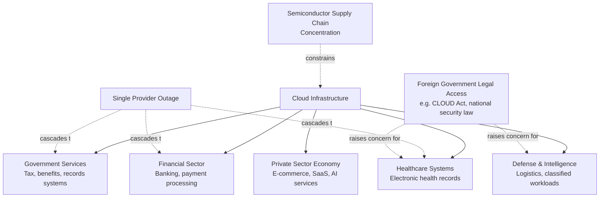

## Cloud Computing Infrastructure as a Strategic Asset

### Definitional Framework

Cloud computing infrastructure — the globally distributed network of hyperscale data centers, compute, storage, and networking capacity operated principally by a small number of hyperscale providers (Amazon Web Services, Microsoft Azure, Google Cloud Platform, and to a lesser extent Alibaba Cloud, Oracle Cloud, and others) — has transitioned in policy and security analysis from being treated as a commercial IT service category to being treated as a component of **critical national infrastructure**, comparable in strategic significance to electricity grids, telecommunications networks, and financial payment systems. This reclassification reflects the reality that government services, financial systems, healthcare records, defense logistics, and an increasing share of private-sector economic activity now depend on cloud infrastructure availability, integrity, and, in some framings, on the geopolitical alignment of the entities controlling that infrastructure.

This topic connects directly to the data localization and hyperscaler subsea cable ownership content covered earlier in this chapter: cloud infrastructure concentration is the broader structural phenomenon of which localization policy and cable ownership concentration are specific manifestations.

### Market Concentration Structure

**Key Points**

- Global cloud infrastructure services (Infrastructure-as-a-Service and Platform-as-a-Service combined) have historically been dominated by a small oligopoly, with Amazon Web Services, Microsoft Azure, and Google Cloud Platform together holding a substantial majority of global market share by revenue, a concentration level that has drawn sustained antitrust and national security policy attention in multiple jurisdictions. [Unverified: specific market share percentages fluctuate quarterly and by measurement methodology (revenue vs. workload share vs. regional variation); consult current industry analyst reporting, such as Synergy Research Group or Gartner, for precise current figures]
- This concentration exists at a global level but with significant regional variation — Alibaba Cloud and Tencent Cloud hold substantial share within China specifically, reflecting both market dynamics and Chinese regulatory preference for domestic cloud infrastructure providers under the data sovereignty frameworks discussed in the previous topic.
- Beneath the three to four dominant hyperscalers, semiconductor supply chains for cloud infrastructure (server-grade CPUs, GPUs/AI accelerators, high-bandwidth memory, and networking silicon) exhibit even greater concentration, meaning cloud infrastructure strategic risk is compounded by upstream hardware supply chain concentration risk (directly connecting to semiconductor supply chain geopolitics covered elsewhere in this course).

### Strategic Asset Framework: Why Cloud Infrastructure Is Treated as Critical Infrastructure

### Documented Systemic Risk: Concentration-Driven Outages

**Case Study: CrowdStrike/Microsoft Windows Outage (July 2024)**

A faulty content update pushed by cybersecurity vendor CrowdStrike to its Falcon sensor software caused widespread crashes of Microsoft Windows systems globally, affecting airlines, hospitals, banks, and government services across multiple countries simultaneously. While this incident involved endpoint software rather than cloud infrastructure directly, it is frequently cited in cloud/IT concentration risk analysis as a demonstration of how concentrated dependency on a small number of widely deployed software and infrastructure providers can produce simultaneous, cross-sectoral, multi-country disruption from a single technical failure — a systemic risk pattern directly analogous to concerns raised about hyperscale cloud provider outages. [Unverified: specific aggregate economic damage estimates from this incident vary significantly by source and methodology]

**Case Study: Major Cloud Provider Regional Outages**

AWS, Azure, and Google Cloud have each experienced significant regional service disruptions at various points (affecting specific availability zones or regions) that cascaded to cause outages for a wide range of dependent commercial and, in some cases, government services relying on that provider, illustrating that even within a single provider's globally distributed architecture, regional infrastructure concentration can produce broad simultaneous impact across seemingly unrelated downstream services and sectors.

### Government Legal Access Frameworks and Cross-Border Data Concerns

**Key Points**

- The U.S. **CLOUD Act** (Clarifying Lawful Overseas Use of Data Act, 2018) allows U.S. law enforcement to compel U.S.-based cloud providers to produce data stored on servers regardless of the physical location of those servers, a framework that has driven significant foreign government and corporate concern about U.S. legal reach over data stored with U.S. hyperscalers even when physically located within foreign jurisdictions (directly connecting to the EU adequacy/Schrems II concerns discussed in the data localization content).
- Similarly, China's national security and intelligence laws contain provisions requiring Chinese entities (and, in some interpretations, entities operating within China) to cooperate with Chinese government intelligence and security requests, generating analogous foreign concern about Chinese government access to data processed through Chinese-linked cloud infrastructure.
- This creates a structural pattern where **the nationality of the infrastructure provider carries geopolitical significance independent of the physical server location**, since legal jurisdiction over the corporate entity, not merely physical data location, determines government access rights in many frameworks — a nuance that pure data localization policy (focused on physical storage location) does not fully address, motivating more comprehensive "sovereign cloud" architectures that also address corporate/legal control structure, not just physical location.

### National Cloud Sovereignty Policy Responses

**1. Sovereign cloud offerings by hyperscalers themselves**

In response to sovereignty concerns, major hyperscalers have developed region-specific "sovereign cloud" products (e.g., Microsoft's EU Data Boundary and sovereign cloud initiatives, AWS European Sovereign Cloud) that combine physical data localization with additional operational controls — such as EU-resident personnel-only operational access and restricted foreign government legal process response procedures — attempting to address both the physical-location and legal-jurisdiction dimensions of sovereignty concern simultaneously.

**2. Domestic/regional cloud champions**

Some governments have promoted or directly subsidized domestic cloud providers as strategic alternatives to foreign hyperscalers, particularly for government and defense workloads (e.g., European initiatives promoting providers such as OVHcloud, or the broader European "Gaia-X" federated cloud infrastructure initiative aimed at creating interoperable, European-governed cloud infrastructure standards, though Gaia-X's practical market impact relative to its ambitious initial goals has been a subject of ongoing debate). [Inference: assessments of Gaia-X's practical success versus its stated ambitions vary substantially among industry analysts and should not be treated as settled]

**3. Government cloud procurement segregation**

Many governments maintain segregated, higher-security cloud environments specifically for classified or sensitive government workloads (e.g., AWS GovCloud and Azure Government in the U.S.), physically and operationally isolated from commercial cloud infrastructure, representing a targeted strategic-asset protection approach for the highest-sensitivity workload category specifically, rather than blanket sovereignty requirements across all cloud usage.

**4. Multi-cloud and cloud repatriation strategies**

Some organizations and governments have pursued deliberate multi-cloud architectures (distributing workloads across multiple providers) or selective "cloud repatriation" (moving specific workloads back to on-premises or nationally controlled infrastructure) as a hedge against single-provider concentration risk, though this approach carries its own cost and complexity trade-offs relative to single-provider optimization.

### Comparative Table: Strategic Risk Dimensions

| Risk Dimension | Description | Primary Mitigation Approach |
| --- | --- | --- |
| Single-provider outage cascading risk | Concentrated dependency amplifies impact of any single provider's technical failure | Multi-cloud architecture, redundancy across providers |
| Foreign legal access risk | Provider's home-country legal jurisdiction may compel data access regardless of physical location | Sovereign cloud offerings addressing legal + physical control |
| Upstream hardware concentration | Cloud infrastructure depends on concentrated semiconductor supply chains (AI accelerators, server CPUs) | Diversified chip sourcing, strategic semiconductor stockpiling |
| Market/antitrust concentration | Small number of dominant providers raises competition and systemic dependency concerns | Antitrust enforcement, interoperability/portability mandates |
| Government workload security | Highest-sensitivity government/defense data requires elevated isolation | Dedicated government cloud environments (GovCloud, Azure Government) |

### The AI Compute Dimension

**Key Points**

- The rapid growth of AI model training and inference workloads has intensified cloud infrastructure's strategic significance further, since access to large-scale GPU/AI accelerator compute capacity — concentrated among a small number of hyperscale providers with the capital and data center scale to deploy it — has itself become a distinct strategic resource, sometimes analyzed through a framework analogous to energy resource geopolitics ("compute as the new oil" is a commonly used, if imprecise, framing in policy discourse).
- This has intersected directly with semiconductor export control policy (notably U.S. export restrictions on advanced AI chips to certain destinations, covered in the semiconductor supply chain content elsewhere in this course), since controlling access to advanced AI accelerator hardware functions as a mechanism for controlling downstream cloud AI compute capacity concentration along geopolitical lines.
- Some governments have begun treating "sovereign AI compute capacity" as a specific sub-category of cloud infrastructure strategic asset policy, pursuing domestic AI data center investment specifically to avoid dependency on foreign hyperscale AI infrastructure for strategically significant AI workloads (defense applications, critical government AI systems). [Speculation: the long-term efficacy and economic viability of nationally siloed AI compute buildouts, given the enormous capital intensity of leading-edge AI data center infrastructure, remains an actively debated and unsettled policy question]

### Systemic Lessons

**Conclusion**

Cloud computing infrastructure exemplifies the broader pattern across this chapter's digital infrastructure topics: a technology sector that achieved enormous efficiency and innovation benefits through global scale and concentration has, precisely because of that concentration, become a source of systemic risk and geopolitical leverage that governments are now attempting to manage through sovereignty, redundancy, and domestic-capacity policies that inherently trade some efficiency for resilience and control. The distinguishing technical insight for cloud infrastructure specifically is that strategic risk operates on at least three compounding levels simultaneously — market concentration among a few dominant providers, legal jurisdiction risk tied to provider nationality independent of physical server location, and upstream hardware supply chain concentration in semiconductor manufacturing — meaning a comprehensive cloud sovereignty policy must address all three levels rather than focusing on any single dimension (such as physical data localization alone) in isolation. The emerging AI compute dimension adds a further layer of urgency and complexity, as the same infrastructure concentration dynamics now intersect directly with national AI capability competition and semiconductor export control policy.

**Related Topics**

- CLOUD Act legal framework and its interaction with EU GDPR adequacy requirements
- Gaia-X European federated cloud infrastructure initiative and its practical market impact
- AWS GovCloud and Azure Government dedicated government cloud architectures
- Semiconductor export controls on advanced AI accelerators and downstream cloud compute effects
- CrowdStrike/Microsoft July 2024 outage as a case study in concentrated IT dependency risk
- Multi-cloud architecture design patterns and cloud repatriation cost-benefit analysis
- Antitrust and competition policy approaches to hyperscale cloud market concentration
- Sovereign AI compute initiatives and national AI data center investment strategies
- Comparative analysis: cloud infrastructure concentration versus subsea cable hyperscaler ownership concentration