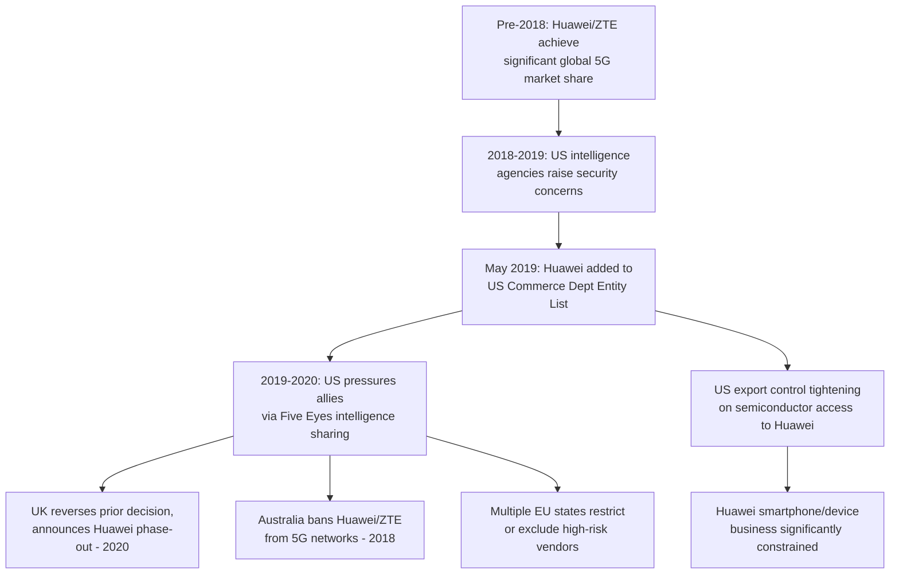

## The Global Telecommunications Equipment Market and the Huawei 5G Dispute

### Definitional Framework and Market Structure

The global telecommunications network equipment market — encompassing radio access network (RAN) hardware, core network switching equipment, and associated software for mobile networks (particularly 5G, and increasingly discussions of 6G standards) — has historically been dominated by a small number of vendors: Huawei and ZTE (China), Ericsson (Sweden), Nokia (Finland), and Samsung (South Korea), with Huawei having achieved the largest global market share by revenue and deployment volume prior to the escalation of the disputes covered in this content. This market structure is significant to supply chain geopolitics because telecommunications network infrastructure is classified by most governments as critical national infrastructure, meaning vendor selection decisions carry security, sovereignty, and geopolitical alignment implications beyond ordinary commercial procurement considerations.

### Technical Background: Why 5G Raised Distinct Security Concerns

**Key Points**

- Earlier mobile network generations (2G, 3G, and to a significant degree 4G/LTE) maintained clearer architectural separation between the "core network" (the centralized, highly sensitive routing and subscriber management infrastructure) and the "radio access network" (the distributed cell tower and antenna equipment closer to end users), allowing some governments to permit foreign vendor equipment in the RAN while restricting it from the more sensitive core.
- 5G network architecture, particularly in its more advanced "standalone" (SA) configuration, involves greater virtualization and software-defined functionality distributed across the network, with some technical analyses arguing this blurs the traditional core/RAN security separation, making the security implications of RAN vendor selection more significant than in prior network generations. [Inference: the degree to which 5G architecture genuinely eliminates a meaningful core/RAN security distinction, versus this being a policy simplification used to justify broader restrictions, has been debated among network security technical experts; this is a genuinely contested technical question, not a settled consensus]
- The core underlying security concern articulated by the U.S. and allied governments centers on the possibility that a vendor headquartered in a jurisdiction where national law can compel corporate cooperation with state intelligence services (specifically citing China's National Intelligence Law and related legal framework) could be compelled to facilitate espionage or, in a conflict scenario, network disruption, through equipment with persistent network access, software update mechanisms, and maintenance backdoor potential.

### Timeline of Key Developments

### The U.S. Entity List Action and Semiconductor Export Controls

In May 2019, the U.S. Department of Commerce added Huawei and a significant number of its affiliates to the Entity List, restricting U.S. companies from supplying Huawei with technology, including semiconductor design tools, components, and manufacturing equipment, without a specific export license. This was subsequently tightened through additional rules, notably the 2020 Foreign Direct Product Rule expansion, which extended U.S. jurisdiction to restrict even non-U.S. semiconductor manufacturers from supplying Huawei if their manufacturing process used U.S.-origin technology or equipment (a category encompassing the overwhelming majority of advanced global semiconductor foundry capacity, given the concentration of critical semiconductor manufacturing equipment supply among a small number of firms, most significantly the Netherlands' ASML for extreme ultraviolet lithography systems).

This connects directly to the broader semiconductor supply chain geopolitics covered elsewhere in this course: the Huawei case is frequently cited as the clearest illustration of how U.S. extraterritorial export control authority, leveraging concentrated chokepoints in global semiconductor manufacturing equipment and design software, can be used as a geopolitical tool independent of direct U.S. trade relationships with the targeted company.

### Allied Government Responses: Divergent Approaches

**United Kingdom**

The UK initially permitted Huawei equipment in "non-core" network functions under strict conditions following a National Cyber Security Centre (NCSC) technical review, but reversed this position in 2020, announcing a phased removal of Huawei equipment from UK 5G networks by a set deadline, a decision widely attributed both to the intensified U.S. semiconductor export controls (which raised concern about Huawei's long-term equipment supply chain reliability and security patch/support continuity, independent of the original espionage concern) and to broader diplomatic pressure following the escalation of U.S.-China tensions.

**Australia**

Among the earliest and most decisive allied actions, Australia banned Huawei and ZTE from supplying equipment for its 5G network in 2018, citing security agency advice regarding the risks of allowing vendors subject to extrajudicial direction from a foreign government to build sensitive network infrastructure.

**European Union**

The EU did not impose a bloc-wide ban but issued a "5G Toolbox" framework in 2020 providing risk-assessment criteria and recommending that member states restrict or exclude "high-risk vendors" from critical network functions, resulting in a patchwork of national responses across member states rather than a unified EU-wide policy — some states (e.g., Sweden) imposed significant restrictions, while others maintained more permissive approaches, reflecting differing threat assessments, existing network infrastructure investment (switching vendors involves significant cost, given already-deployed 4G infrastructure typically using the same vendor for architectural compatibility), and diplomatic/trade relationship considerations with China.

**Developing Economies**

Many countries in Africa, Latin America, Southeast Asia, and elsewhere continued significant Huawei equipment procurement, often citing Huawei's competitive pricing, financing arrangements (including Chinese state-linked export financing supporting Huawei deployments), and the absence of comparably priced alternatives from Western vendors for their specific market conditions, illustrating that the Huawei dispute's practical global outcome has been geographic bifurcation rather than universal exclusion.

### Case Study: "Rip and Replace" Cost Burden

Countries that reversed earlier Huawei procurement decisions faced substantial costs associated with removing and replacing already-installed equipment (commonly termed "rip and replace"), since telecommunications carriers — particularly smaller, rural, and regional carriers who had selected Huawei partly for its competitive pricing — had to fund equipment replacement, often requiring government subsidy programs (e.g., U.S. federal funding programs to reimburse smaller rural carriers for Huawei/ZTE equipment removal costs) to avoid disproportionate financial burden falling on carriers serving lower-revenue, harder-to-justify-commercially markets. This illustrates a frequently underappreciated supply chain security cost dimension: security-driven vendor exclusion policy generates substantial *transition* costs distinct from the *ongoing* cost differential between vendors, and these transition costs disproportionately burden smaller market participants who lack the capital reserves of large national carriers.

### Comparative Table: Allied Government Approaches to Huawei/High-Risk Vendors

| Jurisdiction | Approach | Key Mechanism | Timing |
| --- | --- | --- | --- |
| United States | Full exclusion + semiconductor export controls | Entity List, Foreign Direct Product Rule | 2019 onward |
| Australia | Full ban from 5G networks | Government security directive | 2018 |
| United Kingdom | Initial partial restriction, reversed to full phase-out | NCSC review, then reversal | 2020 |
| European Union | Risk-based framework, no bloc-wide mandate | 5G Toolbox recommendations | 2020, ongoing member-state variation |
| Many developing economies | Continued procurement | Commercial/financing considerations | Ongoing |

### Huawei's Strategic Response

**Key Points**

- Facing severe constraints on access to advanced semiconductor manufacturing (since leading-edge chip fabrication requires equipment and processes subject to the extended U.S. export control regime), Huawei's smartphone business — which had briefly become one of the largest globally by shipment volume — contracted significantly, though Huawei has continued pursuing alternative chip design and, reportedly, domestic Chinese semiconductor manufacturing partnerships (notably with China's Semiconductor Manufacturing International Corporation, SMIC) to develop workarounds using less advanced process nodes than the cutting-edge nodes it previously accessed via TSMC.
- Huawei has continued to compete significantly in telecommunications infrastructure markets not subject to allied restrictions, and has pursued increased vertical integration and domestic Chinese supply chain development for components previously sourced from restricted foreign suppliers, illustrating a broader pattern (also seen in China's API/KSM onshoring efforts covered in the pharmaceutical chapter) where export control pressure can accelerate a targeted country's own domestic supply chain development rather than simply constraining its targeted capability indefinitely. [Inference: the long-term effectiveness of Huawei's domestic substitution strategy in fully replicating the technical capability of restricted foreign inputs, particularly for leading-edge semiconductor process nodes, remains genuinely contested and evolving, and should not be assumed as either fully successful or fully unsuccessful based on any single data point]

### Systemic Lessons for Supply Chain Geopolitics

**Conclusion**

The Huawei 5G dispute represents one of the most consequential and well-documented case studies in modern technology supply chain geopolitics, illustrating several patterns recurring throughout this course: the use of concentrated upstream chokepoints (semiconductor manufacturing equipment, in this case) as geopolitical leverage independent of direct trade relationships with the targeted entity; the challenge of achieving unified allied action given divergent national risk assessments, existing infrastructure sunk costs, and commercial relationships; the disproportionate transition-cost burden on smaller market participants when security policy mandates vendor changes; and the tendency for export control and exclusion pressure to accelerate, rather than permanently prevent, the targeted country's development of domestic alternative capability. The technical core/RAN network architecture debate underlying the original security rationale also illustrates a broader pattern in supply chain security policy: technical architecture arguments and geopolitical alignment considerations are often intertwined in ways that make it difficult to cleanly separate genuine security-driven technical necessity from broader strategic competition motivations, a dynamic likely to recur in future technology supply chain disputes (e.g., in AI infrastructure, covered elsewhere in this chapter).

**Next Steps**

- U.S. Foreign Direct Product Rule mechanics and extraterritorial export control jurisdiction
- ASML extreme ultraviolet (EUV) lithography as a global semiconductor manufacturing chokepoint
- China's National Intelligence Law and its role in foreign government risk assessments
- SMIC domestic Chinese semiconductor manufacturing capability and process node limitations
- EU 5G Toolbox risk assessment criteria and member-state implementation variation
- "Rip and replace" subsidy programs and their fiscal/administrative design
- Open RAN (O-RAN) architecture as an alternative to vertically integrated vendor lock-in
- Comparative case: TikTok/ByteDance disputes as a parallel technology supply chain security case
- 6G standards development and anticipated recurrence of vendor security debates