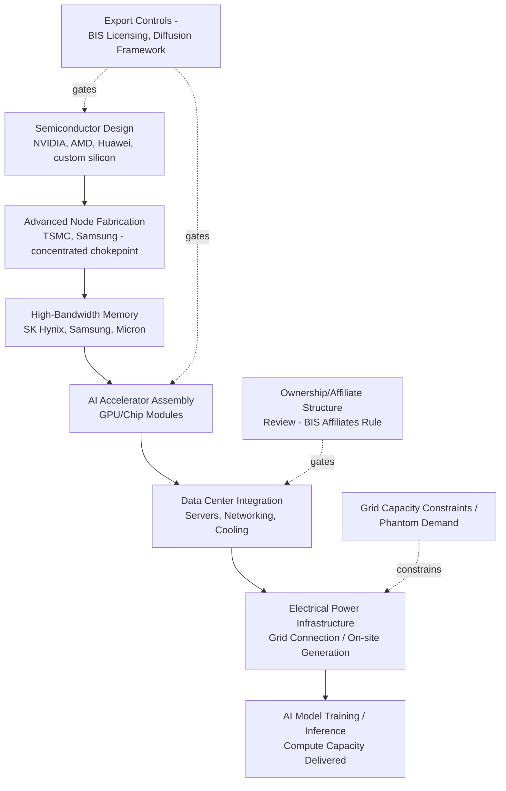

## AI Compute Supply Chains and Data Center Geopolitics

### Definitional Framework

AI compute supply chains encompass the full stack of resources required to train and run large-scale artificial intelligence models: advanced semiconductor AI accelerators (GPUs and custom AI chips), high-bandwidth memory (HBM), the data centers that house and interconnect this hardware, the electrical power infrastructure required to operate them, and the software/firmware ecosystems that govern chip access and usage tracking. "Data center geopolitics" refers to the increasingly explicit treatment of physical compute infrastructure location, ownership, and hardware provenance as instruments of national strategic competition, extending the semiconductor supply chain geopolitics and cloud infrastructure strategic-asset dynamics covered earlier in this chapter into a domain now widely described in policy literature as making compute a geopolitical asset, a description that "would have sounded abstract in 2020" but by 2026 is "operationally concrete: which chips you can buy, in which quantities, to deploy in which countries, is now a question that involves export license applications, national security reviews, and bilateral diplomatic negotiations." [Vamsi Talks Tech](https://www.vamsitalkstech.com/ai-infrastructure/sovereign-ai-and-the-geopolitics-of-compute-export-controls-national-chip-programs-and-the-fracturing-global-ai-stack/)

### Structural Position in the Supply Chain

### The U.S. Export Control Regime: Evolution and Current Structure

**Key Points**

- The Biden administration's January 2025 "Framework for Artificial Intelligence Diffusion" divided the world into three tiers and attempted to regulate the diffusion of advanced AI through export controls, treating compute as "a reliable proxy for AI system capabilities" and "an easily targetable input for AI development." [Taylor & Francis Online](https://www.tandfonline.com/doi/full/10.1080/23738871.2026.2642613)
- The regulatory approach has continued to evolve substantially since then. As of 15 January 2026, the U.S. Bureau of Industry and Security shifted to reviewing shipments of advanced AI chips to China and Macau on a case-by-case basis rather than issuing blanket rejections, subject to a volume cap of 50 percent relative to domestic U.S. shipments, mandatory testing in a U.S.-based laboratory, and know-your-customer obligations, with affected chips including Nvidia's H200 and AMD's MI325X. [Digital Chiefs](https://www.digital-chiefs.de/en/geopolitics-meets-the-data-center-roadmap-what-cios-must-secure-now/)
- Critically, these rules apply not only to manufacturers and exporters but to the entire chain from end recipient to operator, tying review to the parent and ownership structures of all parties involved, and explicitly extend to data center operators, not just hardware manufacturers — requiring buyers to document origin and ownership structures for every piece of hardware. [Digital Chiefs](https://www.digital-chiefs.de/en/geopolitics-meets-the-data-center-roadmap-what-cios-must-secure-now/)
- A related enforcement mechanism, the BIS Affiliates Rule, extends scrutiny to corporate ownership structure: data center owners and operators outside the U.S. have been advised to stress-test their ownership structures against this rule, which was suspended only until November 10, 2026. [Note: given the pace of change in this regulatory area, verify current status against BIS's latest published rules] [CES Intelligence](https://www.ces-intelligence.com/analysis/ai-sovereignty-export-controls-2026)
- Separately, integrated circuit designers not approved under the BIS framework lost their "authorized" status as of April 13, 2026, an operational deadline reportedly missed by many procurement teams because it was contained within an interim final rule rather than prominent public announcement. [CES Intelligence](https://www.ces-intelligence.com/analysis/ai-sovereignty-export-controls-2026)

### Legislative Developments Beyond the Executive Branch

**Key Points**

- Congress has advanced additional measures aimed at closing perceived loopholes in the existing export control structure. Proposed legislation would require cloud service providers to verify that buyers and end users of rented compute capacity were unrestricted or licensed entities, and would grant BIS authority to impose civil and criminal penalties on noncompliant companies whether based abroad or operating within the United States. [Carnegie Endowment for International Peace](https://carnegieendowment.org/research/2026/05/the-geopolitical-debates-over-controlling-cloud-compute)
- Analysts note a structural tension in closing multiple loopholes simultaneously: restricting only rentals to foreign data centers would naturally encourage firms to pivot toward renting cloud compute directly from U.S.-based data centers instead, meaning closing both loopholes at once is necessary to prevent simple substitution. A further second-order effect under consideration is that tightened restrictions might push foreign-owned data centers to reduce dependence on U.S. chips in favor of more accessible Chinese alternatives. [Carnegie Endowment for International Peace](https://carnegieendowment.org/research/2026/05/the-geopolitical-debates-over-controlling-cloud-compute)[Carnegie Endowment for International Peace](https://carnegieendowment.org/research/2026/05/the-geopolitical-debates-over-controlling-cloud-compute)
- There is also a debated intelligence trade-off: continued Chinese use of U.S. cloud infrastructure provides a channel through which U.S. intelligence agencies might gain visibility into the advancements and capabilities of Chinese AI developers, and whether this intelligence value outweighs the security costs of maintaining that access remains an open policy question. [Carnegie Endowment for International Peace](https://carnegieendowment.org/research/2026/05/the-geopolitical-debates-over-controlling-cloud-compute)
- Two additional bipartisan bills reflect a broader push toward multilateral coordination: the STRIDE Act seeks to align semiconductor export controls with allies, while the MATCH Act (Multilateral Alignment of Technology Controls on Hardware) is a more targeted measure aimed specifically at Chinese chipmakers. [BowerGroupAsia](https://bowergroupasia.com/tech-in-2026-geopolitics-ai-risk-and-infrastructure-constraints-reshape-the-sector/)
- These measures also carry diplomatic costs: imposing know-your-customer requirements and end-use restrictions on foreign data centers costs third-party countries revenue and relationships, and deepens U.S. extraterritorial authority over infrastructure located on other nations' soil — a dynamic that drew sharp reactions from affected governments when first attempted. [Carnegie Endowment for International Peace](https://carnegieendowment.org/research/2026/05/the-geopolitical-debates-over-controlling-cloud-compute)

### China's Response: Domestic Substitution Strategy

**Key Points**

- Facing cumulative restrictions, with NVIDIA's H100, B200, and subsequently H20 chips banned from export to China, Chinese AI development has proceeded on an alternative hardware stack centered on Huawei's Ascend 910B and 910C series chips. [Vamsi Talks Tech](https://www.vamsitalkstech.com/ai-infrastructure/sovereign-ai-and-the-geopolitics-of-compute-export-controls-national-chip-programs-and-the-fracturing-global-ai-stack/)
- Huawei claims its Ascend 910C achieves performance comparable to NVIDIA's H100 for specific workloads, though independent benchmarks suggest a meaningful performance gap remains. [Vamsi Talks Tech](https://www.vamsitalkstech.com/ai-infrastructure/sovereign-ai-and-the-geopolitics-of-compute-export-controls-national-chip-programs-and-the-fracturing-global-ai-stack/)
- Domestic policy is compensating for this technical gap through demand-side mandates: the Chinese government's willingness to mandate domestic chip procurement for state-related AI projects gives Huawei a captive market at scale, and the medium-term open question is whether that domestic demand is sufficient to fund the R&D needed to close the performance gap with NVIDIA's Blackwell and Rubin chip generations. [Vamsi Talks Tech](https://www.vamsitalkstech.com/ai-infrastructure/sovereign-ai-and-the-geopolitics-of-compute-export-controls-national-chip-programs-and-the-fracturing-global-ai-stack/)
- This illustrates a pattern also observed in the telecommunications equipment and pharmaceutical onshoring content elsewhere in this course: export restriction pressure can accelerate, rather than simply suppress, a targeted country's domestic supply chain development, even where the resulting substitute technology lags the restricted original in raw capability.

### Sovereign AI Infrastructure: The European Case

**Key Points**

- Europe has pursued a distinct strategy centered on public-private compute infrastructure buildout to reduce dependency on U.S. hyperscale AI infrastructure. Nineteen EuroHPC AI Factories are operational, alongside projects such as Mistral's Bruyères-le-Châtel data center, Deutsche Telekom's Industrial AI Cloud, and the EURO-3C federation, marking what analysts describe as a transition "from intent to execution." [CES Intelligence](https://www.ces-intelligence.com/analysis/ai-sovereignty-export-controls-2026)
- The scale gap with the U.S. remains substantial despite this buildout: U.S. private AI investment runs roughly 24 times European levels (approximately $109 billion versus $4–8 billion annually), and a cited "75/15 global compute split" reflects the accumulated stock effect of that investment gap. [CES Intelligence](https://www.ces-intelligence.com/analysis/ai-sovereignty-export-controls-2026)
- European policy is attempting to compensate for this capital asymmetry through regulatory demand-shaping rather than matching investment directly: compliance mandates and procurement rules are creating "captive demand" for sovereign infrastructure, with Gartner projecting that over one-third of enterprises will run localized AI platforms by 2027, up from just 5 percent previously. [CES Intelligence](https://www.ces-intelligence.com/analysis/ai-sovereignty-export-controls-2026)
- Major U.S. hyperscalers are adapting their own offerings to this environment: Microsoft has expanded its EU Data Boundary for Copilot, and NVIDIA tripled its European AI infrastructure investment in late 2025 specifically to position itself inside the "Sovereign AI" policy envelope. [CES Intelligence](https://www.ces-intelligence.com/analysis/ai-sovereignty-export-controls-2026)
- Model selection itself has become a jurisdictional and compliance decision rather than a purely technical one: running Llama, GPT, Mistral, DeepSeek, or Qwen on sovereign infrastructure now carries multi-year lock-in consequences tied to data residency and audit obligations. [CES Intelligence](https://www.ces-intelligence.com/analysis/ai-sovereignty-export-controls-2026)

### India as an Emerging Compute Market

NVIDIA has made India a priority market, with CEO Jensen Huang committing to significant partnership announcements in 2026, reflecting a broader pattern of AI chip suppliers pursuing geographically diversified allied-market growth as a hedge against the constrained China market and as an instrument of broader technology-alliance strategy (a dynamic structurally similar to Huawei's continued market pursuit in non-restricted jurisdictions covered in the telecommunications equipment content). [Vamsi Talks Tech](https://www.vamsitalkstech.com/ai-infrastructure/sovereign-ai-and-the-geopolitics-of-compute-export-controls-national-chip-programs-and-the-fracturing-global-ai-stack/)

### The Physical Infrastructure Constraint: Energy and Grid Capacity

**Key Points**

- Compute supply chain analysis increasingly treats electrical power availability, not just chip supply, as a binding constraint on AI infrastructure buildout. "Phantom" energy demand — where speculative or inaccurate load forecasts fail to materialize into actual consumption — is straining grid planning and financing, prompting governments to tighten approval processes and pushing data center operators to align capacity forecasts more closely with realistic demand. [BowerGroupAsia](https://bowergroupasia.com/tech-in-2026-geopolitics-ai-risk-and-infrastructure-constraints-reshape-the-sector/)
- This issue is expected to intensify across major data center growth markets including Australia, Indonesia, Malaysia, Thailand, and Japan through the second half of 2026 and into 2027, particularly in markets where energy bottlenecks are already constraining sector growth. [BowerGroupAsia](https://bowergroupasia.com/tech-in-2026-geopolitics-ai-risk-and-infrastructure-constraints-reshape-the-sector/)
- This connects the AI compute supply chain directly to energy infrastructure geopolitics: data center siting decisions are increasingly co-determined by chip export eligibility, ownership-structure compliance, *and* grid interconnection capacity, making AI infrastructure planning a multi-constraint optimization problem rather than a pure semiconductor-availability question.

### Regional Manufacturing Ecosystem Exposure

The tightening U.S.-China export control trajectory signals persistent geopolitical risk for semiconductor manufacturing hubs such as Japan, Korea, Taiwan, Malaysia, and Singapore, whose ecosystems remain closely tied to China as a major importer of semiconductor products and equipment from the region, creating significant supply chain disruption risk should U.S.-China tensions intensify further. This directly links AI compute geopolitics to the broader semiconductor manufacturing concentration risk covered in this course's technology supply chain content: restrictions targeting AI-specific end uses inevitably ripple through shared manufacturing ecosystems serving both AI and non-AI semiconductor demand. [BowerGroupAsia](https://bowergroupasia.com/tech-in-2026-geopolitics-ai-risk-and-infrastructure-constraints-reshape-the-sector/)

### Compliance Architecture for Data Center Operators

**Key Points**

- Legal and compliance analysis frames data centers as newly front-line actors in export control enforcement: many of the items necessary for a data center to allow its customers to develop or run advanced AI models are now subject to U.S. export controls, with data centers, their customers, and their suppliers expected to maintain national security guardrails through risk-based compliance and due diligence in exchange for accessing export-controlled items and technology. [Morgan Lewis](https://www.morganlewis.com/pubs/2026/02/key-us-export-controls-considerations-for-global-data-center-projects)
- Practical risk-management guidance for multinational compute infrastructure operators emphasizes four converging levers: multi-sourcing, supply-chain transparency, staged capital expenditure releases, and sovereign capacity as a fallback option — described as "familiar levers that are now urgent" given how quickly regulatory conditions can shift relative to the multi-year investment horizon of data center construction. [Digital Chiefs](https://www.digital-chiefs.de/en/geopolitics-meets-the-data-center-roadmap-what-cios-must-secure-now/)
- From a sovereignty-policy perspective, infrastructure ownership itself is treated as a strategic control mechanism: owning data centers means controlling part of the upstream AI value chain and protecting it from overseas interference and attack, with AI leadership viewed as essential to economic growth given projections that AI and analytics could create $10 trillion of economic value across the global economy by the turn of the decade. [A&O Shearman](https://www.aoshearman.com/en/insights/data-center-insights/geopolitics-ai-and-data-center-development)
- This sovereignty imperative intersects with cybersecurity regulation: under the EU's NIS 2 framework, covered entities must register with national cybersecurity agencies and implement stronger risk management frameworks, carrying the threat of significant administrative fines for cyber breaches and personal liability for senior managers, with further reforms to this framework proposed by the European Commission in January 2026. [A&O Shearman](https://www.aoshearman.com/en/insights/data-center-insights/geopolitics-ai-and-data-center-development)

### Comparative Table: Major Jurisdictional Compute Strategies

| Jurisdiction | Primary Strategy | Key Mechanism | Central Constraint |
| --- | --- | --- | --- |
| United States | Export control + extraterritorial enforcement | BIS licensing, Affiliates Rule, case-by-case China review | Balancing restriction with allied/commercial relationships |
| China | Domestic substitution + captive demand | Huawei Ascend chips, state-mandated procurement | Performance gap versus leading-edge foreign chips |
| European Union | Sovereign infrastructure buildout + regulatory demand-shaping | EuroHPC AI Factories, Data Boundary, NIS 2 | Capital investment gap (~24x below U.S. private investment) |
| India | Priority market for allied chip suppliers | Bilateral NVIDIA partnership commitments | Emerging infrastructure and grid capacity |
| Manufacturing hub economies (Taiwan, Korea, Japan, Malaysia, Singapore) | Ecosystem exposure management | N/A (dependent on U.S./China policy trajectory) | Deep integration with both U.S. and Chinese semiconductor demand |

### Systemic Lessons

**Conclusion**

AI compute supply chains and data center geopolitics represent the most rapidly evolving frontier of technology supply chain security covered in this chapter, characterized by a regulatory environment that shifts on a timescale of weeks to months while the underlying physical infrastructure — data centers, grid connections, fabrication capacity — requires multi-year investment horizons, creating a structural mismatch that infrastructure operators must navigate through diversification and staged commitment rather than fixed long-term planning. The domain synthesizes nearly every prior theme in this chapter simultaneously: semiconductor manufacturing concentration (shared with the Huawei 5G case), cloud infrastructure ownership and legal-jurisdiction concerns (shared with cloud sovereignty content), and data localization pressure (shared with digital sovereignty policy), while adding two genuinely novel dimensions — extraterritorial compliance obligations extending to data center operators and ownership structures themselves, and electrical grid capacity as a newly binding physical constraint independent of chip availability. The recurring pattern of export restriction accelerating targeted domestic substitution (observed with China's Huawei Ascend chip strategy) reinforces a lesson evident throughout this course: supply chain restriction policy reliably reshapes global capability distribution, but rarely eliminates the restricted capability, over sufficiently long time horizons.

**Related Topics**

- BIS Affiliates Rule and ownership-structure due diligence for multinational data center operators
- EU AI Act compute thresholds and their interaction with sovereign AI infrastructure policy
- EuroHPC AI Factories network architecture and funding structure
- Huawei Ascend chip series performance benchmarking and China's domestic AI chip ecosystem
- "Phantom" energy demand and grid capacity planning for data center buildout
- STRIDE Act and MATCH Act legislative mechanics and allied export control alignment
- NIS 2 cybersecurity framework obligations for critical digital infrastructure operators
- TSMC and Samsung advanced-node fabrication as the upstream chokepoint for AI accelerator supply
- Comparative analysis: AI compute export controls versus Huawei 5G-era semiconductor restrictions