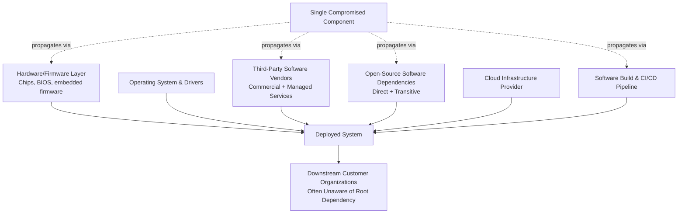

## Cybersecurity Risk in Extended Digital Supply Chains

### Definitional Framework

Digital supply chain cybersecurity risk refers to the security exposure an organization inherits not from its own systems directly, but from the software, hardware, firmware, cloud services, open-source components, and third-party vendors it depends upon throughout its technology stack. This is distinguished from traditional perimeter-based cybersecurity, which assumes an organization's primary risk surface is its own directly controlled infrastructure. Extended digital supply chains — encompassing software dependencies (including transitive dependencies several layers removed from direct developer awareness), managed service providers, cloud infrastructure providers, hardware component suppliers, and firmware/BIOS-level code — mean that a security compromise anywhere in this extended chain can propagate to every downstream organization depending on it, often without those downstream organizations having any direct visibility into, or control over, the point of compromise.

This topic sits at the intersection of the technology supply chain concentration issues covered elsewhere in this chapter (cloud infrastructure, semiconductor manufacturing, telecommunications equipment) and a distinct security discipline concerned specifically with *trust propagation* through multi-tier digital dependency chains.

### Structural Anatomy of Digital Supply Chain Risk

### Taxonomy of Digital Supply Chain Attack Vectors

**1. Software dependency compromise**

Malicious code inserted into a widely used software library, package, or dependency (particularly common in open-source package ecosystems such as npm, PyPI, and similar repositories), which then propagates to every downstream application that incorporates that dependency, often automatically through routine dependency updates.

**2. Build pipeline / CI-CD compromise**

Rather than compromising a software product's source code directly, an attacker compromises the build, compilation, or distribution pipeline used to produce and deliver the software, inserting malicious code at the point of compilation or packaging — a technique that can evade source-code review processes entirely, since the reviewed source code itself may remain clean while the delivered binary is compromised.

**3. Software update/patch mechanism compromise**

Exploitation of the trusted software update channel itself, whereby an attacker compromises a vendor's legitimate update distribution infrastructure to push malicious updates that are automatically trusted and installed by downstream systems, precisely because those systems are configured to trust updates from that vendor.

**4. Managed service provider (MSP) compromise**

Attackers compromise a managed IT service provider or similar third party with privileged administrative access to multiple downstream client networks, using that single point of access to pivot into numerous otherwise-unrelated victim organizations simultaneously.

**5. Hardware/firmware implant risk**

Malicious modification of hardware components or firmware during manufacturing or distribution, a theoretically severe risk category given the difficulty of detecting hardware-level compromise through software-based security tools, though empirically documented cases of this specific attack vector are less common in public reporting than software-layer supply chain attacks. [Unverified: the relative prevalence of hardware/firmware-level supply chain attacks versus software-layer attacks is difficult to assess definitively, given that hardware-level compromise, if undetected, would by its nature be underrepresented in public incident reporting; treat prevalence comparisons between these categories with appropriate caution]

**6. Cloud/API dependency compromise**

Compromise of a third-party cloud service, API, or platform that multiple downstream applications integrate with, propagating impact across all integrating applications through the shared dependency.

### Case Study: SolarWinds Orion Compromise (2020)

Widely regarded as one of the most consequential digital supply chain compromises publicly documented, this incident involved attackers compromising the build system of SolarWinds, a network management software vendor, inserting malicious code into legitimate software updates for its Orion platform that were then digitally signed and distributed through SolarWinds' trusted update mechanism to an estimated 18,000 organizations, including multiple U.S. federal government agencies and major corporations, with attackers subsequently pursuing a smaller subset of high-value targets for deeper compromise. This incident is frequently cited as the canonical example of build-pipeline compromise combined with trusted-update-channel exploitation, and it prompted substantial U.S. policy response, including Executive Order 14028 (2021) on improving national cybersecurity, which specifically mandated new federal software supply chain security requirements.

### Case Study: Log4Shell Vulnerability (2021)

The discovery of a critical remote code execution vulnerability in Log4j, a widely used open-source Java logging library embedded (often as a transitive dependency several layers removed from direct developer awareness) in an enormous number of enterprise applications and cloud services globally, illustrated the systemic risk posed by concentrated dependency on widely reused open-source components. The incident's severity was compounded by the difficulty many organizations faced in even determining whether they were affected, since Log4j was frequently included indirectly through other libraries rather than through direct, consciously chosen dependency declarations — a phenomenon termed the "dependency iceberg" problem, where an organization's direct dependencies represent only a small visible fraction of the full transitive dependency tree actually executing in production.

### Case Study: 3CX Supply Chain Compromise (2023)

A voice-over-IP software provider, 3CX, was compromised through a cascading supply chain attack in which 3CX itself had been compromised via a prior supply chain attack on a different software vendor whose compromised software 3CX had installed internally, illustrating a "supply chain of supply chains" pattern where attackers compromise one vendor specifically as a stepping stone to reach a second vendor's software distribution pipeline, extending the propagation chain an additional tier beyond the immediately visible vendor relationship.

### Software Bill of Materials (SBOM) as a Mitigation Framework

**Key Points**

- A Software Bill of Materials is a formal, machine-readable inventory of all components, libraries, and dependencies (including transitive dependencies) incorporated into a software product, analogous in concept to a manufacturing bill of materials for physical products, intended to give downstream consumers of software visibility into their actual dependency exposure rather than relying solely on the vendor's direct representations.
- U.S. Executive Order 14028 specifically mandated SBOM requirements for software sold to federal government agencies, accelerating broader industry adoption of standardized SBOM formats (notably SPDX and CycloneDX) beyond the federal procurement context specifically.
- SBOMs address the *visibility* problem in digital supply chain risk but do not, by themselves, solve the *remediation* problem: even with full dependency visibility, an organization discovering a vulnerable transitive dependency (as in the Log4Shell case) still faces the practical challenge of coordinating patching or mitigation across potentially numerous internal and third-party systems incorporating that dependency, often requiring vendor cooperation the requesting organization cannot directly compel.

### Hardware Supply Chain Security Concerns

The hardware dimension of digital supply chain risk connects directly to the semiconductor and telecommunications equipment content covered elsewhere in this chapter: concerns about foreign-manufactured hardware containing intentional backdoors or vulnerabilities exploitable by the manufacturing country's government (a concern explicitly cited in the Huawei 5G dispute) represent a hardware-specific instance of the broader digital supply chain trust problem, distinguished from the software cases above primarily by the extreme difficulty of independently verifying hardware/firmware integrity relative to software, where source code review and reproducible-build techniques offer at least partial (if imperfect) independent verification mechanisms.

### Systemic Risk Amplifiers in Digital Supply Chains

**Key Points**

- **Concentration amplifies blast radius**: Because a small number of widely used software libraries, cloud providers, and managed service platforms serve an enormous number of downstream organizations, compromise of any single widely depended-upon component produces disproportionately broad simultaneous impact — a dynamic structurally identical to the concentration-driven systemic risk discussed in the cloud computing strategic asset content (e.g., the CrowdStrike/Microsoft outage, though that specific incident was not a security compromise but a faulty update, illustrating that concentration risk applies equally to accidental and malicious failure modes).
- **Trust transitivity exceeds visibility**: Organizations routinely trust software, hardware, and services several tiers removed from their direct awareness (transitive dependencies, sub-processors of their vendors, component suppliers of their hardware vendors), meaning the effective trust boundary of any given system is frequently far larger, and far less visible, than its formal vendor relationship list would suggest.
- **Patch/update mechanisms are simultaneously the primary defense and a primary attack vector**: The same trusted update channels that allow rapid vulnerability remediation across a vendor's installed base are the mechanism exploited in update-channel compromise attacks (as in SolarWinds), creating an inherent tension between patching speed (a security benefit) and reduced verification friction (a security risk) in automated update systems.
- **Open-source maintenance capacity mismatch**: Many critical, widely depended-upon open-source components are maintained by small numbers of volunteer maintainers with limited resources relative to the scale of downstream dependency on their work, a resourcing mismatch that has been highlighted as a systemic risk factor independent of any specific attack, since under-resourced maintenance can itself produce security gaps through delayed vulnerability response or successful social-engineering compromise of maintainer accounts.

### Policy and Regulatory Responses

**1. Mandatory incident reporting requirements**

Various jurisdictions have introduced or expanded requirements for critical infrastructure operators and, in some frameworks, software vendors to report security incidents within defined timeframes, intended to improve collective situational awareness of supply chain compromise patterns across sectors.

**2. Vendor security certification and procurement standards**

Government procurement frameworks increasingly incorporate specific software supply chain security requirements (SBOM provision, secure development lifecycle attestation) as a condition of vendor eligibility, using government purchasing power to drive broader market security practice improvement, similar in mechanism to how stockpile-linked procurement can drive pharmaceutical onshoring investment (covered elsewhere in this course).

**3. Critical infrastructure-specific cybersecurity frameworks**

Sector-specific regulatory frameworks (e.g., the EU's NIS 2 directive, covered in the AI compute geopolitics content, which extends cybersecurity risk management and incident reporting obligations to a broadened scope of "essential" and "important" entities) increasingly treat digital supply chain risk management as an explicit compliance obligation rather than a purely voluntary best practice.

**4. Zero-trust architecture adoption**

A security architecture philosophy explicitly designed to reduce reliance on implicit trust relationships (including trust in vendors, networks, and previously-authenticated systems), instead requiring continuous verification of every access request regardless of its origin — a direct architectural response to the trust-transitivity problem inherent in extended digital supply chains, though full zero-trust implementation remains a long-term architectural transition for most organizations rather than an immediately achievable state.

### Comparative Table: Attack Vector Characteristics

| Attack Vector | Detection Difficulty | Typical Blast Radius | Primary Mitigation |
| --- | --- | --- | --- |
| Open-source dependency compromise | Medium-High (depends on code review rigor) | Very high (widely reused components) | SBOM, dependency scanning, maintainer support |
| Build/CI-CD pipeline compromise | Very high (bypasses source code review) | High (all users of compromised build) | Build provenance verification, reproducible builds |
| Update channel compromise | High (exploits trusted mechanism) | Very high (entire installed base) | Code signing verification, update anomaly detection |
| Managed service provider compromise | Medium | High (all MSP clients) | Vendor access auditing, least-privilege access design |
| Hardware/firmware implant | Very high | Variable (depends on distribution scope) | Hardware provenance verification, trusted foundry programs |
| Cloud/API dependency compromise | Medium | High (all integrating applications) | API security monitoring, service-level dependency mapping |

### Systemic Lessons

**Conclusion**

Cybersecurity risk in extended digital supply chains represents the security-specific expression of a structural pattern recurring throughout this chapter: modern technology infrastructure achieves efficiency through deep interdependency and reuse (shared cloud platforms, shared open-source libraries, shared hardware components), and that same interdependency, which delivers enormous cost and development-speed benefits under normal conditions, creates concentrated single points of failure whose compromise or malfunction propagates disproportionately broadly. The distinguishing technical challenge specific to digital (as opposed to physical) supply chains is the severity of the *visibility gap* — the SolarWinds, Log4Shell, and 3CX cases each demonstrate that organizations were often unaware of the full depth of their actual dependency exposure until after compromise was discovered, a problem that SBOM and dependency-mapping initiatives address only partially, since visibility alone does not solve the coordination and remediation challenges that follow discovery of a compromised widely shared dependency. This reinforces a lesson applicable across every domain in this course: resilience requires not only diversification and redundancy at the strategic level, but genuine technical visibility into the full multi-tier dependency structure underlying any critical system, since unmanaged concentration risk several tiers removed from direct awareness is, by its nature, the hardest category of supply chain risk to proactively identify before it is exploited.

**Related Topics**

- SolarWinds Orion compromise technical timeline and Executive Order 14028 policy response
- Software Bill of Materials (SBOM) standards: SPDX versus CycloneDX format comparison
- Log4Shell vulnerability technical mechanics and transitive dependency risk mapping
- Zero-trust architecture design principles and implementation roadmaps
- Open-source maintainer resourcing and sustainability as a systemic security risk factor
- Reproducible builds and build provenance verification techniques
- NIS 2 directive scope expansion and critical infrastructure cybersecurity obligations
- Hardware trusted foundry programs and firmware integrity verification methods
- Managed service provider (MSP) access auditing and least-privilege architecture design