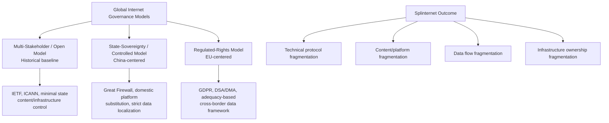

## The Splinternet and Competing Digital Governance Models

### Definitional Framework

The "splinternet" (a portmanteau of "splinter" and "internet") refers to the fragmentation of the historically unified global internet into a collection of increasingly separate, jurisdictionally bounded digital spaces, each governed by distinct national or regional technical standards, content regulation, data governance rules, and, in some cases, physically or logically segmented network infrastructure. This represents a reversal of the internet's founding architectural and governance philosophy — a single, interoperable, borderless network built on common technical protocols (TCP/IP, DNS) and historically governed through multi-stakeholder rather than purely state-centric institutions. The splinternet concept is the culminating synthesis point for this chapter's other digital infrastructure topics: data localization, cloud sovereignty, submarine cable ownership concentration, and AI compute geopolitics are each, in different ways, contributing forces driving this broader fragmentation.

### Historical Governance Baseline: The Multi-Stakeholder Internet Model

**Key Points**

- The internet's technical governance has historically operated through a multi-stakeholder model, distinct from traditional state-centric international governance, involving technical standards bodies (the Internet Engineering Task Force, IETF), the domain name and numbering system authority (the Internet Corporation for Assigned Names and Numbers, ICANN, operating under contract with the U.S. government until a 2016 transition to a fully multi-stakeholder governance structure), and regional internet registries, alongside civil society, private sector, and government participants collectively, rather than through a single international treaty body analogous to, for example, the International Telecommunication Union's role in traditional telecommunications.
- This governance model reflected an underlying assumption, prevalent particularly through the 1990s and 2000s, that a globally unified, minimally state-regulated internet would best serve both economic and democratic values simultaneously — an assumption increasingly contested by a growing number of governments asserting that national sovereignty, security, and cultural/political control require greater state authority over digital infrastructure and content within their borders.

### Three Broad Competing Governance Models

### Model 1: The Multi-Stakeholder / Open Internet Approach

Associated historically with the United States and, to varying degrees, many Western democracies, this model favors minimal state control over internet infrastructure and content, private-sector-led technical governance, and cross-border data and information flow as a presumptive default. Even within this broad category, meaningful policy divergence exists — the U.S. has historically favored a lighter-touch content regulation approach relative to European approaches, discussed below, though this is a matter of degree rather than a clean binary distinction between "open" and "controlled" governance philosophies.

### Model 2: The State-Sovereignty / Controlled Internet Model (China)

**Key Points**

- China's internet governance model, most visibly embodied in the technical content-filtering system commonly termed the "Great Firewall," combines technical blocking of foreign platforms and content, mandatory data localization (covered in prior content in this chapter), domestic platform substitution (WeChat, Baidu, Weibo, and other domestic platforms serving functions performed by blocked foreign services elsewhere), and legal frameworks compelling domestic and, in some interpretations, foreign entities operating within China to cooperate with state security and intelligence requests.
- This model reflects an explicit governance philosophy prioritizing state control over information flow, platform content, and data as instruments of political stability, cultural sovereignty, and national security, distinct from — and in direct tension with — the multi-stakeholder open-internet philosophy.
- China has also actively promoted this governance philosophy internationally, including through technical standards advocacy in international bodies and through digital infrastructure export (e.g., "safe city" surveillance technology and internet governance technical assistance provided to other countries, particularly in contexts where recipient governments similarly prioritize state information control), functioning as a form of digital governance model export analogous to how telecommunications equipment vendor selection (covered in the Huawei content) carries embedded governance-philosophy implications.

### Model 3: The Regulated-Rights Model (European Union)

**Key Points**

- The EU has developed a distinct governance approach that neither fully embraces the historical open multi-stakeholder model's minimal regulation nor adopts the Chinese model's direct state content/platform control, instead pursuing comprehensive rights-based regulatory frameworks applied to a nominally still-open internet: the General Data Protection Regulation (GDPR, covered in the data localization content) for personal data, the Digital Services Act (DSA) governing platform content moderation obligations and algorithmic transparency, and the Digital Markets Act (DMA) addressing competition and interoperability obligations for large "gatekeeper" platforms.
- This model is sometimes described as pursuing "digital sovereignty" through comprehensive regulation and standard-setting rather than through direct state content control or infrastructure ownership, aiming to shape how global platforms operate *within* EU jurisdiction through binding legal obligations with extraterritorial reach for any platform serving EU users, regardless of where that platform is headquartered.
- Because major global platforms generally choose to comply with EU regulatory requirements for their EU-facing operations rather than exit the large EU market, EU regulation has produced what analysts term the "Brussels Effect" — a phenomenon where EU regulatory standards become de facto global standards because platforms find it more efficient to apply EU-compliant practices globally rather than maintain separate compliance architectures for different markets, representing a form of governance influence exercised through market size and regulatory design rather than through technical infrastructure control or explicit international coordination.

### Technical Fragmentation Beyond Governance Philosophy

**Key Points**

- Beyond differing content and data governance philosophy, technical-layer fragmentation has also emerged, including divergent approaches to core internet protocols and addressing (some countries have explored or implemented alternative domain name resolution systems operating partially outside the global ICANN-coordinated Domain Name System), and differing technical standards adoption creating potential interoperability friction at the network protocol level, distinct from the higher-level content/platform/data governance fragmentation discussed above. [Unverified: the practical extent and current operational status of alternative DNS root systems varies and should be verified against current technical reporting, as this remains a narrower and more technically contested phenomenon than the broader governance-level splinternet trends]
- Submarine cable routing and landing infrastructure decisions (covered earlier in this chapter) increasingly reflect and reinforce governance fragmentation, as some new cable systems are explicitly routed to avoid landing in or transiting jurisdictions perceived as high political or security risk, gradually reshaping the physical topology of global connectivity along geopolitical alignment lines rather than purely commercial or geographic efficiency considerations.

### Case Study: Platform-Level Fragmentation

The practical, user-facing manifestation of splinternet dynamics is most visible in platform availability: a substantial share of globally dominant Western social media, search, and e-commerce platforms are inaccessible or heavily restricted within China, while some jurisdictions have at various points restricted or banned specific foreign applications on national security or data-sovereignty grounds (for example, multiple governments have restricted government-device use of, or in some cases broader public access to, applications such as TikTok, citing concerns about foreign government data access analogous to those discussed in the cloud computing strategic asset content regarding CLOUD Act and equivalent foreign legal access frameworks). This illustrates that platform-level fragmentation operates through both restrictive state action (blocking foreign platforms) and reciprocal restriction (foreign governments restricting platforms headquartered in jurisdictions of security concern), producing an increasingly bidirectional pattern of digital market access fragmentation.

### Economic and Innovation Consequences

**Key Points**

- **Reduced economies of scale**: Technology firms increasingly must design products, comply with regulatory regimes, and in some cases build entirely separate technical infrastructure to serve fragmented jurisdictional markets rather than deploying a single global architecture, increasing development and compliance costs relative to the historical unified-internet baseline — directly paralleling the infrastructure duplication costs discussed in the data localization content.
- **Divergent innovation trajectories**: Some analysts argue that governance fragmentation is producing genuinely divergent technology development trajectories between major digital blocs (for example, differing approaches to AI model development and deployment between U.S., Chinese, and European regulatory and infrastructure environments, connecting directly to the "fracturing global AI stack" dynamic discussed in the AI compute geopolitics content), rather than a single global technology frontier that all jurisdictions merely regulate differently.
- **Trade and diplomatic friction**: Digital governance fragmentation has become a recurring subject of trade negotiation and diplomatic friction, as differing data flow, content moderation, and platform liability rules across jurisdictions create compliance complexity and, in some cases, direct trade barriers for cross-border digital commerce.

### Comparative Table: Governance Model Characteristics

| Dimension | Multi-Stakeholder Model | State-Sovereignty Model (China) | Regulated-Rights Model (EU) |
| --- | --- | --- | --- |
| Primary governance mechanism | Technical standards bodies, light-touch state regulation | Direct state control, technical filtering | Comprehensive rights-based regulation |
| Cross-border data flow default | Generally open | Highly restricted | Conditional (adequacy-based) |
| Foreign platform access | Generally open | Heavily restricted/blocked | Open but subject to compliance obligations |
| Primary influence mechanism | Technical standard-setting, market dominance | Direct control + international model export | Regulatory extraterritoriality ("Brussels Effect") |
| Content moderation approach | Primarily platform self-governance (with variation) | State-directed content control | Platform obligations under DSA with regulatory oversight |

### Systemic Lessons

**Conclusion**

The splinternet represents the aggregate, system-level outcome of the individually significant but analytically separable trends covered throughout this chapter: data localization policy, cloud and AI compute sovereignty initiatives, submarine cable ownership and routing decisions, and telecommunications equipment vendor restrictions each independently contribute to a cumulative fragmentation of what was originally designed as a single global technical and commercial infrastructure. The three competing governance models — open multi-stakeholder, state-sovereignty, and regulated-rights — reflect fundamentally different philosophical premises about the proper relationship between state authority, individual rights, and digital infrastructure, and this chapter's analysis suggests no clear convergence toward a single dominant model is likely in the foreseeable term; rather, the more probable trajectory, based on trends already documented across this chapter's content, is continued deepening fragmentation, with individual countries and blocs increasingly required to make explicit governance-alignment choices (which cloud sovereignty framework, which AI model stack, which submarine cable consortium, which telecommunications equipment vendor) that were previously treated as purely commercial or technical decisions but now carry significant geopolitical alignment weight. This connects the splinternet phenomenon directly back to the pharmaceutical and physical supply chain themes from earlier in this course: just as pharmaceutical manufacturing onshoring and PPE supply diversification represent a deliberate trade of efficiency for resilience and sovereignty in physical goods, the splinternet represents the same fundamental trade-off applied to digital infrastructure and information flow.

**Next Steps**

- ICANN multi-stakeholder governance transition (2016) and ongoing internet governance institutional design debates
- China's Great Firewall technical architecture and domestic platform substitution ecosystem
- EU Digital Services Act (DSA) and Digital Markets Act (DMA) enforcement mechanics
- The "Brussels Effect" as a regulatory influence model and its limits
- TikTok/ByteDance restrictions as a case study in platform-level splinternet dynamics
- Alternative DNS root systems and technical-layer internet fragmentation risk
- Comparative analysis: splinternet dynamics versus physical supply chain onshoring/friend-shoring trends
- International Telecommunication Union's role and relationship to multi-stakeholder internet governance
- Fracturing global AI model stack as a splinternet-adjacent technology divergence phenomenon