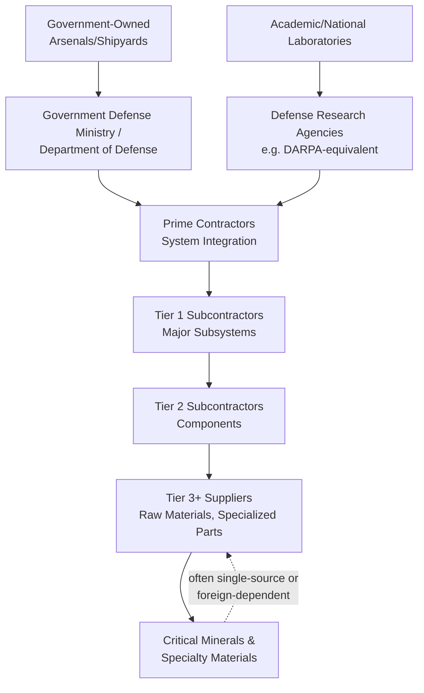

## The Structure of National Defense Industrial Bases

### Definitional Framework

A national defense industrial base (DIB) refers to the complete ecosystem of government, industrial, academic, and commercial entities that research, develop, design, manufacture, and sustain military equipment, weapons systems, and defense-related materiel for a nation's armed forces. This ecosystem is distinguished from ordinary industrial supply chains by several structural features: a single dominant customer (the national government, typically through a defense ministry), long procurement and program timelines often spanning decades, security classification constraints on information sharing, and, in most nations, active government intervention in market structure through regulation, subsidy, and export control that would be considered unusual in most civilian commercial sectors.

### Tiered Structure of a Defense Industrial Base

Defense industrial bases are conventionally analyzed through a tiered supplier structure, analogous to but distinct in governance from civilian manufacturing supply chains:

**Prime contractors** are large firms holding direct contracts with the government for complete weapons systems or platforms (aircraft, ships, armored vehicles, missile systems), responsible for overall system integration and typically possessing the organizational scale to manage complex, multi-decade programs and substantial security clearance and compliance infrastructure.

**Tier 1 and Tier 2 subcontractors** supply major subsystems (engines, avionics, radar systems, munitions) and components respectively, often specialized firms with deep technical expertise in a narrower domain than prime contractors, but frequently exhibiting significant market concentration themselves — many critical subsystem categories are supplied by only a small number of qualified firms globally, or even nationally.

**Lower-tier suppliers** provide raw materials, specialty chemicals, castings, forgings, and highly specialized components, a tier where supply chain visibility for the government customer is typically weakest, and where single-source dependency risk is most acute and least monitored, a dynamic structurally analogous to the pharmaceutical API/KSM visibility gap discussed in the onshoring content earlier in this course.

### Ownership and Governance Models Across Countries

**Key Points**

- **United States**: Predominantly a privatized model, where prime contractors (Lockheed Martin, Boeing, Northrop Grumman, RTX/Raytheon, General Dynamics being the most prominent) are publicly traded commercial entities operating under extensive government regulation (notably the Federal Acquisition Regulation and Defense Federal Acquisition Regulation Supplement) rather than government-owned enterprises, though the government retains ownership of certain specialized facilities (e.g., some ammunition production facilities operated under government-owned, contractor-operated, GOCO, arrangements).
- **China**: Predominantly a state-owned enterprise model, with major defense conglomerates (e.g., China North Industries Group, China State Shipbuilding Corporation, Aviation Industry Corporation of China) organized as large state-owned enterprises under direct or indirect state ownership and central government coordination, reflecting a governance philosophy that treats defense-industrial capacity as inherently a state function rather than a regulated private commercial activity.
- **Russia**: Similarly organized around state-owned or state-controlled defense conglomerates (e.g., Rostec), reflecting historical Soviet-era industrial organization patterns that persisted through post-Soviet economic transition in the defense sector specifically, even as other sectors of the Russian economy underwent more extensive privatization.
- **European nations**: A mixed model varies by country, with some maintaining significant state ownership stakes in major defense firms (e.g., French government ownership stakes in Thales and historical involvement in Airbus's defense division) alongside private commercial defense firms, and significant cross-border European defense industrial collaboration (e.g., Airbus's multinational European ownership structure, and joint procurement/development programs coordinated through mechanisms such as the European Defence Fund).
- This ownership-model variation matters for supply chain security analysis because it shapes the incentive structure governing production capacity decisions: privatized models generally optimize for shareholder returns and face market-driven pressure toward lean, just-in-time production models (with resulting surge-capacity limitations, discussed below), while state-owned models can, in principle, be directed to maintain excess capacity or accept lower commercial efficiency for strategic resilience reasons, though state ownership does not automatically guarantee this outcome in practice. [Inference: the relative practical resilience performance of privatized versus state-owned defense industrial models is a genuinely contested empirical question rather than a settled finding, since both models have exhibited surge-capacity shortfalls in various documented instances]

### The Surge Capacity Problem

**Key Points**

- A defining structural challenge across nearly all modern defense industrial bases is the tension between peacetime production efficiency and wartime surge capacity requirements: decades of post-Cold War defense budget consolidation in many Western nations drove significant defense-industrial consolidation (a substantial reduction in the number of independent prime contractors and specialized subcontractors through mergers and acquisitions during the 1990s in particular) and adoption of lean, just-in-time manufacturing practices optimized for predictable peacetime procurement volumes rather than the ability to rapidly multiply production output during a sustained conflict.
- This structural vulnerability was highlighted prominently by the sustained high-intensity artillery and munitions expenditure rates observed in the Russia-Ukraine conflict beginning in 2022, which substantially exceeded the peacetime production capacity assumptions embedded in most NATO members' existing munitions manufacturing base, exposing a significant gap between ammunition stockpile levels, planned replenishment rates, and actual sustained-conflict consumption rates.
- Rebuilding surge production capacity for munitions and other high-consumption-rate defense materiel has proven to be a multi-year undertaking in most cases, since it typically requires new specialized production line construction, workforce training and certification (particularly for specialized munitions and propellant manufacturing processes involving distinct safety and quality-control requirements), and re-establishing or expanding supplier relationships for specialized raw materials and precursor chemicals that had themselves experienced capacity reduction during the same post-Cold War consolidation period.

### Critical Minerals and Materials Dependency

**Key Points**

- Modern defense systems depend heavily on specialized materials, particularly rare earth elements (used in magnets for guidance systems, radar, and electric motors), specialty alloys, and certain semiconductor categories, many of which exhibit significant single-country supply concentration risk analogous to, but in some respects more acute than, the pharmaceutical API concentration risk discussed earlier in this course.
- China holds a dominant position in global rare earth element mining and, particularly, processing/refining capacity (processing capacity being an even more concentrated chokepoint than raw mining, since rare earth processing is a technically complex and environmentally intensive process that many countries with raw deposits have not developed domestic capacity to perform), creating a structurally significant dependency for defense industrial bases in the U.S., Europe, and allied nations on a strategic competitor for a category of inputs with no readily available substitute for many defense applications.
- This dependency has prompted policy responses structurally similar to pharmaceutical onshoring efforts covered earlier in this course: government subsidy and guaranteed-procurement support for domestic and allied-country rare earth mining and processing capacity development, recognizing that market-driven investment alone has been insufficient to offset the cost advantages of established Chinese processing infrastructure.

### Comparative Table: National DIB Governance Models

| Country/Region | Ownership Model | Key Characteristic | Primary Resilience Mechanism |
| --- | --- | --- | --- |
| United States | Predominantly privatized primes, some GOCO facilities | Extensive federal acquisition regulation, market consolidation post-Cold War | Defense Production Act authority, strategic stockpiles |
| China | State-owned enterprise conglomerates | Direct state coordination and ownership | Centralized state direction of capacity |
| Russia | State-owned/controlled conglomerates (e.g., Rostec) | Soviet-era industrial legacy structure | State-directed capacity allocation |
| European Union (mixed) | Mixed state/private, cross-border collaboration | Fragmented national markets, growing EU-level coordination | European Defence Fund, joint procurement initiatives |

### The Prime Contractor Consolidation Dynamic

**Key Points**

- The U.S. defense industrial base underwent especially significant consolidation following the end of the Cold War, driven partly by explicit government encouragement (the U.S. Department of Defense actively encouraged industry consolidation in the early-to-mid 1990s, in a period sometimes referred to informally as the "Last Supper" following a 1993 meeting where Pentagon officials signaled support for consolidation to defense industry executives), reducing the number of major prime contractors substantially from the larger number that existed during peak Cold War-era defense spending.
- This consolidation produced efficiency benefits (reduced excess capacity relative to reduced post-Cold War defense budgets) but also produced the resilience trade-off discussed above, and has additionally raised recurring antitrust and single-source-dependency concerns for specific weapons system categories where consolidation has left the government with effectively only one or two qualified domestic suppliers, limiting competitive procurement leverage and creating acute single-point-of-failure risk should that sole remaining supplier experience a production disruption.

### Systemic Lessons

**Conclusion**

The structure of national defense industrial bases illustrates a distinctive variant of the broader supply chain resilience-versus-efficiency tension recurring throughout this course, distinguished by the fact that the primary customer is also, uniquely, the entity most responsible for the regulatory and structural environment shaping industry consolidation, capacity planning, and resilience investment incentives. Unlike pharmaceutical or PPE supply chains, where market-driven cost minimization was the primary force driving vulnerable concentration, defense industrial base fragility often resulted from a more deliberate policy choice (post-Cold War consolidation encouragement) made under different threat assumptions than those prevailing today, illustrating that supply chain vulnerability can emerge not only from unexamined market dynamics but from previously reasonable strategic policy choices that did not anticipate subsequent shifts in the geopolitical threat environment, such as the sustained high-intensity conventional conflict scenario that the Russia-Ukraine war has forced Western defense planners to re-confront after decades of counterinsurgency-focused and comparatively lower-consumption-rate operational assumptions.

**Related Topics**

- Defense Production Act authority and its application to munitions and critical minerals capacity
- Rare earth element mining and processing concentration in China and allied-country alternatives
- Russia-Ukraine conflict munitions consumption rates and NATO production capacity gaps
- European Defence Fund and cross-border EU defense industrial collaboration mechanisms
- 1993 "Last Supper" consolidation and its long-term structural effects on U.S. prime contractors
- Government-owned, contractor-operated (GOCO) facility model for munitions production
- Single-source and sole-source supplier risk in specialized weapons subsystems
- Comparative analysis: defense industrial base resilience versus pharmaceutical manufacturing onshoring
- Rostec and Chinese state-owned defense conglomerate organizational structure