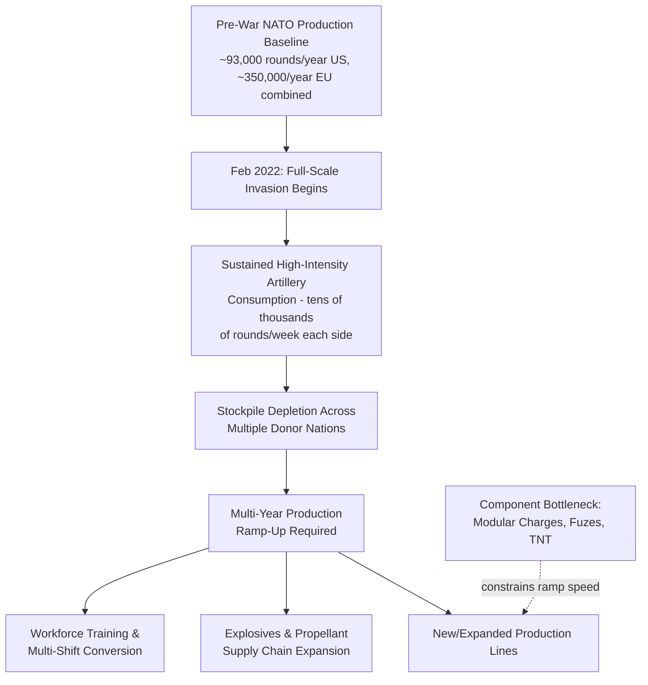

## Munitions Production Capacity and Lessons from the Ukraine War

### Definitional Framework

This topic examines how the sustained, high-intensity conventional warfare of the Russia-Ukraine conflict (beginning February 2022) exposed a critical mismatch between the peacetime munitions production capacity that NATO and allied defense industrial bases had maintained and the actual consumption rates of sustained artillery-centric conventional warfare, providing the most consequential real-world stress test of the "surge capacity problem" introduced in the defense industrial base structure content earlier in this chapter. Munitions production specifically — as distinct from complex weapons platforms — offers a particularly clear case study because artillery shells are a relatively standardized, high-volume-consumption item whose production economics and bottlenecks are more directly comparable across countries and time periods than complex integrated weapons systems.

### The Pre-War Capacity Baseline

**Key Points**

- Before 2022, most NATO members had wound artillery-shell production down to near-minimum levels, reflecting the post-Cold War defense-industrial consolidation and lean-manufacturing dynamics discussed in the defense industrial base structure content. U.S. annual 155mm shell output stood at roughly 93,000 rounds in early 2022 — equivalently, U.S. production was running at approximately 14,000 units per month before Russia's invasion, a volume that a sustained high-intensity fight could burn through in a matter of weeks rather than years.
- European production lines were in a similarly reduced state: mostly single-shift, order-driven, low-capacity production, with combined European 155mm output before the war estimated at roughly 300,000–400,000 shells per year in aggregate.
- This capacity reduction reflected three decades of shrinking forging capacity for shell bodies and explosives/propellant supply chains, meaning that converting factories to continuous, multi-shift wartime output required years rather than months once the war began — the same structural surge-capacity lag identified conceptually in the defense industrial base content, now empirically demonstrated at scale.

### Consumption Rates Versus Production Capacity

Both countries in the conflict have relied heavily on Soviet-derived artillery doctrine emphasizing high-volume fires, with Russia reportedly firing around 10,000 rounds daily and Ukraine approximately 2,000 daily during significant periods of the conflict, rates that made the outcome heavily dependent on which side could sustain its artillery usage over time — figures that dramatically illustrate the gap between a roughly 93,000-round annual pre-war U.S. production baseline and single-day consumption rates in the thousands.

### The Multi-Year Ramp-Up: U.S. Experience

**Key Points**

- The Pentagon set out to expand American 155mm production capacity from approximately 14,000 units per month before the invasion to a goal of 100,000 rounds per month by 2025, illustrating the scale of the required ramp-up (roughly a sevenfold increase).
- Achieving this goal proved directly dependent on sustained supplemental funding: as of early 2024, the U.S. was producing approximately 28,000 155mm rounds per month, with a ramp-up plan targeting 70,000–80,000 rounds per month by the end of 2024, but defense officials indicated that production would plateau short of the 100,000/month goal absent additional congressional supplemental funding — illustrating that production capacity expansion in a democratically governed, budget-appropriation-dependent system is vulnerable to political and fiscal process delays distinct from the underlying industrial engineering timeline itself.
- The U.S. and its allies collectively sent more than 2 million rounds of 155mm artillery ammunition to Ukraine by the point these figures were reported, drawing down existing NATO member stockpiles substantially faster than peacetime production had been designed to replenish.

### The European Ramp-Up and Component Bottlenecks

**Key Points**

- European combined 155mm production reached approximately 1.2–1.3 million shells per year by the end of 2025, up from roughly 300,000–400,000 before the war — approximately a fourfold increase driven by emergency EU funding and military contracts, though this fell short of earlier public targets (EU officials had projected reaching 1.7 million shells annually by the end of 2024, a target not achieved on the original timeline).
- A critical and frequently underappreciated finding from the European ramp-up experience is that shell body forging capacity was not the only, or even necessarily the primary, bottleneck: full artillery rounds also require explosives, initiators, and modular charges, and limited access to these components significantly constrained production increases even where shell-casing manufacturing capacity existed. French explosives producer Eurenco, described as the European leader in this specific niche and a supplier to major manufacturers including Rheinmetall, KNDS France, and MSM, reported it could supply modular charges (the explosive propellant charge that fires the shell from the barrel) for only up to half a million artillery shells in a given year, illustrating that gunpowder and TNT production capacity — concentrated among very few remaining European producers — functioned as a more binding constraint than casing manufacture itself.
- This component-level bottleneck finding reinforces a structural pattern observed throughout this course's supply chain content generally (pharmaceutical KSM/API tiers, semiconductor manufacturing equipment): the most restrictive chokepoint in a multi-tier supply chain is frequently not the most visible or most publicly discussed final-assembly stage, but a narrower, less visible upstream input (explosives/propellant chemistry, in this case) that received less dedicated capacity investment during the preceding decades of demand reduction.

### 2026 Status: Continued Capacity Expansion and Persistent Gaps

**Key Points**

- By 2026, Rheinmetall stated it could produce up to 100,000 extended-range 155mm artillery shells annually, a figure the company itself situated against Ukraine's estimated requirement of 1.2 million rounds per year — illustrating that even substantially expanded single-manufacturer capacity remains a small fraction of estimated wartime demand from a single conflict, with Rheinmetall separately targeting an increase in total annual production capacity to approximately 1.5 million 155mm shells by 2030, indicating that even leading manufacturers regard full capacity alignment with demand as a multi-year-to-decade undertaking rather than an achievable near-term outcome.
- Allied nations have pursued production dispersal and transatlantic industrial integration as a resilience strategy: a 2026 agreement establishes local manufacture of 155mm ammunition in Poland with a targeted output exceeding 180,000 rounds per year, leveraging Australian Munitions (ADI) for projectile bodies, with production nodes inside the EU specifically valued for regulatory alignment, transport efficiency, and political acceptability considerations distinct from pure unit-cost optimization — reflecting the same efficiency-versus-resilience trade-off, and the same friend-shoring logic, discussed in the pharmaceutical onshoring content earlier in this course. Qualification testing (ballistic testing, metallurgical validation, NATO standards compliance) remained a significant 2026 milestone before large-scale deliveries from this new line could begin, underscoring that even well-funded new production lines face a multi-year technical qualification runway before reaching operational output.
- The United Kingdom's 2026 155mm capacity is estimated at approximately 200,000–250,000 shells per year, described as modest by European standards but supporting both UK stockpile replenishment and continued Ukraine contributions, illustrating substantial capacity variation even among committed NATO allies.
- Smaller NATO members have made disproportionately significant contributions relative to their size: Norway's Nammo (a Norway-Finland joint venture) has expanded 155mm and smaller-caliber production significantly, illustrating that resilience in alliance-level munitions supply depends on aggregating capacity contributions across many mid-sized national producers rather than depending solely on the largest members.

### The Extra-NATO Supplier Dimension: South Korea

**Key Points**

- South Korea has emerged as the most significant extra-NATO ammunition supplier to Ukraine (through both direct and indirect channels), with South Korean producers, notably Hanwha Defense, maintaining an estimated 1–2 million rounds per year of 155mm production capacity — capacity originally developed to supply South Korea's own large domestic artillery force (the K9 Thunder self-propelled howitzer being South Korea's primary artillery export platform) rather than built specifically in response to the Ukraine conflict.
- This illustrates an important resilience lesson distinct from the NATO-internal capacity-building narrative: South Korea's peacetime defense posture, shaped by its own distinct and enduring security threat environment (sustained confrontation with North Korea), had maintained a much larger standing artillery production base than most NATO members had judged necessary during the post-Cold War period, meaning South Korea's available surge contribution to the Ukraine conflict was less a matter of emergency wartime ramp-up and more a matter of a pre-existing, differently-motivated capacity base becoming strategically relevant to an unrelated conflict — a reminder that global alliance-level resilience benefits from capacity diversity shaped by varied national threat perceptions, not only from a single dominant power's own planning assumptions.

### Ukraine's Domestic Production Development

**Key Points**

- Ukraine itself has pursued domestic production capability development throughout the conflict as a strategy to reduce dependence on continuous Western military aid, a strategy explicitly analogous to the onshoring and resilience-through-domestic-capacity themes recurring throughout this course. Ukraine had begun developing its own 155mm-caliber artillery system (the Bohdana self-propelled howitzer, built on a domestically produced KrAZ-6322 wheeled chassis) starting in 2016, motivated by the recognition that Ukraine's inherited Soviet-caliber (122mm/152mm) systems and ammunition were produced primarily by Russia, its principal threat, and were consequently unavailable for continued procurement once the conflict began.
- NATO worked with Ukraine beginning in 2022 to establish a ten-year plan to rebuild its domestic defense industry, and Ukraine reportedly produced three times the volume of equipment in 2023 relative to 2022, indicating rapid domestic industrial mobilization, though this remained supplementary to, rather than a replacement for, continued substantial NATO-member ammunition transfers throughout the period.

### Comparative Table: 155mm Production Capacity Trajectory

| Producer/Bloc | Pre-War Baseline (~2022) | 2025–2026 Capacity | Key Constraint |
| --- | --- | --- | --- |
| United States | ~93,000 rounds/year (~14,000/month) | Ramp targeted 100,000/month; achievement contingent on supplemental funding | Congressional appropriations dependency |
| European Union (combined) | ~300,000–400,000 rounds/year | ~1.2–1.3 million rounds/year by end of 2025 | Explosives/propellant (modular charge) supply, short of original 1.7M target |
| United Kingdom | Reduced peacetime baseline | ~200,000–250,000 rounds/year | Modest scale relative to EU/US |
| South Korea (Hanwha and others) | Large pre-existing capacity (not war-driven) | Estimated 1–2 million rounds/year | Export policy and allocation decisions, not production capacity |
| Ukraine (domestic) | Minimal (test-sample Bohdana only) | Growing but still supplementary to Western transfers | Wartime industrial conditions, multi-year rebuild timeline |

### Systemic Lessons

**Conclusion**

The Ukraine war's munitions production experience provides the clearest empirically documented confirmation of the surge-capacity problem identified conceptually in the defense industrial base structure content: peacetime production baselines reduced over three decades of post-Cold War consolidation proved capable of supporting only weeks, not years, of sustained high-intensity conventional conflict consumption, and rebuilding adequate capacity has consistently taken multiple years even under conditions of substantial emergency funding and strong political will across a wide allied coalition. The most transferable technical lesson is that the binding constraint on rapid capacity expansion was frequently not the most visible manufacturing stage (shell-casing forging) but a narrower upstream component bottleneck (explosives and propellant chemistry) that had received even less sustained peacetime investment — directly paralleling the meltblown-fabric bottleneck in PPE production and the KSM/API bottleneck in pharmaceutical manufacturing covered earlier in this course. The alliance-level resilience lesson is equally significant: aggregate NATO-plus-partner capacity substantially exceeds any single member's individual capacity, meaning genuine munitions resilience depends on coordinated multinational capacity-building and burden-sharing (exemplified by Poland's joint production line, Norway's Nammo expansion, and South Korea's extra-alliance contribution) rather than any single nation's production capability considered in isolation — though even the aggregate figures achieved by 2026 remained well short of the full estimated wartime demand of a single sustained conflict, underscoring that this resilience gap, while narrowing, had not been closed even four years into the war.

**Related Topics**

- Explosives and propellant chemical supply chains (TNT, gunpowder) as a hidden munitions bottleneck
- Rheinmetall, KNDS, and European prime contractor capacity expansion investment programs
- South Korea's K9 Thunder export ecosystem and Hanwha Defense production scale
- NATO-Ukraine ten-year defense industrial rebuilding plan
- U.S. congressional supplemental funding dependency and defense production planning risk
- Poland/U.S. joint 155mm production line and transatlantic industrial dispersal strategy
- Comparative analysis: munitions surge capacity versus pharmaceutical/PPE surge capacity lessons
- Multi-shift industrial conversion timelines and workforce training constraints in munitions manufacturing
- Bohdana howitzer program as a case study in wartime domestic defense industrial development