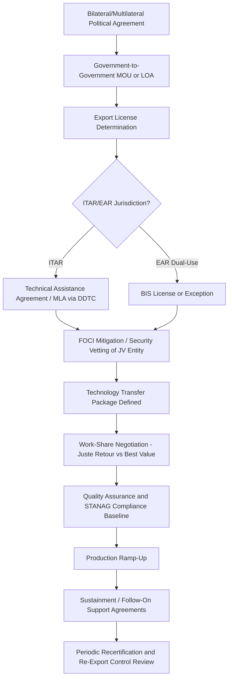

## Allied Defense Industrial Cooperation and Co-Production Agreements

### Overview

Allied defense industrial cooperation encompasses the institutional, legal, and technical frameworks through which states pool defense-industrial capacity to reduce unit costs, ensure supply security, strengthen interoperability, and bind coalition partners together through mutual industrial dependency. Co-production agreements represent the most integrated form of this cooperation, in which a licensing state permits a partner nation's domestic industry to manufacture all or part of a weapon system under license, as opposed to simple government-to-government (G2G) or direct commercial sale (DCS) of finished platforms.

These arrangements sit at the intersection of alliance strategy, industrial policy, export control law, and supply chain risk management. They are a central mechanism by which supply chains for military hardware are geographically distributed among trusted partners rather than concentrated in a single sovereign production base.

### Taxonomy of Cooperative Arrangements

**Key Points**

- **Licensed production**: Partner nation manufactures the system domestically under a technology license from the originating firm/state, typically with royalty payments and technical assistance packages.
- **Co-production**: A deeper variant of licensed production where multiple nations jointly manufacture components or subassemblies of the same program, often with cross-servicing of parts (e.g., F-16 European co-production line in the 1970s–80s).
- **Co-development**: Partners share R&D costs and technical risk from the design phase onward, producing a jointly-owned intellectual property baseline (e.g., Eurofighter Typhoon, FCAS/SCAF, GCAP).
- **Offsets and industrial participation (IP) agreements**: Contractual requirements, often politically mandated, that a percentage of contract value be reinvested in the buyer's domestic industrial base through subcontracts, technology transfer, or unrelated counter-trade.
- **Foreign Military Sales (FMS) with co-production riders**: U.S. FMS cases that include follow-on domestic production authorization (e.g., South Korea's KF-21 program drawing on F-35 co-development lessons, though KF-21 itself is indigenous).
- **Second-source manufacturing**: Establishing an alternate production line in an allied country purely for supply chain resilience/surge capacity, without necessarily transferring full IP.

### Legal and Regulatory Architecture

Co-production agreements do not exist in a vacuum; they are constrained by a layered legal architecture:

1. **Export control regimes**: In the U.S. context, the International Traffic in Arms Regulations (ITAR) administered by the Department of State's Directorate of Defense Trade Controls (DDTC), and the Export Administration Regulations (EAR) for dual-use items administered by the Department of Commerce's Bureau of Industry and Security (BIS).
2. **Technical Assistance Agreements (TAAs)** and **Manufacturing License Agreements (MLAs)**: The specific instruments under ITAR that authorize the transfer of technical data and production rights to a foreign co-producer.
3. **General Security of Military Information Agreements (GSOMIAs)** and reciprocal **Defense Trade Cooperation Treaties**: Bilateral frameworks (e.g., the U.S.–UK and U.S.–Australia Defense Trade Cooperation Treaties) that streamline licensing by exempting certain transfers from case-by-case review.
4. **AUKUS Pillar I/II export carve-outs**: The 2023–2024 amendments creating a license-free trade zone for defense articles/services among the U.S., UK, and Australia under specific eligibility criteria — a notable recent easing of the traditional case-by-case ITAR model. [Inference: the precise scope and any subsequent amendments should be verified against current DDTC guidance, as implementation rules continued to evolve through 2025.]
5. **National security vetting**: Foreign Ownership, Control, or Influence (FOCI) mitigation frameworks in the U.S., and equivalent foreign investment screening regimes (e.g., CFIUS, the UK's National Security and Investment Act) applied to joint ventures and co-production entities.
6. **NATO Standardization Agreements (STANAGs)**: Not legal instruments for IP transfer per se, but technical baselines that make co-production commercially viable by ensuring interchangeability of ammunition, fuel, communications protocols, and logistics.

### Economic Rationale

**Key Points**

- **Cost amortization**: Spreading non-recurring engineering (NRE) costs across a larger production run lowers unit cost — the classic learning-curve/economies-of-scale argument for multinational programs.
- **Burden-sharing**: Distributes the fiscal cost of maintaining a credible deterrent posture across alliance members, addressing free-rider concerns (relevant to NATO's 2%-of-GDP guidance debates).
- **Supply chain resilience**: Redundant production lines in multiple allied jurisdictions reduce single-point-of-failure risk from a single national industrial base being disrupted by conflict, natural disaster, or political embargo.
- **Political lock-in**: Co-production creates durable political-economic constituencies (jobs, supplier networks) in partner nations that reinforce alliance cohesion and make withdrawal from a program costly — sometimes termed "interoperability by design."
- **Market access and industrial upgrading**: For the junior partner, co-production is often the price of market entry, offering technology transfer, workforce skill development, and a foothold in global supply chains that pure import cannot provide.

Trade-offs include: loss of intellectual property control by the licensor; potential creation of future competitors (South Korea's aerospace sector matured partly through F-16 and F-5 co-production before launching FA-50 and KF-21); coordination costs and schedule risk from juste-retour ("fair return") politics, where work-share is allocated by national quota rather than comparative advantage — a persistent criticism of European multinational programs like the A400M and Eurofighter.

### The "Juste Retour" Problem

**Example**

The Eurofighter Typhoon consortium (BAE Systems, Airbus Defence and Space, Leonardo) allocates production work-share roughly proportional to each nation's aircraft order quantities. While this ensures political buy-in from Germany, UK, Italy, and Spain, it has been criticized for fragmenting supply chains — e.g., duplicate final assembly lines in multiple countries rather than a single optimized line — raising unit costs relative to a single-source model like the F-35's more centralized (though still multinational) production network.

### Illustrative Case Studies

**F-35 Joint Strike Fighter Global Supply Chain**

The F-35 program uses a hybrid model: final assembly occurs at three lines (Fort Worth, Texas; Cameri, Italy; Nagoya, Japan), while approximately 1,900+ suppliers across partner nations produce components based on best-value competitive selection rather than strict juste retour. Partner tiers (Level I: UK; Level II: Italy, Netherlands; Level III: Australia, Canada, Denmark, Norway, Turkey — Turkey removed in 2019 following its S-400 acquisition) determine degree of industrial participation and technology access. [Unverified: exact current supplier counts and tier assignments should be checked against Lockheed Martin/JPO current disclosures, as they shift over the program's life.]

**AUKUS Pillar I (Submarines)**

Involves not co-production in the traditional sense but a phased pathway: U.S./UK Virginia and Astute-class technology transfer, eventual UK-based SSN-AUKUS design incorporating U.S. combat systems, with construction split across UK (BAE Systems, Barrow-in-Furness) and Australian (ASC, Adelaide) yards — an unusually deep technology transfer for a naval nuclear propulsion program historically restricted under the 1958 U.S.-UK Mutual Defence Agreement lineage.

**GCAP (Global Combat Air Programme)**

UK, Italy, and Japan's sixth-generation fighter co-development program, merging the UK-Italian Tempest concept with Japan's F-X program — notable as Japan's first major co-development partnership outside the U.S., reflecting a geopolitical shift toward diversified allied industrial partnerships in the Indo-Pacific.

**Historical precedent: F-16 European Participation Program**

Belgium, Denmark, the Netherlands, and Norway co-produced components in the 1970s–80s under licensing from General Dynamics, establishing long-term aerospace supply chains in those countries that persist in today's F-35 supplier networks — illustrating how co-production creates multi-decade industrial path dependency.

### Process Flow: Establishing a Co-Production Agreement

### Supply Chain Risk Considerations

**Key Points**

- **Single-source subcomponent risk**: Even distributed final-assembly programs can retain critical single-source dependencies (e.g., specialty castings, rare-earth-dependent magnets, radiation-hardened electronics) that undermine the resilience rationale if not deliberately diversified.
- **Re-export control friction**: A partner nation manufacturing under license typically cannot re-export components or technology to third parties without originating-state consent, creating diplomatic friction when partner nations pursue independent export customers (a recurring tension in Turkish and South Korean defense export ambitions).
- **Technology leakage risk**: Co-production inherently increases the number of jurisdictions holding sensitive technical data packages, expanding the attack surface for industrial espionage — a driver of increasingly strict FOCI and personnel security requirements.
- **Political risk / sanctions exposure**: Co-production partners can be suspended from programs for geopolitical reasons independent of technical performance (Turkey's F-35 removal over the S-400 system is the canonical example), creating supply chain disruption that must be planned for contractually.
- **Currency and offset accounting complexity**: Offset valuation methodologies vary by country, complicating cost transparency and sometimes masking effective subsidization.

### Diagram: Institutional Layers Governing Co-Production (svg_diagram)

<svg xmlns="http://www.w3.org/2000/svg" viewBox="0 0 760 460" font-family="Helvetica, Arial, sans-serif">
<text x="380" y="28" text-anchor="middle" font-size="18" font-weight="bold" fill="#1a1a1a">Institutional Layers Governing Allied Co-Production (svg_diagram)</text>
<rect x="40" y="50" width="680" height="70" rx="8" fill="#dbe9f7" stroke="#2c5f8a" stroke-width="1.5" />
<text x="380" y="78" text-anchor="middle" font-size="14" font-weight="bold" fill="#1a3d5c">Strategic / Political Layer</text>
<text x="380" y="100" text-anchor="middle" font-size="12" fill="#1a3d5c">Alliance treaties, defense trade cooperation treaties, NATO/AUKUS frameworks</text>
<rect x="40" y="135" width="680" height="70" rx="8" fill="#dfeee0" stroke="#3a7d3f" stroke-width="1.5" />
<text x="380" y="163" text-anchor="middle" font-size="14" font-weight="bold" fill="#254d28">Legal / Regulatory Layer</text>
<text x="380" y="185" text-anchor="middle" font-size="12" fill="#254d28">ITAR/EAR, TAAs, MLAs, GSOMIAs, FOCI mitigation, export licensing</text>
<rect x="40" y="220" width="680" height="70" rx="8" fill="#f7ecd9" stroke="#a3762c" stroke-width="1.5" />
<text x="380" y="248" text-anchor="middle" font-size="14" font-weight="bold" fill="#5c4116">Contractual / Commercial Layer</text>
<text x="380" y="270" text-anchor="middle" font-size="12" fill="#5c4116">Licensing agreements, offset contracts, work-share allocation, JV structures</text>
<rect x="40" y="305" width="680" height="70" rx="8" fill="#f3dde0" stroke="#a13a4a" stroke-width="1.5" />
<text x="380" y="333" text-anchor="middle" font-size="14" font-weight="bold" fill="#5c1b26">Technical / Standards Layer</text>
<text x="380" y="355" text-anchor="middle" font-size="12" fill="#5c1b26">STANAGs, interoperability specs, quality assurance baselines</text>
<rect x="40" y="390" width="680" height="55" rx="8" fill="#e6e0f0" stroke="#5b3f8a" stroke-width="1.5" />
<text x="380" y="422" text-anchor="middle" font-size="14" font-weight="bold" fill="#31235c">Industrial / Production Layer</text>
<line x1="380" y1="120" x2="380" y2="135" stroke="#555" stroke-width="1.5" marker-end="url(#arrow)" />
<line x1="380" y1="205" x2="380" y2="220" stroke="#555" stroke-width="1.5" marker-end="url(#arrow)" />
<line x1="380" y1="290" x2="380" y2="305" stroke="#555" stroke-width="1.5" marker-end="url(#arrow)" />
<line x1="380" y1="375" x2="380" y2="390" stroke="#555" stroke-width="1.5" marker-end="url(#arrow)" />
</svg>

### Cost Amortization Illustration

For a program with non-recurring engineering cost $C_{NRE}$ shared among $n$ partner nations producing a combined quantity $Q$ units, the simplified per-unit cost contribution from NRE is:

$$C_{unit,NRE} = \frac{C_{NRE}}{Q}$$

Multinational participation increases $Q$ relative to a single-nation program, lowering $C_{unit,NRE}$, though this benefit is frequently offset in practice by juste-retour-driven line duplication, which raises recurring per-unit manufacturing cost $C_{unit,mfg}$ — the empirical debate in programs like Eurofighter centers on whether net unit cost $C_{unit,NRE} + C_{unit,mfg}$ is actually lower than a single-source alternative.

### Current Trends [Inference/Unverified — verify against latest policy announcements]

- Expansion of AUKUS-style license-free trade zones as a template other allied groupings may seek to replicate for faster technology sharing.
- Growing emphasis on "minilateral" co-development (GCAP, FCAS) alongside traditional NATO-wide standardization, reflecting a shift toward smaller, deeper coalitions for next-generation systems.
- Increased scrutiny of critical mineral and semiconductor sub-tier dependencies within allied co-production supply chains, driven by concerns over reliance on non-allied sources for inputs like rare earths.
- Pressure to reform offset/juste-retour practices toward "best value" competitive sourcing models, following F-35 program lessons, though political resistance from smaller industrial bases remains significant.

**Related Topics**

- Foreign Military Sales (FMS) process and Letters of Offer and Acceptance (LOA)
- ITAR/EAR jurisdictional determination and Commodity Jurisdiction requests
- NATO Standardization Agreements (STANAGs) and interoperability certification
- Offset policy design and economic impact assessment
- Foreign Ownership, Control, or Influence (FOCI) mitigation structures
- Critical minerals dependencies in allied defense supply chains
- Export control reform: AUKUS Pillar I/II license exemptions
- Juste retour vs. best-value work-share allocation models
- Defense industrial base reshoring and friend-shoring strategies
- Multinational program governance structures (OCCAR, NSPA, Joint Program Offices)