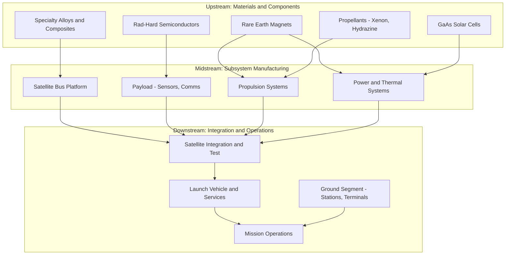

## Space Supply Chains and Satellite Manufacturing Dependencies

### Overview

Space supply chains encompass the multi-tiered industrial base required to design, manufacture, launch, and sustain satellites and associated ground infrastructure. Unlike terrestrial defense hardware, space systems combine extremely long development lead times, near-irreplaceable on-orbit assets (no field repair), and a component base drawing from a narrow set of specialized suppliers — conditions that make the sector unusually exposed to single-point-of-failure risk, export control friction, and geopolitical leverage. This topic examines the structural dependencies across the satellite value chain: raw materials, radiation-hardened electronics, propulsion, launch services, and ground segment infrastructure, and how these dependencies intersect with great-power competition.

### Structure of the Satellite Value Chain

**Key Points**

- **Upstream (materials/components)**: Specialty alloys, composite structures, radiation-hardened (rad-hard) semiconductors, precision optics, solar cells, and propellants.
- **Midstream (subsystem manufacturing)**: Bus (platform) manufacturing, payload integration, propulsion systems, attitude control, power systems, thermal management.
- **Downstream (integration/launch/operations)**: Satellite integration and test (I&T), launch vehicle manufacturing and services, ground station networks, mission operations centers, and end-user terminals.

Each tier has distinct dependency profiles, and vulnerabilities compound across tiers — a rad-hard chip shortage at the upstream level can stall an entire constellation program regardless of downstream launch capacity.

### Critical Chokepoints

**Radiation-Hardened Microelectronics**

Rad-hard chips must withstand total ionizing dose, single-event effects, and displacement damage from the space radiation environment. Fabrication requires specialized foundry processes distinct from commercial semiconductor lines, and the qualified supplier base is extremely narrow — historically concentrated among a small number of U.S. (e.g., BAE Systems Electronic Systems, Honeywell Aerospace) and European (e.g., STMicroelectronics-affiliated programs) foundries, with additional capacity emerging in allied nations. [Inference: exact current market share figures should be verified, as this segment shifts with periodic re-qualification of foundry lines and new entrants.] This concentration makes rad-hard electronics one of the most acute chokepoints in the entire space supply chain, comparable in strategic sensitivity to advanced-node semiconductors in the broader dual-use technology base.

**Specialty Materials**

- **Solar cell materials**: High-efficiency multi-junction gallium arsenide (GaAs) solar cells depend on germanium substrates and III-V compound semiconductor fabrication, concentrated among a small number of specialized producers globally.
- **Rare earth elements**: Used in satellite reaction wheels, actuators, and traveling-wave tube amplifiers (magnets); subject to the same rare-earth supply concentration risk (dominated by Chinese processing capacity) affecting broader defense electronics.
- **Composite structures and specialty alloys**: Carbon fiber composites and titanium/aluminum-lithium alloys for satellite buses draw on the same aerospace materials base as military and commercial aviation, creating cross-sector demand competition.

**Propulsion**

Electric propulsion (Hall-effect and ion thrusters) and chemical propulsion systems depend on specialized propellant supply chains (e.g., xenon gas, hydrazine derivatives) and precision manufacturing of thrusters — xenon in particular has experienced periodic global supply tightness given its status as a byproduct of air separation processes with limited dedicated production capacity. [Unverified: current xenon market conditions should be checked, as pricing and availability have historically been volatile and sensitive to geopolitical disruptions, including past Russia-linked supply concerns.]

**Launch Services**

Access to space is itself a chokepoint: nations without independent heavy-lift launch capability depend on a small number of launch service providers (SpaceX, Arianespace, ULA, and state launch providers such as Roscosmos, CASC, and ISRO), creating strategic dependency for satellite operators lacking sovereign launch access. Post-2022 sanctions on Russian launch services (e.g., loss of Soyuz access for European institutional payloads) illustrate how launch dependency translates directly into program delay risk.

### Dependency Map

### Export Control Framework for Space Systems

Satellite and space technology transfer in the U.S. is governed primarily by:

- **ITAR (Category XV — Spacecraft Systems)**: Historically the default jurisdiction for nearly all satellite hardware and technical data, reflecting Cold War-era treatment of satellites as inherently military-relevant technology.
- **2013 Export Control Reform**: Shifted many commercial communications satellites and components from ITAR to the more permissive EAR (Commerce Control List), following congressional authorization — a significant liberalization intended to help U.S. commercial satellite manufacturers compete internationally without undermining control over genuinely sensitive systems (e.g., remote sensing with military-relevant resolution, protected communications).
- **Missile Technology Control Regime (MTCR)**: Constrains transfer of technology applicable to systems capable of delivering weapons of mass destruction, directly affecting launch vehicle and certain propulsion technology transfers given the dual-use overlap between space launch vehicles and ballistic missiles.
- **Wassenaar Arrangement**: Multilateral export control regime covering dual-use goods and technologies, including certain space-related items, coordinated among member states.

The dual-use nature of nearly all satellite technology — a communications satellite bus is structurally similar whether serving commercial broadband or military SATCOM — means classification determinations (ITAR vs. EAR, and CCL classification level) have outsized influence on which nations can participate in a given supply chain.

### Case Studies

**GPS III and Rad-Hard Component Sourcing**

Military GPS satellite programs require rad-hard processors and radiation-tolerant components sourced from a vetted, security-cleared supplier base, illustrating how national security space programs maintain parallel, more restricted supply chains distinct from the commercial small-satellite sector, which increasingly uses commercial-off-the-shelf (COTS) components with radiation mitigation via software/redundancy rather than hardened silicon.

**Starlink and Vertical Integration as Supply Chain Strategy**

SpaceX's Starlink program pursues extensive vertical integration — in-house manufacture of satellite buses, phased-array antennas, and reusable launch vehicles — explicitly to reduce dependency on external suppliers and control production cadence at a scale (thousands of satellites) that a traditional multi-tier supplier network would struggle to support. This represents a structurally different supply chain philosophy from traditional exquisite, low-volume military satellite programs.

**European Strategic Autonomy in Launch**

The European Space Agency's Ariane 6 program and associated European launcher strategy reflect a deliberate policy objective to maintain sovereign launch access independent of both U.S. commercial providers and (post-2022) Russian launch services, following the loss of Soyuz access — illustrating how launch dependency is treated as a strategic autonomy issue by allied but non-U.S. actors. [Inference: current Ariane 6 operational cadence and any continuing reliance on non-European components should be verified against latest ESA program status.]

**China's Space Industrial Base Consolidation**

China has pursued state-directed consolidation of its space industrial base (China Aerospace Science and Technology Corporation, CASC, and China Aerospace Science and Industry Corporation, CASIC) to achieve supply chain self-sufficiency across launch, satellite manufacturing, and ground systems, reducing dependency on foreign components partly in response to export control restrictions imposed by the U.S. and allies.

### Risk Assessment Framework

**Key Points**

- **Single-source dependency risk**: Map each subsystem to its qualified supplier count; components with only one or two qualified sources (common for rad-hard parts) represent acute program risk.
- **Foreign dependency risk**: Assess reliance on non-allied nations for critical inputs (e.g., rare earth processing, certain optical coatings) versus allied-nation dependency (generally lower geopolitical risk but still a resilience concern).
- **Launch dependency risk**: Evaluate whether a program has access to multiple qualified launch providers/vehicles versus reliance on a single provider or a single nation's launch infrastructure.
- **Obsolescence and diminishing manufacturing sources (DMS)**: Long satellite development timelines (often 5–10+ years from contract to launch) create risk that qualified components become obsolete before the program completes, requiring costly requalification.
- **Cybersecurity of the ground segment**: Ground stations and mission operations centers represent a supply chain attack surface distinct from the physical hardware chain, encompassing software supply chain risk in flight software and ground control systems.

### Options for Mitigating Space Supply Chain Risk

**Approach 1: Diversified Qualified Sourcing**

- Qualify multiple suppliers for critical rad-hard components even at higher unit cost
- Maintain strategic buffer inventories of long-lead items (e.g., traveling-wave tube amplifiers)

**Approach 2: Allied Industrial Base Coordination**

- Pursue co-production and technology-sharing agreements among allied space agencies analogous to defense co-production models
- Harmonize export control treatment among allied nations to enable faster component transfer within trusted networks

**Approach 3: Vertical Integration / In-House Capability**

- Bring critical subsystem manufacturing in-house to eliminate external dependency (the SpaceX model)
- Requires significant capital investment and is generally only viable at high production volumes

**Approach 4: COTS-Based Resilience Through Redundancy**

- Accept lower per-unit radiation tolerance by using commercial components, compensating through constellation-level redundancy (proliferated LEO architectures) rather than individual satellite hardening
- Shifts risk model from "protect the single asset" to "tolerate individual satellite loss," relevant to programs like the Space Development Agency's proliferated warfighter space architecture

### Illustrative Cost/Schedule Dynamic

For a satellite program with a critical single-source component subject to lead time $L$ and demand $D$ exceeding available supplier capacity $S$, schedule risk scales with the shortage ratio:

$$\text{Shortage Risk Factor} = \frac{D}{S} \times L$$

Programs with $D/S > 1$ for rad-hard components face compounding schedule slip risk, which is a key driver behind DoD and allied-nation investment in expanding qualified rad-hard foundry capacity (e.g., U.S. Trusted Foundry / Trusted Access Program Office initiatives ensuring assured access to secure microelectronics fabrication). [Unverified: current program names and funding levels for these initiatives should be checked against latest DoD microelectronics strategy documents, as organizational structures in this space have been reorganized in recent years.]

### Next Steps

**Related Topics**

- Rare earth elements and critical minerals in defense electronics supply chains
- Semiconductor supply chain security and Trusted Foundry programs
- Proliferated LEO constellation architectures and resilience-by-numbers doctrine
- Export Control Reform (2013) and satellite ITAR-to-EAR migration
- Missile Technology Control Regime (MTCR) and dual-use launch technology
- Ground segment cybersecurity and software supply chain risk
- Allied space industrial cooperation frameworks (Artemis Accords industrial dimensions, Combined Space Operations)
- China's civil-military fusion in space industrial policy
- Commercial launch market concentration and strategic autonomy debates
- Diminishing Manufacturing Sources and Material Shortages (DMSMS) management