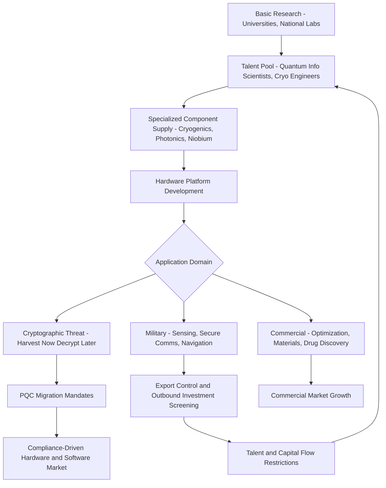

## Quantum Computing and Emerging Dual-Use Technology Races

### Overview

Quantum computing represents a paradigmatic dual-use technology: the same underlying physics and engineering advances that promise breakthroughs in materials science, drug discovery, and optimization also threaten to undermine widely deployed public-key cryptography and offer potential military advantages in sensing, secure communications, and computational modeling. This creates a distinct supply chain and industrial policy dynamic compared to established dual-use categories (semiconductors, aerospace materials): the technology is not yet mature, the eventual dominant architecture is unsettled, and states are racing to secure talent, materials, and fabrication capacity ahead of commercial or military payoff being fully realized. This item surveys the technology landscape, the associated supply chain dependencies, the export control response, and the broader pattern of "emerging tech races" (quantum, but also biotechnology, hypersonics, and AI) as a category of dual-use competition.

### Quantum Technology Domains

**Key Points**

- **Quantum computing**: Using quantum bits (qubits) exploiting superposition and entanglement to perform certain computations infeasible for classical computers (e.g., Shor's algorithm for integer factorization, Grover's algorithm for search).
- **Quantum sensing**: Using quantum coherence effects for ultra-precise measurement of gravity, magnetic fields, time, and rotation — with direct military applications in GPS-denied navigation and submarine detection.
- **Quantum communications/cryptography**: Quantum key distribution (QKD) exploiting the no-cloning theorem to detect eavesdropping, and post-quantum cryptography (PQC) — classical algorithms designed to resist quantum attack.
- **Quantum networking**: Distributing entanglement across nodes to link quantum computers or enable distributed quantum sensing, an early-stage but strategically watched subfield.

### Qubit Modalities and Their Supply Chain Profiles

Different physical qubit implementations have distinct manufacturing dependencies:

| Modality | Key Materials/Inputs | Fabrication Dependency |
| --- | --- | --- |
| Superconducting (e.g., transmon) | Niobium, aluminum, sapphire/silicon substrates | Dilution refrigerators (cryogenics), specialized lithography similar to semiconductor fabs |
| Trapped ion | Ultra-high vacuum systems, precision lasers, ion trap chips | Photonics and laser component supply chains |
| Photonic | Single-photon sources/detectors, integrated photonic chips | Overlaps with telecom photonics supply chain |
| Neutral atom | Laser arrays, optical tweezers | Similar laser/photonics dependency as trapped ion |
| Topological (experimental) | Specialized semiconductor-superconductor heterostructures | Highly specialized, limited fabrication base; still largely research-stage [Speculation: commercial viability timeline remains genuinely contested among researchers] |

**Cryogenics as a chokepoint**: Superconducting qubit systems require dilution refrigerators capable of reaching millikelvin temperatures — a specialized manufacturing niche with a small number of qualified global suppliers, making this an easily overlooked but significant supply chain dependency distinct from the qubit chips themselves.

### The Cryptographic Threat Driver: Harvest Now, Decrypt Later

**Key Points**

- A cryptographically relevant quantum computer (CRQC) — one large and stable enough to run Shor's algorithm at scale — would break current RSA and elliptic-curve cryptography underlying most internet security.
- **"Harvest now, decrypt later"** describes the strategy of adversaries exfiltrating and storing encrypted data today for future decryption once a CRQC becomes available, creating urgency for migration to post-quantum cryptography even though a CRQC does not yet exist.
- This dynamic is a primary driver of near-term government investment and policy (rather than quantum computing's other, more speculative commercial applications), because the migration timeline for cryptographic infrastructure is itself measured in years to decades.

### Post-Quantum Cryptography Standardization

The U.S. National Institute of Standards and Technology (NIST) ran a multi-year public competition to standardize post-quantum cryptographic algorithms, finalizing initial standards including CRYSTALS-Kyber (renamed ML-KEM, for key encapsulation) and CRYSTALS-Dilithium (renamed ML-DSA, for digital signatures) as Federal Information Processing Standards. [Unverified: given the pace of NIST's PQC program, confirm current standard status, any additional algorithms finalized, and federal migration mandate deadlines against the latest NIST publications, as this program has continued to evolve.]

Government mandates (e.g., U.S. National Security Memorandum on quantum, and equivalent allied-nation directives) increasingly require federal agencies and critical infrastructure operators to inventory cryptographic assets and begin migration planning — creating a substantial compliance-driven market and supply chain for PQC-enabled hardware and software.

### Dual-Use Classification and Export Control Response

- **Wassenaar Arrangement updates**: Quantum computing and certain quantum cryptography technologies have been added to multilateral dual-use control lists in recent years, reflecting recognition of quantum's strategic sensitivity alongside traditional dual-use categories like advanced semiconductors.
- **U.S. Commerce Control List (CCL) additions**: The Bureau of Industry and Security has periodically added quantum computing-related items and specific technical parameters to export control lists, part of a broader trend of "emerging and foundational technology" controls under the Export Control Reform Act framework.
- **Outbound investment screening**: The U.S. has moved toward restricting outbound investment by U.S. persons into Chinese quantum computing, semiconductor, and AI entities — a policy tool distinct from traditional export controls, targeting capital and expertise flows rather than only goods and technical data. [Inference: specific covered transaction thresholds and entity lists should be verified against current Treasury/Commerce outbound investment rule text, as this is an actively developing regulatory area.]
- **Talent and researcher screening**: Growing emphasis on research security frameworks (e.g., NSPM-33 implementation in the U.S.) addressing foreign talent recruitment programs perceived as vectors for quantum and other emerging-tech knowledge transfer.

### National Strategic Postures

**Example: Comparative approach**

- **United States**: National Quantum Initiative Act-driven federal investment, public-private partnerships (national labs, universities, firms like IBM, Google, IonQ, Rigetti), combined with export controls and outbound investment screening targeting rival programs.
- **China**: State-directed, large-scale investment including dedicated national quantum laboratories, with notable public milestones in quantum communications (e.g., the Micius satellite QKD demonstration) reflecting a strategic emphasis on quantum communications/cryptography alongside computing.
- **European Union**: Coordinated investment through the Quantum Flagship program, balancing sovereign capability development with EU-wide technology sovereignty objectives distinct from, though coordinated with, U.S. and UK efforts.
- **United Kingdom**: National Quantum Strategy with dedicated funding for quantum computing, sensing, and communications, integrated with broader UK science and technology superpower ambitions.

[Inference: relative program scale and specific funding figures across these jurisdictions change frequently with new budget cycles; comparative figures should be verified against current government sources rather than treated as static.]

### Talent Competition as a Supply Chain Dimension

Unlike traditional hardware supply chains, quantum technology races are unusually talent-constrained: the pool of researchers with deep expertise in quantum information science, cryogenic engineering, and specialized materials science is small relative to the scale of national ambitions, making talent flows (immigration policy, university partnerships, researcher mobility restrictions) as strategically significant as physical component supply chains. This is a distinguishing feature relative to more mature dual-use sectors like aerospace, where the underlying engineering talent base is larger and more distributed.

### Emerging Tech Race Pattern (Comparative Framework)

**Key Points**

Quantum computing exemplifies a broader pattern seen across several emerging dual-use technology races, each sharing structural features:

- **Biotechnology/synthetic biology**: Dual-use concern around gain-of-function research and bioweapon-relevant capability, paired with civilian therapeutic and agricultural applications.
- **Hypersonics**: Dual-use overlap between hypersonic glide vehicle research and civilian high-speed flight/reentry technology, with a narrow specialized materials and testing infrastructure base (wind tunnels, thermal protection materials).
- **Artificial intelligence / advanced compute**: Overlap between commercial AI model development and military applications in autonomy, targeting, and intelligence analysis, with export controls increasingly targeting the advanced semiconductor supply chain underpinning AI compute rather than AI software itself.

Common structural features across these races: (1) narrow specialized supplier/talent bases, (2) technology maturity outpacing regulatory frameworks, (3) difficulty distinguishing civilian from military application at the point of export control classification, and (4) first-mover strategic anxiety driving investment ahead of proven payoff.

### Dependency and Race Dynamic Diagram

### Risk and Policy Considerations

**Key Points**

- **Timeline uncertainty as a policy challenge**: Because the arrival date of a cryptographically relevant quantum computer is genuinely uncertain among experts, policymakers must hedge (fund PQC migration now) without being able to point to a settled technical milestone — creating recurring debate over whether investment levels are proportionate. [Speculation: this remains an area of legitimate expert disagreement rather than settled consensus.]
- **Fragmentation risk**: Multiple competing qubit modalities mean allied nations risk investing in incompatible technology bases, complicating future allied quantum cooperation analogous to defense co-production standardization challenges.
- **Overclassification risk**: Overly broad dual-use controls on quantum technology could stifle the open scientific collaboration on which the field's basic research progress has historically depended, a tension also seen in AI and biotech export control debates.
- **Supply chain concentration in adjacent technologies**: Because quantum hardware depends on semiconductor fabrication and specialized photonics, the same chokepoints affecting advanced semiconductor supply chains (extreme ultraviolet lithography equipment, specific foundry capacity) indirectly constrain quantum hardware scaling.

**Related Topics**

- Post-quantum cryptography migration planning and cryptographic inventory management
- Wassenaar Arrangement dual-use list updates and emerging technology controls
- Outbound investment screening mechanisms (U.S. Treasury/Commerce)
- Advanced semiconductor export controls and EUV lithography chokepoints
- Research security frameworks and foreign talent program screening (NSPM-33)
- Comparative national quantum strategies (U.S. National Quantum Initiative, EU Quantum Flagship, UK National Quantum Strategy)
- Biotechnology dual-use governance and gain-of-function research oversight
- Hypersonic weapons technology and dual-use materials science
- AI compute governance and advanced chip export controls
- Quantum key distribution and satellite-based quantum communications (Micius precedent)