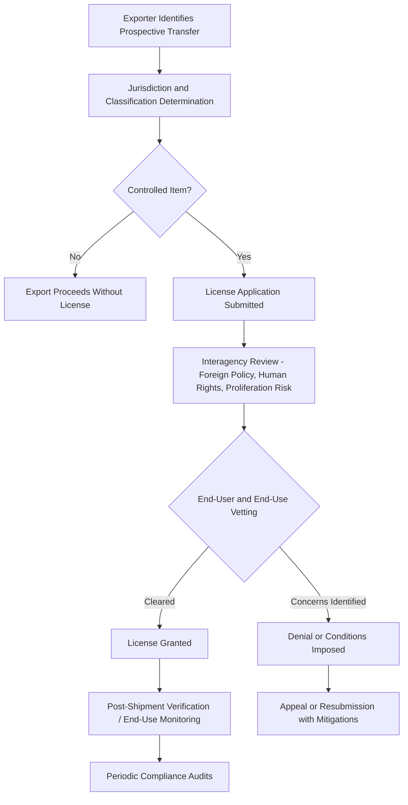

## International Arms Export Control Regimes

### Overview

International arms export control regimes are the multilateral and bilateral legal, political, and administrative frameworks that govern the transfer of weapons, military technology, and dual-use items across national borders. These regimes serve multiple, sometimes competing, objectives: preventing proliferation of weapons of mass destruction and destabilizing conventional arms buildups, maintaining alliance interoperability through controlled technology sharing, protecting national technological advantage, and supporting legitimate defense trade and industrial cooperation. Unlike a single unified global treaty system, arms export control operates through a layered architecture of multilateral supplier-group regimes (voluntary, non-treaty-based), binding treaties, and national implementing legislation — a structure that creates significant variation in stringency and enforcement across jurisdictions.

### The Multilateral Supplier-Group Regimes

**Key Points**

These four regimes are voluntary, consensus-based arrangements among supplier nations (not treaties, and not enforced by a supranational body) that establish common control lists and licensing principles which each member then implements through domestic law:

- **Nuclear Suppliers Group (NSG)**: Controls export of nuclear materials, equipment, and technology to prevent proliferation, established following India's 1974 nuclear test.
- **Missile Technology Control Regime (MTCR)**: Controls export of missiles and unmanned delivery systems capable of carrying weapons of mass destruction (payload ≥500 kg, range ≥300 km being the classic Category I threshold), plus related production technology.
- **Australia Group**: Coordinates export controls on chemical and biological weapons precursors, equipment, and technology.
- **Wassenaar Arrangement**: The successor to the Cold War-era COCOM (Coordinating Committee for Multilateral Export Controls), covering conventional arms and dual-use goods/technologies broadly, including cyber-surveillance tools, advanced materials, and (in recent years) certain quantum and AI-adjacent items.

Because these regimes operate by consensus among members and lack binding enforcement mechanisms, their effectiveness depends heavily on member states' domestic implementation rigor and political will — a structural limitation frequently noted in nonproliferation policy analysis.

### Binding Treaty Instruments

- **Arms Trade Treaty (ATT)**: Entered into force in 2014, the first legally binding multilateral treaty establishing common international standards for regulating the international trade in conventional arms, requiring states parties to assess export risk against criteria including potential use in serious violations of international humanitarian law and human rights law. [Unverified: current ratification/signatory count should be checked, as membership continues to evolve; notably, several major arms exporters and importers have not ratified or have withdrawn signature.]
- **Non-Proliferation Treaty (NPT)**: While primarily a nonproliferation instrument rather than a trade control regime per se, the NPT's framework underpins and legitimizes the NSG's export control mission.
- **Chemical Weapons Convention (CWC) and Biological Weapons Convention (BWC)**: Establish binding prohibitions that inform and reinforce Australia Group export control objectives, though the BWC notably lacks a formal verification mechanism.

### National Implementation: The U.S. System as Illustrative Model

**Key Points**

- **International Traffic in Arms Regulations (ITAR)**: Administered by the Department of State's Directorate of Defense Trade Controls (DDTC), governing the U.S. Munitions List (USML) — items and technical data specifically designed, developed, or modified for military application.
- **Export Administration Regulations (EAR)**: Administered by the Department of Commerce's Bureau of Industry and Security (BIS), governing the Commerce Control List (CCL) — dual-use items with both civilian and military application.
- **Arms Export Control Act (AECA)**: The underlying statutory authority for ITAR and the Foreign Military Sales (FMS) program.
- **Commodity Jurisdiction (CJ) process**: The formal mechanism by which DDTC determines whether a specific item falls under ITAR or EAR jurisdiction — a determination with major commercial consequences given ITAR's more restrictive licensing regime.
- **2013 Export Control Reform (ECR)**: Migrated a substantial portion of less sensitive military and satellite items from the USML to the CCL, intended to strengthen control over the most sensitive "crown jewel" technologies by reducing bureaucratic burden on less sensitive items — a rebalancing of control intensity rather than wholesale deregulation.

### Comparative National Frameworks

| Jurisdiction | Primary Legal Instrument | Administering Authority |
| --- | --- | --- |
| United States | ITAR / EAR under AECA and Export Control Reform Act | DDTC (State), BIS (Commerce) |
| European Union | Common Position 2008/944/CFSP (common criteria, not directly binding EU regulation) | National authorities per member state |
| United Kingdom | Export Control Order 2008 | Export Control Joint Unit (ECJU) |
| Germany | War Weapons Control Act (Kriegswaffenkontrollgesetz) and Foreign Trade Act | Federal Office for Economic Affairs and Export Control (BAFA) |
| France | Code de la défense export control provisions | Ministerial-level interagency process |
| Russia | Rosoboronexport state monopoly framework | State-controlled export intermediary |

[Inference: this table reflects general institutional structure; specific current thresholds, licensing exemptions, and recent legislative amendments in each jurisdiction should be verified against current national government sources, as these frameworks are periodically revised.]

Notably, the EU's Common Position establishes shared risk-assessment criteria among member states but is not a supranational licensing authority — actual export licensing decisions remain a national competency, producing meaningful policy variation among EU member states despite the common framework (a frequently cited limitation of EU-level arms export harmonization).

### Licensing and Review Process (Generic Model)

### Enforcement Mechanisms and Their Limits

**Key Points**

- **Denial lists and entity lists**: National authorities maintain lists of prohibited or restricted end-users (e.g., BIS Entity List, Denied Persons List) that exporters must screen against.
- **End-use monitoring**: Programs such as the U.S. Blue Lantern (DDTC) and Golden Sentry (DoD) programs conduct post-shipment checks to verify that transferred defense articles remain with the intended end-user and are used as licensed.
- **Criminal and civil penalties**: Violations of ITAR/EAR carry substantial financial penalties and potential criminal liability for both corporate entities and individuals, with debarment from future export privileges as an additional consequence.
- **Re-export control**: Most regimes require the recipient nation's consent before a licensed item is re-exported to a third country, a frequent source of friction in co-production and alliance contexts where partner nations seek independent export markets.
- **Structural enforcement gap**: Because the core multilateral regimes (NSG, MTCR, Australia Group, Wassenaar) are consensus-based and non-binding, enforcement ultimately depends on national-level implementation; a state can withdraw from or simply under-enforce a regime's guidelines without formal treaty violation, a persistent limitation noted across nonproliferation and conventional arms control literature.

### Case Studies

**Turkey's F-35 Removal**

Turkey's 2019 acquisition of the Russian S-400 air defense system triggered its removal from the F-35 program under Countering America's Adversaries Through Sanctions Act (CAATSA) provisions, illustrating how export control decisions increasingly function as instruments of alliance discipline and geopolitical signaling, not merely technical proliferation prevention.

**China Entity List Expansion**

The steady expansion of the U.S. Commerce Department's Entity List to include Chinese semiconductor, AI, and defense-linked firms demonstrates the use of export control instruments to address strategic technology competition concerns beyond traditional WMD proliferation, reflecting an evolution in how "dual-use" risk is defined in an era of great-power technology competition. [Inference: the specific scope and pace of Entity List additions changes frequently and should be checked against current BIS publications for up-to-date status.]

**AUKUS Export Control Carve-Outs**

The 2023–2024 U.S. regulatory changes creating license-free trade zones for defense articles among the U.S., UK, and Australia under AUKUS represent a notable departure from the traditional case-by-case licensing model, reflecting a policy judgment that deep alliance integration justifies streamlined control for a narrowly defined trusted-partner set. [Unverified: implementation details and eligibility scope should be confirmed against current DDTC guidance given the rule's relative novelty.]

### Tensions and Ongoing Debates

**Key Points**

- **Innovation vs. control trade-off**: Overly broad or slow licensing processes risk pushing allied nations toward non-U.S. suppliers or accelerating indigenous development to avoid control burdens — a frequently cited concern in U.S. defense-industrial policy debates.
- **Harmonization vs. sovereignty**: Efforts to harmonize allied export control standards (facilitating co-production and interoperability) run against individual states' reluctance to cede control over sovereign licensing decisions.
- **WMD-proliferation framing vs. great-power competition framing**: Historically regimes centered on preventing WMD and destabilizing conventional arms transfers to problematic end-users; increasingly, controls are deployed to preserve relative technological advantage over strategic competitors, a shift with implications for how allies and non-aligned states perceive the legitimacy and predictability of the system.
- **Compliance burden on legitimate trade**: Complex, multi-jurisdictional control lists create significant compliance costs for defense and dual-use exporters, particularly smaller firms in allied co-production supply chains.

**Related Topics**

- Missile Technology Control Regime (MTCR) categories and hypersonic weapons controls
- Wassenaar Arrangement dual-use list updates (quantum, AI, cyber-surveillance tools)
- Arms Trade Treaty ratification status and implementation gaps
- U.S. Entity List and outbound investment screening mechanisms
- Allied defense industrial cooperation and export control carve-outs (AUKUS)
- End-use monitoring programs (Blue Lantern, Golden Sentry)
- CAATSA and secondary sanctions as export control enforcement tools
- EU Common Position 2008/944/CFSP and member-state licensing divergence
- Commodity Jurisdiction determinations and ITAR-to-EAR migration
- Rosoboronexport and state-controlled arms export models