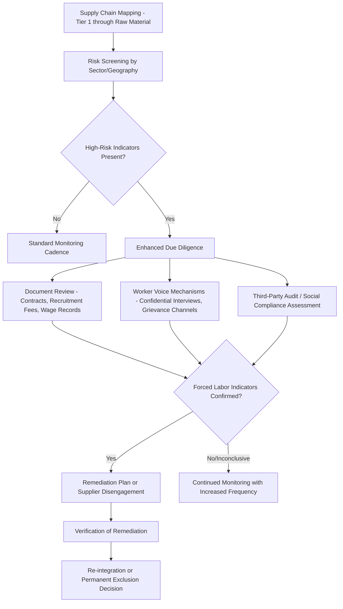

## Forced Labor Risk in Global Supply Chains

### Overview

Forced labor risk in global supply chains refers to the exposure of companies and states to complicity in coerced, deceived, or debt-bonded labor occurring anywhere across a multi-tier supply network — from raw material extraction through component manufacturing to final assembly. Unlike direct human rights violations by a single employer, supply chain forced labor risk is distinctive because it is diffuse (occurring at supplier tiers often invisible to lead firms), difficult to detect through conventional audits, and increasingly the subject of binding legal liability rather than only reputational or voluntary corporate social responsibility concern. This topic surveys the definitional framework, detection methodologies, major legal regimes, and risk mitigation approaches.

### Defining Forced Labor: The ILO Framework

**Key Points**

The International Labour Organization (ILO) defines forced labor as work exacted from a person under threat of penalty and for which the person has not offered themselves voluntarily. The ILO identifies eleven indicators commonly used across audit and detection methodologies:

- Abuse of vulnerability
- Deception
- Restriction of movement
- Isolation
- Physical and sexual violence
- Intimidation and threats
- Retention of identity documents
- Withholding of wages
- Debt bondage
- Abusive working and living conditions
- Excessive overtime

The presence of a single strong indicator (e.g., document retention combined with debt bondage) is generally treated as sufficient to raise reasonable suspicion of forced labor under most corporate and regulatory risk frameworks, though determinations of legal forced labor status typically require a fuller evidentiary basis. [Inference: application thresholds vary by regulatory regime, so the specific evidentiary bar should be checked against the relevant jurisdiction's guidance when assessing a specific case.]

### High-Risk Sectors and Geographies

**Key Points**

Forced labor risk concentrates disproportionately in certain sector and geographic patterns, though risk exists globally and is not limited to any single region:

- **Extractives and raw materials**: Mining (notably cobalt in the Democratic Republic of Congo, associated with artisanal mining conditions), agriculture (cotton, palm oil, cocoa, seafood/fishing fleets), and timber.
- **Textiles and apparel**: Multi-tier subcontracting common in garment manufacturing creates visibility gaps beyond Tier 1 (cut-and-sew) into Tier 2 (fabric/yarn) and Tier 3 (raw fiber) suppliers.
- **Electronics manufacturing**: Complex, deeply tiered component supply chains with significant subcontracting of lower-value assembly work.
- **Solar photovoltaic manufacturing**: Polysilicon production has been a particular focus of recent regulatory attention (see Uyghur Forced Labor Prevention Act discussion below) given documented concerns regarding labor conditions in China's Xinjiang region.
- **Fishing and seafood**: Long-haul fishing vessels present acute detection challenges due to physical isolation, flag-of-convenience jurisdictional ambiguity, and limited inspection access.

### Legal and Regulatory Regimes

**United States: Uyghur Forced Labor Prevention Act (UFLPA)**

Enacted 2021, the UFLPA establishes a rebuttable presumption that any goods mined, produced, or manufactured wholly or in part in China's Xinjiang Uyghur Autonomous Region, or produced by entities on an associated UFLPA Entity List, are made with forced labor and are therefore prohibited from importation into the United States under Section 307 of the Tariff Act of 1930. The burden shifts to the importer to demonstrate by clear and convincing evidence that the goods were not produced with forced labor — a substantially higher evidentiary burden than prior "reasonable care" import compliance standards. U.S. Customs and Border Protection (CBP) administers detention and enforcement.

**Section 307 of the Tariff Act of 1930 (Pre-UFLPA baseline)**

The longstanding general U.S. prohibition on importing goods made with forced or convict labor, historically limited in practical enforcement impact by a "consumptive demand" exception (repealed in 2016 by the Trade Facilitation and Trade Enforcement Act), after which enforcement activity substantially increased.

**European Union Forced Labour Regulation**

Adopted to prohibit products made with forced labor from being placed on or exported from the EU market, applying to both EU and non-EU companies and covering the full supply chain rather than being limited to a specific region — structurally broader in geographic scope than the UFLPA's Xinjiang-specific presumption, though it does not rely on a rebuttable presumption tied to a specific region. [Unverified: specific implementation timeline, enforcement mechanism details, and entry-into-application dates should be verified against current EU official sources, as this regulation's implementing measures were still being finalized as of the most recent available information.]

**EU Corporate Sustainability Due Diligence Directive (CSDDD)**

Establishes mandatory human rights and environmental due diligence obligations for large companies operating in the EU market, requiring identification, prevention, mitigation, and accounting of adverse impacts across their own operations, subsidiaries, and value chains — a broader due diligence obligation distinct from the product-specific import prohibition model of the Forced Labour Regulation. [Unverified: transposition deadlines and scope thresholds have been subject to ongoing legislative adjustment and should be checked against the latest official EU text.]

**UK Modern Slavery Act 2015**

Requires large commercial organizations operating in the UK to publish an annual statement describing steps taken to ensure slavery and human trafficking are not occurring in their business or supply chains — a disclosure-based model rather than an import prohibition or mandatory due diligence model, generally regarded as a lighter-touch precursor to the EU's more prescriptive approach.

**Australia Modern Slavery Act 2018**

Similarly disclosure-based, requiring covered entities to report on modern slavery risks in operations and supply chains and actions taken to address them.

### Comparative Regulatory Models

| Regime | Model | Geographic Scope | Enforcement Mechanism |
| --- | --- | --- | --- |
| U.S. UFLPA | Rebuttable presumption / import ban | Xinjiang-linked goods specifically | CBP detention, importer must rebut with clear/convincing evidence |
| EU Forced Labour Regulation | Product ban | Global (any forced labor in supply chain) | Market surveillance authorities, product withdrawal |
| EU CSDDD | Mandatory due diligence | Global value chain of covered EU-operating firms | Civil liability, administrative penalties |
| UK Modern Slavery Act | Disclosure/reporting | Global, disclosure only | Reputational; no direct penalty for statement content |
| Australia Modern Slavery Act | Disclosure/reporting | Global, disclosure only | Reputational; no direct penalty for statement content |

### Supply Chain Detection and Due Diligence Process

### Detection Methodology Limitations

**Key Points**

- **Traditional social audits are widely criticized** as insufficient for forced labor detection because they are typically announced in advance, rely on management-provided documentation that can be falsified, and interview workers on-site where fear of retaliation suppresses honest disclosure.
- **Sub-tier invisibility**: Lead firms often have contractual relationships only with Tier 1 suppliers and limited visibility into Tier 2/3 suppliers (raw material processing, component fabrication) where forced labor risk is frequently concentrated.
- **Worker voice and grievance mechanisms**: Increasingly regarded as a more reliable detection method than document-based audits, though effectiveness depends on genuine worker access to confidential, retaliation-free reporting channels — a design and implementation challenge in itself.
- **Data and traceability technology**: Blockchain-based and other digital traceability systems are increasingly piloted to establish chain-of-custody documentation for high-risk commodities (e.g., cotton, cobalt), though [Speculation: the maturity and reliability of these traceability systems as a standalone forced labor detection tool remains genuinely debated, as traceability of physical origin does not by itself verify labor conditions at each node].

### Corporate Risk Mitigation Approaches

**Approach 1: Supply Chain Mapping and Segmentation**

- Map suppliers to at least Tier 2/3 for high-risk commodity categories
- Prioritize enhanced due diligence resources toward highest-risk sector/geography combinations rather than uniform application across the entire supplier base

**Approach 2: Contractual and Commercial Levers**

- Embed forced labor prohibition clauses with audit rights and remediation requirements in supplier contracts
- Prohibit worker-paid recruitment fees (a leading indicator of debt bondage risk) through supplier code of conduct requirements

**Approach 3: Multi-Stakeholder and Industry Collaboration**

- Participate in sector-specific initiatives (e.g., Responsible Business Alliance in electronics, Better Cotton Initiative in textiles) that pool audit data and establish common standards, reducing duplicative audit burden on shared suppliers
- Engage with civil society and labor rights organizations with on-the-ground visibility that commercial audit firms may lack

**Approach 4: Remediation-Centered Response**

- Where forced labor indicators are confirmed, prioritize worker remediation (repayment of recruitment fees, return of documents, back wages) over immediate supplier termination, reflecting an emerging view among human rights practitioners that abrupt disengagement can leave affected workers without recourse or income

### Case Study: Solar Supply Chain Scrutiny

The global polysilicon supply chain for solar photovoltaic panels became a focal point of forced labor enforcement following documented concerns about labor conditions in Xinjiang, which historically supplied a substantial share of global polysilicon production. This created significant supply chain disruption for solar manufacturers globally, driving both diversification of polysilicon sourcing to alternative geographies and increased due diligence documentation requirements across the solar supply chain — illustrating how forced labor regulation can function as a substantial supply chain reconfiguration driver independent of tariff or national security trade policy. [Inference: current market share of Xinjiang-linked polysilicon and the pace of supply chain diversification should be verified against current industry reporting, as this has been a rapidly shifting market.]

### Tensions and Open Debates

**Key Points**

- **Evidentiary burden vs. practical feasibility**: Rebuttable presumption regimes like UFLPA place a demanding evidentiary burden on importers for complex, deeply tiered supply chains where full chain-of-custody documentation to the raw material level is often not commercially available.
- **Regional presumption vs. global due diligence models**: Region-specific presumption approaches (UFLPA) versus global due diligence obligations (EU CSDDD) reflect different policy philosophies about whether forced labor risk should be addressed through targeted trade restriction or broad corporate governance obligation.
- **Disclosure-only regimes' effectiveness**: Reporting-based frameworks (UK, Australia Modern Slavery Acts) have faced criticism for lacking meaningful enforcement teeth, as companies can comply by simply describing steps taken without independent verification of their adequacy.
- **Cost and competitiveness concerns**: Compliance costs disproportionately affect smaller suppliers with less capacity for extensive documentation and audit participation, raising equity concerns about whether stringent due diligence requirements inadvertently disadvantage smaller producers in developing economies.

**Related Topics**

- Uyghur Forced Labor Prevention Act enforcement and CBP detention procedures
- EU Corporate Sustainability Due Diligence Directive scope and civil liability provisions
- Conflict minerals due diligence (Dodd-Frank Section 1502, EU Conflict Minerals Regulation)
- Worker voice technology and confidential grievance mechanism design
- Sector-specific multi-stakeholder initiatives (Responsible Business Alliance, Better Cotton Initiative)
- Recruitment fee prohibition and debt bondage indicators
- Supply chain traceability technology and blockchain chain-of-custody systems
- Solar photovoltaic supply chain diversification post-UFLPA
- Comparative analysis of disclosure-based vs. due-diligence-based regulatory models
- Remediation-centered corporate response frameworks