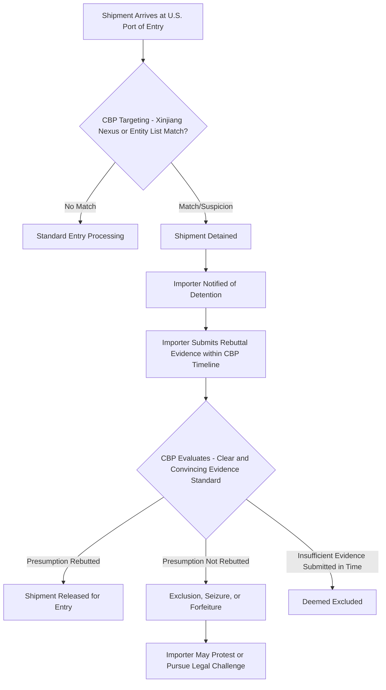

## The Uyghur Forced Labor Prevention Act and Its Rebuttable Presumption

### Overview

The Uyghur Forced Labor Prevention Act (UFLPA), signed into law in December 2021 and effective June 21, 2022, is a U.S. statute that establishes the most stringent forced-labor import enforcement mechanism in U.S. trade law to date. Its central legal innovation is a rebuttable presumption: any goods mined, produced, or manufactured wholly or in part in China's Xinjiang Uyghur Autonomous Region (XUAR), or produced by an entity identified on the UFLPA Entity List, are presumed to be made with forced labor and are therefore barred from entry under Section 307 of the Tariff Act of 1930 — unless the importer meets a demanding evidentiary burden to rebut that presumption. This reverses the traditional burden of proof in U.S. customs enforcement, shifting it from the government (which must normally show evidence of forced labor) to the importer (which must affirmatively prove its absence).

### Legislative and Legal Foundation

**Key Points**

- **Statutory basis**: UFLPA operates as an enhancement to Section 307 of the Tariff Act of 1930, the longstanding general U.S. prohibition on importing goods made with forced, convict, or indentured labor.
- **Historical context**: Section 307 enforcement was historically limited by a "consumptive demand" exception, permitting import of forced-labor goods if U.S. domestic production could not meet demand; this exception was repealed by the 2016 Trade Facilitation and Trade Enforcement Act, substantially expanding subsequent enforcement capacity that UFLPA later built upon.
- **Legislative intent**: Congress designed UFLPA specifically to address documented concerns regarding labor conditions affecting Uyghur and other ethnic and religious minority groups in Xinjiang, including reports of state-sponsored labor transfer programs.
- **Effective date**: The presumption took effect June 21, 2022, with U.S. Customs and Border Protection (CBP) as the primary enforcing agency.

### The Rebuttable Presumption Mechanism

**Key Points**

- **Scope of the presumption**: Applies to (1) goods wholly or partly mined, produced, or manufactured in Xinjiang, and (2) goods produced by any entity on the UFLPA Entity List, regardless of where in China or globally that entity's facility is physically located — meaning the presumption is not purely geography-bound once an entity is listed.
- **Evidentiary standard for rebuttal**: The importer must demonstrate compliance with UFLPA's requirements by "clear and convincing evidence" — a substantially higher standard than the "preponderance of the evidence" or "reasonable care" standards more typical in customs compliance.
- **Effect of failure to rebut**: Goods are denied entry, detained, excluded, or seized by CBP; detained shipments face the practical commercial cost of delay, storage, and potential total loss of the goods if the presumption cannot be overcome within CBP's procedural timelines.
- **No de minimis exception**: A supply chain input traceable to Xinjiang or a listed entity can trigger the presumption even where that input represents a small fraction of the finished good's overall value or content, creating exposure at multiple tiers of a supply chain, not only for finished products assembled in the region.

### The UFLPA Entity List

The UFLPA Entity List is maintained by the Forced Labor Enforcement Task Force (FLETF), an interagency body chaired by the Department of Homeland Security, and is organized into four statutorily defined categories:

1. Entities in Xinjiang that mine, produce, or manufacture wholly or in part any goods, wares, articles, or merchandise with forced labor.
2. Entities working with the government of Xinjiang to recruit, transport, transfer, harbor, or receive forced labor or persecuted minority groups out of Xinjiang.
3. Entities that exported products made by entities described in categories 1 or 2 from China into the United States.
4. Entities based in Xinjiang or that source material from Xinjiang that are involved in poultry processing, polysilicon production, or the recruitment/transport/transfer of Uyghur, Kazakh, Kyrgyz, or other persecuted groups out of Xinjiang.

[Unverified: the specific current composition and count of the UFLPA Entity List changes periodically as FLETF adds or, less commonly, removes entities; the current list should be checked against DHS/FLETF's official published list for any specific compliance determination.]

### Rebuttal Process and Required Evidence

**Key Points**

To rebut the presumption, CBP guidance generally requires importers to provide comprehensive supply chain traceability documentation, which in practice includes:

- **Complete supply chain mapping**: Documentation tracing the good from raw material origin through every processing and manufacturing stage to the finished product.
- **Due diligence system documentation**: Evidence of a systematic supply chain due diligence program, not merely ad hoc documentation gathered in response to a specific detention.
- **Supply chain tracing for high-risk inputs**: Particularly for commodities with documented high Xinjiang production concentration — cotton, polysilicon, tomatoes, and their derivative products are frequently cited as CBP priority focus areas.
- **Independent, verifiable third-party evidence**: CBP guidance emphasizes that self-attestation by suppliers or the importer alone is generally insufficient; independent verification (e.g., isotopic testing for cotton origin, verified financial and production records) substantially strengthens a rebuttal submission.

### UFLPA Enforcement Process

### High-Risk Commodity Focus Areas

**Key Points**

CBP and FLETF have identified priority sectors reflecting documented Xinjiang production concentration and consequent elevated enforcement scrutiny:

- **Cotton and cotton products**: Xinjiang has historically been a major source of China's cotton production; downstream apparel and textile products with any traceable Xinjiang cotton content face significant scrutiny, complicated by the global, highly blended nature of cotton and yarn supply chains.
- **Polysilicon (solar)**: Xinjiang has been a substantial source of global polysilicon production feeding into solar photovoltaic panel manufacturing, making this a specific enforcement priority category under the Entity List's fourth category.
- **Tomatoes and tomato products**: Identified as a priority commodity given Xinjiang's role in Chinese tomato paste production destined for global food supply chains.
- **Aluminum and derivative products**: Increasing enforcement attention given Xinjiang's role in aluminum smelting, which is energy-intensive and geographically concentrated in the region.

[Inference: the relative enforcement intensity across these commodity categories shifts over time as FLETF publishes updated strategy documents; current priority focus should be checked against the latest FLETF strategy publication.]

### Commercial and Compliance Impact

**Example**

A U.S. apparel importer sourcing cotton t-shirts manufactured in Vietnam may still face UFLPA exposure if the cotton fiber itself originated in Xinjiang before being spun into yarn and woven into fabric elsewhere — illustrating that country-of-assembly does not determine UFLPA applicability; the entire upstream material chain is in scope. This has driven substantial commercial pressure toward supply chain diversification away from Xinjiang-origin cotton and polysilicon, and toward enhanced supplier documentation requirements extending well beyond Tier 1 relationships.

**Key Points on Commercial Consequences**

- **Detention and delay costs**: Even ultimately-successful rebuttals impose significant commercial cost through shipment delay, demurrage, and storage charges during the CBP review period.
- **Documentation burden shift**: Importers have had to build supply chain traceability systems (often for the first time extending to raw material origin) that many previously lacked, particularly for commodities like cotton with globally blended and difficult-to-trace supply chains.
- **Market reallocation**: Diversification of sourcing away from Xinjiang-linked inputs toward alternative geographies (e.g., cotton sourcing shifts toward other producing regions, polysilicon capacity expansion outside China) has been a documented market response, though the pace and completeness of this diversification varies significantly by commodity. [Unverified: current market share shifts should be verified against recent industry and trade data given the dynamic nature of this reallocation.]

### Comparison to Standard Section 307 Enforcement

| Dimension | Standard Section 307 | UFLPA Rebuttable Presumption |
| --- | --- | --- |
| Burden of proof | Government must show evidence of forced labor | Importer must disprove forced labor |
| Evidentiary standard | Reasonable suspicion sufficient for detention | Clear and convincing evidence required to rebut |
| Geographic/entity trigger | Case-by-case, no presumption | Automatic presumption for Xinjiang nexus or Entity List match |
| Practical enforcement volume | Historically limited, resource-constrained | Substantially higher detention volume post-2022 |

### Tensions and Ongoing Debates

**Key Points**

- **Traceability feasibility**: Critics note that for globally blended commodities like cotton, achieving supply-chain-wide traceability to the raw material level sufficient to meet a "clear and convincing evidence" standard is technically and commercially difficult, particularly for smaller importers without extensive compliance resources.
- **Presumption breadth vs. due process concerns**: The reversal of the traditional burden of proof, while intended to address the practical difficulty of proving forced labor occurred in a closed, state-controlled region, has drawn criticism regarding fairness to importers facing detention based on presumption rather than affirmative government evidence.
- **Entity List category 3 breadth**: The category covering entities that merely exported goods made by other listed entities creates a potentially expansive net that can implicate parties without direct operational presence in Xinjiang.
- **Diplomatic and trade friction**: UFLPA enforcement has been a recurring point of friction in U.S.-China trade relations, with the Chinese government disputing the underlying factual premises regarding labor conditions in the region — a dispute that falls outside the scope of technical compliance guidance and reflects broader contested geopolitical narratives. [This factual dispute is presented here as a description of the diplomatic posture, not as a resolution of the underlying human rights questions, which involve contested evidentiary claims beyond the scope of this technical summary.]

**Next Steps**

**Related Topics**

- Forced labor risk detection methodologies and ILO indicator framework
- UFLPA Entity List: FLETF administration and listing/delisting procedures
- Cotton and polysilicon supply chain traceability technology (isotopic testing, blockchain)
- CBP detention, exclusion, and seizure procedures under Section 307
- EU Forced Labour Regulation as a comparative global (non-region-specific) model
- Solar photovoltaic supply chain diversification post-UFLPA
- Section 307 Tariff Act history and the 2016 consumptive demand exception repeal
- Forced Labor Enforcement Task Force (FLETF) strategy publications
- Supply chain due diligence system design for high-risk commodity importers
- U.S.-China trade friction and human rights-linked trade policy instruments