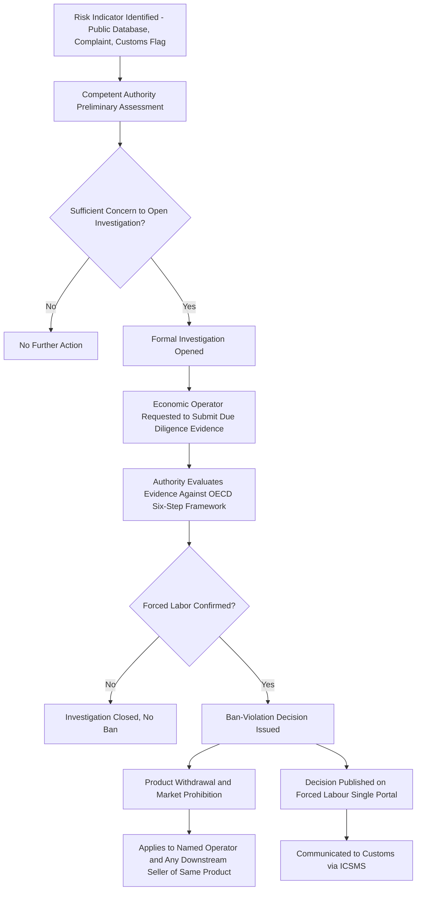

## The EU Forced Labor Regulation and Corporate Due Diligence Mandates

### Overview

The European Union has built a two-instrument architecture addressing forced labor exposure in supply chains, distinguished by legal mechanism and target: the **EU Forced Labour Regulation** (Regulation (EU) 2024/3015, "EUFLR" or "FLR"), a product-ban instrument targeting goods regardless of origin, and the **Corporate Sustainability Due Diligence Directive** (CSDDD, also styled CS3D), a process-based due diligence obligation imposed on large companies' own operations and value chains. Both instruments have undergone significant timeline and scope revision since original adoption — most notably through the 2025–2026 "Omnibus I" simplification package affecting the CSDDD — making current implementation status essential context for any compliance analysis.

### The EU Forced Labour Regulation: Structure and Scope

**Key Points**

- **Legal instrument type**: Regulation (EU) 2024/3015, directly applicable across all EU member states without national transposition legislation required (distinguishing it from the CSDDD, which is a directive requiring transposition).
- **Prohibition mechanism**: Bans placing, making available on, or exporting from the EU market any product made with forced labor — applying to all products and all companies, with no size threshold or sectoral exemption. [Sedex](https://www.sedex.com/blog/eu-forced-labour-regulation-guidelines-and-supply-chain-implications/)
- **Geographic scope**: Applies to all products across all sectors, irrespective of the provenance of the goods, including those made within the EU, with no de minimis threshold, and to any EU or non-EU economic operator without turnover or employee thresholds — structurally broader than the UFLPA's Xinjiang-specific rebuttable presumption, since the EUFLR is not tied to any single region and instead requires case-by-case investigation of suspected forced labor anywhere in a product's supply chain. [Passle](https://sustainablefutures.linklaters.com/post/102n7tb/eu-forced-labour-regulation-commission-publishes-long-awaited-implementation-gui)
- **No standing presumption**: Unlike UFLPA, the EUFLR does not create an automatic rebuttable presumption tied to a geography or entity list; instead, competent authorities open investigations based on risk indicators and evidence, and the burden framework operates through an investigation-and-decision process rather than a blanket import reversal of proof.

### Timeline and Current Implementation Status

**Key Points**

- **Entry into force**: 13 December 2024, beginning a three-year transition period. [Sedex](https://www.sedex.com/blog/eu-forced-labour-regulation-guidelines-and-supply-chain-implications/)
- **Full application date**: 14 December 2027, when investigations, market bans and the public reporting channel (the Single Information Submission Point) go live. [Sedex](https://www.sedex.com/blog/eu-forced-labour-regulation-guidelines-and-supply-chain-implications/)
- **Member State penalty notification deadline**: 14 December 2026, by which member states must notify the Commission of their penalty frameworks for violations. [Sedex](https://www.sedex.com/blog/eu-forced-labour-regulation-guidelines-and-supply-chain-implications/)
- **Implementation guidelines**: The European Commission adopted its implementation guidelines on 26 June 2026 and launched the Forced Labour Single Portal, with the final version published in the Official Journal on 3 September 2026, unchanged from the version originally published on 30 June 2026. [Covington & Burling LLP](https://www.cov.com/en/news-and-insights/insights/2026/07/european-commission-publishes-forced-labour-regulation-guidelines-key-takeaways-for-companies)[Passle](https://sustainablefutures.linklaters.com/post/102n7tb/eu-forced-labour-regulation-commission-publishes-long-awaited-implementation-gui)
- **Preparatory infrastructure now active**: The Forced Labour Single Portal indicates preparation should start now, listing European Commission webinars beginning 14 September 2026, including sessions for SMEs and specific sectors — solar, textiles, electronics and semiconductors, agri-food, automotive, and fisheries. The Single Information Submission Point for reporting suspected violations becomes available from 14 December 2027. [Mayer Brown](https://www.mayerbrown.com/en/insights/publications/2026/09/a-practical-roadmap-for-compliance-with-the-eu-forced-labour-regulation)[Mayer Brown](https://www.mayerbrown.com/en/insights/publications/2026/09/a-practical-roadmap-for-compliance-with-the-eu-forced-labour-regulation)
- **Sequencing relative to CSDDD**: The Regulation starts applying as of 14 December 2027, i.e., after the entry into application of the CSDDD and its mandatory due diligence measures for the largest in-scope companies on 26 July 2027 — meaning companies subject to both instruments will have already begun CSDDD-driven due diligence processes before facing EUFLR product-ban exposure, giving the due diligence obligation practical primacy in sequencing even though the two instruments operate on different legal logics. [Passle](https://sustainablefutures.linklaters.com/post/102jrnw/eu-forced-labour-regulation-published-in-the-official-journal)

### The Due Diligence–Investigation Relationship

A key clarification from the June/September 2026 guidelines: documented due diligence, structured around the OECD six-step framework, is confirmed as the primary mechanism for reducing investigation risk under the FLR, though due diligence itself remains voluntary rather than a standalone mandatory obligation under the Regulation. This distinguishes the EUFLR's approach from the UFLPA's mandatory rebuttal evidentiary requirement: under the EUFLR, a company is not required to prove a negative for every product on entry, but robust documented due diligence functions as the practical evidence base that reduces the likelihood of triggering — and strengthens a company's position in — an investigation, should one be opened. [Sedex](https://www.sedex.com/blog/eu-forced-labour-regulation-guidelines-and-supply-chain-implications/)

### Enforcement and Investigation Process

**Key Points**

- **Competent authorities**: Each member state designates national competent authorities responsible for investigations, publicly listed on the Forced Labour Single Portal, alongside a Commission role for products investigated outside the EU.
- **Cross-border coordination infrastructure**: Implementing Regulation (EU) 2026/903 establishes the forced labor module in the EU market surveillance information system (ICSMS) for coordinating cross-border investigations among member state authorities. [Osapiens](https://osapiens.com/en/regulations/eu-forced-labor-regulation)
- **Ban-violation consequences**: Where authorities conclude a ban violation occurred, decisions generally impose a prohibition on making the product available on the EU market and require withdrawal of products already placed on the market; ban-violation decisions must be published on the Forced Labour Single Portal and communicated to customs authorities through ICSMS, and such decisions apply not only to the named economic operator but to any business placing or making available the banned product on the EU market — a notably broad effect extending liability exposure beyond the investigated party to downstream sellers of the same banned product. [Passle](https://sustainablefutures.linklaters.com/post/102n7tb/eu-forced-labour-regulation-commission-publishes-long-awaited-implementation-gui)
- **Potential future customs pre-clearance system**: Article 27 of the Regulation grants the Commission power to adopt delegated acts that could require economic operators to provide detailed product information to customs authorities before goods are released for free circulation or exported, though the precise implementation remained uncertain, with a potential route resembling the approach used in the EU Deforestation Regulation. [Passle](https://sustainablefutures.linklaters.com/post/102jrnw/eu-forced-labour-regulation-published-in-the-official-journal)

### EUFLR Investigation and Enforcement Flow

### The CSDDD: Scope After Omnibus I

**Key Points**

- **Original instrument**: The CSDDD entered into force on 25 July 2024, requiring in-scope companies to identify and address adverse human rights and environmental impacts in their operations and value chains. [schoenherr](https://www.schoenherr.eu/media/pmynki3b/schoenherr_brochure_omnibus_112025.pdf)
- **Omnibus I amendments**: The Omnibus I Directive narrowed CSDDD scope, reduced liability and fines, and delayed application; it was published in the Official Journal on 26 February 2026 as Directive (EU) 2026/470 and entered into force on 18 March 2026. [dlapiper](https://knowledge.dlapiper.com/dlapiperknowledge/globalemploymentlatestdevelopments/2026/eu-council-approves-omnibus-i-directive)
- **Chain-of-activities limitation**: Due diligence measures under the amended CSDDD are limited to companies' own operations, subsidiaries, and direct (Tier 1) business partners; in-depth assessment of indirect (sub-tier) business partners is required only where plausible information suggests adverse impacts — a substantial narrowing from the original proposal's broader value-chain reach, and a significant divergence from the EUFLR's full-chain, no-de-minimis scope. [arthurcox](https://www.arthurcox.com/insights/omnibus-package-proposed-amendments-to-csrd-and-csddd)
- **Revised transposition and application timeline**: Member states must transpose the CSDDD-related Omnibus I provisions by 26 July 2028, while the CSDDD's mandatory due diligence measures for the largest in-scope companies enter application on 26 July 2027. [mondaq](https://webiis10.mondaq.com/ireland/corporate-and-company-law/1755118/omnibus-i-directive-published-revised-scope-and-reduced-obligations-under-csrd-and-csddd)[Passle](https://sustainablefutures.linklaters.com/post/102jrnw/eu-forced-labour-regulation-published-in-the-official-journal)

### Comparative Framework: EUFLR vs. CSDDD vs. UFLPA

| Dimension | EU Forced Labour Regulation | CSDDD (post-Omnibus I) | U.S. UFLPA |
| --- | --- | --- | --- |
| Instrument type | Regulation (directly applicable) | Directive (requires transposition) | Statute + CBP enforcement |
| Core mechanism | Product ban following investigation | Mandatory due diligence process obligation | Rebuttable presumption / import ban |
| Geographic trigger | Any origin, no region-specific presumption | Company's own operations + direct (Tier 1) partners, indirect only if plausible risk indicated | Xinjiang-linked or Entity List-linked goods specifically |
| Company scope threshold | None — all companies, all sectors | Large companies above turnover/employee thresholds (narrowed by Omnibus I) | All U.S. importers of covered goods |
| Full application date | 14 December 2027 | 26 July 2027 (largest companies) | Already in effect since 21 June 2022 |
| Due diligence mandatory? | Voluntary, but functions as key evidence to reduce investigation risk | Mandatory for in-scope companies | De facto mandatory to rebut presumption |

### Sector-Specific Preparatory Focus

**Example**

The Commission's outreach webinar program beginning September 2026 specifically targets solar, textiles, electronics and semiconductors, agri-food, automotive, and fisheries sectors — mirroring the high-risk sector pattern seen under UFLPA enforcement (solar polysilicon, textiles/cotton) while extending explicit preparatory attention to automotive and fisheries, sectors where EU-specific supply chain risk mapping has received comparatively less prior regulatory attention than under the U.S. regime. [Mayer Brown](https://www.mayerbrown.com/en/insights/publications/2026/09/a-practical-roadmap-for-compliance-with-the-eu-forced-labour-regulation)

### Compliance Implications for Multinational Operators

**Key Points**

- **Dual-regime exposure**: A company selling into both the U.S. and EU markets faces materially different compliance architectures — UFLPA's presumption-and-rebuttal model for Xinjiang-linked goods, and the EUFLR's full-supply-chain, all-origin investigation model with no automatic presumption but no size or sector carve-out either.
- **Due diligence system reusability**: Because the OECD six-step due didiligence framework underlies the Commission's EUFLR guidance, companies that have built UFLPA-driven supply chain traceability systems have a partially reusable evidentiary base for EUFLR risk-reduction purposes, though the EUFLR's lack of a region-specific trigger means such systems must be extended beyond Xinjiang-specific documentation to cover the full range of sectors and geographies where forced labor risk may arise. [Sedex](https://www.sedex.com/blog/eu-forced-labour-regulation-guidelines-and-supply-chain-implications/)
- **CSDDD narrowing reduces but does not eliminate overlap**: With Omnibus I limiting CSDDD's mandatory deep-tier scrutiny to cases with "plausible information" of risk, companies cannot rely on CSDDD compliance alone to satisfy EUFLR risk-reduction expectations, since the EUFLR's investigation trigger is not bound by the same Tier-1-first limitation.
- **Preparatory window is active now**: With guidelines finalized and the Portal live as of September 2026, and full application 14 December 2027, companies have a defined but narrowing window to build documented due diligence systems ahead of enforcement.

### Tensions and Open Debates

**Key Points**

- **Simplification vs. stringency trade-off**: The Omnibus I narrowing of CSDDD scope reflects an EU-level policy tension between competitiveness/administrative burden concerns and the original ambition of comprehensive value-chain human rights accountability — a live and contested policy debate rather than a settled matter.
- **Voluntary due diligence within a binding ban**: The EUFLR's structure — a binding product ban paired with only voluntary (though practically essential) due diligence — creates some ambiguity for companies about the precise evidentiary bar that will satisfy an investigating authority, since no codified minimum due diligence standard is itself mandatory.
- **Downstream liability breadth**: The rule that a ban-violation decision applies to any business placing or making available the banned product on the EU market, not only the originally investigated operator, raises practical concern for retailers and distributors with limited visibility into a product's original manufacturing investigation history. [Passle](https://sustainablefutures.linklaters.com/post/102n7tb/eu-forced-labour-regulation-commission-publishes-long-awaited-implementation-gui)
- **Coordination with the Deforestation Regulation model**: The potential future customs pre-clearance system under Article 27 signals a direction toward information-system-based compliance seen in the EU Deforestation Regulation, though [Inference: whether the Commission ultimately adopts this delegated-act pathway, and on what timeline, remains genuinely undetermined given the "precise implementation remains uncertain" characterization in current legal commentary].

**Related Topics**

- Uyghur Forced Labor Prevention Act rebuttable presumption mechanism
- OECD Due Diligence Guidance for Responsible Business Conduct (six-step framework)
- Omnibus I simplification package: CSRD and Taxonomy Regulation amendments
- EU Deforestation Regulation as a comparative information-system compliance model
- Forced Labour Single Portal and Single Information Submission Point mechanics
- Sector-specific EUFLR risk areas: solar, textiles, automotive, fisheries
- ICSMS cross-border market surveillance coordination
- Comparative due diligence liability regimes (CSDDD civil liability vs. EUFLR administrative enforcement)
- Supply chain traceability system design for dual U.S./EU compliance
- Value-chain cap provisions and SME protection under revised CSRD/CSDDD