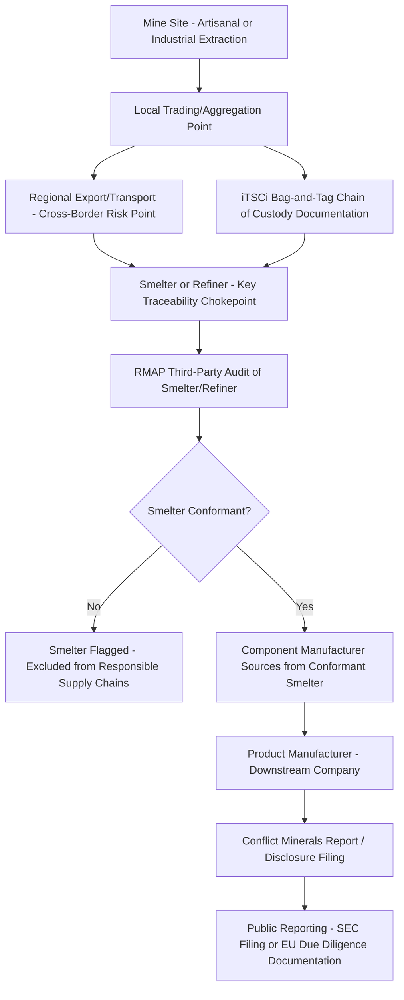

## Conflict Minerals and the Democratic Republic of Congo

### Overview

Conflict minerals refer to minerals extracted in conditions of armed conflict and human rights abuses, whose trade has historically financed armed groups, most prominently in the eastern Democratic Republic of Congo (DRC). The regulatory and industry response centers on four minerals collectively termed "3TG": tin, tantalum, tungsten, and gold, sourced from the DRC and adjoining Great Lakes region countries. This topic covers the geological and economic context, the armed-conflict financing mechanism, the major legal and standards regimes (Dodd-Frank Section 1502, the EU Conflict Minerals Regulation, and the OECD Due Diligence Guidance), traceability infrastructure, and the debates over the regime's effectiveness and unintended consequences.

### Geological and Economic Context

**Key Points**

- **Tantalum (coltan)**: The DRC has historically been one of the world's most significant sources of tantalum ore (coltan), a critical input for tantalum capacitors used extensively in consumer electronics, aerospace, and medical devices due to their high capacitance-to-volume ratio and reliability.
- **Tin (cassiterite)**: Used primarily as solder in electronics manufacturing; the DRC and surrounding region represent a significant global tin ore source, extracted largely through artisanal and small-scale mining (ASM) operations.
- **Tungsten (wolframite)**: Used in electronics, automotive, and industrial cutting tools; similarly extracted through a mix of artisanal and semi-industrial operations in the region.
- **Gold**: Extracted both artisanally and industrially; gold is comparatively easier to smuggle and launder into the legitimate supply chain than the other 3TG minerals due to its high value-to-weight ratio and the difficulty of tracing melted gold to its original mine of origin, making it the most persistently difficult 3TG mineral to control.
- **Artisanal and small-scale mining (ASM) predominance**: A substantial share of 3TG extraction in the eastern DRC occurs through informal, labor-intensive artisanal mining rather than large-scale industrial operations, which shapes both the human rights risk profile (informal sites often lack labor protections) and the practical difficulty of supply chain traceability (numerous small, dispersed extraction points rather than a few large mines).

### The Conflict Financing Mechanism

**Key Points**

- **Armed group taxation and control of mine sites**: Non-state armed groups and, in some documented cases, elements of national security forces have derived revenue by taxing, controlling, or directly operating mine sites and transport routes in eastern DRC, using proceeds to sustain military operations.
- **Regional conflict dynamics**: Eastern DRC has experienced protracted conflict involving numerous armed groups, with cross-border dynamics involving neighboring countries; mineral revenue has been documented as one among several financing streams for armed actors in this context. [Inference: the specific armed groups and relative financing significance of minerals versus other revenue sources shift over time and should be verified against current UN Group of Experts on the DRC reporting, which provides the most authoritative periodic assessment.]
- **Supply chain laundering**: Minerals extracted from conflict-affected or high-risk sites can enter legitimate supply chains through smuggling across porous regional borders, mixing with non-conflict material at smelting/refining stages, and mislabeling of origin — a laundering dynamic that traceability regimes are specifically designed to interrupt.
- **The smelter/refiner chokepoint**: Because 3TG minerals from many mine sites converge at a relatively small number of smelters and refiners before entering global electronics and industrial supply chains, this processing stage is treated as the key chokepoint for traceability verification — once processed, mineral origin becomes extremely difficult to determine through physical or chemical means alone.

### Legal and Regulatory Regimes

**Dodd-Frank Section 1502 (United States)**

Enacted as part of the 2010 Dodd-Frank Wall Street Reform and Consumer Protection Act, Section 1502 requires SEC-reporting companies to conduct due diligence on their supply chains and publicly disclose whether their products contain 3TG minerals originating from the DRC or adjoining countries, and if so, whether that sourcing financed or benefited armed groups. The provision operates as a disclosure-based regime — it does not prohibit sourcing from the region outright, but mandates public reporting (via annual Conflict Minerals Reports filed with the SEC) intended to create market and reputational pressure for supply chain due diligence.

**EU Conflict Minerals Regulation**

Effective from 2021, the EU Conflict Minerals Regulation requires EU importers of 3TG minerals and metals above defined volume thresholds to conduct supply chain due diligence aligned with the OECD Due Diligence Guidance, with EU-based smelters and refiners subject to more stringent requirements than smaller downstream importers. Unlike Dodd-Frank Section 1502, the EU regulation applies to defined "Union importers" of raw minerals/metals rather than the broader universe of companies whose products merely contain the minerals, giving it a narrower but more upstream-focused scope. [Unverified: specific volume thresholds and any subsequent amendments should be checked against current EU official text, as thresholds and annexed mineral/metal definitions are subject to periodic technical revision.]

**OECD Due Diligence Guidance for Responsible Supply Chains of Minerals from Conflict-Affected and High-Risk Areas**

The foundational international standard underlying both the Dodd-Frank and EU regimes, establishing a five-step due diligence framework: (1) establish strong company management systems, (2) identify and assess risk in the supply chain, (3) design and implement a strategy to respond to identified risks, (4) carry out independent third-party audit of supply chain due diligence at identified points, and (5) report annually on supply chain due diligence. This framework is referenced as the interoperable standard that allows companies to satisfy multiple national/regional regulatory regimes through a single underlying due diligence process.

### Industry Traceability Infrastructure

**Key Points**

- **Responsible Minerals Initiative (RMI)**: An industry-led multi-stakeholder program (part of the Responsible Business Alliance) that operates the **Responsible Minerals Assurance Process (RMAP)**, an independent third-party audit protocol certifying smelters and refiners as conformant with responsible sourcing standards — the primary industry mechanism through which downstream companies verify smelter-level compliance without independently auditing every mine site.
- **iTSCi (ITRI Tin Supply Chain Initiative)**: A traceability and due diligence scheme covering tin, tantalum, and tungsten mine sites in the region, providing bag-and-tag tracking of mineral bags from mine site through the supply chain to document chain of custody and flag risk incidents.
- **Certified Trading Chains and regional certification mechanisms**: Various regional mechanisms (including mechanisms developed under the International Conference on the Great Lakes Region, ICGLR) aim to certify mine sites and trading routes as conflict-free, complementing company-level and industry-level due diligence.
- **Smelter/refiner conformance status as the practical compliance proxy**: Because tracing mineral origin becomes physically difficult after smelting, most downstream company compliance programs function by confirming their supply chain sources only from RMAP-conformant smelters/refiners, effectively delegating mine-site-level due diligence verification to the smelter certification layer.

### Supply Chain Due Diligence Flow (OECD Five-Step Framework Applied to 3TG)

### Case Study: The Smelter Certification Bottleneck

**Example**

A global electronics manufacturer sourcing tantalum capacitors typically cannot verify the original DRC mine site of the tantalum ore itself; instead, its due diligence program confirms that its capacitor suppliers source exclusively from RMAP-conformant tantalum smelters. This illustrates the structural reliance of downstream conflict minerals compliance on a relatively small number of certified processing facilities functioning as trust chokepoints — a similar structural pattern to the rad-hard semiconductor and rare-earth processing chokepoints discussed elsewhere in dual-use and critical minerals supply chain analysis, though the traceability *mechanism* here (mine-to-smelter bag-and-tag documentation) is distinct from those sectors.

### Effectiveness Debates and Unintended Consequences

**Key Points**

- **De facto embargo effect / "trade disruption" criticism**: A frequently cited critique is that Dodd-Frank Section 1502's compliance costs and reputational risk led some downstream companies to simply avoid sourcing from the DRC region entirely (rather than sourcing responsibly from within it), which some researchers and DRC-based mining livelihood advocates argue harmed artisanal miners' legitimate income by reducing overall demand for DRC-origin minerals, independent of whether specific supply chains were actually conflict-financed. [Speculation: the magnitude and net welfare effect of this "de facto embargo" dynamic remains genuinely debated among researchers, with differing empirical studies reaching different conclusions about the scale of livelihood impact relative to the regime's conflict-financing reduction benefits.]
- **Verification depth limitations**: Because smelter certification is the practical compliance proxy, critics note that certification audits verify smelter-level sourcing documentation and processes rather than directly monitoring every upstream mine site or trading route in real time, creating residual risk that documentation can be falsified or circumvented at the aggregation/trading stage before reaching the smelter.
- **Armed group financing displacement rather than elimination**: Some analyses suggest that increased scrutiny of 3TG minerals shifted some armed group revenue-generation toward other financing sources (including other minerals not covered by the 3TG designation, or entirely non-mineral revenue streams), raising questions about whether the regime addresses the underlying conflict financing problem or primarily redirects it. [Inference: this displacement dynamic is a recurring theme in academic and policy literature on the topic, but its precise current scale should be checked against latest UN Group of Experts reporting rather than treated as a fixed, settled finding.]
- **Cost burden on smaller companies and smelters**: The audit and documentation costs associated with RMAP conformance and downstream disclosure obligations have been noted as disproportionately burdensome for smaller smelters and manufacturers relative to large multinational firms with dedicated compliance resources.
- **Positive effects noted in some assessments**: Proponents and several monitoring bodies point to documented reductions in certain armed groups' direct control over specific mine sites in areas where traceability and certification schemes have been actively implemented, alongside formalization benefits for artisanal miners operating through certified trading channels. [Inference: the relative weight of positive versus negative effects is contested in the literature and should not be treated as a settled net assessment.]

### Comparative Note: 3TG Regime vs. Broader Forced Labor Regimes

Unlike the UFLPA or EU Forced Labour Regulation, which target forced labor conditions broadly across any sector or commodity, the 3TG conflict minerals regime is narrower in mineral scope (specifically tin, tantalum, tungsten, and gold) but addresses a related though distinct harm category — armed conflict financing rather than forced labor per se, though the two harms frequently co-occur at artisanal mine sites where both conflict financing and labor rights violations (including child labor and hazardous working conditions) have been documented in the same locations. Companies with exposure to DRC-region mineral sourcing frequently must satisfy both conflict minerals due diligence and broader forced/child labor due diligence obligations simultaneously, given this overlap.

**Related Topics**

- OECD Due Diligence Guidance for Responsible Supply Chains (five-step framework)
- Responsible Minerals Initiative (RMI) and RMAP smelter/refiner audit protocol
- iTSCi bag-and-tag traceability system for tin, tantalum, tungsten
- EU Conflict Minerals Regulation importer thresholds and smelter obligations
- UN Group of Experts on the DRC: armed group financing reporting
- Artisanal and small-scale mining (ASM) formalization initiatives
- Child labor risk at artisanal mine sites in the Great Lakes region
- Rare earth elements and critical minerals supply chain concentration (comparative chokepoint analysis)
- Cobalt mining and forced/child labor risk in DRC (related but distinct mineral category)
- International Conference on the Great Lakes Region (ICGLR) certification mechanisms