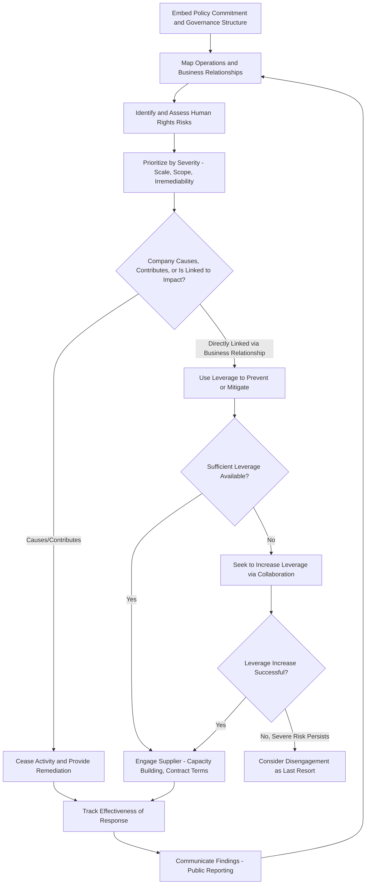

## Corporate Human Rights Due Diligence Frameworks

### Overview

Corporate human rights due diligence (HRDD) refers to the ongoing process by which companies identify, prevent, mitigate, and account for actual and potential adverse human rights impacts arising from their own operations, subsidiaries, and business relationships throughout their value chain. Unlike sector- or commodity-specific regimes (conflict minerals, forced labor product bans), HRDD frameworks are horizontal in scope, applying the same underlying process logic across the full range of potential human rights impacts — labor rights, forced and child labor, health and safety, indigenous rights, land rights, and community impacts — regardless of industry. This topic surveys the foundational soft-law instruments, their translation into binding legal obligations, the core methodological steps common across frameworks, and the practical challenges of implementation at scale.

### Foundational Soft-Law Instruments

**Key Points**

- **UN Guiding Principles on Business and Human Rights (UNGPs)**: Endorsed by the UN Human Rights Council in 2011, the UNGPs are the foundational framework underlying essentially all subsequent corporate HRDD regulation. They rest on three pillars: (1) the state duty to protect human rights, (2) the corporate responsibility to respect human rights, and (3) access to remedy for victims of business-related human rights abuse. The UNGPs are voluntary/non-binding as originally adopted, but have been progressively "hardened" into binding law through instruments like the CSDDD.
- **OECD Guidelines for Multinational Enterprises**: A broader responsible business conduct framework (covering human rights, labor, environment, anti-corruption, and other areas) adhered to by OECD member and several non-member governments, operationalized through National Contact Points that handle specific instance complaints against companies.
- **OECD Due Diligence Guidance for Responsible Business Conduct**: Provides the generalized due diligence methodology (distinct from the mineral-specific OECD guidance) that has become the reference methodology cited in EU regulatory guidance, including for the Forced Labour Regulation.
- **ILO Tripartite Declaration on Multinational Enterprises and Social Policy**: A labor-focused instrument addressing multinational enterprise responsibilities specifically regarding employment, training, working conditions, and industrial relations.

The UNGPs' second pillar — the "corporate responsibility to respect" — established the conceptual basis that due diligence is not merely a risk-management exercise for the company's own benefit, but an affirmative process obligation owed toward potentially affected rights-holders, a framing that subsequent binding legislation has built upon.

### The Common HRDD Process Architecture

**Key Points**

Despite variation in specific legal requirements across jurisdictions, most HRDD frameworks converge on a broadly common process architecture derived from the UNGPs and OECD guidance:

1. **Embed responsible business conduct into policies and management systems**: Establish a human rights policy commitment, integrate it into governance structures, and assign organizational responsibility.
2. **Identify and assess adverse impacts**: Map operations and business relationships to identify where human rights risks are most severe, considering both the likelihood and severity (scale, scope, and irremediability) of potential impacts.
3. **Cease, prevent, or mitigate adverse impacts**: Design and implement responses proportionate to the significance of identified risks, prioritizing prevention over remediation after the fact.
4. **Track implementation and results**: Monitor whether risk mitigation measures are actually effective, using both internal tracking and qualitative feedback from affected stakeholders.
5. **Communicate how impacts are addressed**: Publicly report on due diligence processes and outcomes, providing transparency to investors, civil society, and affected communities.
6. **Provide for or cooperate in remediation**: Where the company has caused or contributed to an adverse impact, provide or cooperate in legitimate remediation processes for affected rights-holders.

This structure explains why due diligence is described as an ongoing, iterative *process* rather than a one-time compliance checklist — risk assessment must be repeated as operations, geographies, and business relationships change over time.

### Severity and Prioritization Logic

**Key Points**

- **Salience over materiality**: A foundational UNGP concept is that human rights due diligence should prioritize risks based on their *salience* — the severity of risk to people — rather than conventional financial materiality to the company; a low-financial-exposure supplier relationship can still represent a high-salience human rights risk if the potential impact on affected workers or communities is severe.
- **Severity assessment factors**: Standard guidance directs companies to assess severity based on **scale** (how grave the impact is), **scope** (how many individuals are or could be affected), and **irremediability** (how difficult it would be to restore affected persons to their prior situation) — with likelihood as a secondary factor once severity has been assessed.
- **Leverage as a response variable**: Where a company identifies a severe risk but has limited direct leverage over the entity causing it (e.g., a distant sub-tier supplier), guidance generally directs the company to seek to increase leverage (through contract terms, industry collaboration, or capacity building) rather than simply disengaging, reflecting UNGP guidance that disengagement should generally be a last resort given its potential to leave affected workers worse off.

### From Soft Law to Binding Obligation: Regulatory Translation

| Instrument | Legal Status | Core Mechanism | Geographic Reach |
| --- | --- | --- | --- |
| UN Guiding Principles | Voluntary (soft law) | Process framework, no enforcement | Global reference standard |
| OECD Guidelines for MNEs | Voluntary, with grievance mechanism | National Contact Point specific instance procedure | OECD-adhering states |
| French Duty of Vigilance Law (2017) | Binding national law | Civil liability for failure to establish vigilance plan | Large French companies |
| German Supply Chain Due Diligence Act (LkSG) | Binding national law | Administrative fines, public procurement exclusion | Large companies operating in Germany |
| EU CSDDD | Binding EU directive (national transposition) | Civil liability, administrative penalties | Large EU and non-EU companies meeting thresholds |
| UK Modern Slavery Act | Binding disclosure requirement only | Reputational; no substantive due diligence mandate | Large UK-operating companies |

[Inference: this table presents general structural comparison; specific current thresholds, penalty regimes, and any recent amendments (particularly given the EU CSDDD's Omnibus I revisions) should be verified against current national legal text for any compliance-specific determination.]

### National Precursor Laws

**French Duty of Vigilance Law (Loi de Vigilance, 2017)**

Widely regarded as the first binding national HRDD law with civil liability exposure, requiring large French companies to establish and publish a "vigilance plan" identifying and preventing severe human rights and environmental risks across their own operations, subsidiaries, and the operations of subcontractors and suppliers with which they maintain an established commercial relationship. Failure to establish an adequate plan, or to properly implement it, can give rise to civil liability for resulting harm — establishing a legal template subsequently referenced in EU-level CSDDD negotiations.

**German Supply Chain Due Diligence Act (Lieferkettensorgfaltspflichtengesetz, LkSG)**

Entered into force in 2023, requiring large companies operating in Germany to conduct risk-based due diligence across their own business area and direct suppliers, with expanded obligations for indirect suppliers triggered by substantiated knowledge of risk — establishing a risk-tiered approach to supply chain depth that influenced subsequent EU-level scope debates over how far due diligence obligations should extend into indirect (sub-tier) relationships.

### HRDD Process Flow

### Grievance Mechanisms and Access to Remedy

**Key Points**

- **Third pillar obligation**: The UNGPs' third pillar establishes that companies should provide or participate in effective grievance mechanisms allowing affected individuals to raise concerns and seek remedy, complementing state-based judicial remedy.
- **UNGP effectiveness criteria for non-judicial grievance mechanisms**: Legitimate, accessible, predictable, equitable, transparent, rights-compatible, a source of continuous learning, and based on engagement and dialogue with affected stakeholders — a widely cited checklist for evaluating whether a company-level grievance mechanism is genuinely functional rather than nominal.
- **Operational-level vs. judicial remedy**: Company-operated grievance mechanisms are intended to complement, not substitute for, access to state-based judicial or non-judicial remedy (such as National Contact Point procedures or civil litigation), particularly for the most severe impacts.

### Implementation Challenges

**Key Points**

- **Sub-tier supply chain visibility**: As with forced labor and conflict minerals due diligence, HRDD frameworks face the structural challenge that most companies have limited direct contractual visibility beyond Tier 1 suppliers, requiring collaborative industry mechanisms, risk-based prioritization, or leverage-building strategies to extend meaningful due diligence deeper into the value chain.
- **Resource asymmetry between large and small companies**: Comprehensive HRDD processes (risk mapping, stakeholder engagement, grievance mechanism operation, audit) require substantial dedicated compliance resources, creating disproportionate burden concerns for smaller companies — a recurring theme in EU-level scope-narrowing debates (reflected in the CSDDD's Omnibus I revisions limiting deep-tier scrutiny to cases with plausible risk indicators).
- **Tension between standardization and context-specificity**: A generalized process framework applicable across all sectors and geographies must be adapted to highly context-specific risk profiles (e.g., indigenous land rights risk in extractives versus forced labor risk in electronics assembly), creating implementation variability that can complicate cross-company comparison and enforcement consistency.
- **Civil liability standard variation**: Jurisdictions differ significantly in whether and how failure to conduct adequate due diligence translates into civil liability for resulting harm (French duty of vigilance and the CSDDD both include civil liability mechanisms, though CSDDD liability provisions were also narrowed under Omnibus I), creating cross-border legal uncertainty for multinational companies.
- **Distinguishing due diligence from guarantee**: A frequently emphasized clarification in HRDD guidance is that conducting due diligence is a *process* obligation (a genuine, good-faith effort to identify and address risk) rather than a *guarantee* that no adverse impact will ever occur in a company's value chain — a distinction relevant both to legal liability standards and to realistic stakeholder expectations of what due diligence can achieve.

### Relationship to Sector-Specific Regimes

**Example**

A company subject to the CSDDD's general HRDD obligation, and also sourcing 3TG minerals from the DRC region, and also importing goods potentially linked to Xinjiang, faces three overlapping but methodologically related obligations: the CSDDD's general human rights and environmental due diligence process, the OECD conflict minerals due diligence guidance specific to 3TG sourcing, and UFLPA's rebuttable presumption evidentiary requirement for China-linked goods. While each has distinct legal triggers and evidentiary standards, all three share the same underlying UNGP-derived process logic (risk identification, prioritization by severity, mitigation, tracking, reporting), allowing a well-designed company-wide due diligence system to serve as the common infrastructure underlying compliance with all three simultaneously, even though full compliance still requires satisfying each regime's specific evidentiary and disclosure requirements individually.

**Related Topics**

- UN Guiding Principles on Business and Human Rights: three-pillar framework
- OECD Due Diligence Guidance for Responsible Business Conduct
- French Duty of Vigilance Law and civil liability precedent
- German Supply Chain Due Diligence Act (LkSG) risk-tiered approach
- EU CSDDD scope and Omnibus I amendments
- Grievance mechanism design and UNGP effectiveness criteria
- Severity assessment methodology: scale, scope, irremediability
- Leverage-building strategies for sub-tier supplier engagement
- Forced labor risk in global supply chains (sector-specific application)
- Conflict minerals due diligence as a commodity-specific HRDD application