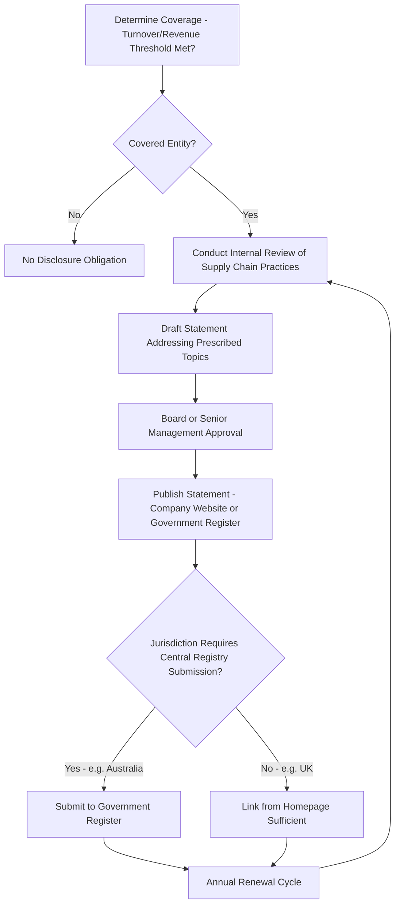

## Supply Chain Transparency Legislation and Disclosure Requirements

### Overview

Supply chain transparency legislation encompasses the family of legal instruments that require companies to publicly disclose information about human rights, labor, and environmental conditions in their supply chains, distinct from — though often overlapping with — substantive due diligence mandates or product import bans. The defining feature of disclosure-based regimes is that they generally do not prohibit any particular sourcing practice or product; instead, they compel public reporting intended to create market, investor, and reputational pressure for improved practices through transparency itself. This topic surveys the major disclosure regimes, their common structural elements, their relationship to substantive due diligence and product-ban instruments, and the debates over disclosure-only regulation's effectiveness.

### Disclosure vs. Due Diligence vs. Product Ban: A Structural Distinction

**Key Points**

- **Disclosure-only regimes** (e.g., UK Modern Slavery Act, Australia Modern Slavery Act, California Transparency in Supply Chains Act) require companies to report on the steps taken (or not taken) to address supply chain risk, without mandating any particular substantive action or minimum standard of due diligence.
- **Due diligence mandate regimes** (e.g., EU CSDDD, French Duty of Vigilance Law, German LkSG) require companies to actually conduct a defined due diligence process, with disclosure as one component alongside substantive risk identification and mitigation obligations.
- **Product ban / import restriction regimes** (e.g., UFLPA, EU Forced Labour Regulation) prohibit market access for goods linked to forced labor, using disclosure/documentation primarily as evidence in enforcement rather than as the primary compliance mechanism itself.
- These categories are not mutually exclusive in practice: many due diligence mandate regimes include disclosure components, and disclosure regimes are sometimes viewed as a policy stepping-stone toward eventual due diligence mandates, as illustrated by the UK and Australian acts predating the more substantive EU CSDDD.

### Major Disclosure-Based Regimes

**UK Modern Slavery Act 2015 (Section 54, Transparency in Supply Chains)**

Requires commercial organizations above a specified turnover threshold operating in the UK to publish an annual "slavery and human trafficking statement" describing steps taken during the financial year to ensure slavery and human trafficking are not occurring in their own business or supply chains, or explicitly stating that no such steps have been taken. The statement must be approved by the board (or equivalent) and published on the organization's website with a link in a prominent place on the homepage. Notably, the Act specifies required *topics* a statement should address (organizational structure, policies, due diligence processes, risk assessment, training, effectiveness measurement) but does not mandate that the company actually undertake any of these steps — a company can technically comply by disclosing that it has done little or nothing.

**Australia Modern Slavery Act 2018**

Similarly requires covered entities (defined by an annual consolidated revenue threshold) to submit an annual modern slavery statement addressing seven mandatory criteria: reporting entity structure and operations, supply chains, modern slavery risks, actions taken to assess and address those risks, effectiveness of those actions, consultation process (for group statements), and any other relevant information. Statements are submitted to a government-maintained public register — a centralized disclosure repository feature not present in the UK regime, which relies on decentralized publication on individual company websites.

**California Transparency in Supply Chains Act (2010)**

An early precursor disclosure law requiring large retailers and manufacturers doing business in California to disclose their efforts to eradicate slavery and human trafficking from their supply chains, covering similar disclosure topics (verification, audits, certification, internal accountability, training) to the subsequently enacted UK and Australian statutes, and often cited as an influential model for those later regimes.

### Comparative Disclosure Regime Structure

| Regime | Threshold Basis | Reporting Mechanism | Mandatory Substantive Action? | Central Registry? |
| --- | --- | --- | --- | --- |
| UK Modern Slavery Act | Annual turnover threshold | Company website publication | No — disclosure of steps taken (or not taken) | No |
| Australia Modern Slavery Act | Annual consolidated revenue threshold | Government-maintained public register | No — disclosure against seven criteria | Yes |
| California Transparency Act | Annual worldwide gross receipts threshold | Company website publication | No — disclosure of specified efforts | No |
| EU CSDDD (contrast) | Turnover/employee thresholds (narrowed by Omnibus I) | Due diligence statement + reporting | Yes — mandatory due diligence process | Varies by member state |

[Inference: specific current turnover/revenue thresholds for each regime should be verified against current statutory text, as these are subject to periodic legislative amendment and the figures themselves are not treated here as fixed.]

### Common Structural Elements Across Disclosure Regimes

**Key Points**

- **Board-level or senior management approval and sign-off requirement**: Most disclosure statutes require the disclosure statement to be approved at board or equivalent senior governance level, intended to ensure organizational accountability rather than treating the statement as a routine compliance filing handled solely by lower-level compliance staff.
- **Prescribed disclosure topics rather than prescribed actions**: A recurring pattern (UK, Australia, California) is that statutes specify categories of information a statement should address (organizational structure, risk assessment, training, effectiveness) without mandating minimum performance on any category — a structural feature central to subsequent criticism of these regimes' enforcement teeth.
- **Public accessibility requirement**: Nearly all disclosure regimes require statements to be publicly accessible (via company website or government register), reflecting the underlying theory of change that transparency itself, absent direct government enforcement of substantive standards, will generate sufficient market and civil society pressure to drive improved practice.
- **Absence of direct penalty for statement content**: A defining and frequently criticized feature is that these regimes generally impose no penalty for the *substance* of what a company discloses — a company can comply by publishing a statement acknowledging minimal action — with penalties, where they exist, typically attaching only to complete failure to publish any statement at all, not to inadequate substantive content.

### Disclosure Compliance Process

### Effectiveness Debates

**Key Points**

- **"Race to the bottom" disclosure concern**: Because disclosure-only regimes impose no substantive minimum standard, critics argue companies face limited incentive to disclose meaningfully poor performance candidly, potentially producing boilerplate or superficially compliant statements that satisfy the letter of the law without substantively addressing underlying risk.
- **Civil society and investor monitoring as the enforcement substitute**: Absent direct government enforcement of statement quality, the practical accountability mechanism for disclosure regimes relies heavily on civil society organizations, journalists, and investors independently reviewing and comparing published statements — an indirect enforcement pathway whose effectiveness depends on the capacity and attention of those external monitors rather than a state regulator.
- **Central registry as a partial effectiveness enhancement**: The Australian model's centralized public register is generally regarded as facilitating easier comparison across companies and sectors relative to the UK's decentralized website-publication model, potentially strengthening the practical transparency benefit even without adding substantive enforcement teeth.
- **Disclosure regimes as a policy precursor rather than endpoint**: The evolution from disclosure-only regimes (UK 2015, Australia 2018) toward substantive due diligence mandates (EU CSDDD) is frequently characterized in policy literature as a deliberate escalation — disclosure regimes generated baseline transparency and normalized the concept of supply chain human rights reporting, which then created the informational and political foundation for subsequent binding due diligence legislation. [Inference: whether this represents a deliberate, coordinated policy escalation strategy across jurisdictions, or simply independent parallel regulatory evolution, is a matter of policy interpretation rather than an established fact.]
- **Review and reform proposals**: Both the UK and Australian modern slavery acts have been subject to periodic government-commissioned reviews assessing whether disclosure-only structures should be strengthened with mandatory due diligence elements or penalties for inadequate statement content; [Unverified: the current status and outcome of any such reform proposals should be checked against the latest government publications in each jurisdiction, as legislative reform in this area has been actively discussed but implementation status varies.]

### Interaction with Financial Disclosure and ESG Reporting Regimes

**Key Points**

- **Convergence with sustainability reporting**: Supply chain transparency disclosure increasingly intersects with broader corporate sustainability reporting regimes (e.g., the EU's Corporate Sustainability Reporting Directive, CSRD), which require broader environmental, social, and governance disclosure of which supply chain human rights information forms one component — creating potential overlap and consolidation opportunities between historically separate disclosure obligations.
- **Investor-driven disclosure demand**: Beyond legally mandated disclosure, institutional investors increasingly request supply chain human rights disclosure through voluntary frameworks and shareholder engagement, creating a disclosure expectation that in some cases exceeds strict legal minimums, particularly for large, publicly traded companies subject to significant investor scrutiny.
- **SEC Conflict Minerals disclosure as a comparative U.S. model**: The Dodd-Frank Section 1502 conflict minerals disclosure requirement represents a narrower, commodity-specific U.S. analog to the broader modern slavery statement regimes — mandatory disclosure via SEC filing rather than voluntary website publication, illustrating that disclosure-based regulation is not a single uniform model but varies in specificity, filing mechanism, and regulatory authority across different national and commodity contexts.

### Practical Compliance Considerations for Multinational Companies

**Key Points**

- **Multi-jurisdictional statement consolidation**: A multinational company operating across the UK, Australia, and California may produce a single consolidated statement addressing the combined disclosure topics of all applicable regimes, provided it satisfies each jurisdiction's specific procedural requirements (board approval, registry submission, homepage linking) individually.
- **Disclosure quality as reputational risk management**: Even absent direct penalty for statement substance, companies increasingly treat disclosure quality as a reputational and investor-relations consideration, given active civil society and media scrutiny of comparative statement quality across industry peers.
- **Relationship to underlying due diligence system**: Where a company is also subject to substantive due diligence obligations (CSDDD, LkSG) or product-ban regimes (UFLPA, EUFLR) in other markets, the disclosure statement can typically draw on the same underlying due diligence documentation and risk assessment work, reducing duplicative compliance effort even though each regime's specific disclosure format and required content differs.

**Related Topics**

- UK Modern Slavery Act Section 54 statement requirements
- Australia Modern Slavery Act central register and seven mandatory criteria
- California Transparency in Supply Chains Act as an early disclosure model
- Corporate human rights due diligence frameworks (substantive obligation comparison)
- EU Corporate Sustainability Reporting Directive (CSRD) convergence
- SEC Conflict Minerals Report filing requirements under Dodd-Frank Section 1502
- Civil society and investor monitoring of disclosure statement quality
- Comparative analysis of disclosure-based vs. due-diligence-based regulatory models
- EU CSDDD as an evolution from disclosure toward mandatory due diligence
- Boilerplate disclosure risk and statement quality assessment methodologies