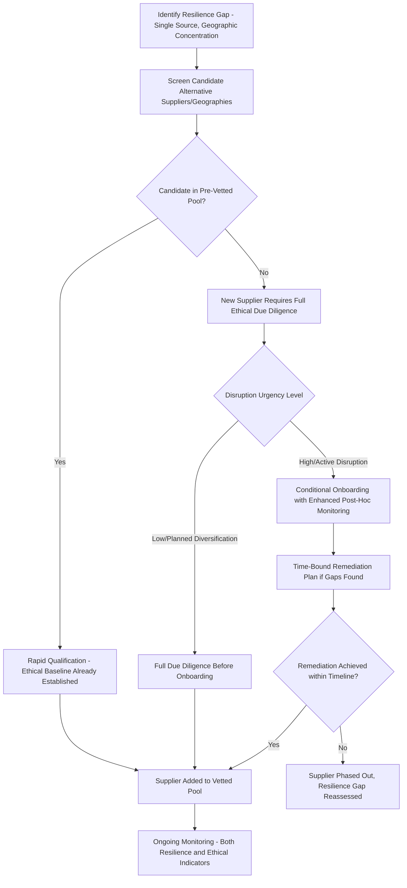

## Balancing Ethical Sourcing with Supply Chain Resilience Goals

### Overview

Ethical sourcing and supply chain resilience are often treated as complementary objectives in corporate and policy rhetoric, but in practice they frequently generate genuine trade-offs that procurement and supply chain leaders must actively manage. Ethical sourcing prioritizes verified compliance with labor, human rights, and environmental standards, often favoring known, auditable, geographically concentrated supplier relationships. Resilience prioritizes redundancy, diversification, and rapid reconfiguration capability in the face of disruption — objectives that can push toward *more* supplier diversity and geographic spread, sometimes into higher-risk or less-audited jurisdictions. This topic examines where these objectives align, where they conflict, and the frameworks companies use to navigate the tension.

### Where the Objectives Align

**Key Points**

- **Long-term supplier relationships reduce both ethical and resilience risk**: Deep, longstanding supplier relationships with strong communication and capacity-building investment tend to produce both better labor practice outcomes (through sustained engagement rather than transactional audits) and better resilience (through supplier loyalty and priority allocation during shortages) — a genuine area of alignment rather than trade-off.
- **Supply chain visibility serves both goals simultaneously**: Investment in sub-tier mapping and traceability technology, originally driven by forced labor and conflict minerals compliance, produces the same visibility infrastructure needed to identify resilience vulnerabilities (single-source dependencies, geographic concentration risk) — a case where compliance-driven investment has a genuine resilience dividend.
- **Supplier diversification within a vetted pool supports both objectives**: Building a diversified base of pre-vetted, ethically compliant suppliers (rather than diversifying opportunistically into unvetted new suppliers during a crisis) allows companies to pursue resilience-driven diversification without sacrificing ethical sourcing standards — the central design principle behind most "resilient and responsible" sourcing strategies.

### Where the Objectives Conflict

**Key Points**

- **Speed of qualification vs. depth of vetting**: Resilience often demands rapid supplier onboarding during disruption (a war, a natural disaster, a sanctions event) to restore supply continuity, while rigorous ethical sourcing due diligence — sub-tier mapping, worker interviews, independent audit — takes considerable time, creating pressure to shortcut vetting precisely when the operational need to onboard quickly is highest.
- **Geographic diversification into higher-risk jurisdictions**: Reducing single-country concentration risk (a core resilience strategy following disruptions like COVID-19 supply shocks or Red Sea shipping disruptions) sometimes means expanding sourcing into new geographies with less mature labor rights enforcement infrastructure, less established audit ecosystems, or higher documented forced labor risk than the geographies being diversified away from.
- **Second-source qualification cost trade-off against audit depth**: Establishing a resilience-driven second or third source for a critical component requires investing qualification resources per new supplier; companies operating under fixed compliance budgets sometimes face a genuine choice between qualifying more suppliers with lighter-touch ethical vetting per supplier, or fewer suppliers with deeper vetting — a resource allocation trade-off rather than a false dilemma.
- **Nearshoring/friend-shoring vs. genuine labor standards improvement**: Reshoring or friend-shoring strategies pursued primarily for geopolitical or tariff-driven resilience reasons do not automatically improve labor standards outcomes; a nearshored facility can still exhibit forced labor risk indicators, meaning resilience-driven geographic strategy should not be assumed to substitute for continued ethical sourcing diligence.
- **Inventory buffering costs compete with compliance investment for the same budget**: Both resilience (safety stock, dual-sourcing premiums) and ethical sourcing (audit costs, supplier capacity-building investment) require capital investment that competes for the same finite procurement and supply chain budget, particularly acute for mid-sized companies without the scale of large multinational compliance functions.

### Decision Framework: Sequencing Resilience and Ethical Sourcing Decisions

### Approaches to Managing the Trade-Off

**Approach 1: Pre-Vetted Supplier Pool Expansion**

- Invest in ethical due diligence on a broader pool of potential suppliers *before* a disruption creates urgent need, rather than vetting reactively
- Maintain a standing shortlist of geographically diversified, pre-qualified suppliers meeting both resilience criteria (capacity, location, redundancy value) and ethical baseline standards

**Approach 2: Risk-Tiered Due Diligence Depth**

- Apply full-depth due diligence (sub-tier mapping, independent audit, worker voice mechanisms) only to the highest-risk sector/geography combinations
- Apply lighter-touch, faster-turnaround screening for lower-risk categories, preserving compliance resources for where they matter most while enabling faster resilience-driven onboarding elsewhere

**Approach 3: Conditional Onboarding with Time-Bound Remediation**

- Allow rapid onboarding during genuine supply emergencies with baseline screening only, paired with mandatory enhanced monitoring and a defined remediation timeline
- Treat conditional onboarding as inherently temporary, with a clear decision point at which the supplier must either meet full ethical standards or be phased out

**Approach 4: Industry Collaboration to Share Vetting Costs**

- Participate in multi-stakeholder audit-sharing initiatives (as with the Responsible Business Alliance in electronics or Better Cotton Initiative in textiles) so that ethical due diligence costs for a shared supplier base are distributed across multiple buying companies
- This reduces the marginal cost of adding a new, already-audited supplier to a resilience-diversification strategy, partially resolving the cost trade-off between audit depth and supplier count

### Case Illustration: Post-Disruption Diversification Tension

**Example**

Following a major single-region manufacturing disruption, a company seeking rapid geographic diversification for a critical electronic component faces two imperfect paths: qualify a new supplier in an alternative region quickly to restore supply continuity, accepting reduced ethical due diligence depth in the near term, or maintain full due diligence rigor and accept prolonged supply disruption while vetting is completed. Companies that had previously invested in a pre-vetted supplier pool spanning multiple geographies were able to avoid this dilemma entirely by activating an already-qualified alternative source — illustrating why the *timing* of ethical due diligence investment (proactive versus reactive) is often the decisive factor determining whether the trade-off materializes at all.

### Regulatory Pressure Shaping the Balance

**Key Points**

- **Due diligence mandates constrain rapid, unvetted onboarding**: Binding due diligence regimes (EU CSDDD, German LkSG) create legal exposure for onboarding new suppliers without adequate risk assessment, meaning companies subject to these regimes cannot treat rapid, lightly-vetted resilience diversification as a compliance-free option even during genuine supply emergencies.
- **Product ban regimes create asymmetric risk depending on diversification direction**: A company diversifying *away* from a UFLPA-flagged or high-risk region for resilience reasons faces reduced forced-labor compliance risk as a side effect; a company diversifying *toward* an under-vetted new geography for resilience reasons may inadvertently increase forced-labor compliance exposure — meaning the compliance and resilience incentives can point in the same or opposite directions depending on the specific diversification path chosen.
- **Friend-shoring policy incentives do not guarantee ethical outcomes**: Government incentives favoring nearshoring or allied-country sourcing (relevant to the broader "friend-shoring" trend discussed in dual-use and critical minerals supply chain contexts) are motivated primarily by geopolitical and security considerations rather than labor standards, meaning companies pursuing friend-shoring for resilience or policy-incentive reasons should not assume labor risk is automatically lower in the new location without independent verification.

### Metrics and Governance for Balancing Both Objectives

**Key Points**

- **Dual scorecarding**: Leading procurement organizations increasingly track resilience metrics (single-source dependency ratios, geographic concentration indices, lead-time buffers) and ethical sourcing metrics (audit conformance rates, worker grievance resolution rates, sub-tier mapping coverage) as parallel, co-equal dashboards rather than folding ethical sourcing into a subordinate compliance checkbox within a resilience-first strategy.
- **Board and executive-level joint ownership**: Because both resilience and ethical sourcing failures can produce material financial, legal, and reputational consequences, governance structures increasingly place both under shared executive accountability (e.g., a chief supply chain officer or chief procurement officer with both mandates) rather than siloing ethical sourcing solely within a corporate social responsibility function disconnected from core sourcing strategy decisions.
- **Scenario planning that models both disruption and compliance risk jointly**: Mature supply chain risk functions increasingly run combined scenario models — assessing how a given diversification decision would perform under both a geopolitical/natural disaster disruption scenario and a forced-labor enforcement action scenario — rather than modeling resilience and compliance risk as entirely separate planning exercises. [Inference: the degree to which this joint-scenario-planning practice has become standard versus remaining an emerging best practice varies significantly by company size and industry maturity, and specific adoption rates should not be treated as established without current industry survey data.]

**Related Topics**

- Supply chain risk mitigation approaches for forced labor (pre-vetted pool, remediation-centered response)
- Friend-shoring and allied industrial base diversification strategy
- Responsible Minerals Initiative and shared industry audit infrastructure
- Corporate human rights due diligence frameworks and leverage-building strategies
- Single-source dependency risk assessment methodology
- EU CSDDD and German LkSG onboarding compliance obligations
- Sub-tier supply chain mapping and traceability technology investment
- Post-COVID and Red Sea disruption diversification case studies
- Dual scorecarding and joint governance models for procurement risk
- Scenario planning integrating geopolitical and human rights risk factors