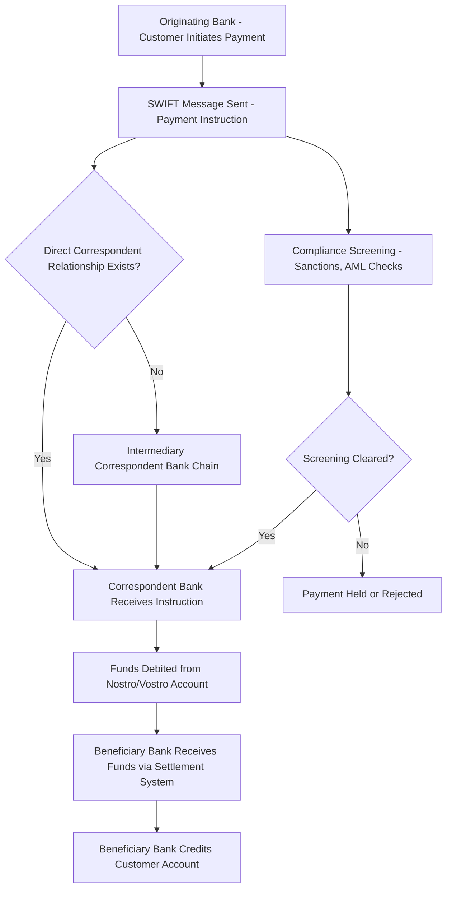

## SWIFT and the Architecture of Global Payments

### Overview

The Society for Worldwide Interbank Financial Telecommunication (SWIFT) is a member-owned cooperative headquartered in Belgium that operates the dominant global messaging network for interbank financial communication. SWIFT itself does not hold funds, clear payments, or settle transactions — it is fundamentally a secure, standardized messaging system that instructs financial institutions to move money, with actual settlement occurring through correspondent banking relationships and central bank payment systems. Its centrality to global finance, combined with its governance structure and jurisdictional exposure, has made SWIFT a focal point of monetary geopolitics, most visibly through its use as a sanctions enforcement instrument.

### What SWIFT Actually Is (and Is Not)

**Key Points**

- **A messaging network, not a payment system**: SWIFT transmits standardized, authenticated financial messages (payment instructions, letters of credit, securities transactions) between financial institutions; it does not itself hold accounts, transfer funds, or perform settlement.
- **Settlement occurs elsewhere**: Actual movement of funds happens through correspondent banking relationships (banks holding accounts with one another, "nostro/vostro" accounts) and through national real-time gross settlement (RTGS) systems and central bank payment infrastructure — SWIFT messages instruct these underlying settlement mechanisms but are distinct from them.
- **Cooperative governance structure**: SWIFT is organized as a member-owned cooperative under Belgian law, governed by a board of directors drawn from member financial institutions across represented countries, with oversight additionally exercised by a group of central banks (the "G10" central bank oversight group led by the National Bank of Belgium, with the U.S. Federal Reserve and other major central banks participating) — a governance structure that matters significantly for understanding how sanctions-driven disconnection decisions are made and by whom.
- **Global reach and scale**: SWIFT connects thousands of financial institutions across more than 200 countries and territories, carrying millions of messages daily, making it the de facto global standard for interbank financial messaging despite the existence of alternative and competing systems.

### Message Types and Standards

**Key Points**

- **MT message standards**: SWIFT's legacy messaging format (e.g., MT103 for single customer credit transfers, MT202 for interbank transfers) has been the longstanding backbone of cross-border payment instructions.
- **ISO 20022 migration**: The global financial messaging industry, including SWIFT, has been migrating toward the ISO 20022 message standard, which carries substantially richer structured data (enabling better compliance screening, reconciliation, and straight-through processing) than the legacy MT format. [Unverified: the specific current migration completion timeline and coexistence period details should be checked against SWIFT's latest published migration guidance, as this has been a multi-year phased transition with periodically adjusted deadlines.]
- **SWIFT gpi (global payments innovation)**: An enhancement layer providing payment tracking, transparency on fees and timing, and same-day use of funds for participating institutions, addressing longstanding criticisms of cross-border payment opacity and unpredictable settlement times.

### The Correspondent Banking Relationship

### SWIFT as a Sanctions Enforcement Instrument

**Key Points**

- **Disconnection as a geopolitical tool**: Removing specific banks or an entire national banking system from SWIFT access — as occurred with select Iranian banks in 2012 and a substantial portion of the Russian banking system following the 2022 invasion of Ukraine — does not itself freeze assets or block all financial activity, but severely degrades the speed, cost, and reliability of that institution's or country's ability to conduct cross-border transactions, since alternative messaging channels (fax, telex, bilateral arrangements) are far less efficient at scale.
- **Governance mechanics of disconnection**: Because SWIFT is a Belgian cooperative subject to EU law, sanctions-driven disconnection decisions are implemented through EU regulatory designation (and in the U.S. context, through parallel Treasury/OFAC sanctions designations that create legal risk for SWIFT and its member banks if they continue serving designated entities) rather than through SWIFT acting as an independent political decision-maker — SWIFT itself has historically emphasized that it complies with applicable legal and regulatory requirements rather than unilaterally choosing which countries to disconnect based on its own judgment.
- **Effectiveness debate**: Disconnection is widely regarded by economists and policy analysts as a highly disruptive but not fully comprehensive sanctions tool — affected countries and banks generally seek workarounds (bilateral currency arrangements, alternative messaging systems, trade in currencies and through intermediary jurisdictions not subject to the same restrictions), meaning disconnection substantially raises transaction costs and friction without completely eliminating the ability to transact internationally. [Inference: the precise magnitude of continued transaction capability following major disconnection events, such as the 2022 Russian banking sanctions, is a matter of ongoing empirical analysis and should be assessed against current economic research rather than treated as settled.]
- **Extraterritorial legal exposure**: Because SWIFT and many of its major member banks have exposure to U.S. dollar clearing and U.S. jurisdiction (even for non-U.S. banks, given the centrality of the U.S. dollar in global trade finance), secondary sanctions risk creates strong incentive for SWIFT member institutions to comply with U.S.-driven sanctions designations even absent a formal EU disconnection decision, illustrating how dollar centrality (discussed further under reserve currency dynamics) reinforces SWIFT-based sanctions enforcement.

### Comparative and Alternative Payment Messaging Systems

**Key Points**

- **Russia's SPFS (System for Transfer of Financial Messages)**: Developed by the Central Bank of Russia beginning around 2014 (following initial concerns about potential SWIFT disconnection after Crimea-related sanctions) as a domestic alternative messaging system, subsequently extended to some international counterparties, though with substantially smaller network reach than SWIFT. [Unverified: current SPFS international adoption scope should be verified against recent reporting, as its extension to non-Russian counterparties has been a gradually evolving and geopolitically sensitive area.]
- **China's CIPS (Cross-Border Interbank Payment System)**: A renminbi-denominated cross-border payment and settlement infrastructure developed to reduce reliance on the U.S. dollar-centric correspondent banking system and SWIFT for renminbi-denominated trade settlement; CIPS handles both messaging and settlement functions for RMB transactions, distinguishing it structurally from SWIFT's pure-messaging role, though CIPS participants often still use SWIFT messaging alongside CIPS settlement rather than as a complete substitute. [Inference: the degree to which CIPS functions as a genuine SWIFT alternative versus a complementary settlement layer that still relies on SWIFT messaging for many participants is a matter of ongoing evolution and should be checked against current usage data.]
- **Bilateral and regional payment arrangements**: Various bilateral currency swap lines and regional payment integration initiatives (e.g., discussions around BRICS-linked payment infrastructure) have been proposed or developed as further diversification away from SWIFT/dollar-centric infrastructure, though the practical scale and interoperability of these alternatives relative to SWIFT's established network effects remains a genuinely contested and evolving area. [Speculation: claims about the near-term viability of these alternatives as comprehensive SWIFT substitutes should be treated with caution given SWIFT's substantial network effect advantages and the technical/trust infrastructure required to replicate its function at global scale.]

### Network Effects and the Difficulty of Building Alternatives

**Key Points**

- **Two-sided network effect**: SWIFT's value to any given bank increases with the number of other banks already connected, creating a strong incumbency advantage that makes alternative systems difficult to scale even when there is significant political motivation to do so — a classic network-effect dynamic analogous to other global standard-setting infrastructure.
- **Trust and compliance infrastructure as a barrier to entry**: Beyond raw connectivity, SWIFT's decades of accumulated compliance screening integration, message standardization, and dispute-resolution processes represent institutional infrastructure that alternative systems must also replicate to be genuinely competitive, not merely technical messaging capability.
- **Fragmentation risk for the broader financial system**: A widely discussed concern among policymakers and financial stability analysts is that proliferation of competing, non-interoperable payment messaging systems (SWIFT, CIPS, SPFS, and potential future alternatives) could reduce global financial system efficiency and increase compliance complexity for banks operating across multiple jurisdictions, even as individual countries pursue such alternatives for sanctions-resilience or strategic autonomy reasons.

### Case Study: 2022 Russian Bank SWIFT Disconnection

**Example**

Following Russia's 2022 invasion of Ukraine, the EU, in coordination with the U.S., UK, and other allies, moved to disconnect a substantial number of major Russian banks from SWIFT, implemented through EU regulatory designation given SWIFT's Belgian jurisdictional basis. Some Russian banks, particularly those involved in energy trade settlement, were initially exempted or later added in phases, reflecting a deliberate policy calibration to balance sanctions pressure against the practical goal of maintaining certain continued trade flows (such as energy payments to some jurisdictions) during the transition period. [Unverified: the specific current list of disconnected versus still-connected Russian banks, and any subsequent changes, should be checked against current EU sanctions regulation text, as this list has been subject to periodic amendment since 2022.]

### Strategic and Policy Implications

**Key Points**

- **SWIFT access as monetary-geopolitical leverage**: The 2022 Russia case reinforced global recognition that SWIFT access functions as a significant instrument of financial statecraft, accelerating interest among several non-Western economies in reducing dependency on SWIFT-and-dollar-centric infrastructure — a dynamic directly relevant to broader de-dollarization and reserve currency diversification discussions.
- **Tension between sanctions effectiveness and dollar/SWIFT centrality preservation**: Aggressive or frequent use of SWIFT disconnection as a sanctions tool creates a long-term incentive for affected and non-aligned states to invest in alternative infrastructure, potentially eroding the very centrality that makes SWIFT disconnection an effective sanctions tool in the first place — a strategic trade-off increasingly discussed among monetary policy and sanctions policy analysts. [Speculation: the extent to which this erosion dynamic will meaningfully materialize over the coming years, versus SWIFT's network effects proving durable despite sanctions-driven alternative-seeking, remains a genuinely open and debated question rather than a settled trend.]
- **Continued centrality of correspondent banking despite messaging alternatives**: Even where alternative messaging systems gain adoption, actual cross-border settlement still substantially depends on correspondent banking relationships often denominated in and cleared through U.S. dollars, meaning messaging-system diversification alone does not fully address underlying dollar-centric settlement dependency.

**Related Topics**

- Correspondent banking relationships and nostro/vostro account mechanics
- U.S. dollar centrality in global trade finance and reserve currency dynamics
- Sanctions enforcement mechanisms: OFAC designations and secondary sanctions
- China's Cross-Border Interbank Payment System (CIPS) and RMB internationalization
- Russia's SPFS and post-2014 payment infrastructure diversification
- ISO 20022 messaging standard migration and compliance screening implications
- De-dollarization debates and BRICS payment infrastructure proposals
- 2022 Russian sanctions: scope, phasing, and energy trade carve-outs
- Central bank digital currencies (CBDCs) as potential future payment infrastructure
- Network effects and incumbency advantage in global financial infrastructure