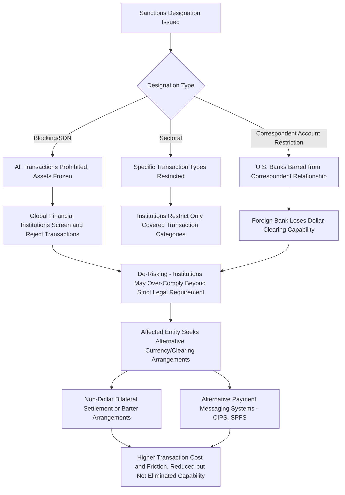

## Financial Sanctions and Exclusion from Payment Systems

### Overview

Financial sanctions and payment system exclusion constitute a category of statecraft distinct from, though related to, trade-based export controls: rather than restricting the physical movement of goods or technology, these measures restrict the movement of money, targeting a state, entity, or individual's ability to hold, transfer, or access financial assets and infrastructure. This chapter item surveys the legal and institutional architecture of financial sanctions (asset freezes, blocking designations, sectoral sanctions), the mechanics of payment system exclusion beyond SWIFT disconnection specifically, secondary sanctions and their extraterritorial reach, and the broader debate over sanctions effectiveness and circumvention.

### Categories of Financial Sanctions

**Key Points**

- **Asset freezes / blocking sanctions**: Prohibit transactions with a designated individual, entity, or government, and freeze any assets within the jurisdiction of the sanctioning authority; in the U.S. context, this is implemented through the Office of Foreign Assets Control (OFAC) Specially Designated Nationals and Blocked Persons (SDN) List.
- **Sectoral sanctions**: Rather than a comprehensive blocking designation, sectoral sanctions restrict specific types of transactions (e.g., new debt or equity financing above a certain maturity) with named entities in targeted economic sectors, allowing continued limited engagement while restricting particular high-impact financial activities — the U.S. Sectoral Sanctions Identifications (SSI) List operates on this model.
- **Correspondent and payable-through account sanctions**: Restrict or prohibit U.S. (or other jurisdiction) financial institutions from maintaining correspondent banking relationships with designated foreign banks, a mechanism that can functionally cut a foreign bank off from dollar-clearing capability without a formal blocking designation.
- **Sovereign debt and central bank asset restrictions**: Measures targeting a state's ability to issue new sovereign debt in sanctioning jurisdictions' markets, or freezing central bank reserve assets held abroad — the freezing of a substantial portion of Russian central bank foreign exchange reserves following the 2022 invasion of Ukraine is a prominent recent example of this category's scale and geopolitical significance.
- **Sanctions list types beyond SDN**: Additional U.S. Treasury/OFAC list categories (e.g., the Sectoral Sanctions Identifications List, the Non-SDN Menu-Based Sanctions List, and various country-specific and program-specific lists) create a layered compliance screening environment that financial institutions must navigate. [Unverified: the specific current list architecture and any newly created list categories should be checked against current OFAC published guidance, as new list types and programs are periodically introduced.]

### The "Dollar Clearing" Chokepoint

**Key Points**

- **Correspondent banking as the enforcement lever**: Because a substantial share of global trade and financial transactions are denominated in U.S. dollars, and because dollar-denominated transactions ultimately clear through the U.S. banking system (even when neither the originating nor beneficiary party is American), the U.S. Treasury's jurisdiction over any transaction touching the U.S. financial system gives it an unusually broad practical reach for sanctions enforcement, independent of SWIFT disconnection specifically.
- **De-risking behavior**: Financial institutions, facing significant compliance cost and legal risk from potential sanctions violations, frequently choose to terminate or decline entire categories of correspondent banking relationships with banks or regions perceived as high sanctions-risk — a phenomenon termed "de-risking" that can restrict financial access even for legitimate, non-sanctioned transactions in affected regions, a frequently cited unintended consequence of aggressive sanctions enforcement.
- **Distinction from SWIFT disconnection**: Dollar-clearing restriction operates independently of SWIFT messaging access — a bank could remain connected to SWIFT but be unable to process dollar-denominated transactions if U.S. correspondent banks refuse to clear for it, illustrating that payment system exclusion is a multi-layered phenomenon rather than a single on/off switch tied to any one piece of infrastructure.

### Legal Architecture of U.S. Financial Sanctions

**Key Points**

- **International Emergency Economic Powers Act (IEEPA)**: The primary statutory authority underlying most modern U.S. financial sanctions programs, granting the President authority to regulate international financial transactions in response to a declared national emergency involving an unusual and extraordinary threat.
- **OFAC administration**: The Treasury Department's Office of Foreign Assets Control administers and enforces sanctions programs, publishes designation lists, issues general and specific licenses (authorizations for otherwise-prohibited transactions), and pursues civil and criminal enforcement actions for violations.
- **Executive Orders and country/program-specific frameworks**: Individual sanctions programs (targeting specific countries, terrorism, narcotics trafficking, cyber activity, human rights abuses via Global Magnitsky sanctions, and others) are typically established through Executive Order, each with distinct designation criteria and licensing frameworks.
- **CAATSA and secondary sanctions statutory authority**: The Countering America's Adversaries Through Sanctions Act provides specific statutory authority for secondary sanctions targeting non-U.S. persons engaging in significant transactions with sanctioned Russian, Iranian, or North Korean entities, illustrated by its application to Turkey's F-35 program removal following its S-400 acquisition.

### Secondary Sanctions and Extraterritorial Reach

**Key Points**

- **Primary vs. secondary sanctions distinction**: Primary sanctions restrict U.S. persons and U.S.-jurisdiction transactions directly; secondary sanctions target non-U.S. persons for engaging in specified transactions with sanctioned parties, even absent any direct U.S. nexus, extending U.S. sanctions policy's practical reach far beyond U.S. territorial jurisdiction.
- **Mechanism of secondary sanctions leverage**: Secondary sanctions typically threaten the foreign violator with exclusion from the U.S. financial system or market — given dollar centrality and the practical necessity of U.S. market access for most globally active financial institutions and corporations, this threat carries substantial coercive weight even for entities with no direct U.S. operations.
- **Diplomatic friction from extraterritoriality**: Secondary sanctions have been a recurring source of friction with allied nations, particularly the European Union, which has periodically objected to U.S. secondary sanctions constraining EU companies' ability to conduct otherwise-lawful business (e.g., historical friction over Iran-related secondary sanctions affecting European firms), sometimes prompting EU "blocking statute" countermeasures intended to shield EU companies from U.S. secondary sanctions effects, with mixed practical effectiveness given the overriding practical importance of U.S. market access to most large EU companies. [Inference: the current practical efficacy of EU blocking statute mechanisms in fully insulating EU companies from U.S. secondary sanctions pressure remains limited and contested, and specific current cases should be checked against recent legal and policy analysis.]

### Payment System Exclusion Mechanics Beyond SWIFT

### Sanctions Evasion and Circumvention Patterns

**Key Points**

- **Shell companies and layered ownership structures**: Sanctioned individuals and entities frequently attempt to obscure beneficial ownership through complex corporate structures spanning multiple jurisdictions, complicating designation-matching and compliance screening.
- **Third-country intermediation**: Trade and financial flows are sometimes rerouted through non-sanctioning third countries that maintain financial relationships with the sanctioned party, a pattern documented in various sanctions evasion contexts (e.g., commodity trade rerouting, "shadow fleet" tanker operations in the context of oil price cap enforcement).
- **Cryptocurrency and alternative value transfer**: Sanctioned actors have explored cryptocurrency and other alternative value-transfer mechanisms to circumvent traditional correspondent banking chokepoints, prompting expanded OFAC and international regulatory attention to virtual asset service provider compliance obligations. [Unverified: the current scale and practical effectiveness of cryptocurrency-based sanctions evasion, relative to more traditional evasion methods, remains an actively studied and debated question, and should be checked against current financial intelligence and academic research rather than assumed to be a dominant evasion channel.]
- **Compliance and enforcement response**: Sanctioning authorities have responded with expanded designation of facilitating networks (not just primary targets), enhanced beneficial ownership transparency requirements, and increased information-sharing among allied sanctions authorities to counter these evasion patterns.

### Multilateral Coordination and Divergence

**Key Points**

- **Coordinated sanctions regimes**: Major sanctions actions (e.g., the 2022 Russia sanctions) have increasingly involved close coordination among the U.S., EU, UK, and other allied jurisdictions to maximize effectiveness and reduce circumvention opportunities through non-aligned jurisdictions — reflecting lessons learned from earlier, less-coordinated sanctions episodes where divergent national approaches created evasion opportunities.
- **UN Security Council sanctions as the multilateral baseline**: UN Security Council sanctions resolutions represent the most broadly multilateral sanctions authority, binding on all UN member states, though subject to potential veto by permanent Security Council members, which has constrained UN-level sanctions action on some major geopolitical conflicts where a permanent member has significant interest.
- **Divergence risk**: Where major economies (the U.S., EU, China, and others) pursue different sanctions postures toward the same target, sanctioned entities can potentially exploit jurisdictions maintaining continued financial relationships, illustrating why coordinated multilateral sanctions design is generally regarded as more effective than unilateral action, though coordination itself carries diplomatic negotiation cost and can result in a less stringent common denominator than a single actor's preferred sanctions intensity.

### Effectiveness and Cost-Benefit Debate

**Key Points**

- **Behavioral change vs. humanitarian cost trade-off**: A long-standing debate in sanctions policy literature concerns whether broad financial sanctions achieve their intended behavioral or policy change objectives relative to the humanitarian and economic costs borne by the general population of the targeted country, particularly for comprehensive sanctions regimes versus more narrowly targeted designations aimed at specific individuals or entities.
- **Targeted/"smart" sanctions as a policy response to this critique**: The evolution toward individually targeted designations (asset freezes on specific officials, entities, or sectors) rather than broad country-wide trade embargoes reflects a policy response intended to concentrate costs on responsible actors while minimizing broader humanitarian impact, though the practical effectiveness of this targeting in fully avoiding broader economic spillover remains debated.
- **Sanctions fatigue and diminishing marginal effectiveness**: Some analysts argue that increasingly frequent use of financial sanctions as a foreign policy tool risks a long-term diminishing effectiveness dynamic, as repeatedly sanctioned states invest more systematically in resilience infrastructure (alternative payment systems, reserve diversification, trade relationship diversification) over time. [Speculation: whether this diminishing-effectiveness dynamic is empirically significant at a systemic level, versus financial sanctions retaining substantial coercive effectiveness in specific well-designed cases, remains a genuinely contested question in sanctions policy research rather than a settled conclusion.]
- **Measurement difficulty**: Rigorously measuring sanctions effectiveness is methodologically difficult because the intended counterfactual (what would have happened absent sanctions) is inherently unobservable, and sanctions are frequently deployed alongside other policy instruments (diplomatic pressure, military assistance, export controls) making attribution of any observed outcome to financial sanctions specifically a genuinely contested empirical exercise.

**Related Topics**

- SWIFT disconnection mechanics and governance (specific messaging-system exclusion)
- OFAC SDN List, Sectoral Sanctions Identifications List, and licensing procedures
- CAATSA secondary sanctions and the Turkey F-35/S-400 case
- De-risking behavior and correspondent banking access reduction in emerging markets
- Russian central bank reserve freeze and sovereign asset immobilization
- Oil price cap enforcement and "shadow fleet" evasion patterns
- Virtual asset service provider compliance and cryptocurrency sanctions evasion
- EU blocking statute and allied divergence on secondary sanctions
- UN Security Council sanctions authority and permanent member veto dynamics
- Targeted/"smart" sanctions design versus comprehensive embargo effectiveness