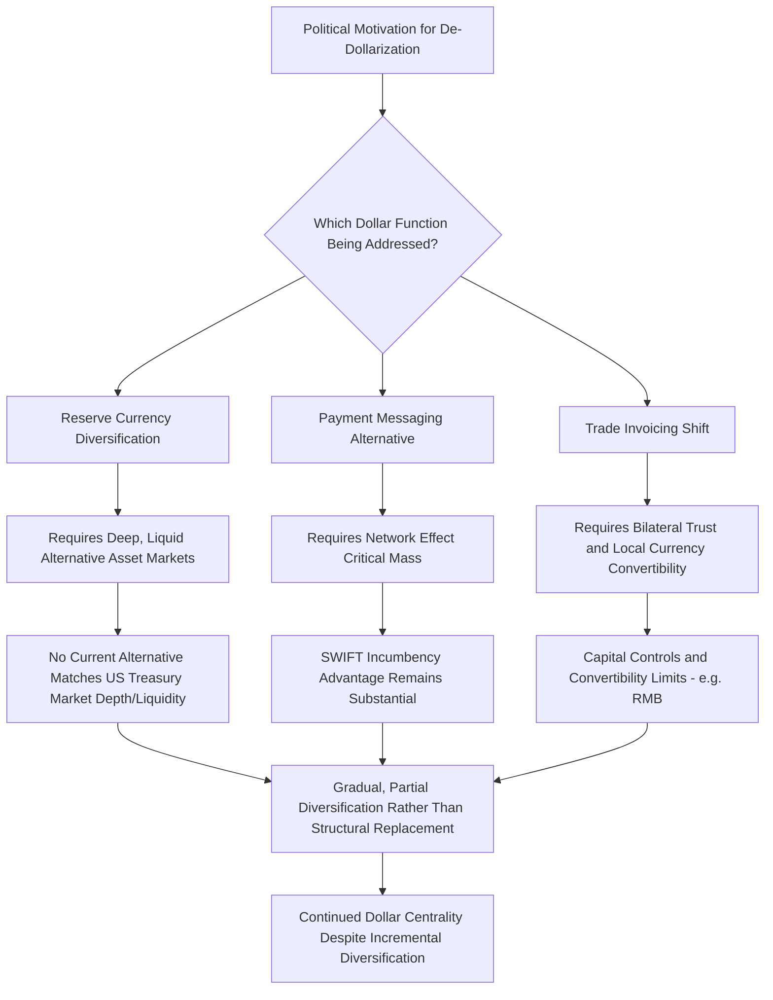

## De-Dollarization Debates and Alternative Payment Systems

### Overview

De-dollarization refers to the process, aspiration, or policy agenda of reducing reliance on the U.S. dollar in international reserves, trade invoicing, and cross-border payment settlement. It sits at the intersection of monetary economics and geopolitics: the dollar's centrality is partly a function of deep, liquid U.S. capital markets and network effects, but its use as a tool of financial statecraft (sanctions, SWIFT disconnection, asset freezes) has intensified political motivation among several states to reduce dependency on dollar-centric infrastructure. This topic examines the empirical evidence on dollar centrality's actual trajectory, the distinct alternative infrastructure initiatives underway, and the significant gap between de-dollarization rhetoric and structural financial reality.

### Distinguishing Three Separate Dollar Roles

**Key Points**

A central analytical point, and a frequent source of confused public debate, is that "the dollar's role" is not one thing but at least three distinct functions that can move independently:

- **Reserve currency share**: The proportion of central banks' official foreign exchange reserves held in dollar-denominated assets, tracked by the IMF's Currency Composition of Official Foreign Exchange Reserves (COFER) database.
- **Payment/settlement messaging share**: The proportion of cross-border interbank payment messages (as tracked via SWIFT) denominated in or routed through dollar-clearing infrastructure.
- **Trade invoicing share**: The proportion of global goods and services trade invoiced in dollars, independent of which currencies are actually held in reserve or how payments are messaged.

As of early 2026, these three metrics were moving in different directions simultaneously: the dollar's reserve share fell to roughly 57%, its lowest level in several decades, while its share of SWIFT-settled interbank payment messages reached a record high near 51%, and its trade invoicing share remained roughly stable near the mid-50% range — illustrating that no single narrative ("the dollar is collapsing" or "the dollar's dominance is unchanged") accurately captures the multidimensional reality.

### The Reserve Currency Data in Detail

**Key Points**

- **Long-term declining trend**: The dollar's share of allocated global official foreign exchange reserves has declined from roughly 71-72% at its peak around 2001 to approximately 56-57% by 2025-2026, according to IMF COFER data — a genuine multi-decade structural decline.
- **Valuation effects vs. active reallocation**: A critical methodological distinction emphasized in recent IMF data briefs is that quarter-to-quarter COFER share movements are frequently driven substantially by exchange-rate valuation effects (a weaker dollar mechanically raises the reported share of non-dollar-denominated reserves without any central bank actively selling dollar assets) rather than genuine active portfolio reallocation by central banks — for instance, one 2025 quarterly decline was found to be roughly 92% attributable to exchange-rate effects rather than deliberate diversification.
- **Post-2022 acceleration narrative and its limits**: Popular commentary has frequently cited the 2022 Russian sanctions as an inflection point accelerating de-dollarization, and rigorous academic work (e.g., Caldara and Iacoviello's analysis of geopolitical risk and reserve composition) has found geopolitical risk became a statistically significant factor in reserve composition decisions in a way it was not before roughly 2016 — but constant-exchange-rate-adjusted data across multiple recent quarters has generally shown central banks made only marginal, not dramatic, active changes to dollar holdings, complicating the strongest versions of the rapid-de-dollarization narrative.
- **Gold as the primary observed diversification vehicle**: Central bank gold purchasing has been substantial and sustained (net purchases in the hundreds of tonnes per quarter in recent data), with gold surpassing U.S. Treasuries as a share of official reserves in 2025 — though this shift was driven predominantly by gold price appreciation (a valuation effect) rather than large-scale active accumulation reallocation away from dollar assets, and does not by itself indicate a safe-asset architecture capable of replacing the dollar has emerged.
- **No single alternative currency has captured meaningful reserve share**: The renminbi's reserve share has remained low, generally under 2% of allocated global reserves through 2025-2026 — far below what would be required to constitute a serious structural alternative to the dollar, reflecting continued limits on RMB capital account convertibility, capital controls, and the comparatively smaller scale of internationally traded Chinese financial assets and liabilities relative to global totals.

### Structural Drivers Cited in De-Dollarization Debates

**Key Points**

- **U.S. fiscal dynamics**: Rising U.S. federal debt (exceeding $39 trillion by early 2026) and sustained large budget deficits are frequently cited by de-dollarization proponents as a structural rationale for reserve diversification, reflecting concern about long-term dollar asset value stability, though this concern has been a recurring theme in dollar-decline commentary for decades without triggering discontinuous reserve reallocation to date.
- **Weaponization concern**: The freezing of a substantial portion of Russian central bank reserves following 2022, and broader use of SWIFT disconnection and financial sanctions as foreign policy tools, is widely cited as having unnerved central bankers in non-aligned and Global South economies, reinforcing incentive to diversify reserve holdings away from assets perceived as subject to unilateral freezing risk by a single jurisdiction.
- **Multipolarity framing**: Some geopolitical and economic analysis frames de-dollarization as part of a broader structural shift toward a multipolar international order, in which reserve currency composition reflects and reinforces broader shifts in relative economic and geopolitical power — though [Speculation: the degree to which multipolarity is genuinely driving currency-specific outcomes versus functioning as a retrospective narrative applied to what may be more modest, gradual, and valuation-driven reserve composition changes remains a matter of significant analytical disagreement].

### Alternative Payment and Settlement Infrastructure Initiatives

**Key Points**

- **China's Cross-Border Interbank Payment System (CIPS)**: RMB-denominated cross-border payment and settlement infrastructure intended to reduce reliance on dollar-centric correspondent banking and SWIFT messaging for RMB trade settlement, though many CIPS participants continue to use SWIFT messaging alongside CIPS settlement rather than as a complete substitute.
- **Russia's SPFS**: Domestic financial messaging alternative developed following initial 2014 sanctions concerns, subsequently extended to some international counterparties, though with substantially smaller network reach than SWIFT.
- **BRICS payment infrastructure discussions**: Various proposals for BRICS-linked payment and settlement infrastructure, and periodic discussion of a potential BRICS common currency or unit of account, have been raised in BRICS summit contexts, though these initiatives remain at an early conceptual or limited-implementation stage relative to the scale required to meaningfully rival dollar-centric infrastructure. [Unverified: the current concrete implementation status of any specific BRICS payment infrastructure initiative should be checked against the latest BRICS summit communiqués and central bank statements, as this remains an actively evolving and often more aspirational than operational area.]
- **Bilateral local-currency settlement arrangements**: A growing number of bilateral trade agreements (e.g., India-UAE, China-Russia, and various other bilateral pairs) have incorporated local-currency settlement provisions to reduce transaction-level dollar dependency for specific trade corridors, representing a more incremental and currently more operationally realized diversification pathway than comprehensive alternative payment infrastructure.
- **Central bank digital currencies (CBDCs) and cross-border CBDC pilots**: Various multilateral CBDC interoperability pilots (e.g., project mBridge and similar initiatives) have explored whether central bank digital currency infrastructure could enable more efficient cross-border settlement with reduced dependency on correspondent banking chains, though these remain largely at pilot or limited-production stage rather than representing operational alternatives at meaningful global scale. [Inference: the practical maturity and adoption trajectory of cross-border CBDC settlement infrastructure changes rapidly and should be checked against current central bank and BIS reporting.]

### Structural Barriers to Rapid De-Dollarization

**Key Points on Structural Barriers**

- **Capital market depth and liquidity**: No alternative currency's government debt market currently matches the depth, liquidity, and perceived safety of U.S. Treasury markets, which remains a fundamental structural anchor for the dollar's reserve currency role independent of political sentiment toward diversification.
- **Network effects in payment messaging**: As discussed in the context of SWIFT specifically, the network-effect advantage of an incumbent, near-universal payment messaging system creates substantial switching costs that political motivation alone does not automatically overcome, particularly absent comparable trust and compliance infrastructure in alternative systems.
- **Capital account convertibility constraints**: The renminbi's continued capital controls and limited full convertibility represent a specific and significant structural constraint on its ability to expand reserve currency role regardless of trade volume or political will toward RMB internationalization.
- **Coordination problem among diversifying states**: Because no single alternative currency or payment system currently offers comparable scale to the dollar/SWIFT combination, states seeking diversification face a coordination problem — diversifying into multiple different, non-interoperable alternatives (gold, RMB, bilateral local-currency arrangements, CIPS, SPFS) individually rather than into one comparably scaled substitute, which limits the practical liquidity and network benefit of any single alternative.

### Evaluating Competing Narratives

**Key Points**

- **The "collapse" narrative overstates the pace of change**: Viral commentary asserting rapid, order-of-magnitude shifts in dollar dominance (for example, claims of dollar reserve share falling by double-digit percentage points within a year or two due to sanctions alone) is generally not supported by the underlying COFER data once exchange-rate valuation effects are properly separated from active reallocation — rigorous analysis (e.g., CEPR/VoxEU commentary responding to viral claims) has repeatedly found actual quarter-over-quarter active reallocation to be far more modest than headline share-change figures suggest.
- **The "no change" narrative understates genuine long-term structural decline**: Conversely, dismissing de-dollarization entirely ignores the genuine, sustained multi-decade decline in dollar reserve share from roughly 71-72% to roughly 56-57%, and the documented statistical shift toward geopolitical risk mattering more for reserve composition decisions since around 2016 — a real trend, even if slower and more gradual than crisis-driven narratives suggest.
- **Appropriate characterization**: The most empirically grounded characterization, reflected in serious economic analysis, treats de-dollarization as a genuine, gradual, multi-decade structural trend that has likely been reinforced (not created) by post-2022 sanctions-driven diversification incentive, occurring alongside continued and in some dimensions (payment messaging share) even strengthening dollar centrality — a nuanced, multidirectional picture rather than a simple binary trajectory in either direction. [Inference: this synthesis reflects the balance of currently available rigorous COFER-based analysis, but the underlying data and its interpretation continue to be actively debated among economists, and future data releases could shift this assessment in either direction.]

### Practical Implications for Multinational Corporate and Financial Risk Management

**Key Points**

- **Currency risk diversification distinct from de-dollarization politics**: Companies with significant cross-border exposure increasingly consider multi-currency invoicing and settlement capability as a practical risk management measure independent of the broader geopolitical de-dollarization debate, given genuine (if gradual) shifts in bilateral trade currency arrangements.
- **Sanctions-resilience planning**: Given the demonstrated willingness to freeze sovereign reserve assets and restrict SWIFT/dollar-clearing access as sanctions tools, financial institutions and corporations with exposure to geopolitically sensitive counterparties increasingly incorporate payment-system and currency-diversification contingency planning into broader supply chain and financial risk frameworks, connecting this topic directly to the sanctions and payment-system-exclusion mechanisms discussed elsewhere in this chapter.

**Related Topics**

- IMF COFER database methodology and valuation-effect adjustment techniques
- SWIFT governance and payment messaging network effects
- Financial sanctions and payment system exclusion mechanisms
- Renminbi internationalization and capital account convertibility constraints
- Central bank gold accumulation trends and safe-asset diversification
- Cross-border CBDC interoperability pilots (e.g., Project mBridge)
- BRICS monetary cooperation and common currency discussions
- Bilateral local-currency trade settlement arrangement case studies
- U.S. fiscal trajectory and long-term reserve currency confidence
- China's CIPS and comparative payment infrastructure scale analysis