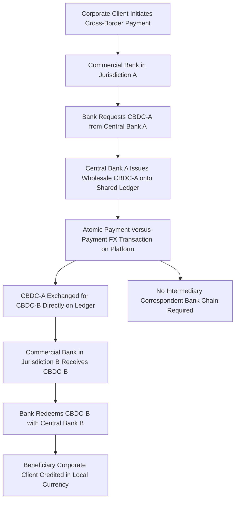

## Central Bank Digital Currencies and Cross-Border Settlement

### Overview

Central bank digital currencies (CBDCs) — digital liabilities of a central bank, distinct from commercial bank deposits or private cryptocurrency — have been explored extensively for their potential to improve cross-border payment efficiency, an area long characterized by high cost, slow settlement, and dependency on correspondent banking chains. This topic distinguishes wholesale from retail CBDC applications, surveys the major multi-central-bank cross-border settlement pilots (with particular attention to Project mBridge, whose 2024 governance history is itself a significant case study in the intersection of financial infrastructure and monetary geopolitics), and examines the structural promise and limitations of CBDC-based settlement as an alternative to correspondent banking and SWIFT-based infrastructure.

### Wholesale vs. Retail CBDC: A Critical Distinction

**Key Points**

- **Wholesale CBDC**: A digital central bank liability restricted to use by financial institutions (commercial banks, clearing houses) for interbank settlement purposes — the relevant category for cross-border settlement infrastructure discussed in this item, since it is the wholesale, interbank application that most directly addresses correspondent banking inefficiencies.
- **Retail CBDC**: A digital central bank liability accessible to the general public and businesses for everyday transactions, functioning as a digital equivalent to physical cash — a largely separate policy domain (concerned with financial inclusion, monetary policy transmission, and competition with private payment providers) with different technical and regulatory considerations than wholesale cross-border settlement.
- **Why the distinction matters for this topic**: Cross-border settlement efficiency gains are primarily associated with wholesale CBDC arrangements connecting central banks and their supervised financial institutions directly, bypassing layers of the traditional correspondent banking chain — most major multi-jurisdictional cross-border CBDC pilots (mBridge, Project Dunbar, Project Jura) have focused on the wholesale application specifically.

### The Correspondent Banking Inefficiency Problem CBDCs Aim to Address

**Key Points**

- **Multi-hop settlement chains**: Traditional cross-border payments, particularly involving jurisdictions without direct correspondent relationships, often require multiple intermediary correspondent banks, each adding cost, delay, and settlement risk.
- **Correspondent banking retreat**: A documented trend of correspondent banks reducing relationships with certain jurisdictions (a "de-risking" pattern discussed in the context of financial sanctions), particularly affecting smaller and emerging market economies, creating growing costs and delays for affected countries' cross-border payment access — cited by the BIS as a key motivating concern behind CBDC-based settlement infrastructure exploration.
- **The multi-CBDC platform concept**: Rather than each pair of countries requiring bilateral correspondent relationships, a shared multi-CBDC platform allows multiple central banks to issue and exchange their respective CBDCs directly on common infrastructure, in principle enabling near-instant, lower-cost, atomic payment-versus-payment (PvP) foreign exchange settlement without intermediary correspondent chains.

### Project mBridge: Structure and Technical Architecture

**Key Points**

- **Origins and founding participants**: Project mBridge began as a collaboration starting in 2021 between the BIS Innovation Hub, the Bank of Thailand, the Central Bank of the United Arab Emirates, the Digital Currency Institute of the People's Bank of China, and the Hong Kong Monetary Authority, with the Saudi Central Bank joining as a full participant in 2024.
- **Technical foundation**: The platform is built on the mBridge Ledger, a custom-built blockchain (developed using Hyperledger Foundation technology) designed specifically for real-time, peer-to-peer, cross-border payment and foreign exchange transactions, on which each participating central bank issues and controls its own CBDC.
- **2022 real-value pilot**: In a six-week pilot (August–September 2022), 20 commercial banks across the four founding jurisdictions conducted 164 payment and foreign exchange transactions totaling over $22 million in payments and FX settled directly on the platform, representing the largest cross-border CBDC pilot at that time and among the first to settle real-value, cross-border transactions on behalf of corporate clients.
- **Minimum viable product stage**: The project reached MVP stage in mid-2024, at which point the BIS invited private sector firms to propose value-added solutions and use cases for the platform, and the project had accumulated more than 25 observing central bank members beyond its core participants.

### Cross-Border CBDC Settlement Flow (Generic Multi-CBDC Platform Model)

### The 2024 BIS Withdrawal: A Case Study in Financial Infrastructure Geopolitics

**Key Points**

- **The withdrawal**: In October 2024, BIS General Manager Agustín Carstens announced during the Santander International Banking Conference in Madrid that the BIS would exit Project mBridge, leaving the participating central banks to continue developing the platform independently — occurring roughly one week after the October 2024 BRICS summit in Kazan, Russia.
- **The BRICS summit context**: At the Kazan summit, mBridge was a notable talking point, with BRICS officials and commentary touting its potential to enable de-dollarized cross-border settlement among member nations, and discussion of a related concept termed the "BRICS Bridge" (potentially building on mBridge's technology) as a possible sanctions-resilient alternative payment architecture.
- **BIS's official framing**: Carstens characterized the withdrawal as a routine "graduation" — stating the BIS often catalyzes innovation projects and then steps back once initiatives mature to a point where participating central banks can sustain them independently, explicitly stating the decision was not due to political factors or any project shortcomings, and specifically asserting that "mBridge is not the 'BRICs bridge.'"
- **Widely divergent interpretation**: Despite the official framing, the withdrawal was widely interpreted in policy and financial commentary circles as a response to concern that continued BIS association with a platform publicly touted by Russian and BRICS officials as sanctions-circumvention infrastructure could create reputational and political risk for the BIS, given the heightened post-2022 sensitivity around any technology perceived as enabling evasion of dollar-based financial sanctions. [Inference: the relative weight of the "routine graduation" versus "political risk management" explanations cannot be definitively resolved from public statements alone, and both the official BIS framing and the widely circulated alternative interpretation should be presented as competing accounts rather than a settled single explanation — this is a matter of ongoing informed speculation among sanctions and monetary policy analysts rather than a confirmed internal BIS decision rationale.]
- **Continuation without the BIS**: Following the BIS's exit, the founding and full-member central banks (China, Hong Kong, Thailand, UAE, and Saudi Arabia) retained the option to continue platform development independently, though the project's subsequent operational trajectory without the BIS's technical and governance leadership role represents [Unverified: current specifics of continued mBridge development, adoption, or any production deployment status should be checked against the latest reporting from the operating central banks, as this remains an evolving, largely non-BIS-documented situation following the 2024 withdrawal].

### Governance and Standard-Setting Questions Raised by mBridge

**Key Points**

- **Who sets interoperable CBDC standards?**: The mBridge episode raised broader questions about which institution or body should set technical and governance standards for interoperable cross-border CBDC infrastructure — the BIS, the IMF, the G20, or ad hoc coalitions of interested central banks — a question left more open, not more settled, by the BIS's withdrawal from a project it had originally spearheaded.
- **Sanctions enforcement complications flagged by U.S. policymakers**: U.S. Treasury and congressional commentary has flagged concern that wholesale CBDC settlement corridors operating outside traditional dollar-clearing and SWIFT-based infrastructure could complicate enforcement of secondary sanctions, directly connecting this technical payments infrastructure topic to the broader financial sanctions and de-dollarization debates covered elsewhere in this chapter.
- **Experimental status, not production infrastructure**: Despite years of development and a real-value pilot, mBridge (and comparable cross-border CBDC platforms) remains explicitly experimental — it has not become a live, large-scale production payment system, and participating central banks have not committed to a specific production launch timeline, an important caveat against overstating the platform's current practical significance relative to its symbolic and geopolitical prominence.

### Other Notable Cross-Border CBDC Initiatives

**Key Points**

- **Project Mariana**: A collaboration between the BIS and the central banks of France, Singapore, and Switzerland, completed in October 2023, which explored cross-border trading and settlement of wholesale CBDCs among financial institutions while integrating decentralized finance technology on a public blockchain — technically distinct from mBridge's custom-built ledger approach.
- **Cedar x Ubin+**: A multi-phase technical research initiative led by the New York Federal Reserve's New York Innovation Center in collaboration with the Monetary Authority of Singapore, evaluating wholesale CBDC applications using distributed ledger technology for cross-border payment efficiency — notable as a U.S. Federal Reserve-affiliated exploration of the same general technical space, though structured as a research initiative rather than a production-oriented platform.
- **Project Dunbar and Project Aurum**: Additional BIS Innovation Hub-affiliated projects exploring related aspects of multi-CBDC settlement architecture and full-stack (wholesale interbank plus retail e-wallet) CBDC system design, respectively, illustrating that mBridge is one prominent example within a broader, multi-institution landscape of CBDC cross-border settlement experimentation rather than a singular initiative.

### Assessing CBDC Cross-Border Settlement's Structural Promise and Limits

**Key Points**

- **Genuine technical efficiency potential**: The core technical case for multi-CBDC platforms — reducing intermediary hops, enabling atomic payment-versus-payment settlement, and providing an alternative for jurisdictions affected by correspondent banking retreat — represents a genuine and technically plausible efficiency improvement over traditional correspondent banking chains, distinct from the geopolitical framing that has come to dominate public discussion of these platforms.
- **Geopoliticization risk to technical projects**: The mBridge case illustrates a broader dynamic relevant to financial infrastructure innovation generally — a technically-motivated efficiency project can become geopoliticized once its potential dual-use application (efficiency improvement vs. sanctions circumvention potential) becomes a matter of public political discussion, potentially constraining the willingness of Western-aligned institutions to continue technical leadership even where the underlying technology has legitimate non-political efficiency applications.
- **Interoperability and standard fragmentation risk**: With the BIS's central coordinating role in mBridge diminished, and multiple parallel initiatives (Cedar x Ubin+, Mariana, Dunbar) proceeding somewhat independently, there is a documented risk of technical standard fragmentation across cross-border CBDC platforms, which could undermine the network-effect benefits that make a shared multi-CBDC platform valuable in the first place — echoing the broader payment-system fragmentation concern discussed in relation to SWIFT alternatives.
- **Uncertain adoption trajectory**: [Speculation: whether cross-border CBDC settlement platforms will achieve meaningful production-scale adoption in the coming years, versus remaining primarily experimental and symbolically significant rather than operationally significant, remains a genuinely open question given the technology's continued pilot-stage status and the added complexity introduced by the platform's geopoliticization following the 2024 BIS withdrawal.]

**Related Topics**

- SWIFT governance and payment messaging network effects (comparative infrastructure)
- Financial sanctions and payment system exclusion mechanisms (secondary sanctions complications)
- De-dollarization debates and alternative payment systems (BRICS Bridge context)
- Correspondent banking retreat and de-risking in emerging market economies
- BIS Innovation Hub project portfolio (Mariana, Dunbar, Aurum)
- Payment-versus-payment (PvP) settlement mechanics and atomic settlement risk reduction
- Renminbi internationalization and PBOC Digital Currency Institute involvement
- U.S. Federal Reserve wholesale CBDC research (Cedar x Ubin+)
- Standard-setting governance for interoperable cross-border digital currency infrastructure
- Technical architecture of permissioned distributed ledgers for central bank use