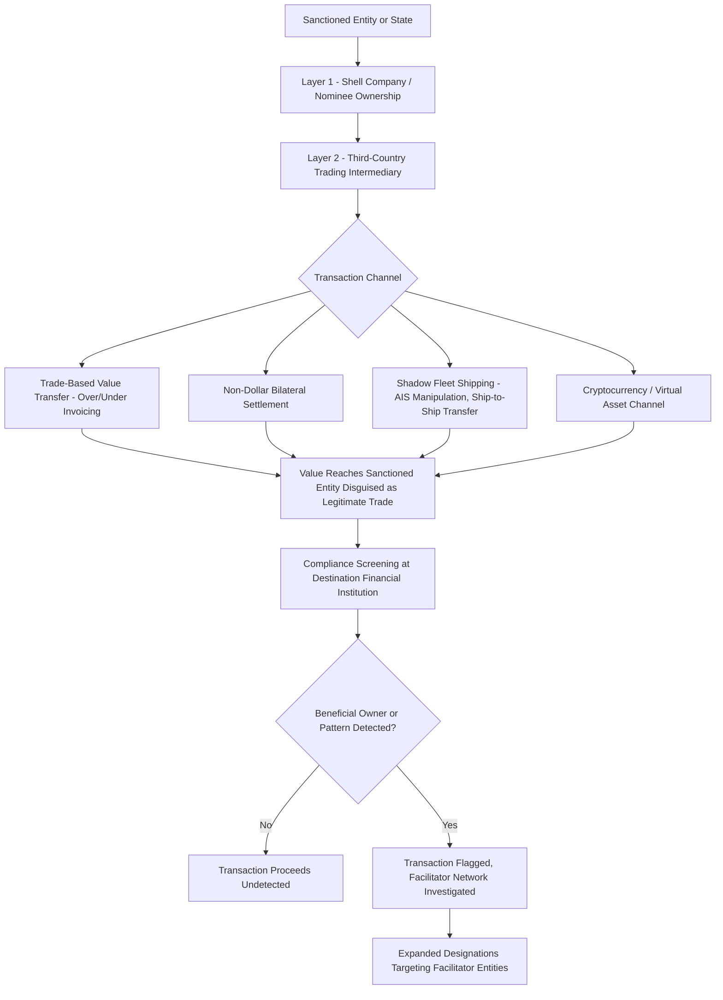

## Sanctions Evasion Networks and Shadow Financial Channels

### Overview

Sanctions evasion networks and shadow financial channels refer to the organizational structures, transaction methods, and infrastructure that sanctioned states, entities, and individuals develop to circumvent financial sanctions and payment system exclusion. These networks range from relatively simple corporate opacity techniques to sophisticated, state-coordinated systems spanning shipping, banking, and trade documentation. This topic surveys the primary evasion typologies, the most extensively documented recent case (Russia's post-2022 sanctions evasion infrastructure, including the "shadow fleet"), the detection and countermeasure ecosystem, and the broader debate over how evasion capacity affects sanctions policy design.

### Core Evasion Typologies

**Key Points**

- **Beneficial ownership obfuscation**: Layering ownership through shell companies, trusts, and nominee arrangements across multiple jurisdictions to obscure the true controlling party behind a transaction or asset, making sanctions-list matching difficult for compliance screening systems that rely on named-entity matching.
- **Third-country transshipment and re-invoicing**: Routing goods or funds through non-sanctioning intermediary jurisdictions, sometimes with re-invoicing (altering documented origin, value, or product classification) to disguise the true counterparty or nature of a transaction as it crosses into the sanctioning jurisdiction's visibility.
- **Trade-based value transfer**: Using over- or under-invoicing of legitimate trade transactions to move value across borders in ways that do not appear as a direct financial transfer subject to sanctions screening, a longstanding money-laundering technique adapted for sanctions evasion purposes.
- **Parallel/gray market networks and barter arrangements**: Bilateral or multilateral arrangements settling trade through non-currency exchange, commodity-for-commodity barter, or informal value transfer systems (analogous to hawala-style networks) that bypass formal banking channels entirely.
- **Front and facilitator entities**: Establishing or co-opting ostensibly independent trading companies, logistics firms, or financial intermediaries that are not themselves directly designated but function specifically to facilitate transactions on behalf of sanctioned parties — a pattern that has driven expansion of sanctions list categories to include such facilitating networks, not only primary targets.
- **Cryptocurrency and virtual asset channels**: Use of cryptocurrency exchanges, mixing services, and peer-to-peer transfer mechanisms to move value with reduced visibility relative to traditional correspondent banking, prompting expanded regulatory attention to virtual asset service provider (VASP) compliance obligations. [Unverified: the actual current scale of cryptocurrency-based sanctions evasion relative to more traditional trade-based and shipping-based methods remains a genuinely debated empirical question and should be assessed against current financial intelligence unit and blockchain analytics reporting rather than assumed to be a dominant channel.]

### Case Study: Russia's Post-2022 Sanctions Evasion Infrastructure

**Key Points**

- **Scale and state-level coordination**: Following the extensive 2022 sanctions package (SWIFT disconnection for major banks, central bank reserve freezes, export controls, and the G7 oil price cap), Russia developed and expanded a range of evasion mechanisms with documented state involvement, distinguishing this case from more typical individually-organized evasion networks by its scale and apparent government coordination.
- **The "shadow fleet" (or "dark fleet")**: A substantial number of aging oil tankers, often with opaque or frequently changing ownership registered in jurisdictions with limited transparency requirements, used to transport Russian oil in ways designed to evade the G7 price cap mechanism and Western-provided tanker insurance requirements — these vessels frequently disable or manipulate Automatic Identification System (AIS) transponders to obscure location and conduct ship-to-ship transfers to further obscure cargo origin documentation.
- **Alternative insurance and flagging arrangements**: Because G7 price cap enforcement relies substantially on Western-dominated maritime insurance (P&I club) requirements as a leverage point, shadow fleet vessels have sought alternative, non-Western insurance arrangements or operated with reduced or non-compliant insurance coverage, and have re-flagged to jurisdictions less responsive to Western sanctions pressure.
- **Third-country trade intermediation**: Significant rerouting of Russian trade flows through intermediary countries not participating in Western sanctions regimes, including increased use of alternative currencies (notably the Chinese yuan) for bilateral settlement, reducing dependency on dollar-clearing and SWIFT-dependent transactions for Russia's remaining international trade.
- **Parallel import mechanisms**: Russia has employed formal legal mechanisms (a "parallel import" legalization scheme) permitting the import of foreign goods without the original manufacturer's authorization, functioning as a state-sanctioned circumvention of export control and corporate withdrawal decisions by Western companies, distinct from financial sanctions evasion per se but part of the broader evasion and resilience-building response.

### Sanctions Evasion Network Structure (Generic Model)

### Detection Methodologies and Countermeasures

**Key Points**

- **Beneficial ownership transparency requirements**: Expanding regulatory requirements (e.g., beneficial ownership registries in various jurisdictions, enhanced due diligence obligations under anti-money laundering frameworks) aim to counter ownership-layering evasion techniques by requiring disclosure of the ultimate individual controlling an entity, not merely its immediate registered owner.
- **Trade data anomaly analysis**: Compliance and law enforcement analysts increasingly use trade data pattern analysis (unusual routing through known transshipment hubs, price anomalies suggesting mis-invoicing, sudden trade volume spikes with countries bordering sanctioned states) to flag likely evasion activity for further investigation.
- **Maritime tracking and AIS anomaly detection**: Given the shadow fleet phenomenon's prominence, satellite-based and commercial maritime tracking services have developed specific capability to detect AIS transponder manipulation, unusual ship-to-ship transfer patterns, and vessel behavior consistent with sanctions evasion, feeding into both government enforcement and private-sector (insurance, shipping industry) compliance screening.
- **Blockchain analytics for cryptocurrency channels**: Specialized blockchain analytics firms and government financial intelligence units have developed transaction-tracing capability for cryptocurrency flows, though the effectiveness of this analysis varies significantly depending on the specific evasion technique used (transparent public blockchains are more traceable than privacy-focused coins or sophisticated mixing services).
- **Facilitator network designation expansion**: A significant policy response pattern has been expanding sanctions designations beyond primary sanctioned targets to include the facilitating networks (trading companies, shipping registries, insurance intermediaries) that enable evasion, reflecting recognition that primary-target-only sanctions design leaves substantial evasion capacity available through nominally independent intermediaries.
- **Enhanced allied information-sharing**: Coordinated intelligence and compliance information-sharing among allied sanctions-imposing jurisdictions (U.S., EU, UK, and others) has been expanded specifically to counter evasion networks that exploit divergent national enforcement approaches, reflecting lessons learned from earlier, less-coordinated sanctions episodes.

### The Compliance Burden on Legitimate Financial Institutions

**Key Points**

- **De-risking as a defensive response**: Faced with the compliance cost and legal risk of inadvertently processing evasion-linked transactions, financial institutions frequently respond by broadly restricting or terminating correspondent relationships with entire categories of higher-risk counterparties or jurisdictions — a defensive over-compliance response ("de-risking") that can restrict legitimate financial access for non-sanctioned parties in affected regions as a side effect.
- **Escalating due diligence cost**: As evasion techniques grow more sophisticated, financial institutions' compliance programs face escalating cost to maintain effective screening, creating a continuous arms-race dynamic between evasion technique sophistication and compliance detection capability.
- **False positive and false negative trade-offs**: Compliance screening systems face an inherent trade-off between overly broad flagging (generating high false-positive rates that burden legitimate transactions and customers) and insufficiently sensitive screening (missing genuine evasion activity), a persistent operational challenge for financial institutions implementing sanctions compliance programs at scale.

### Effectiveness Debate: Does Evasion Capacity Undermine Sanctions Policy?

**Key Points**

- **Partial mitigation rather than complete circumvention**: The general pattern observed across documented evasion cases (Russia post-2022 being the most extensively studied recent example) is that evasion networks substantially raise transaction costs, introduce friction, delay, and discount pricing (e.g., Russian oil sold at a discount to non-price-cap-compliant buyers) rather than fully restoring pre-sanctions economic conditions — meaning evasion mitigates but does not eliminate sanctions impact in most documented cases. [Inference: the precise quantitative magnitude of this cost-imposition-versus-restoration balance for any specific sanctions episode is a matter of ongoing economic research and should be assessed against current academic and financial intelligence analysis rather than treated as a fixed, generalizable ratio.]
- **State-level evasion capacity vs. individual/entity-level evasion**: A state with substantial administrative capacity, willing third-country trading partners, and strategic resources (as documented in the Russian case) can build considerably more resilient and sophisticated evasion infrastructure than an individually sanctioned entity or smaller state, suggesting evasion resilience scales with the sanctioned party's underlying economic and diplomatic resources rather than being a uniform phenomenon across all sanctions targets.
- **Long-term sanctions design implications**: The demonstrated evasion capacity in major sanctions episodes has informed a policy shift toward designing sanctions with anticipated evasion pathways in mind from the outset (e.g., extending designations to known facilitator categories preemptively, building price cap mechanisms with built-in insurance-sector leverage points) rather than treating evasion response as purely reactive.
- **Genuinely contested question of net effectiveness**: Whether extensive and adaptive evasion capacity meaningfully undermines the strategic case for using financial sanctions as a foreign policy tool at all, versus representing an expected and manageable cost of an otherwise still net-effective policy instrument, remains a genuinely and vigorously contested question among sanctions policy researchers and practitioners. [Speculation: this question does not have a settled answer in current policy literature and reasonable analysts continue to reach different conclusions based on differing weightings of behavioral change evidence, humanitarian cost, and evasion-network resilience data.]

### Relationship to Broader Financial Infrastructure Topics

**Example**

The shadow fleet phenomenon illustrates how sanctions evasion analysis connects across seemingly separate domains covered elsewhere in this chapter: shadow fleet vessels avoid dollar-clearing and SWIFT-dependent payment for oil sales by using non-Western insurance and settling in alternative currencies, directly linking maritime evasion infrastructure to the broader de-dollarization and alternative payment channel dynamics discussed separately — illustrating that sanctions evasion is not a standalone financial-crime topic but is structurally intertwined with the payment infrastructure and currency diversification themes running through the broader monetary geopolitics landscape.

**Related Topics**

- Financial sanctions and payment system exclusion mechanisms
- G7 oil price cap mechanism and maritime insurance leverage points
- Shadow fleet / dark fleet detection and AIS transponder manipulation
- Beneficial ownership transparency and anti-money laundering frameworks
- Virtual asset service provider (VASP) compliance and blockchain analytics
- De-dollarization debates and bilateral local-currency settlement arrangements
- De-risking behavior and correspondent banking access reduction
- CAATSA secondary sanctions and facilitator network designation expansion
- Trade-based money laundering and mis-invoicing detection methodologies
- Multilateral sanctions coordination and allied information-sharing mechanisms