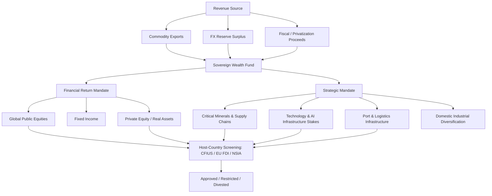

## Sovereign Wealth Funds and Strategic State Investment

### Definition and Core Characteristics

A sovereign wealth fund (SWF) is a state-owned investment vehicle that manages pools of capital derived from national reserves, commodity exports, fiscal surpluses, or foreign exchange operations, deploying that capital into domestic and international assets to achieve macroeconomic, strategic, or intergenerational objectives. SWFs are distinguished from central bank reserves, state pension funds, and state-owned enterprises (SOEs) by their broader risk tolerance, longer investment horizons, and explicit mandate to seek returns rather than merely preserve liquidity for balance-of-payments management.

Core characteristics:

- **State ownership**: capital is owned by the sovereign (national or subnational government), though management may be delegated to an independent or quasi-independent board.
- **Funding source**: typically commodity export revenue (oil, gas, minerals), current account/trade surpluses, privatization proceeds, or fiscal budget allocations.
- **Investment mandate**: ranges from pure financial return maximization to explicit strategic/industrial policy objectives (technology acquisition, domestic infrastructure, geopolitical influence).
- **Liability structure**: unlike pension funds, most SWFs have no explicit future liabilities to individual citizens, which permits higher risk tolerance and illiquidity tolerance.

### Typology of Sovereign Wealth Funds

**Stabilization funds**: Buffer commodity price volatility against the domestic budget (e.g., Chile's Economic and Social Stabilization Fund). Primary objective is counter-cyclical fiscal smoothing rather than long-term wealth accumulation.

**Savings/intergenerational funds**: Convert depleting non-renewable resource wealth into a diversified, perpetual financial endowment for future generations (e.g., Norway's Government Pension Fund Global, Kuwait Investment Authority's Future Generations Fund).

**Reserve investment corporations**: Manage a portion of excess foreign exchange reserves for higher returns than traditional reserve management permits (e.g., China Investment Corporation, GIC Singapore).

**Development/strategic funds**: Deploy capital explicitly to advance domestic industrial policy, infrastructure, or geopolitical positioning (e.g., Mubadala, Public Investment Fund (PIF) of Saudi Arabia, Russian Direct Investment Fund).

**Pension reserve funds**: Technically SWFs by structure but earmarked for future pension liabilities (e.g., Australia's Future Fund).

### Major Funds by Assets Under Management (illustrative ranking, order of magnitude)

| Fund | Country | Approx. Source | Type |
| --- | --- | --- | --- |
| Norway GPFG | Norway | Oil/gas revenue | Savings |
| China Investment Corporation | China | FX reserves | Reserve investment |
| Abu Dhabi Investment Authority (ADIA) | UAE | Oil revenue | Savings |
| Kuwait Investment Authority | Kuwait | Oil revenue | Savings/stabilization |
| GIC Private Limited | Singapore | FX reserves | Reserve investment |
| Public Investment Fund (PIF) | Saudi Arabia | Oil revenue, privatization | Strategic/development |
| Qatar Investment Authority | Qatar | Gas revenue | Savings/strategic |
| Temasek Holdings | Singapore | State asset holdings | Strategic holding company |

[Unverified] Exact AUM figures fluctuate materially year to year with commodity prices and asset valuations; consult SWFI (Sovereign Wealth Fund Institute) rankings for current figures rather than treating any static table as current.

### Governance Architecture

**Arm's-length model**: Fund operates with statutory independence from the finance ministry's day-to-day direction, governed by an independent board, with a codified investment mandate and public reporting (Norway GPFG is the canonical example, operating under a mandate from the Ministry of Finance but managed at arm's length by Norges Bank Investment Management).

**Direct executive control model**: Fund investment decisions are more tightly coupled to executive/political leadership, often with strategic and commercial objectives blended (PIF under Saudi Vision 2030 reports to the Public Investment Fund Council chaired by the Crown Prince).

**Dual-mandate tension**: Funds with both a commercial return objective and a strategic/industrial policy objective face an inherent governance tension — capital allocation decisions optimized for geopolitical or domestic-development goals may underperform relative to a pure-return benchmark, and transparency about this trade-off varies widely by fund.

### The Santiago Principles

Following criticism of SWF opacity and fears of politically motivated investment in the mid-2000s, the IMF-convened International Working Group of Sovereign Wealth Funds produced the **Santiago Principles** (2008), a set of 24 voluntary generally accepted principles and practices (GAPP) covering:

- Legal framework and objectives disclosure
- Institutional and governance framework separating owner, governing body, and operational management
- Investment and risk management framework, including disclosure of general investment policy

Adherence is voluntary and self-reported through the International Forum of Sovereign Wealth Funds (IFSWF); compliance varies significantly across member funds, and the principles carry no binding enforcement mechanism. [Inference] The principles function primarily as a reputational and diplomatic tool to preempt host-country investment restrictions rather than as a hard regulatory regime.

### Strategic Investment as a Geopolitical Instrument

SWFs increasingly function as instruments of statecraft distinct from pure portfolio management:

**Technology and supply chain acquisition**: State funds take strategic stakes in semiconductor, battery, critical minerals, and AI infrastructure firms to secure access, transfer expertise, or embed influence within foreign technology ecosystems. Gulf funds (PIF, Mubadala, QIA) have expanded significantly into AI compute, chip design, and data center equity.

**Resource security**: Funds acquire equity stakes in mining, agriculture, and logistics assets abroad to lock in physical supply chains for commodities the home country lacks domestically (e.g., Gulf fund investments in African and Latin American agriculture and mining; Chinese SOE and fund-linked investment in lithium, cobalt, and rare earth extraction).

**Port and logistics infrastructure**: Equity stakes in ports, pipelines, and rail corridors serve dual commercial and strategic purposes, providing both financial return and geopolitical leverage over trade chokepoints (e.g., Chinese state-linked investment in Mediterranean and Indian Ocean ports under Belt and Road Initiative financing structures, though not all BRI financing runs through classic SWF vehicles).

**Sanctions circumvention and financial statecraft**: [Inference] Funds may be used to preserve access to international capital markets or hard-currency assets under geopolitical stress, though direct evidence of sanctions-evasion use is generally classified or contested rather than openly documented.

**Domestic diversification mandates**: Gulf funds increasingly redirect capital domestically to diversify oil-dependent economies (PIF's role in Saudi Vision 2030 megaprojects such as NEOM) rather than purely seeking overseas returns, creating a hybrid sovereign-wealth/industrial-policy vehicle.

### Host-Country Screening and Investment Restrictions

Recipient states have progressively tightened inbound investment screening in response to SWF and state-linked capital flows, particularly for assets touching critical infrastructure, dual-use technology, and data:

- **United States**: CFIUS (Committee on Foreign Investment in the United States) reviews transactions for national security risk, with expanded jurisdiction post-FIRRMA (2018) covering non-controlling investments in critical technology, infrastructure, and sensitive personal data firms.
- **European Union**: FDI Screening Regulation (2019) establishes a cooperation mechanism among member states and the European Commission, though final screening authority remains national.
- **United Kingdom**: National Security and Investment Act (2021) grants call-in powers over transactions in 17 sensitive sectors.

[Inference] The trend across major recipient jurisdictions since roughly 2016–2018 has been toward broader and more discretionary screening authority, driven primarily by concern over Chinese state-linked capital in technology and infrastructure, with second-order effects on Gulf and other sovereign capital that must now navigate more elaborate compliance and disclosure processes even when the underlying capital source is not the primary policy target.

### Risk and Return Considerations Distinct from Private Capital

**Political risk premium**: Target-country and target-firm valuations may embed a discount or demand a premium when the counterparty is a foreign sovereign fund, reflecting both regulatory uncertainty (screening risk) and reputational considerations for the investee firm.

**Illiquidity tolerance**: Absent near-term liabilities, SWFs can accept longer lock-ups and larger allocations to private equity, infrastructure, and real assets than most institutional investors, structurally shaping global private-market capital supply.

**Home bias and dual mandate drag**: [Inference] Funds pursuing simultaneous strategic and financial objectives may experience benchmark underperformance attributable to non-financial constraints (e.g., mandated domestic allocations, restrictions on investing in geopolitically sensitive counterparties), though rigorous public attribution analysis is rarely available given limited disclosure.

**Reciprocal exposure risk**: Deep bilateral SWF investment linkages can create informal deterrence dynamics (mutual capital hostage positions) but also transmission channels for financial contagion or coercive asset freezes during acute geopolitical crises, as demonstrated by the freezing of Russian central bank and state-linked assets following the 2022 invasion of Ukraine — an action that materially altered global sovereign risk perceptions around holding reserves and strategic assets in Western-custodied instruments.

### Diagram: SWF Capital Flow and Strategic Objective Structure

### Illustrative SWF Ownership Concentration (svg_diagram)

<svg xmlns="http://www.w3.org/2000/svg" viewBox="0 0 640 320" font-family="sans-serif">
<text x="320" y="24" text-anchor="middle" font-size="16" font-weight="bold" fill="#1a1a1a">Sovereign Wealth Fund Mandate Spectrum (svg_diagram)</text>
<line x1="60" y1="80" x2="580" y2="80" stroke="#333" stroke-width="2" />
<text x="60" y="65" font-size="12" fill="#333">Pure Financial Return</text>
<text x="480" y="65" font-size="12" fill="#333">Pure Strategic/Industrial</text>
<circle cx="130" cy="80" r="8" fill="#2166ac" />
<text x="130" y="105" text-anchor="middle" font-size="11">Norway GPFG</text>
<circle cx="220" cy="80" r="8" fill="#2166ac" />
<text x="220" y="105" text-anchor="middle" font-size="11">GIC Singapore</text>
<circle cx="300" cy="80" r="8" fill="#762a83" />
<text x="300" y="105" text-anchor="middle" font-size="11">ADIA</text>
<circle cx="390" cy="80" r="8" fill="#762a83" />
<text x="390" y="105" text-anchor="middle" font-size="11">QIA</text>
<circle cx="480" cy="80" r="8" fill="#b2182b" />
<text x="480" y="105" text-anchor="middle" font-size="11">Mubadala</text>
<circle cx="550" cy="80" r="8" fill="#b2182b" />
<text x="550" y="105" text-anchor="middle" font-size="11">PIF (Saudi)</text>
<rect x="40" y="160" width="560" height="130" fill="none" stroke="#ccc" stroke-width="1" />
<text x="60" y="185" font-size="12" font-weight="bold" fill="#2166ac">Blue: Return-maximizing, arm's-length governance</text>
<text x="60" y="210" font-size="12" font-weight="bold" fill="#762a83">Purple: Hybrid return/strategic, moderate independence</text>
<text x="60" y="235" font-size="12" font-weight="bold" fill="#b2182b">Red: Explicit strategic/domestic-development mandate</text>
<text x="60" y="265" font-size="11" fill="#555">Positioning is illustrative and directional, not a precise quantitative index.</text>
</svg>

### Key Points

- SWFs sit structurally between central bank reserve management and private institutional investment, distinguished by return-seeking mandates and typically longer horizons.
- The Santiago Principles are voluntary transparency norms, not binding regulation — treat "Santiago-compliant" as a signaling claim, not a guarantee of disclosure depth.
- The strategic/financial dual mandate is the central analytical tension in this domain: funds pursuing geopolitical objectives alongside returns face governance and performance-attribution challenges rarely resolved by public disclosure.
- Host-country screening regimes (CFIUS, EU FDI Regulation, UK NSIA) have tightened materially since the late 2010s, reshaping how SWFs structure inbound transactions (minority stakes, co-investment with domestic partners, passive voting agreements).
- The 2022 freezing of Russian sovereign assets is a structural inflection point in how states now assess counterparty and custodial risk for their own reserve and fund holdings.

**Related Topics**

- Central bank reserve diversification and de-dollarization trends
- CFIUS review process and critical technology carve-outs
- Belt and Road Initiative financing structures vs. classic SWF vehicles
- Critical minerals equity stakes and upstream supply chain control
- Gulf state economic diversification (Vision 2030, UAE "We the UAE 2031")
- Sanctions and asset-freezing as tools of financial statecraft
- Sovereign debt distress and SWF-linked debt-for-equity restructuring