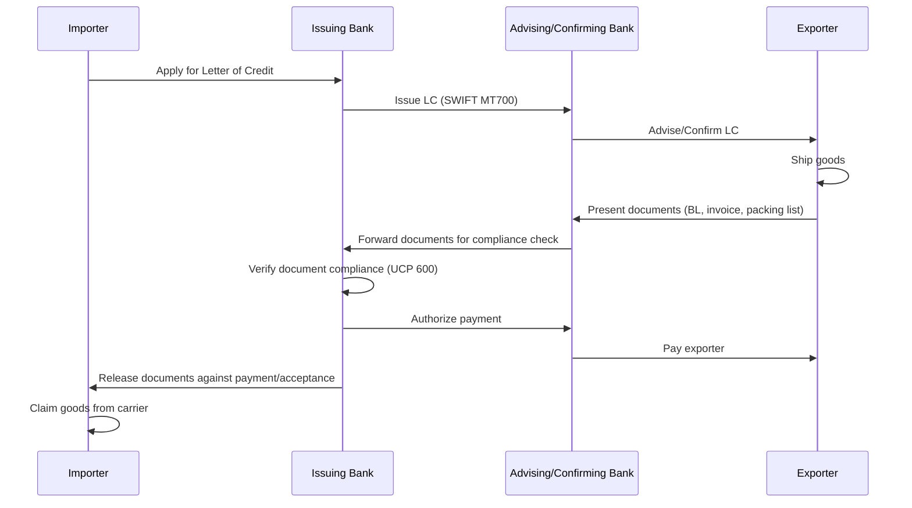

## Trade Finance and Its Role in Enabling Global Commerce

### Definition and Function

Trade finance refers to the set of financial instruments, products, and mechanisms used to facilitate international and domestic trade transactions by mitigating the counterparty, payment, and performance risks inherent in exchanging goods across jurisdictions where buyer and seller often lack established trust, shared legal recourse, or synchronized cash flow needs. Trade finance intermediates the fundamental mismatch of international commerce: exporters want payment assurance before or at shipment, while importers want to defer payment until goods are received and verified. Banks, non-bank financial institutions, and increasingly fintech platforms bridge this gap by inserting a creditworthy intermediary and standardized documentary process into the transaction.

Trade finance is estimated to underpin the majority of global merchandise trade flows [Unverified — figures vary by source methodology, typically cited in the 80–90% range by industry bodies such as the ICC and WTO], making it a structurally load-bearing but largely invisible layer of the global supply chain.

### Core Instruments

**Letters of Credit (LC)**: A bank-issued conditional payment guarantee on behalf of the importer (applicant), payable to the exporter (beneficiary) upon presentation of compliant shipping and commercial documents. Governed internationally by the ICC's Uniform Customs and Practice for Documentary Credits (UCP 600). The issuing bank's obligation is independent of the underlying sale contract (the "principle of autonomy") — payment is triggered by document compliance, not physical goods verification, which is the source of both the LC's reliability and its exploitability via fraudulent documentation.

**Documentary Collections**: A lower-cost, lower-security alternative in which banks act as document intermediaries without a payment guarantee, governed by the ICC's Uniform Rules for Collections (URC 522). Two subtypes: Documents against Payment (D/P), where documents release only upon payment, and Documents against Acceptance (D/A), where documents release upon the importer's acceptance of a time draft (deferred payment commitment).

**Bank Guarantees and Standby Letters of Credit (SBLC)**: Function as a payment-of-last-resort backstop rather than the primary payment mechanism, triggered only upon default of the underlying obligation. Common in performance bonds, bid bonds, and advance payment guarantees.

**Open Account Trade**: The importer pays after receiving goods, typically on 30/60/90-day terms, with no bank-intermediated guarantee. Dominant in trade between established counterparties with long trading histories or intra-firm/intra-group trade, but exposes the exporter fully to buyer credit risk absent supplementary insurance.

**Trade Credit Insurance**: Insures exporters (or their financing banks) against buyer non-payment, commonly used to support open-account trade or to enable receivables financing. Major providers include Euler Hermes (Allianz Trade), Atradius, and Coface, alongside export credit agencies (ECAs).

**Supply Chain Finance (SCF) / Reverse Factoring**: A buyer-led program in which a financial institution pays the supplier early (at a discount) based on the buyer's approved invoice and stronger credit rating, with the buyer repaying the financier at the original invoice due date. Shifts financing cost from the supplier's (often weaker) credit rating to the buyer's (often stronger) rating, improving supply chain liquidity, particularly for SME suppliers.

**Factoring and Forfaiting**: Factoring involves the outright sale of receivables (often domestic or short-term) to a factor at a discount, typically with recourse provisions. Forfaiting is the non-recourse purchase of medium/long-term export receivables (often evidenced by promissory notes or bills of exchange), commonly used for capital goods exports.

**Export Credit Agency (ECA) Financing**: State-backed or state-owned institutions (e.g., US EXIM Bank, UK Export Finance, Euler Hermes on behalf of the German government, China's Sinosure) provide direct loans, guarantees, or insurance to support national exporters, often for large capital goods, infrastructure, or strategically significant transactions where private market capacity or risk appetite is insufficient.

### Documentary Trade Transaction Flow

### Risk Categories Mitigated

**Commercial/credit risk**: The risk that the buyer is unwilling or unable to pay, mitigated through LC issuance, credit insurance, or ECA guarantees that substitute the intermediary's or insurer's creditworthiness for the buyer's own.

**Country/sovereign risk**: Transfer restrictions, currency inconvertibility, expropriation, or political instability in the importer's jurisdiction, typically covered through ECA political risk insurance or specialized political risk insurers (e.g., MIGA — the World Bank's Multilateral Investment Guarantee Agency).

**Documentary/fraud risk**: Forged bills of lading, duplicate financing against the same underlying goods (as in the 2014 Qingdao port metals financing fraud, where the same warehouse receipts were pledged multiple times to different lenders), or shell-company circular trade used to fabricate financeable transactions.

**Performance risk**: The risk that goods fail to meet contractual specification despite document compliance, generally outside the scope of bank-mediated document checks and left to the underlying sale contract and any separate inspection/certification regime.

**Settlement and FX risk**: Currency mismatch between invoicing and settlement currencies, addressed through FX forwards, currency clauses in trade contracts, or increasingly through local-currency trade settlement arrangements pursued for de-dollarization objectives.

### Regulatory and Standards Infrastructure

- **UCP 600** (2007): ICC rules governing documentary letters of credit, near-universally incorporated by reference into LC terms.
- **URC 522**: ICC rules for documentary collections.
- **ISP98**: ICC rules specific to standby letters of credit.
- **eUCP**: Supplement to UCP 600 enabling electronic presentation of trade documents.
- **Basel III capital treatment**: Trade finance instruments (particularly short-tenor, self-liquidating LCs) received calibrated capital treatment under Basel III after industry advocacy demonstrated historically low default rates relative to standard corporate lending, reflected in the ICC Trade Register data used to support lower risk-weighting arguments to the Basel Committee.
- **AML/KYC and sanctions screening**: Correspondent banks apply stringent transaction screening against sanctions lists (OFAC SDN list, EU/UN sanctions regimes) at multiple points in the documentary chain, a major driver of "de-risking" — the withdrawal of correspondent banking relationships from higher-risk jurisdictions, which has disproportionately reduced trade finance access in parts of Africa, the Pacific, and the Caribbean. [Inference] De-risking is generally attributed by trade bodies (ICC, IFC) to rising compliance costs relative to the profitability of small-volume correspondent relationships rather than to any single regulatory mandate requiring exit.

### The Trade Finance Gap

The **trade finance gap** refers to the shortfall between demand for trade finance (particularly from SMEs and firms in emerging markets) and the supply banks and other institutions are willing or able to provide, most frequently quantified in periodic surveys by the Asian Development Bank (ADB). [Unverified] Estimates in ADB survey publications have placed the global gap in the range of roughly $1.5–2.5 trillion annually in recent survey years, though methodology relies on self-reported bank rejection rates and should be treated as directional rather than precise. SMEs face disproportionately higher LC application rejection rates than large corporates, attributed to smaller transaction sizes relative to fixed compliance costs, thinner credit histories, and correspondent bank de-risking in the SME's home jurisdiction.

### Digitalization of Trade Finance

**Electronic Bills of Lading (eBL)**: Digitization of the paper bill of lading — historically the critical "document of title" bottleneck in trade finance — has accelerated following the **Electronic Trade Documents Act 2023** (UK), which gave electronic trade documents the same legal status as paper originals under English law (a jurisdiction under which a large share of global trade contracts are governed). Platforms such as essDOCS, Bolero, WaveBL, and CargoX provide eBL issuance and transfer infrastructure, competing partly on interoperability and partly on network effects among carriers, banks, and traders.

**Distributed ledger / blockchain trade platforms**: Multiple bank-led consortium platforms attempted to digitize LC issuance and document exchange (Marco Polo Network, we.trade, Contour, Voltron/Contour lineage descending from an R3 Corda pilot). [Unverified] Several of these consortia (Marco Polo, we.trade) ceased or scaled back operations in the early-to-mid 2020s, illustrating the difficulty of achieving the network-effect critical mass required for multi-bank DLT trade platforms despite technically sound proofs of concept; Contour continued operating serving LC digitization.

**ICC Digital Standards Initiative (DSI)**: Industry effort to harmonize legal, technical, and data standards (aligned with UNCITRAL Model Law on Electronic Transferable Records — MLETR) to enable cross-platform interoperability rather than siloed consortium platforms.

### Geopolitical Dimensions

**Sanctions as trade finance chokepoints**: Because the vast majority of global trade finance and settlement flows through correspondent banking relationships denominated predominantly in USD, and clears through US-linked correspondent banks or SWIFT messaging, US sanctions regimes exercise outsized extraterritorial leverage — a bank need not be American to be exposed to US enforcement risk if it processes USD-denominated trade finance touching a sanctioned party, a dynamic central to instruments like SWIFT disconnection (as applied to designated Russian and Iranian banks) and secondary sanctions risk.

**De-dollarization of trade settlement**: States seeking to reduce USD dependency (e.g., Russia-China, ASEAN local currency settlement frameworks, India's rupee trade settlement mechanism) have pursued bilateral local-currency trade finance and settlement arrangements, though [Inference] liquidity depth, convertibility, and hedging market thinness in non-USD currency pairs remain structural constraints limiting the scale at which this substitutes for dollar-denominated trade finance in the near term.

**Export credit competition as industrial policy**: ECA financing has become an instrument of strategic competition, particularly in infrastructure, energy, and telecommunications exports to developing markets, where Chinese ECA and policy bank financing (China Development Bank, Sinosure, EXIM Bank of China) competes directly with OECD Arrangement-bound Western ECAs, which are constrained by the OECD Arrangement on Officially Supported Export Credits (limiting subsidy levels and terms) in ways Chinese lenders are not bound by, generating persistent competitiveness debates within OECD trade policy circles.

**Supply chain finance as SME resilience infrastructure**: Multilateral development banks (IFC, ADB, EBRD) run dedicated trade finance facilitation programs providing risk-sharing guarantees to local banks in developing markets specifically to counteract correspondent de-risking and close the SME trade finance gap, treating trade finance access itself as a development and supply-chain-resilience policy lever rather than purely a private banking product.

### Key Points

- Trade finance instruments substitute institutional creditworthiness (bank, insurer, ECA) for direct counterparty trust, and the choice of instrument reflects a negotiated allocation of payment risk between buyer and seller.
- UCP 600's "principle of autonomy" — that payment obligations are triggered by document compliance, not physical verification of goods — is both the mechanism's core strength (speed, enforceability) and its principal fraud vector.
- The trade finance gap is structurally concentrated among SMEs and emerging-market firms, driven by fixed compliance costs and correspondent bank de-risking rather than by aggregate global capital scarcity.
- USD-centric correspondent banking clearance gives US sanctions policy extraterritorial reach over global trade finance, a dynamic actively contested through de-dollarization and local-currency settlement initiatives with as-yet limited scale.
- DLT-based trade finance consortia have struggled against network-effect and standards-fragmentation problems; legal reform (UK Electronic Trade Documents Act, MLETR adoption) has proven a more durable digitalization lever than blockchain infrastructure alone.

**Related Topics**

- SWIFT messaging infrastructure and sanctions enforcement mechanics
- OECD Arrangement on Officially Supported Export Credits
- Correspondent banking de-risking and its development impact
- UNCITRAL MLETR and electronic transferable records adoption by jurisdiction
- Basel III capital treatment of short-term trade finance instruments
- Local-currency trade settlement frameworks (ASEAN, BRICS payment initiatives)
- Commodity trade finance fraud typologies (warehouse receipt fraud, duplicate financing)