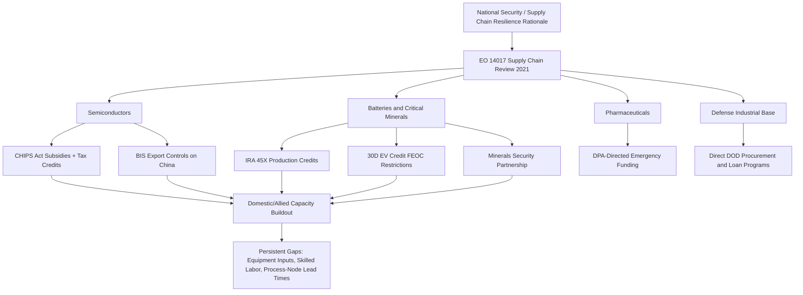

## The United States: Reindustrialization and Strategic Dependencies

### Overview and Policy Context

US reindustrialization refers to the coordinated set of industrial policy interventions launched roughly from 2021 onward aimed at reversing decades of manufacturing offshoring in strategically sensitive sectors — semiconductors, batteries/critical minerals, pharmaceuticals, and defense-critical inputs — driven by a convergence of national security concerns (dependency on geopolitical rivals, particularly China, for critical inputs), pandemic-exposed supply chain fragility, and domestic political pressure to restore manufacturing employment. This represents a marked departure from the post-Cold War US policy consensus favoring comparative-advantage-driven offshoring and minimal industrial policy intervention.

The core strategic logic: the US identified specific chokepoints where (a) supply is geographically concentrated in a small number of foreign jurisdictions, (b) the goods in question are foundational to defense, technology leadership, or economic security, and (c) market forces alone were judged unlikely to correct the concentration given capital intensity, long payback periods, and East Asian government subsidy competition.

### Legislative and Policy Instruments

**CHIPS and Science Act (2022)**: Appropriated approximately $52.7 billion for domestic semiconductor manufacturing incentives, R&D, and workforce development, plus a 25% investment tax credit for semiconductor manufacturing equipment. Administered by the Department of Commerce, with direct funding agreements attached to guardrails restricting recipients from expanding advanced semiconductor capacity in China for 10 years.

**Inflation Reduction Act (2022)**: Despite its name, functions substantially as clean energy and battery/EV industrial policy, providing production tax credits (Section 45X Advanced Manufacturing Production Credit) for domestic battery cell, module, and critical mineral processing, plus consumer EV tax credits (Section 30D) conditioned on North American final assembly and increasing percentages of battery components/critical minerals sourced domestically or from US free-trade-agreement partners — explicitly structured to exclude Chinese-sourced content ("foreign entity of concern" restrictions).

**Infrastructure Investment and Jobs Act (2021)**: Funds grid modernization, critical minerals processing demonstration projects, and battery supply chain investments through DOE loan and grant programs.

**Defense Production Act (DPA) invocations**: Used to direct funding toward critical minerals processing, pharmaceutical active ingredient production, and other defense-adjacent supply chain gaps, granting the executive branch authority to prioritize contracts and provide direct financial incentives outside standard appropriations processes.

**Executive Order 14017 (America's Supply Chains, 2021)**: Directed a 100-day interagency review of semiconductor, large-capacity battery, critical minerals, and pharmaceutical supply chains, establishing the analytical basis for subsequent legislative action.

### Semiconductor Reshoring

Major fabrication investments announced or under construction include TSMC's Arizona facilities (Phoenix), Samsung's Taylor, Texas expansion, Intel's Ohio ("Silicon Heartland") and Arizona expansions, and Micron's New York and Idaho memory fabs. [Unverified] Project timelines and committed capital figures have shifted materially since original announcements — several TSMC Arizona milestones were delayed relative to initial schedules, and Intel's expansion pace has been affected by the company's broader financial and foundry-strategy difficulties — so current-state figures should be verified against recent reporting rather than treated as fixed.

Structural challenges persist despite subsidy support: the US retains a comparatively small share of global leading-edge fabrication capacity concentrated overwhelmingly in Taiwan (TSMC) and South Korea (Samsung), a US-based semiconductor manufacturing ecosystem still depends heavily on foreign-sourced fabrication equipment inputs and specialty chemicals, and construction/permitting timelines and skilled-labor availability in the US have proven slower than in East Asian competitor jurisdictions. [Inference] Even with CHIPS Act-funded capacity fully online, the US is unlikely to achieve leading-edge fabrication self-sufficiency in the near-to-medium term given the multi-generational lead times required to build equivalent process-node expertise and yield maturity relative to TSMC.

**Export control regime**: Complementing onshoring subsidies, the Bureau of Industry and Security (BIS) has progressively tightened export controls on advanced semiconductor manufacturing equipment and high-performance AI chips to China (October 2022 controls and subsequent revisions), extending controls extraterritorially via the Foreign Direct Product Rule to capture equipment made by allied-nation firms (ASML in the Netherlands, Tokyo Electron in Japan) using US-origin technology, requiring diplomatic coordination with the Netherlands and Japan to align their national export control regimes.

### Critical Minerals and Battery Supply Chains

The US faces acute import dependency for numerous critical minerals essential to batteries, magnets, and defense systems — most significantly for rare earth elements and battery-grade processed lithium, cobalt, graphite, and nickel, where China holds dominant midstream processing and refining capacity even where raw ore extraction is more geographically diversified. [Unverified] Specific import-reliance percentages by mineral shift with USGS Mineral Commodity Summary annual updates and should be checked against the current-year publication rather than a single static figure.

Policy responses include DOE and DOD funding for domestic and allied-nation critical minerals processing facilities, the **Minerals Security Partnership** (a US-led coalition with allied nations including Australia, Canada, Japan, South Korea, and EU members coordinating investment in non-Chinese critical minerals supply chains), and IRA battery tax credit "foreign entity of concern" provisions designed to redirect battery supply chains away from Chinese-linked processing even when raw materials originate elsewhere.

**Friend-shoring/ally-shoring**: Rather than pursuing full domestic self-sufficiency (frequently uneconomic given US deposit scarcity for certain minerals), US strategy substantially emphasizes diversifying supply toward allied and partner nations (Australia for lithium and rare earths, Canada for multiple critical minerals, Indonesia and the Philippines for nickel with caveats around Chinese-linked processing investment even within those countries) under free-trade-agreement-linked eligibility for IRA incentives.

### Pharmaceutical and Medical Supply Chain Dependencies

The US retains significant dependency on China and India for active pharmaceutical ingredients (APIs) and generic drug precursor chemicals, a vulnerability highlighted acutely during COVID-19-era PPE and API shortages. Policy responses have been comparatively less aggressive than semiconductor or battery policy, relying more on DPA-directed emergency funding, strategic national stockpile replenishment, and more limited domestic API manufacturing incentive programs, reflecting [Inference] lower near-term political salience relative to semiconductors and EVs, alongside the structurally difficult economics of onshoring low-margin generic drug and precursor chemical manufacturing against established Asian cost bases.

### Reindustrialization Policy Architecture

### Labor Market and Cost Structure Constraints

Reshoring initiatives confront structural cost and capacity constraints distinct from subsidy availability: US manufacturing labor costs remain substantially higher than in China, Vietnam, or Mexico even accounting for productivity differentials; skilled trades and semiconductor process engineering talent pipelines have atrophied after decades of reduced domestic fabrication activity, requiring substantial vocational and university program investment with multi-year lag times; and permitting timelines for large industrial facilities (environmental review, utility interconnection, water rights) frequently exceed comparable timelines in competitor jurisdictions, a friction increasingly identified across both parties as a binding constraint independent of subsidy levels, feeding into broader "permitting reform" policy debates.

### Nearshoring and the Mexico Dimension

A parallel and complementary dynamic to direct reshoring is **nearshoring** to Mexico, driven by USMCA regional content requirements (particularly in automotive rules of origin), lower relative labor costs than the US alongside geographic proximity advantages over Asia, and Chinese firms themselves establishing Mexican manufacturing operations partly to access USMCA-preferential US market access — a dynamic that has drawn increasing US trade policy scrutiny and proposed rule-of-origin tightening aimed at preventing Chinese firms from using Mexican assembly as a tariff-circumvention channel ("connector" or transshipment concerns).

### Assessment of Structural Dependencies Despite Policy Intervention

Even accounting for the scale of CHIPS Act and IRA-driven investment, several dependency vectors remain only partially addressed: leading-edge semiconductor fabrication capacity remains concentrated outside the US notwithstanding onshoring investment; midstream critical mineral processing (as opposed to raw extraction) remains heavily China-concentrated globally, and building alternative processing capacity involves substantial capital cost, multi-year permitting, and in some cases environmentally contentious processing chemistry; and legacy-node semiconductors (mature process technology used pervasively in automotive and industrial applications) remain a comparatively under-addressed dependency relative to leading-edge chip policy focus, with China itself expanding legacy-node capacity aggressively during this period. [Inference] The overall reindustrialization program is best characterized as a multi-decade structural rebalancing effort still in its early-to-middle implementation phase rather than a completed or near-complete substitution of prior dependency patterns.

### Key Points

- US reindustrialization policy is organized around identified strategic chokepoints (semiconductors, batteries/critical minerals, pharmaceuticals) rather than broad-based manufacturing policy, reflecting a targeted national-security rationale rather than general industrial protectionism.
- CHIPS Act and IRA incentives are structurally linked to export control and "foreign entity of concern" restrictions — onshoring subsidies and China-directed trade restrictions function as two halves of a single strategic framework rather than independent policies.
- Persistent structural constraints (skilled labor pipelines, permitting timelines, midstream processing capacity, legacy-node chip dependency) mean subsidy-driven reshoring has not eliminated underlying dependency vectors, particularly outside leading-edge semiconductors and cathode/EV battery chains.
- Nearshoring to Mexico functions as a complementary strategy to direct US reshoring but has generated its own transshipment/circumvention policy concerns regarding Chinese-linked manufacturing.

**Related Topics**

- BIS export controls and the Foreign Direct Product Rule mechanics
- Minerals Security Partnership member commitments and project pipeline
- USMCA automotive rules of origin and nearshoring dynamics
- Legacy-node semiconductor overcapacity and Chinese industrial policy response
- CFIUS screening interaction with reshored critical infrastructure investment
- Strategic National Stockpile and pharmaceutical supply chain resilience policy