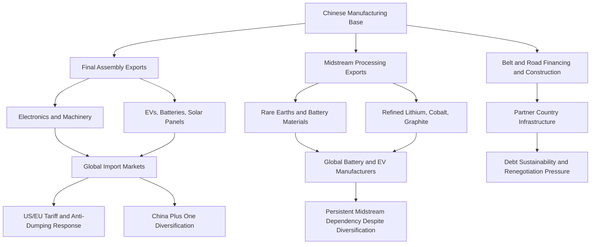

## China: The World's Factory and Its Evolving Trade Strategy

### Historical Foundation of Manufacturing Primacy

China's emergence as the dominant global manufacturing base traces to the post-1978 reform and opening-up period under Deng Xiaoping, accelerated substantially by 2001 WTO accession, which locked in predictable market access for Chinese exports and triggered a sustained wave of foreign direct investment and export-oriented manufacturing buildout. The comparative advantage that initially drove this shift — abundant low-cost labor combined with special economic zone infrastructure, tax incentives, and currency policy supportive of export competitiveness — has evolved substantially over the subsequent two decades as China has moved up the value chain from labor-intensive light manufacturing (textiles, toys, low-end electronics assembly) toward capital- and technology-intensive production (electronics, machinery, solar panels, batteries, electric vehicles).

China's manufacturing scale is distinguished not merely by output volume but by the depth and density of its industrial ecosystem: dense supplier clusters, mature logistics infrastructure, a large skilled and semi-skilled labor pool, and — critically for reshoring difficulty — agglomeration effects where component suppliers, tooling shops, and assembly plants co-locate at a density difficult to replicate elsewhere in the near term, a factor frequently cited as a structural barrier to rapid supply chain diversification independent of tariff or labor cost considerations.

### The "China Plus One" and Diversification Response

Rising Chinese labor costs (which have increased substantially relative to Southeast Asian and South Asian alternatives), US-China trade tensions since 2018, and pandemic-driven supply chain resilience concerns have collectively driven a **"China plus one"** diversification strategy among multinational manufacturers — maintaining Chinese production capacity while adding a second manufacturing base, most commonly in Vietnam, India, Mexico, or elsewhere in Southeast Asia, to reduce single-country concentration risk without fully exiting China.

[Inference] The practical effect of China plus one to date has generally been diversification of final assembly and lower-value-add stages rather than full supply chain relocation, since many alternative manufacturing locations (Vietnam prominently) remain themselves dependent on Chinese-sourced intermediate components and raw materials — meaning a portion of nominal "diversification" reflects a relocation of the final export-origin label rather than a full displacement of Chinese value-add from the underlying supply chain.

### Evolving Trade and Industrial Strategy

**Made in China 2025**: A 2015-launched industrial policy initiative targeting Chinese self-sufficiency and global leadership across ten designated high-technology sectors (advanced robotics, aerospace, new energy vehicles, biotechnology, advanced rail, etc.), pursued through state subsidies, preferential financing via state banks, domestic content mandates, and coordinated industrial planning at national and provincial levels. The initiative drew significant international criticism (and contributed to the 2018 onset of US-China tariff escalation) for its explicit government-directed market-share targets in named foreign markets, which trading partners characterized as inconsistent with WTO market-access norms.

**Dual Circulation Strategy** (introduced 2020): A rebalancing framework emphasizing "internal circulation" (strengthening domestic demand, domestic technology self-sufficiency, and reduced reliance on foreign inputs and export markets) alongside continued "external circulation" (export competitiveness and international engagement), reflecting a strategic response to both US-China decoupling pressure and a desire to reduce vulnerability to external demand shocks and technology chokepoints (particularly following US semiconductor export controls).

**Belt and Road Initiative (BRI)**: Launched 2013, a global infrastructure financing and construction program (ports, railways, power plants, telecommunications) spanning partner countries primarily across Asia, Africa, Latin America, and parts of Europe, financed substantially through Chinese policy banks (China Development Bank, Export-Import Bank of China) and executed by Chinese state-owned construction firms. Functions simultaneously as export market development for Chinese construction and engineering capacity, a mechanism for securing resource-supply and market-access relationships, and a vehicle for extending Chinese geopolitical influence, though it has drawn criticism (and some project cancellations/renegotiations) over debt sustainability concerns in recipient countries and "debt-trap" characterizations that Chinese officials dispute. [Inference] BRI lending volume and pace slowed materially in the years following the initial 2013–2018 expansion phase, reflecting both recipient-country debt distress (Sri Lanka, Zambia, Pakistan) and increased Chinese lender caution rather than a formal strategic retrenchment.

**Overcapacity and export-led rebalancing**: Amid weak domestic consumption growth and a prolonged property-sector downturn since roughly 2021, Chinese industrial policy has directed substantial state-supported investment into manufacturing capacity (particularly EVs, batteries, solar panels, and steel) that has outpaced domestic demand absorption, driving a surge in export volumes at competitive (critics argue subsidized/below-cost) pricing — generating a wave of anti-dumping and countervailing duty investigations and tariff responses from the EU, US, Brazil, India, Turkey, and other trading partners across 2023–2025, particularly targeting Chinese EVs, steel, and solar equipment.

### Position in Global Supply Chains: Midstream and Processing Dominance

A structurally important and frequently underappreciated dimension of Chinese supply chain centrality is dominance not merely in final assembly but in **midstream processing and refining** — China holds a disproportionate share of global processing capacity for rare earth elements, lithium (chemical conversion/refining rather than only raw extraction), cobalt refining, and battery-grade materials, alongside dominant positions in solar-grade polysilicon and battery cell/component manufacturing (LFP cathode chemistry particularly). This midstream concentration means that even supply chains with geographically diversified raw material extraction (e.g., cobalt mined in the DRC, lithium mined in Australia or Chile) frequently still route through Chinese-owned or Chinese-located processing facilities before reaching finished-goods manufacturers, a structural dependency more difficult to diversify away from than final assembly given the capital intensity, technical expertise, and often environmentally intensive nature of processing/refining infrastructure.

### Export Control and Retaliatory Leverage

China has progressively developed and deployed its own export control instruments in response to US technology restrictions, including licensing requirements and export restrictions on gallium, germanium, and graphite (materials with semiconductor and battery relevance) and rare earth export licensing controls, functioning as reciprocal leverage in the broader US-China technology and trade conflict. China's 2020 Export Control Law and its **Unreliable Entity List** mechanism provide a legal framework for restricting exports to, or otherwise sanctioning, foreign entities deemed to have harmed Chinese national security or interests, paralleling in structure (though narrower in current application scope) the US Entity List mechanism.

### Structural Trade and Investment Flow Map

### Domestic Structural Constraints Shaping Strategy

China's trade strategy evolution is shaped as much by internal structural pressures as by external tariff and geopolitical pressure: a prolonged property-sector deleveraging cycle since 2021 has weakened domestic consumption and local government fiscal capacity (given historical reliance on land-sale revenue), demographic headwinds (a declining working-age population) raise long-term questions about labor-cost competitiveness and domestic market growth, and youth unemployment and broader employment pressures have reinforced policy emphasis on export-oriented manufacturing employment as a social-stability priority, [Inference] a factor likely reinforcing continued state support for manufacturing overcapacity export absorption even amid trading-partner pushback, since redirecting that capacity toward the still-recovering domestic market is not straightforwardly achievable in the near term.

### Key Points

- Chinese manufacturing dominance rests on ecosystem density and midstream processing/refining concentration, not merely final-assembly labor cost advantage — a distinction critical to understanding why "China plus one" diversification has not eliminated underlying Chinese supply chain centrality.
- Made in China 2025 and Dual Circulation represent sequential phases of an increasingly self-sufficiency-oriented industrial strategy, shifting from externally oriented market-share targeting toward resilience against Western technology restriction.
- Export overcapacity in EVs, solar, batteries, and steel — driven substantially by weak domestic demand amid the property-sector downturn — has become the dominant friction point in China's current trade relationships, generating a proliferating set of anti-dumping and tariff responses globally rather than a single bilateral (US-only) conflict.
- China's own export control apparatus (rare earths, gallium, germanium licensing; Unreliable Entity List) constitutes genuine reciprocal leverage in the broader technology and trade conflict, not merely a defensive posture.
- BRI functions simultaneously as export market development, resource/market access strategy, and geopolitical influence tool, with its expansion pace tempered by recipient-country debt distress since the late 2010s.

**Related Topics**

- Rare earth element processing concentration and Western alternative-supply initiatives
- EU and US anti-dumping/countervailing duty proceedings against Chinese EVs and solar equipment
- Belt and Road debt sustainability cases (Sri Lanka, Zambia, Pakistan)
- China's Unreliable Entity List and Export Control Law mechanics
- Vietnam and India as China Plus One manufacturing destinations
- Chinese property sector deleveraging and its macroeconomic spillover into trade policy