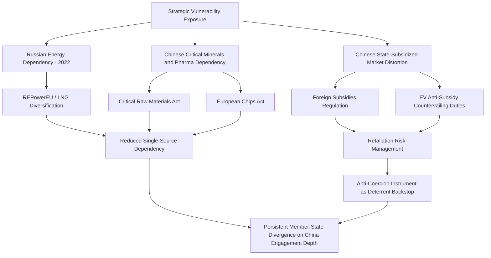

## The European Union: Strategic Autonomy and De-Risking Policy

### Conceptual Origins and Evolution

**Strategic autonomy** as an EU policy concept originated primarily in defense and security policy discourse (particularly French strategic thinking on European defense independence from US/NATO reliance) before broadening substantially after 2020 to encompass economic, technological, and supply chain dimensions. The COVID-19 pandemic's exposure of EU dependency on Chinese and Indian pharmaceutical and PPE supply chains, combined with the 2022 Russian invasion of Ukraine's demonstration of acute EU vulnerability to Russian energy dependency, catalyzed a shift from a largely aspirational/defense-oriented concept toward concrete economic security policy instruments.

**De-risking**, articulated most prominently by European Commission President Ursula von der Leyen in a March 2023 speech and subsequently adopted as the EU's formal framing for its China policy stance, represents a deliberate rhetorical and policy distinction from the more confrontational US "decoupling" framing — emphasizing selective, targeted risk reduction in critical sectors while explicitly preserving continued broad economic engagement with China, reflecting the EU's comparatively greater trade and export dependency on the Chinese market relative to the US, and internal member-state divergence (Germany's export-heavy automotive and machinery sectors are considerably more China-exposed and China-engagement-favorable than, for instance, more security-hawkish positions from some Central and Eastern European states).

### The Energy Dependency Shock and Response

Russia's invasion of Ukraine in February 2022 exposed the EU's acute dependency on Russian pipeline natural gas (Germany in particular derived a majority of its gas imports from Russia pre-invasion) [Unverified — precise pre-war dependency percentages vary by member state and should be checked against Eurostat/IEA figures for the relevant year], triggering an emergency energy security response:

**REPowerEU** (2022): The Commission's plan to eliminate dependency on Russian fossil fuels, combining accelerated renewable energy deployment, energy efficiency measures, diversified gas supply (increased LNG imports, notably from the US and Qatar), and gas demand reduction targets across member states.

**LNG import infrastructure buildout**: Rapid construction/repurposing of floating storage and regasification units (FSRUs) at ports including in Germany (previously without LNG import terminals), the Netherlands, and elsewhere, substantially increasing US LNG export volumes to Europe as a substitute for pipeline gas.

**Sanctions on Russian energy**: EU import bans on Russian seaborne crude oil and refined products (with a price cap mechanism coordinated with G7 partners), alongside a near-total halt in pipeline gas flows following the Nord Stream pipeline sabotage (September 2022) and Russian supply cutoffs to multiple member states.

[Inference] The speed and scale of EU gas diversification achieved in 2022–2023 exceeded most contemporaneous expert expectations, though it came at substantial economic cost (elevated energy prices relative to the US, competitiveness pressure on energy-intensive industry) that continues to feature prominently in EU industrial competitiveness debates.

### Critical Raw Materials Policy

**European Critical Raw Materials Act (CRMA)**, entered into force 2024: Establishes EU-wide benchmarks for strategic raw materials (a designated subset of the broader critical raw materials list) — targeting at least 10% of annual EU consumption from domestic extraction, 40% from domestic processing, 25% from recycling, and no more than 65% of consumption from any single third country by 2030 — alongside streamlined permitting for designated "Strategic Projects" and enhanced supply chain monitoring and stockpiling coordination among member states.

[Inference] The CRMA's diversification targets, particularly the domestic extraction and processing benchmarks, face substantial practical headwinds given limited EU domestic mineral reserves for several critical materials, historically slow EU permitting timelines for mining and processing facilities relative to non-EU competitor jurisdictions, and local environmental and community opposition to new extraction projects, meaning target achievement by 2030 should be treated as an aspirational policy anchor rather than a high-confidence forecast.

### Trade Defense Instruments

**Foreign Subsidies Regulation (FSR)**, applicable from 2023: A novel EU instrument empowering the Commission to investigate and address distortive effects of non-EU government subsidies benefiting companies operating in the EU single market — including powers to block subsidized acquisitions, public procurement bids, and require divestments — explicitly designed to address a gap where traditional EU State Aid rules apply only to EU member state subsidies, leaving non-EU (principally Chinese) state-subsidized firms operating in the EU market previously unaddressed by a comparable disciplinary mechanism.

**Anti-Coercion Instrument (ACI)**, entered into force December 2023: A retaliatory trade instrument allowing the EU to respond collectively to third-country economic coercion targeting individual member states (conceived substantially in response to Chinese trade pressure campaigns against Lithuania following Lithuania's Taiwan diplomatic engagement, and against Australia over COVID-19 origin investigation calls), authorizing countermeasures including tariffs, trade restrictions, and public procurement exclusions.

**EV and solar anti-subsidy investigations**: The Commission's 2023–2024 anti-subsidy investigation into Chinese battery electric vehicle imports resulted in additional countervailing duties (layered atop the EU's standard tariff) ranging by manufacturer following individualized subsidy margin calculations, representing one of the most consequential EU trade defense actions of the de-risking period and drawing threatened Chinese retaliation against EU agricultural and other exports (notably brandy/cognac and pork investigations).

### Screening and Investment Control Architecture

**EU FDI Screening Regulation** (2019, operational from 2020): Establishes a cooperation mechanism enabling member states and the Commission to share information and raise concerns about inbound foreign direct investment affecting security or public order, though final screening authority and decision-making remains at the national level — a structural limitation relative to the more centralized US CFIUS model, since roughly two dozen but not all member states maintain national screening regimes of varying stringency, creating potential gaps for investment routed through less-stringent member states.

**Dual-use export control coordination**: EU Dual-Use Regulation governs export controls on items with both civilian and military applications, requiring coordination across member states' national export licensing authorities, an area of periodic friction given varying national risk appetites and defense-industrial interests.

### Semiconductor and Technology Policy

**European Chips Act** (entered into force 2023): Targets doubling the EU's global semiconductor production market share (from a low single-digit percentage toward a stated 20% ambition by 2030 [Unverified — treat this figure as a stated policy aspiration rather than a tracked-to-plan metric]), combining public and private investment mobilization, support for first-of-a-kind manufacturing facilities (including Intel's since-delayed Magdeburg, Germany fab project and TSMC's joint venture fab in Dresden), and a crisis-response mechanism for coordinated action during future semiconductor supply disruptions. [Unverified] Several flagship projects under the Chips Act framework, notably Intel's Magdeburg investment, experienced significant delays or scope reductions following Intel's broader financial difficulties, illustrating execution risk distinct from the policy framework itself.

### De-Risking Policy Architecture

### Internal Coherence Challenges

A defining structural feature of EU strategic autonomy policy, distinguishing it from more unitary national industrial policy (US, China), is the persistent tension between centralized Commission-level instruments and member-state-level economic interests and competencies: trade policy and competition/state aid enforcement are EU competencies exercised through the Commission, but industrial policy, energy mix decisions, and a substantial share of investment screening remain national competencies, and member states retain sharply divergent economic exposure to and political stance toward China — Germany's automotive and machinery export sector and Chinese market access concerns create persistent pressure toward a more accommodative China posture than instruments like the ACI or FSR might suggest in isolation, while states such as Lithuania (post-Taiwan dispute) and several Central/Eastern European states favor a more assertive posture. [Inference] This internal divergence means EU de-risking implementation is likely to remain more incremental, sector-specific, and contested than the formal instrument architecture might suggest, with instrument availability not translating uniformly into consistent application intensity across all member states and sectors.

### Defense-Industrial Dimension

Beyond economic supply chains, strategic autonomy encompasses defense-industrial base consolidation efforts — the **European Defence Industrial Strategy** and associated instruments aim to increase intra-EU defense procurement (reducing reliance on US defense imports) and consolidate a historically fragmented European defense manufacturing base (multiple national champions producing overlapping platform types) — an area where progress has historically been slower than economic de-risking instruments given entrenched national defense-industrial interests and the tension between EU-level ambition and NATO-interoperability considerations with the US defense industrial base.

### Key Points

- "De-risking" is a deliberate EU rhetorical and policy distinction from US "decoupling," reflecting greater EU trade dependency on China and sharper internal member-state divergence on appropriate China engagement intensity.
- The 2022 Russian gas dependency shock functioned as the primary catalytic event transforming strategic autonomy from an aspirational defense concept into concrete, rapidly implemented economic security policy.
- The Foreign Subsidies Regulation and Anti-Coercion Instrument represent genuinely novel EU trade-defense architecture addressing gaps (non-EU state subsidies, coercive trade retaliation) that pre-existing EU trade law did not adequately cover.
- EU strategic autonomy implementation faces a structural coherence constraint absent in more unitary national industrial policy systems: Commission-level trade and competition instruments interact with member-state-level industrial, energy, and screening competencies, producing persistent application inconsistency across the bloc.
- Critical Raw Materials Act and Chips Act targets should be treated as policy aspirations anchoring investment and permitting reform rather than high-confidence delivery forecasts, given permitting timeline, execution risk (as with Intel Magdeburg), and domestic resource base constraints.

**Related Topics**

- EU Foreign Subsidies Regulation enforcement case history
- REPowerEU implementation and LNG import infrastructure buildout by member state
- EU-China EV tariff dispute and retaliatory measures (cognac, pork investigations)
- European Defence Industrial Strategy and defense-industrial base consolidation
- Critical Raw Materials Act Strategic Projects list and permitting reform
- Member-state divergence in national FDI screening regime stringency