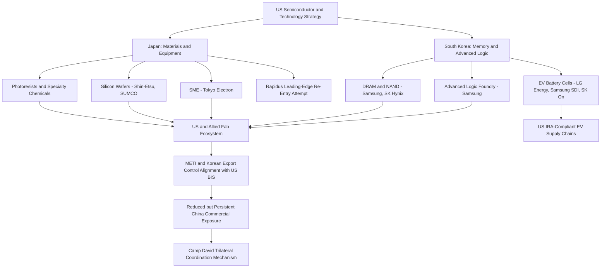

## Japan and South Korea as Allied Technology Manufacturing Hubs

### Structural Position in Global Technology Supply Chains

Japan and South Korea occupy a distinctive and complementary position in global technology supply chains as US-allied democracies with deep, decades-established manufacturing and materials-science capabilities concentrated in precisely the upstream and midstream segments where the US itself has structural gaps — specialty chemicals, precision manufacturing equipment, and advanced memory/logic semiconductor fabrication. Both states function as indispensable nodes in the US-led effort to construct semiconductor and critical technology supply chains resilient to Chinese leverage, while simultaneously each maintaining substantial independent commercial relationships with China that complicate full alignment with US decoupling objectives.

### Japan: Materials, Equipment, and Legacy Semiconductor Strength

**Semiconductor manufacturing equipment (SME) and materials dominance**: Japan holds a globally dominant or near-dominant position in several categories of semiconductor manufacturing inputs largely invisible to end consumers but structurally critical to global chip production — photoresists (light-sensitive chemicals essential to lithography), certain high-purity specialty gases, silicon wafers (Shin-Etsu and SUMCO collectively hold a majority global market share), and specific categories of semiconductor manufacturing equipment (Tokyo Electron is among the top-tier global SME suppliers alongside ASML and Applied Materials).

**Export control alignment with the US**: Japan's Ministry of Economy, Trade and Industry (METI) imposed export restrictions on 23 categories of semiconductor manufacturing equipment to China in 2023, developed in close coordination with (though not identical in scope to) US Bureau of Industry and Security controls, reflecting Japan's participation in the broader US-led effort to restrict Chinese access to advanced chipmaking capability. [Inference] Japan's willingness to align export controls with US objectives despite the commercial cost to Japanese equipment makers' China revenue reflects both alliance security commitments and Japan's own strategic concerns regarding Chinese technological and military advancement in its immediate region.

**Rapidus and the leading-edge fabrication re-entry attempt**: Japan largely exited leading-edge logic semiconductor fabrication in the 2000s–2010s as its major electronics conglomerates (which had previously held significant DRAM and logic fabrication capacity) lost competitiveness to Korean, Taiwanese, and eventually US players. **Rapidus Corporation**, established 2022 with backing from the Japanese government and a consortium of major Japanese corporations (Toyota, Sony, NTT, SoftBank, among others), represents an ambitious state-backed effort to re-enter leading-edge (targeting 2nm-class) logic fabrication, in partnership with IBM for foundational process technology, with a pilot line targeted in Hokkaido. [Unverified] Rapidus's technical and commercial viability remains genuinely uncertain given the extreme capital intensity and multi-generational process expertise gap involved in re-entering leading-edge fabrication from a multi-decade absence — this should be treated as a high-risk strategic bet rather than an assured reindustrialization success, and current project status/timeline should be checked against recent reporting.

**Automotive and legacy semiconductor supply chain depth**: Beyond leading-edge ambitions, Japan retains substantial global relevance in mature-node/legacy semiconductors (heavily used in automotive applications, an area of Japanese industrial strength) and in broader automotive supply chain technology, alongside continued strength in robotics and precision machine tools relevant to advanced manufacturing more broadly.

### South Korea: Memory Dominance and Advanced Logic/Foundry Position

**Memory semiconductor dominance**: Samsung Electronics and SK Hynix collectively hold a dominant global share of DRAM and NAND flash memory production [Unverified — precise current market share figures fluctuate with product cycles and should be verified against current industry tracking such as TrendForce or Omdia], a position built over decades of sustained capital investment and process technology leadership, making South Korea structurally indispensable to global electronics, data center, and AI infrastructure supply chains given memory's foundational role across virtually all computing hardware.

**Advanced logic and foundry competition**: Samsung also operates a significant advanced logic foundry business competing directly with TSMC at leading-edge process nodes, though [Inference] Samsung's foundry division has faced persistent yield and customer-acquisition challenges relative to TSMC's dominant leading-edge market position, a competitive gap that has proven durable across multiple process node generations despite substantial Samsung investment.

**Battery and EV supply chain leadership**: South Korea's LG Energy Solution, Samsung SDI, and SK On collectively represent a major share of global EV battery cell manufacturing capacity outside China, positioning South Korean firms as principal beneficiaries of US IRA battery tax credit provisions favoring non-Chinese-linked battery supply chains, with substantial South Korean battery manufacturing investment announced in the US specifically to qualify for IRA incentives and serve US automaker EV supply chains.

**CHIPS Act and US investment**: Samsung's Taylor, Texas fabrication facility investment represents one of the largest single foreign direct investments under the CHIPS Act incentive framework, illustrating South Korea's direct participation in US semiconductor reshoring policy rather than merely externally supplying it.

### Shared Structural Vulnerabilities and China Exposure

Both Japan and South Korea maintain substantial commercial exposure to the Chinese market that complicates full alignment with US decoupling objectives: Chinese demand represents a historically significant export market for Japanese and Korean semiconductor equipment, materials, and memory chips, Chinese domestic memory chip manufacturers (led by China's YMTC and CXMT) are actively pursuing capacity expansion partly enabled by continued (if increasingly restricted) access to legacy-node equipment, representing a longer-term competitive threat to Korean memory dominance, and both countries' automotive and electronics manufacturers maintain substantial China-based production and China-market sales exposure independent of the semiconductor/critical-technology dimension.

[Inference] This dual exposure — deep alliance-driven participation in US-led supply chain realignment alongside continued substantial commercial dependency on the Chinese market — means both Japan and South Korea are likely to continue calibrating export control and investment decisions incrementally rather than pursuing full commercial decoupling from China, a posture broadly analogous to the EU's "de-risking" framing even where formal alignment with US export control policy is closer than the EU's.

### Trilateral and Minilateral Coordination Mechanisms

**US-Japan-Korea trilateral coordination**: Strengthened significantly following the August 2023 Camp David trilateral summit, establishing enhanced supply chain early-warning mechanisms and coordination commitments among the three countries, notable given the historically complex bilateral Japan-Korea relationship (shaped by unresolved historical grievances) that has periodically constrained trilateral security and economic cooperation despite shared alliance ties to the US.

**Chip 4 / Fab 4 alliance concept**: An earlier (2022) US-proposed semiconductor coordination grouping encompassing the US, Japan, South Korea, and Taiwan, aimed at coordinating supply chain resilience and technology protection policy, though [Unverified] the initiative's institutionalization and ongoing activity level appear to have been less prominent in subsequent reporting relative to the more substantive bilateral and CHIPS Act-linked coordination mechanisms, and current status should be verified rather than assumed active at its original conception scope.

### Allied Technology Hub Supply Chain Map

### Divergent Strategic Postures Within the Alliance Structure

Despite shared alliance ties to the US and substantial export control alignment, Japan and South Korea have not pursued identical strategic postures: Japan's approach has more explicitly emphasized state-directed re-entry into leading-edge fabrication (Rapidus) as a deliberate industrial policy bet, reflecting concern over having previously ceded leading-edge capability entirely, whereas South Korea's posture centers more on defending and extending its existing dominant position in memory and expanding its (structurally weaker) position in advanced logic foundry competition against TSMC, and the two countries' historically strained bilateral relationship has meant that even substantial shared strategic interest in supply chain resilience has required deliberate US-facilitated trilateral coordination (Camp David) rather than emerging organically from shared alliance membership alone.

### Key Points

- Japan and South Korea occupy structurally complementary rather than directly competing positions in allied semiconductor supply chains — Japanese strength concentrates in upstream materials/equipment, Korean strength in memory fabrication and downstream battery/EV supply chains, with Samsung's foundry business as a partial exception competing directly with TSMC.
- Both countries have aligned export control policy with US objectives on advanced semiconductor equipment to China, but retain substantial independent commercial exposure to the Chinese market that constrains full decoupling, a posture with meaningful parallels to EU de-risking despite closer formal alignment with US policy.
- Rapidus represents a high-risk, high-ambition Japanese state-backed bet to re-enter leading-edge fabrication after a multi-decade absence, and its ultimate technical/commercial success should not be assumed given the scale of the capability gap being addressed.
- Camp David trilateral coordination (2023) represents a notable deepening of US-Japan-Korea supply chain cooperation specifically because it required overcoming a historically difficult bilateral Japan-Korea relationship rather than building on pre-existing close trilateral ties.
- South Korean battery manufacturers are principal direct beneficiaries of US IRA "foreign entity of concern" provisions, illustrating how US reindustrialization policy operates partly through channeling investment toward allied-nation firms rather than exclusively domestic US manufacturers.

**Related Topics**

- Rapidus Corporation technical partnership with IBM and Hokkaido fab progress
- Samsung Taylor, Texas fab investment under CHIPS Act
- Chinese domestic memory chip competitors (YMTC, CXMT) and legacy-node equipment access
- Japan-Korea historical relationship frictions and their effect on trilateral security cooperation
- METI 2023 semiconductor equipment export control scope versus US BIS controls
- South Korean battery manufacturer US investment under IRA Section 45X