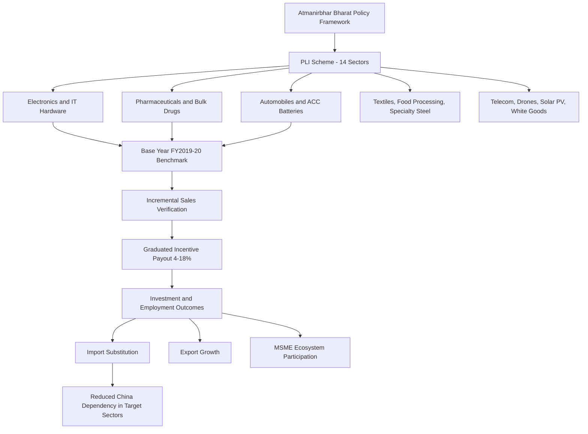

## India and the Production Linked Incentive Scheme

### Policy Origin and Rationale

The Production Linked Incentive (PLI) scheme is India's flagship manufacturing-competitiveness industrial policy instrument, launched initially in April 2020 for mobile manufacturing, specified electronic components, and pharmaceutical/medical device inputs, and substantially expanded following the Union Budget 2021-22 announcement of a total outlay of INR 1.97 lakh crore for PLI schemes across 13 key sectors, to create national manufacturing champions and generate employment opportunities. The scheme is positioned as the operational financial mechanism underpinning the broader **Atmanirbhar Bharat** ("Self-Reliant India") policy framework and the **Make in India** initiative, reflecting a deliberate post-COVID and post-Galwan-clash (2020 India-China border confrontation) strategic pivot toward reducing import dependency, particularly on China, across designated strategic sectors. [Press Information Bureau](https://www.pib.gov.in/PressReleasePage.aspx?PRID=1710134&reg=48&lang=2)

The scheme's core design logic differs structurally from many prior Indian industrial subsidy approaches by tying incentive disbursement directly to verified performance outcomes rather than capital investment alone: the PLI Scheme rewards manufacturers with 4 percent to 18 percent of incremental sales above the base year benchmark of FY 2019-20, meaning firms must demonstrably grow output beyond a fixed historical baseline to receive incentive payouts, an approach intended to minimize subsidy capture by firms that would have produced comparably without state support. [Bajaj Finserv](https://www.bajajfinserv.in/production-linked-incentive-pli-scheme)

### Sectoral Coverage

The scheme now spans a total approved outlay of ₹1.91 lakh crore across fourteen strategic sectors, including mobile manufacturing, pharmaceuticals, automobiles, electronics, food processing, textiles, solar modules, advanced batteries, drones, speciality steel, telecom, medical devices, white goods, and advanced chemistry cells. Additional named sectors from official disbursement reporting include Large Scale Electronics Manufacturing (LSEM), IT Hardware, Bulk Drugs, Telecom & Networking Products, and Automobiles & Auto components. [Production Linked Incentive Scheme 2026 Analysis | India Manufacturing Growth +2](https://arthneetiglobal.com/production-linked-incentive-scheme-2026/)

Sector selection reflects a mix of strategic-dependency logic (pharmaceuticals/bulk drugs and APIs, given India's own exposure to Chinese precursor chemical dependency exposed during COVID-19), employment-generation logic (textiles, food processing — labor-intensive sectors with substantial rural/MSME linkages), and future-industry positioning (advanced chemistry cell batteries, solar PV modules, semiconductors added subsequently, drones) aligned with global energy transition and defense-technology trends.

### Scheme Mechanics

**Base-year benchmarking**: Incentives calculated against incremental sales above the FY 2019-20 baseline, with graduated incentive rates (4-18% depending on sector and product category) typically structured to decline over the incentive period to encourage front-loaded investment and rapid scale-up.

**Multi-year disbursement window**: Most sectoral schemes run five to six years from approval, with annual verification of production/sales thresholds and eligibility criteria (minimum investment commitments, domestic value addition thresholds in select sectors) required to trigger each year's incentive payout.

**Eligibility and application process**: Companies (domestic and foreign, including consortium and greenfield/brownfield project structures) apply for sector-specific allocation, with selection criteria varying by sector — larger, more capital-intensive sectors (semiconductors, ACC batteries) involve smaller numbers of large anchor investors, while sectors like food processing and textiles have accommodated substantially more MSME participants.

**MSME participation channel**: Around 176 MSMEs have benefited, especially in sectors such as pharma, telecom, food processing, textiles, and drones, reflecting a deliberate scheme design choice to extend PLI benefits beyond large anchor manufacturers into the broader supplier ecosystem, though large-scale flagship sectors (electronics, semiconductors) remain dominated by major domestic and multinational manufacturers. [Bajaj Finserv](https://www.bajajfinserv.in/production-linked-incentive-pli-scheme)

### Implementation Results to Date

As of the most recent official reporting (December 2025), cumulative performance across the scheme shows 836 applications approved across 14 strategic sectors, with cumulative investment exceeding ₹2.16 lakh crore and cumulative sales exceeding ₹20.41 lakh crore. Further detail from the same reporting period indicates exports have reached ₹8.3 lakh crore, more than 14.39 lakh direct and indirect jobs have been generated, and ₹28,748 crore has been disbursed as incentives. [Press Information Bureau](https://www.pib.gov.in/PressReleasePage.aspx?PRID=2230621&reg=3&lang=1)[Arthneeti Global](https://arthneetiglobal.com/production-linked-incentive-scheme-2026/)

A materially important implementation detail concerns the gap between announced outlay and actual disbursement: actual incentive disbursement has remained at about 12% of the initial announcements through September 2025, against original scheme design expectations of an investment of ₹3.48 lakh crore, incremental production or sales of ₹29 lakh crore, and the creation of 39 lakh jobs. [Inference] This disbursement-to-announcement gap likely reflects both the graduated, performance-verified nature of the incentive structure (payouts trail investment and production ramp-up by design) and genuine shortfalls in some sectors relative to original targets — the gap should not be read purely as underperformance without accounting for the scheme's inherent multi-year lag structure, though it does indicate that headline outlay figures substantially overstate near-term fiscal disbursement. [Wikipedia](https://en.wikipedia.org/wiki/Production_Linked_Incentive_schemes_in_India)[Wikipedia](https://en.wikipedia.org/wiki/Production_Linked_Incentive_schemes_in_India)

### Sector-Specific Outcomes: Electronics and Pharmaceuticals

**Mobile phone and electronics manufacturing**: The most frequently cited PLI success case, with substantial growth in domestic mobile phone assembly (led by Apple's expanded Indian manufacturing through Foxconn, Pegatron, and Tata Electronics, alongside Samsung) reducing mobile phone import dependency and enabling India to emerge as a growing smartphone export base, reflected in export data showing electronic goods exports grew strongly by 41.94 percent, driven by robust demand for smartphones and consumer electronics in major markets including the USA, UAE, and China. [Press Information Bureau](https://www.pib.gov.in/PressReleasePage.aspx?PRID=2202979&lang=1&reg=3)

**Pharmaceuticals and bulk drugs**: A structurally significant reversal is documented in the API/bulk drug segment, where India transitioned from a net importer (₹1,930 crore deficit in FY 2021-22) to a net exporter of bulk drugs (₹2,280 crore surplus in FY 2024-25), directly relevant to reducing India's own historical dependency on Chinese active pharmaceutical ingredient precursors — a dependency structurally analogous to the vulnerability Western pharmaceutical supply chains face vis-à-vis China and India jointly. [Press Information Bureau](https://www.pib.gov.in/PressNoteDetails.aspx?NoteId=155082&ModuleId=3&reg=48&lang=2)

### PLI Scheme Structure and Flow

### Structural Challenges and Limitations

**Disbursement lag and fiscal design questions**: As noted, the substantial gap between cumulative announced outlay and actual disbursement (roughly 12% through September 2025) raises questions about the pace at which fiscal incentives translate into realized manufacturing capacity versus committed-but-unrealized investment pipelines.

**Manufacturing share of GDP stagnation**: A broader structural critique noted in independent analysis observes that India's manufacturing share remained around 15 to 17 percent of GDP for decades, significantly below major industrial economies, raising the analytical question of whether PLI-driven sectoral gains represent genuine structural transformation of India's manufacturing base or more concentrated gains within specific PLI-eligible firms and sectors without yet shifting the broader economy-wide manufacturing trajectory. [Inference] This is a legitimate and actively debated question in Indian economic policy circles rather than a settled critique, since PLI is a relatively young and still-maturing policy instrument (most sectoral schemes remain within their initial five-to-six-year implementation windows). [Arthneeti Global](https://arthneetiglobal.com/production-linked-incentive-scheme-2026/)

**Import-substitution versus assembly-only concern**: A structural critique parallel to the "China plus one" assembly-relocation dynamic — critics note that some PLI-supported electronics manufacturing (particularly mobile phone assembly) has historically involved substantial imported component content (semiconductors, displays, other high-value subassemblies) with final assembly occurring in India, meaning headline production and export figures may partly reflect assembly-value-add rather than deep domestic value chain localization, though scheme design increasingly incorporates domestic value addition thresholds intended to progressively deepen localization over the incentive period.

**Global competitiveness versus protected-market dynamics**: [Inference] As with most performance-linked industrial subsidy programs, a standing analytical question is whether PLI-supported firms are becoming genuinely globally cost- and quality-competitive (as electronics export growth to the US, UAE, and China would suggest for that sector) or whether some sectors' output growth relies more heavily on continued incentive support and protective tariff structures — sector-by-sector export performance data (strong in electronics, more moderate in others per pharmaceutical exports increased moderately by 6.46 percent supported by orders from countries like Nigeria and the USA) suggests meaningfully uneven competitiveness gains across the 14 sectors rather than uniform success. [Press Information Bureau](https://www.pib.gov.in/PressReleasePage.aspx?PRID=2202979&lang=1&reg=3)

### Geopolitical Significance Within Supply Chain Diversification

PLI functions as India's primary policy instrument for positioning itself as a beneficiary of global supply chain diversification away from China, complementing rather than directly replicating the US CHIPS Act/IRA model — PLI is broader in sectoral scope but generally offers proportionally smaller per-sector incentive intensity than the most concentrated US semiconductor subsidies, and is explicitly structured around incremental sales performance rather than primarily capital expenditure matching. India's position as a "China plus one" destination benefits directly from PLI-incentivized capacity (particularly in electronics assembly), though [Inference] India's own manufacturing ecosystem still lacks the supplier density and logistics infrastructure maturity of China's manufacturing base, meaning PLI-driven capacity growth should be understood as a multi-decade convergence process rather than a near-term substitute for Chinese manufacturing scale.

### Key Points

- PLI's performance-linked design (incentives tied to verified incremental sales above a fixed FY 2019-20 baseline) distinguishes it from simpler capital-expenditure-matching subsidy models, intended to reduce subsidy capture by firms that would have grown regardless of state support.
- The substantial gap between announced outlay (₹1.91-1.97 lakh crore) and actual disbursement (roughly 12% through September 2025) reflects both the scheme's inherent multi-year, performance-verified payout structure and likely genuine underperformance relative to original targets in some sectors — the two explanations are not mutually exclusive and current data does not cleanly separate them.
- Electronics/mobile manufacturing and pharmaceutical bulk drugs represent PLI's most substantively documented success cases, including India's reversal from net importer to net exporter status in bulk drugs — a dependency reversal directly relevant to reducing India's own China-exposure in pharmaceutical precursor chemicals.
- Persistent open questions include the depth of domestic value addition in electronics assembly (versus imported high-value component content), and whether sectoral PLI gains represent genuine structural manufacturing transformation given India's multi-decade stagnant manufacturing share of GDP.
- PLI positions India as a substantive beneficiary of global "China plus one" supply chain diversification, though India's manufacturing ecosystem density and logistics infrastructure maturity remain structurally behind China's, implying a gradual convergence trajectory rather than rapid substitution.

**Related Topics**

- India Semiconductor Mission and fabrication capacity buildout
- Apple/Foxconn/Tata Electronics Indian manufacturing expansion
- India's bulk drug and API self-sufficiency policy (post-COVID precursor chemical dependency)
- Domestic value addition thresholds and deepening localization requirements across PLI sectors
- India-China trade relationship amid strategic manufacturing competition
- MSME integration into PLI-anchored supply chains