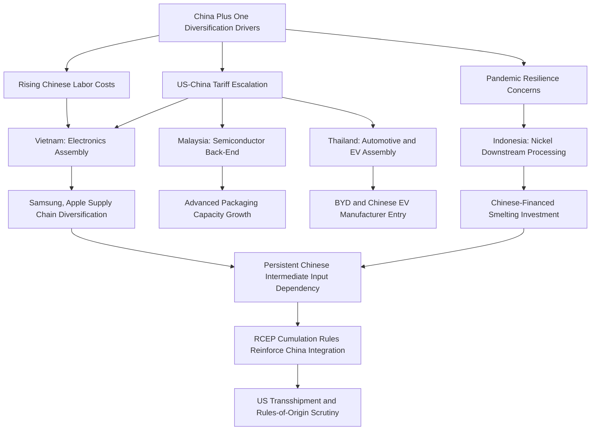

## Southeast Asia and ASEAN as a Manufacturing Alternative

### Structural Role in Global Supply Chain Diversification

Southeast Asia, organized loosely under the ten-member Association of Southeast Asian Nations (ASEAN), has emerged as the principal geographic beneficiary of "China plus one" diversification strategies pursued by multinational manufacturers since the late 2010s, driven by rising Chinese labor costs, US-China tariff escalation beginning in 2018, and pandemic-era supply chain resilience concerns. Unlike India or Mexico, ASEAN's manufacturing rise is not organized around a single dominant national industrial policy but rather reflects the aggregate effect of individually distinct national strategies (Vietnam's export-oriented FDI model, Indonesia's resource-nationalist downstream processing strategy, Thailand's automotive cluster, Malaysia's semiconductor back-end specialization) operating within a shared regional trade architecture.

ASEAN's collective manufacturing significance is amplified by intra-regional supply chain integration under the **ASEAN Free Trade Area** and the broader **Regional Comprehensive Economic Partnership (RCEP)** — the world's largest trade bloc by population and GDP, encompassing ASEAN plus China, Japan, South Korea, Australia, and New Zealand — which has the practical effect of embedding ASEAN manufacturing more deeply into China-centered supply chains even as ASEAN gains market share as a final-assembly and export-origin location for goods destined to the US and EU.

### Vietnam: Electronics and Export-Oriented FDI Leadership

Vietnam has emerged as the most prominent single ASEAN beneficiary of China plus one diversification, anchored substantially by Samsung's large-scale electronics manufacturing presence (Vietnam represents a major share of Samsung's global smartphone production) and increasing Apple supply chain diversification (AirPods, iPad, and some MacBook assembly shifting partially to Vietnam through contract manufacturers). Vietnam's competitive positioning combines a large, relatively low-cost and increasingly skilled labor force, an extensive network of bilateral and regional free trade agreements (EU-Vietnam FTA, CPTPP membership, RCEP) providing preferential market access that many competitor jurisdictions lack, and sustained government infrastructure and industrial-zone investment.

[Inference] A structurally important caveat frequently raised in trade and supply chain analysis is that a meaningful share of Vietnam's export growth reflects final assembly and re-export of Chinese-sourced intermediate inputs and components rather than fully domestic value-added manufacturing — meaning Vietnam's export statistics, and by extension its apparent role in "de-Sinicizing" supply chains, may overstate the degree to which underlying Chinese value-add has actually been displaced rather than merely relabeled at the point of final assembly and export-origin certification. This dynamic has drawn increasing US trade policy scrutiny regarding transshipment and rules-of-origin circumvention.

### Indonesia: Resource-Based Downstream Processing Strategy

Indonesia has pursued a distinctive and more resource-nationalist industrial strategy centered on its position as the world's largest nickel ore producer, implementing a progressive ban on raw (unprocessed) nickel ore exports (first introduced in 2014, with a more comprehensive and enforced ban from 2020) explicitly designed to compel domestic smelting and downstream battery-material processing investment rather than permitting continued raw ore export.

This policy has attracted substantial Chinese investment in Indonesian nickel processing and smelting capacity (a significant share of Indonesian nickel processing investment originates from Chinese firms, given Chinese battery and stainless steel producers' downstream demand and technical smelting expertise), positioning Indonesia as a critical node in global EV battery supply chains (nickel is a key input for higher-energy-density NMC/NCA battery chemistries) while simultaneously creating a paradox for Western "friend-shoring" battery supply chain diversification objectives — Indonesian nickel is geographically outside China, but a substantial share of Indonesian processing capacity is Chinese-owned or Chinese-financed, complicating US IRA "foreign entity of concern" eligibility determinations for battery materials sourced through Indonesian supply chains.

### Malaysia: Semiconductor Back-End and Test/Assembly Specialization

Malaysia has held a long-established position in global semiconductor supply chains, specifically concentrated in back-end operations — assembly, testing, and packaging (ATP) — rather than front-end wafer fabrication, a specialization dating to the 1970s-80s establishment of multinational semiconductor back-end facilities (Intel, Texas Instruments, and others have maintained substantial Malaysian operations for decades). This established base has positioned Malaysia favorably amid renewed global semiconductor supply chain diversification, with Malaysia attracting new investment specifically in advanced packaging capacity (increasingly strategically important given advanced packaging's growing role in AI chip performance, e.g., chiplet and 2.5D/3D packaging techniques) from firms seeking non-Chinese back-end capacity.

### Thailand: Automotive Manufacturing Hub and EV Transition

Thailand has developed the most mature automotive manufacturing cluster in Southeast Asia over several decades, historically anchored by Japanese automaker investment (Toyota, Honda, Isuzu) earning Thailand the informal designation as the "Detroit of Asia" within regional industry commentary, with a dense supplier ecosystem supporting both domestic ASEAN market sales and export production. More recently, Thailand has aggressively courted Chinese EV manufacturer investment (BYD, among others establishing Thai assembly operations) as part of a deliberate strategy to transition its automotive cluster toward EV production, leveraging existing supplier infrastructure while diversifying beyond historical Japanese-automaker dependency, supported by Thai government EV investment incentives and tax structures.

### The Philippines and Other ASEAN Members

The Philippines has historically specialized in electronics assembly and business process outsourcing (BPO) rather than broad-based heavy manufacturing, alongside emerging relevance in nickel and other critical minerals (the Philippines is among the world's largest nickel ore producers alongside Indonesia, though with comparatively less developed domestic downstream processing capacity, resulting in most Philippine nickel ore being exported for processing elsewhere, notably to China). Other ASEAN members occupy narrower but sometimes strategically relevant niches: Singapore functions primarily as a regional finance, logistics, and increasingly semiconductor/advanced manufacturing R&D hub rather than a mass-manufacturing base given its small size and high labor costs, while Cambodia and Laos have absorbed lower-value-add labor-intensive manufacturing (garments, footwear) as costs have risen in Vietnam and China.

### Regional Trade Architecture Supporting Manufacturing Growth

**RCEP** (effective January 2022): Reduces tariffs and harmonizes rules of origin across its 15 member economies, with cumulative rules-of-origin provisions that — notably — allow inputs sourced from any RCEP member (including China) to count toward regional value-content thresholds for preferential tariff treatment, a structural feature that [Inference] likely reinforces rather than reduces Chinese input integration into ASEAN export supply chains even as ASEAN gains export market share, since RCEP's cumulation rules make it easier, not harder, for ASEAN-based manufacturers to use Chinese components while still qualifying for preferential access to other RCEP markets.

**CPTPP (Comprehensive and Progressive Agreement for Trans-Pacific Partnership)**: A separate, higher-standard trade agreement including Vietnam, Malaysia, Singapore, and Brunei among ASEAN members (notably excluding China), providing preferential access to a different set of markets (Japan, Australia, Canada, UK accession, and others) with generally stricter rules of origin than RCEP, functioning as a complementary market-access channel more aligned with Western supply chain diversification objectives.

**Bilateral FTA networks**: Vietnam's EU-Vietnam FTA and various bilateral agreements provide additional preferential market access layers, contributing to Vietnam's particular attractiveness as an export platform relative to ASEAN peers with thinner FTA coverage.

### ASEAN Manufacturing Diversification Map

### Structural Limitations as a China Substitute

Despite substantial diversification gains, ASEAN collectively faces structural constraints limiting its capacity to fully substitute for Chinese manufacturing scale and depth: no single ASEAN economy approaches China's combined labor force scale, infrastructure density, and supplier ecosystem breadth, meaning diversification has concentrated in specific product categories and assembly stages rather than replicating full end-to-end supply chains; several ASEAN manufacturing hubs (Vietnam electronics, Indonesia nickel processing) remain significantly dependent on Chinese capital, components, or technical expertise, complicating clean "de-Sinicization" narratives; and infrastructure gaps (port capacity, power grid reliability in some markets, skilled technical labor availability at scale) remain more pronounced than in China's most developed manufacturing regions, requiring continued substantial infrastructure investment to support further capacity absorption.

[Inference] The most defensible characterization of ASEAN's role is as a genuine and growing diversification destination for specific supply chain stages (final assembly, certain processing steps, some component manufacturing) operating in increasing economic integration with rather than clean substitution for Chinese supply chains — a nuance frequently lost in simplified "moving production out of China" framing common in popular commentary.

### Key Points

- ASEAN's manufacturing rise reflects an aggregation of distinct national strategies rather than unified regional industrial policy — Vietnam (electronics/FDI), Indonesia (resource downstream processing), Malaysia (semiconductor back-end), and Thailand (automotive/EV) each pursue structurally different specializations.
- A recurring analytical caution across multiple ASEAN manufacturing hubs is the depth of continued Chinese input, capital, or technical dependency underlying apparent diversification — Vietnam's assembly-heavy export profile and Indonesia's Chinese-financed nickel processing capacity are the clearest examples.
- RCEP's cumulative rules-of-origin structure structurally reinforces rather than reduces Chinese component integration into ASEAN export supply chains, a nuance that complicates simple narratives of ASEAN "replacing" China in global manufacturing.
- Indonesia's nickel export ban represents a notably assertive resource-nationalist industrial policy model — using raw material export restriction to compel domestic downstream investment — distinct from the FDI-attraction models pursued elsewhere in the region.
- ASEAN functions most accurately as a growing, differentiated diversification destination for specific supply chain stages rather than a wholesale substitute for Chinese manufacturing scale and ecosystem depth.

**Related Topics**

- US transshipment and rules-of-origin enforcement targeting Vietnam-routed Chinese goods
- Indonesia's nickel export ban and its WTO dispute history
- RCEP cumulation rules versus CPTPP stricter rules-of-origin comparison
- Chinese EV manufacturer (BYD, others) Southeast Asian assembly expansion
- Malaysia's advanced semiconductor packaging investment pipeline
- ASEAN infrastructure investment gaps and their effect on absorption capacity