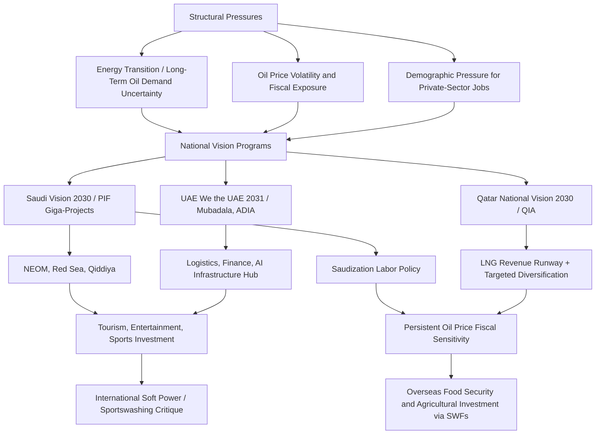

## The Gulf States and Economic Diversification Strategies

### Strategic Rationale for Diversification

Gulf Cooperation Council (GCC) member states — Saudi Arabia, the United Arab Emirates, Qatar, Kuwait, Bahrain, and Oman — have pursued increasingly ambitious economic diversification programs since roughly the mid-2010s, driven by a convergence of structural pressures: long-term demand uncertainty for hydrocarbons given accelerating global energy transition policy and EV adoption trajectories, fiscal vulnerability to oil price volatility repeatedly exposed by price collapses (2014-2016, 2020), demographic pressure to create private-sector employment for rapidly growing young national populations historically dependent on public-sector employment, and a broader strategic recognition that hydrocarbon export revenue alone cannot indefinitely fund current state spending, subsidy, and welfare commitments at existing levels across multi-decade horizons.

Diversification strategy in the Gulf context encompasses several interlocking dimensions distinct from, though related to, sovereign wealth fund strategic investment (covered separately): (1) domestic economic diversification away from hydrocarbon GDP dependency, (2) labor market "nationalization" policies aimed at increasing citizen private-sector employment, (3) positioning as regional/global logistics, finance, and technology hubs, and (4) leveraging sovereign capital and state-directed investment to build entirely new domestic industries and mega-projects.

### Saudi Arabia: Vision 2030

**Vision 2030**, launched 2016 under the direction of Crown Prince Mohammed bin Salman, is the most expansive and closely watched Gulf diversification program, structured around three pillars: a vibrant society, a thriving economy, and an ambitious nation. Key programmatic elements include reducing oil's share of GDP (a headline target that has proven difficult to achieve given continued oil price sensitivity of overall GDP figures), substantially increasing private-sector and non-oil GDP contribution, expanding tourism and entertainment sectors previously heavily restricted under prior social policy (cinema reintroduction, large-scale entertainment and tourism visa liberalization), and a series of "giga-projects" including **NEOM** (a planned futuristic city and economic zone in northwestern Saudi Arabia, including the widely publicized linear city concept "The Line"), the Red Sea tourism development, Qiddiya (entertainment megaproject near Riyadh), and Diriyah Gate (heritage/tourism redevelopment).

[Unverified] NEOM and several other giga-projects have faced substantial reported cost escalation, scope reduction, and timeline extension relative to original announcements — treat specific project scale, cost, and completion-date claims as subject to ongoing revision rather than fixed, and verify against current reporting given the scale and frequency of publicly reported adjustments to these projects.

The **Public Investment Fund (PIF)** functions as the principal financing and strategic-direction vehicle for Vision 2030, both funding domestic giga-projects directly and pursuing international strategic investments (sports, technology, entertainment) partly to build reciprocal economic and reputational linkages supporting the broader diversification and international-image objectives of the program.

**Saudization (Nitaqat program)**: Labor market policy mandating minimum quotas of Saudi national employment across private-sector firms by sector and company size category, enforced through a color-coded compliance tier system affecting firms' visa sponsorship privileges, aimed at reducing reliance on the historically dominant expatriate workforce (which has long constituted a majority of the private-sector labor force) and creating meaningful private-sector employment pathways for Saudi nationals, particularly women, whose labor force participation has risen substantially under Vision 2030-era reforms.

### United Arab Emirates: Diversification Maturity and Financial/Logistics Hub Positioning

The UAE entered its diversification effort earlier and from a more advanced starting position than other GCC states, reflecting Dubai's decades-long development as a regional trade, logistics, tourism, and financial hub even prior to the more recent Vision-branded diversification programs adopted elsewhere in the Gulf (Dubai's own oil reserves were comparatively limited relative to Abu Dhabi's, incentivizing earlier economic diversification out of practical necessity). The UAE's current framework, **We the UAE 2031**, targets continued expansion of non-oil GDP, foreign trade volume, and foreign direct investment, building on Dubai's established position as a global logistics hub (Jebel Ali Port and the broader Dubai logistics/free-zone ecosystem), aviation hub (Emirates and Dubai/Abu Dhabi airport infrastructure), and increasingly as a global finance and wealth-management destination benefiting from relative political stability and favorable tax treatment amid regional and global instability elsewhere.

Abu Dhabi, holding the bulk of UAE hydrocarbon reserves, has pursued its own diversification emphasis through **Mubadala** and **ADIA** sovereign investment, alongside domestic initiatives in renewable energy (Masdar), AI and advanced technology (Abu Dhabi's G42 and broader AI infrastructure investment ambitions, including substantial international partnerships in AI compute and chip supply), and continued downstream hydrocarbon value-chain investment (petrochemicals) even while pursuing non-oil diversification, reflecting a "diversify while still investing in the core hydrocarbon value chain" strategy distinct from a wholesale pivot away from oil and gas.

### Qatar: LNG-Funded Diversification and the National Vision 2030 Framework

Qatar's diversification strategy, framed under **Qatar National Vision 2030**, is distinguished by the country's position as one of the world's largest LNG exporters, providing a comparatively long runway of hydrocarbon revenue certainty (given multi-decade LNG supply contracts and continued global gas demand growth, particularly as a transition fuel) relative to oil-dependent Gulf peers facing more acute oil-demand-transition urgency. Qatar has leveraged the 2022 FIFA World Cup hosting as a soft-power and infrastructure investment catalyst, alongside continued Qatar Investment Authority international strategic investment, and has pursued targeted diversification into financial services (Qatar Financial Centre), logistics, and specific manufacturing niches, while [Inference] facing less acute near-term fiscal pressure to diversify than Saudi Arabia given Qatar's comparatively small citizen population relative to hydrocarbon revenue and accumulated sovereign wealth.

### Common Structural Themes Across Gulf Diversification Programs

**"Vision" branding convergence**: Nearly all GCC diversification programs (Saudi Vision 2030, UAE's various iterations culminating in We the UAE 2031, Qatar National Vision 2030, Kuwait Vision 2035, Bahrain Economic Vision 2030, Oman Vision 2040) share a common branding and structural template — long-term national planning documents with headline non-oil GDP and employment targets, reflecting both genuine shared strategic logic and, [Inference] plausibly, a degree of regional policy emulation and international-investor-facing branding convention rather than purely independently derived national strategy in each case.

**Tourism and entertainment sector expansion**: A common diversification lever across the Gulf involves substantial social liberalization paired with tourism infrastructure investment — Saudi Arabia's cinema and entertainment reintroduction, tourism visa liberalization across the GCC, and large-scale hospitality and entertainment infrastructure investment, reflecting both genuine economic diversification logic and broader soft-power and international-image objectives tied to attracting foreign investment, talent, and tourism revenue.

**Sports and cultural investment as strategic soft power ("sportswashing" critique)**: Gulf sovereign and state-linked investment in international sports (Saudi PIF's LIV Golf, Premier League club ownership — Newcastle United; Qatar's 2022 World Cup and Paris Saint-Germain ownership; UAE's Manchester City ownership through Abu Dhabi United Group) has drawn sustained international commentary characterizing this as "sportswashing" — using high-profile sports investment to improve international reputation and deflect criticism of human rights records — a characterization Gulf officials and associated entities dispute, framing the investments instead as legitimate commercial diversification and soft-power strategy consistent with other nations' historical use of cultural and sporting investment.

**Technology and AI ambition**: Gulf states, particularly the UAE and increasingly Saudi Arabia, have pursued substantial investment positioning themselves as AI infrastructure and compute hubs, leveraging sovereign capital to attract major technology partnerships (including significant announced US technology company AI infrastructure investment and chip supply arrangements in the UAE), though such arrangements have drawn US national security scrutiny given concerns about potential Chinese technology transfer risk through Gulf intermediary relationships, requiring negotiated US government conditions on advanced chip export licensing to Gulf AI infrastructure projects.

### Structural Challenges to Diversification

**Persistent oil price sensitivity of fiscal balances**: Despite diversification rhetoric and genuine non-oil sector growth, GCC state budgets remain substantially sensitive to oil price fluctuations given the continued scale of hydrocarbon revenue relative to total state revenue in most member states (Qatar and UAE somewhat less so than Saudi Arabia, Kuwait, and Oman), meaning diversification progress should be assessed against continued fiscal breakeven oil price metrics rather than solely against non-oil GDP share targets.

**Labor market nationalization implementation friction**: Nationalization quota policies (Saudization and equivalents elsewhere) face persistent implementation tension between policy targets and private-sector employer preferences for expatriate labor (often perceived, rightly or wrongly, as offering comparable skill at lower cost or with greater flexibility), requiring ongoing enforcement mechanism adjustment and generating periodic private-sector compliance friction.

**Giga-project execution risk**: The scale and ambition of flagship projects (NEOM prominently) creates substantial execution, cost, and timeline risk, with [Unverified] multiple reports of scope reduction and schedule extension warranting treatment of headline project announcements as aspirational rather than committed-and-on-track without independent verification.

**Water and food security constraints**: Gulf economic diversification, particularly toward large-scale population growth and giga-city development, must contend with severe underlying water scarcity (heavy reliance on energy-intensive desalination) and near-total food import dependency, structural constraints that shape (and in some cases motivate) Gulf sovereign wealth fund investment in overseas agricultural land and food-security-linked assets as a complementary strategy to domestic diversification.

### Gulf Diversification Strategy Architecture

### Key Points

- Gulf diversification programs share a common "Vision" branding template but reflect materially different starting positions and urgency levels — Qatar's LNG revenue runway provides comparatively lower near-term diversification urgency than Saudi Arabia's oil-dominated and larger-citizen-population fiscal structure.
- Sovereign wealth funds (PIF, Mubadala, ADIA, QIA) function as the principal financing and execution vehicles for diversification giga-projects, linking this topic directly to Gulf strategic investment behavior covered under sovereign wealth fund analysis.
- Giga-project execution risk (particularly NEOM) is substantial and reported cost/scope/timeline figures should be treated as subject to ongoing revision rather than fixed commitments.
- Sports and cultural investment as soft power carries a persistent and contested "sportswashing" framing in international commentary, a characterization Gulf officials dispute as legitimate diversification and reputational strategy.
- Persistent oil price fiscal sensitivity, labor nationalization implementation friction, and severe water/food security constraints represent durable structural limits on diversification progress independent of stated Vision program ambitions.

**Related Topics**

- NEOM and Saudi giga-project cost/scope revision history
- Gulf sovereign wealth fund overseas agricultural and food-security investment
- US national security conditions on Gulf AI chip and compute infrastructure deals
- Saudization/Nitaqat labor market compliance enforcement mechanics
- Qatar LNG export contract structure and global gas demand transition dynamics
- Gulf sports investment portfolio (PIF LIV Golf, Newcastle; QSI PSG; Abu Dhabi Manchester City)